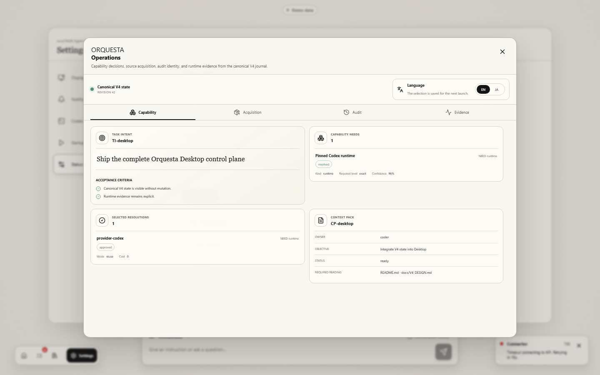

# Orquesta V4 Desktop

Orquesta is a local-first Windows command room that turns Codex into an evidence-backed team of long-lived specialists.

Coding agents are strong once a task is clear. The harder problem is deciding what capabilities the task needs, whether an existing tool should be reused, who should own each part, which context that specialist should read, and whether claimed work actually ran. Orquesta makes that decision layer visible and keeps its project truth in the repository instead of relying on one enormous chat history.

The core goal is not a short multi-agent demo. Orquesta is designed for one-, two-, or three-month development efforts where the team must keep operating without losing the user's intent. Specialists accumulate questions as they work. The user's answers are curated into explicit vision, constraints, and decisions, so human metacognition and tacit knowledge become durable project state instead of disappearing inside old chat messages.

The V4 Desktop application combines a live organization map, user-task queue, conversation history, project switching, a read-only explainer named Luca, and evidence views for capability resolution, acquisition, audit, and execution. The Codex harness remains the runtime boundary; Orquesta does not add a second sandbox or pretend that a dispatched request is a completed turn.

New here? Start with [START_HERE.md](START_HERE.md).

OpenAI Build Week judges can start with [BUILD_WEEK.md](BUILD_WEEK.md), which separates the pre-existing project from work completed during the submission period and includes testing and installation guidance.

Orquesta is not just one Codex thread with a team-themed dashboard. Real operation requires evidence: a task is routed to a non-orchestrator specialist when the work belongs to that lane, the handoff is recorded, the specialist returns a report or artifact, and the orchestrator accepts, holds, or requests changes in state. Direct orchestrator work is reserved for orchestration bookkeeping, tiny state/report updates, emergency unblockers, or explicit user instruction.

The Desktop is a mission-control workspace for that loop. It is meant to make delegation, pending user actions, live and idle specialists, runtime evidence, and project history visible. The interface alone is not proof that the team is operating correctly; the underlying state must show real handoffs, reports, and acceptance evidence.

## Current Status

Current hackathon build: **Orquesta V4 Desktop, 0.1.0 preview**.

The current application targets Windows x64. It is unsigned preview software, so Windows may show an unknown-publisher warning. Code signing, automatic updates, macOS/Linux packaging, and V4 Phase 3 learning are not part of this submission.

The first GitHub-install bootstrap smoke test passed on 2026-06-22. During OpenAI Build Week, Orquesta was meaningfully extended into a Windows desktop product with a one-screen project intake, six-phase setup experience, Home tutorial, adaptive organization projection, inspection agents, Luca explanations, and a packaged Codex runtime. See [BUILD_WEEK.md](BUILD_WEEK.md) for the dated evidence boundary.

Bootstrap smoke and delegation-loop smoke are separate checks. Bootstrap smoke proves setup, project-owned `/api/state`, foundation agents, dashboard rendering, and encoding health. Delegation-loop smoke proves the operating model: a real specialist receives a task, reports back, and the orchestrator records an acceptance decision. Do not treat the dashboard alone as proof of multi-agent operation.

## V4 System

Phase 2A adds bounded discovery of existing tools from official documentation, registries, GitHub, and approved UI catalogs. Candidates keep source hashes and expiry evidence, pass hard gates before ranking, and run through a source-bound Audition before they can be proposed for use. Audition approval and install authorization are separate; Core does not install a dependency.

Phase 2B adds pinned Codex App Server and SDK adapters, repository-only fallback, explicit approval relay, truthful model evidence, and a bounded Event Journal chain from dispatch through acceptance. The Codex harness remains the runtime safety boundary. Orquesta adds no second sandbox.

The Windows application uses Electron, React, TypeScript, and Vite. Its sandboxed Renderer talks through a typed, context-isolated Preload bridge to Electron Main and a separate Core utility process. Repository access and Codex communication do not run in the Renderer.

Codex App Server is the primary execution path, with an SDK fallback and a repository-only preparation fallback. Requested, applied, and observed model identity stay separate. `actual_model` remains unknown unless runtime evidence proves it.

Orquesta also keeps model cost visible. Policy automatically recommends Luna, Terra, or Sol from task signals; the orchestrator can accept or override that route when dispatching a specialist, with bounded escalation for harder work. The Desktop passes the requested model to Codex App Server, but does not present it as applied or observed unless runtime evidence proves it.

## Try the Desktop App

The fastest review path is the Windows x64 installer attached to the latest GitHub release. The build is unsigned preview software.

To run from source, install Node.js 22.12.0 or newer, then run:

```powershell
npm install
npm install --prefix apps/orquesta-desktop
npm run start:desktop --prefix apps/orquesta-desktop
```

For architecture, packaging, and validation details, see [the Desktop README](apps/orquesta-desktop/README.md) and [Desktop validation evidence](apps/orquesta-desktop/VALIDATION.md).

## Desktop Preview




The first image is a repository-backed Desktop capture. The Operations image is a deterministic review fixture, not a claim that a live Codex turn was running when it was captured.

## Looking For Collaborators

I am sincerely looking for people who want to develop Orquesta together.

This project is still small and experimental, but I believe there is something important here: a way to make Codex work with the user as a long-lived creative team instead of a pile of disposable tasks.

If you are interested in multi-agent workflows, Codex skills, game-development tools, human-in-the-loop creative systems, dashboard design, or just making this strange thing actually usable, please reach out. I am genuinely, urgently looking for collaborators.

## What Orquesta Provides

- A long-lived orchestrator thread for routing, state, blockers, approvals, and final reports.
- Foundation roles:
  - `orchestrator`
  - `user-support`
  - `orquesta-admin`
- The Desktop presents `orquesta-admin` as Luca, a read-only project explainer grounded in bounded saved records.
- Numbered production specialist roles such as `visual-art-001`, `implementation-001`, `world-lore-001`, and `playtest-qa-001`.
- File-backed project state under `.orquesta/` in the target project.
- A Windows Desktop for organization visualization, task state, delegation evidence, user actions, records, setup, and Codex messaging. The earlier browser dashboard remains in the repository as a legacy review surface.
- A merged `user-support` role that handles user communication, vision-question curation, and failure intake instead of three separate foundation agents.
- Atomic control-state writes, deterministic `control_audit.json`, and completion-envelope validation for staged-in specialist work.
- A separate Control Plane view that distinguishes dispatch acceptance, turn start, progress, report production, capacity circuits, fallbacks, and model evidence.
- Question observations before curator promotion, and incident candidates/clusters before concierge repair cards or user tasks.
- Policy-driven Luna, Terra, and Sol recommendations that the orchestrator can accept or override at dispatch, with bounded escalation and separate requested, applied, and observed evidence.

## Repository Layout

```text
START_HERE.md                  First-reader guide for trying Orquesta
orquesta/
  SKILL.md                     Codex skill entrypoint
  references/                  Operating protocols and state schemas
  assets/dashboard/            Static dashboard app
  dashboard-server.js          Local dashboard API/server
  agents/openai.yaml           Skill metadata
docs/
  articles/                    Draft articles for Zenn, Qiita, and launch notes
  design/                      Design notes
  release/                     Public release and discovery notes
  research/                    Multi-agent research notes
package.json                   Dashboard start script
```

Local runtime folders are intentionally not published:

```text
.orquesta/   target-project state and reports
.agents/     local installed skill mirror
.codex/      local Codex metadata
```

## Install From GitHub For Testing

Clone this repository or add it as a source in the project where you want to test Orquesta.

Manual local install:

```powershell
$skillRoot = "$env:USERPROFILE\\.codex\\skills\\orquesta"
New-Item -ItemType Directory -Force -Path $skillRoot
Copy-Item -Recurse -Force .\\orquesta\\* $skillRoot
```

Then start a new Codex thread in your target project and ask Codex to use the `orquesta` skill.

Expected bootstrap behavior:

1. The calling chat becomes the orchestrator.
2. The orchestrator thread is renamed to `★ Orquesta 統括` and pinned when thread tools are available.
3. Orquesta creates or reuses foundation roles.
4. Orquesta initializes file-backed state under `.orquesta/`.
5. Orquesta verifies the dashboard with `/api/state`.
6. Orquesta opens the verified dashboard URL in your external browser when possible.
7. Orquesta gives you the dashboard URL in chat as a fallback.
8. Only after setup does it plan production specialists for the user's actual task.

## Dashboard

From the repository root:

```powershell
npm run dashboard
```

Open:

```text
the URL printed by `npm run dashboard`
```

The dashboard starts on `http://127.0.0.1:4177/` when that port is free. If another local dashboard or process already owns the port, Orquesta scans for a free nearby port before starting, then writes the verified URL to `.orquesta/setup/options.json`.

The dashboard reads `.orquesta/` state from the current project. While visible, it checks for changes about every five seconds, but unchanged state returns `304 Not Modified` and does not trigger a full re-render. Hidden tabs slow down their polling.

When verifying a dashboard after setup, check `/api/state` for the current project. A plain HTTP 200 on the dashboard port is not enough, because another local Orquesta dashboard may already be using that port.

The current dashboard direction is a mission-control interface rather than the early simple status page:

- Command Board style layout with glass lighting and dense operational panels.
- DAG/tree layout support for specialist command maps and project route views.
- User-action and delegation surfaces that distinguish prepared, sent, reviewed, accepted, and blocked work.
- Trigger audit visibility for event-driven foundation roles, including pending question-candidate summaries that may require `user-support` review.

Trigger audit is visibility, not automation. It can show that question-curation conditions exist, but it must not turn `user-support` into a continuous watcher or promote raw question candidates without an explicit Orquesta route.

## Beta V3 Evidence Boundaries

Beta V3 applies hard gates progressively to staged-in `specialist_required` and medium/high-risk work. A valid handoff, specialist report, `question_candidates`, completion envelope, and task-scoped control audit are required before acceptance. Older accepted work remains compatible as a legacy warning unless it is reopened.

Capacity is separate from task state and agent health. A `dispatch_accepted` result is not a started specialist turn. If a required capacity circuit is open, Orquesta stops that work, evaluates only bounded role-compatible fallbacks, and does not let the orchestrator quietly do the specialist work itself.

Model routing is repository-owned recommendation and evidence by default. `recommended_model`, `requested_model`, `applied_model`, and `actual_model` are separate fields. The repository-only adapter records `unsupported` for product switching; it cannot prove the actual runtime model. Local counters are not presented as billing-token truth.

When proof depends on visual judgment, tacit knowledge, credentialed judgment, or direct user experience, Orquesta may create a narrow user capability review task with a concrete procedure and expected response. This is not a generic ask-the-user fallback. If automation is unsafe or unstable, the affected task pauses rather than inventing evidence.

The Codex in-app Browser currently has a reproducible crash path that can restart Codex Desktop. This is an external tool limitation, not an Orquesta defect by itself. Do not retry that route during a task. Use external-browser UAT only when the user can verify named behaviors and the result is recorded as user evidence.

## Development Checks

```powershell
npm run check
```

Focused checks are also available when working on specific release risks:

```powershell
npm run test:triggers
npm run test:question-candidates
npm run test:ports
```

For dashboard UI changes, also run a browser DOM smoke check against a running dashboard when the browser surface is stable:

```powershell
npm run smoke:dashboard -- http://127.0.0.1:4177/
```

This check catches the user-only visualizer failure mode by asserting that agent nodes render and that the browser console has no render-stopping errors. If the in-app Browser is unstable, pause that verification route and use the documented external-browser UAT procedure instead of claiming a smoke pass.

See [GitHub install bootstrap smoke test](docs/testing/github-install-bootstrap-smoke-test.md) for the first external install result.

## License

MIT License. See [LICENSE](LICENSE).
