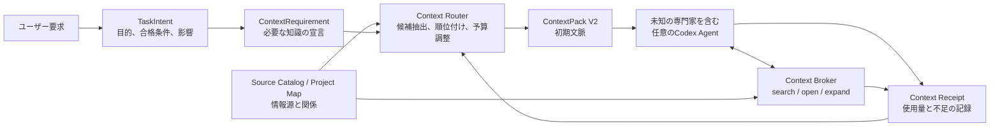

# Orquesta Adaptive Context Router V2 設計

作成日: 2026-07-31

対象: Orquesta V4 Fast
状態: V2の限定実行経路まで実装済み。実測合格前はV1へ戻る

## 結論

Orquestaのコンテキスト配送を、役職名ごとの固定テンプレートから、タスクが要求する知識、依存関係、権限、証拠をもとに組み立てる方式へ変更する。

「実装係にはこの文書」「計画係にはプロジェクト概要」という対応表は作らない。役職名は人間向けの表示と組織管理にだけ使い、何を読むかは決めない。世界観構築、ビジュアライズ、法律調査、音響設計など、開発時点で想定していない専門家でも、同じ仕組みで必要な情報を受け取れるようにする。

統括者と専門家の違いも、職名ではなく責務で決める。

- 統括者は、目的、現在地、採用済み判断、仕事の依存関係、リスクを広く浅く持つ
- 専門家は、自分の能力と担当タスクに必要な範囲を狭く深く持つ
- 詳細資料は最初から全部渡さず、必要になった時点で根拠付きで追加取得する
- 全員が守る不変条件は、長い説明文として毎回読ませず、できるだけスキーマと実行カーネルで強制する

採用する構造は次の通りである。



これは新しいマルチエージェントフレームワークではない。Codexのスレッドとハーネスをそのまま使い、Orquestaの中に小さな文脈ルーターを作る。

## 今回確認した現状

Orquestaには、すでに`ContextPackV1`とコンテキストコンパイラがある。しかし、現状は目標の半分までしか届いていない。

### 残すべき部分

`packages/context-compiler/src/compile.js`には、次の重要な機能がある。

- TaskIntent、Resolution、Agent Contractの検証
- ワークスペース外参照の拒否
- 除外対象の適用
- 許可された編集範囲の検証
- 入力とファイルのハッシュによるprovenance
- 同じ入力から同じContext Packを作る決定性
- 古い判断や矛盾した承認証拠の拒否

これらは文脈選択の安全な下部構造として残す。

### 足りない部分

V1が読む候補は、主に次の三つから作られている。

- Resolutionに明記された証拠ファイル
- 合格条件の文章から正規表現で抜いたファイル名
- Agent Contractに固定された`required_reading`

この方式では、タスクの意味から「この判断には過去のユーザー判断が必要」「この設計には既存UIの視覚資料が必要」と推定できない。`token_budget`、`adopted_decisions`、`relevant_state_excerpts`も実質使われていない。

さらに、Desktopが専門家を起動する実経路では、`ContextPackV1`ではなく`task_profile.context_manifest`の`required_reading`、`allowed_files`、`excluded_context`を直接プロンプトへ埋め込んでいる。つまりV1は存在するが、実際の専門家入力を選ぶ頭脳にはなっていない。

`packages/core/src/task-profiler.js`の既定値も、明示されたファイルがなければ`canonical_task_record`とタスクのscopeを渡すだけである。これでは広すぎる場合と足りない場合の両方が起きる。

### ベンチマーク上の注意

現在のベンチマークは、一つのケースごとに統括者、Luca、利用者支援を新規起動している。そのため、長期稼働する本番Orquestaの定常コストより、コールドスタート費用が大きく出ている。

競合要件整理の実測では、合計1,239,165トークンのうち、三つの基盤スレッドが436,444トークン、三つの専門家が802,721トークンを使った。基盤スレッドだけで約35.2%である。一方、Codex自体が各スレッドへ付けるハーネス説明も大きく、すべてをOrquesta側だけで削減できるわけではない。

したがって、今後は次の二つを分けて測る。

- コールドスタート: プロジェクトと基盤エージェントを新規作成する費用
- 定常運用: 既存の統括者と専門家を再利用し、新しいタスクだけを配送する費用

また、現行ベンチマークは本物のContextPackを専門家入力に使っていない。Context Routerの性能判定にそのまま使ってはいけない。

## 長期実運用で確認できた問題

ランサーズ収益プロジェクトの統括タスクは、ベンチマークより重要な実運用証拠になっている。ただし、このプロジェクトは壊れていたV4で起動し、その後にV4 Fastの変更を段階的に受けている。最近の会話と正規状態を照合して見つかった問題を、すべてFastの問題として扱ってはいけない。V4由来の負債、移行時の負債、現在も残る一般問題を分けて評価する。

### 三つの仕事が同じ統括文脈へ混ざった

同じ統括会話で、次の三つが並行して扱われていた。

- 案件5576094の成果物作成と納品
- 受注OSのUIと状態同期
- 通常探索と300件集中探索の実運用

ユーザーが「今どの段階で、何をしているのか分からない」と確認する状態になり、統括者も案件、OS、探索を何度も整理し直していた。これは統括者がプロジェクトを広く把握した結果ではなく、現在フォーカスすべき仕事と背景状態が分離されていない状態である。

Project Control Planeには`active_workstream`を一つ明示し、それ以外は一行の背景要約へ落とす。統括者が必要なときだけ別workstreamを展開する。

```json
{
  "active_workstream": "receiving-os-focused-search",
  "focus": {
    "task_id": "RECEIVING-OS-V2-PHASE3-001",
    "current_goal": "ユーザー操作から候補表示までの縦一本を通す",
    "next_decision": "live user journey result"
  },
  "background": [
    {
      "workstream_id": "lancers-order-5576094",
      "state": "user_led_delivery",
      "summary": "成果物は完成。ユーザーと案件作業係が納品を継続"
    },
    {
      "workstream_id": "receiving-os-ui",
      "state": "accepted_with_limits",
      "summary": "UIレビュー済み。複数案件表示は未確認"
    }
  ]
}
```

### 実運用担当と実装担当が同じ席だった

正規`agents.json`では`receiving-ops`のroleが`implementation`である一方、missionは受注OSの通常運用と案件キュー管理になっている。同じCodexタスクへ通常探索Commandと実装修正Appointmentが入り、古い探索実行が新しい実装指示へ割り込んだ。

役職名をContext Routerへ使わない方針と、責任境界をなくすことは別である。文脈選択は役職名に依存させないが、実行時のauthorityとchannelは厳密に分ける。

- `live_operation`: 実運用、外部読み取り、キュー処理
- `product_implementation`: コードとテストの変更
- `independent_review`: 独立検品
- `coordination`: タスク分解、割当、受入

一つのCodex turnは一つのchannelだけを持つ。`live_operation`中の席へ`product_implementation`を割り込ませない。能力が両方あっても、実行カーネルが現在のchannelを排他的に固定する。

### 古い指示と新しい指示を区別できなかった

実運用では、新しいMVP修正指示を送った直前に、古い通常探索が同じ担当で実行されていた。後から別turnだと判明したが、ユーザーと統括者から見て、どの指示に対する実行かを即座に判別できなかった。

ContextPack V2はタスクIDだけでなく、次を必ず持つ。

- `workstream_id`
- `task_revision`
- `intent_revision`
- `command_id`
- `execution_channel`
- `valid_from_event_sequence`
- `supersedes_context_pack_id`

専門家のturn開始時に、実行カーネルが現在revisionとPackを比較する。古いPackやsuperseded commandなら、LLMを動かす前に拒否する。

### ユーザー指示は保存されたが強制されなかった

正規`directives.json`には、次のような重要指示が実際に保存されている。

- 新しい集中探索を自動開始しない
- UIからのユーザー操作だけをUAT証拠にする
- 通常進捗で統括チャットを汚染しない
- 中間checkpointで案件全体を止めない
- 受注コントローラーへ実装を混ぜない

しかし、一部は後続turnの入力やruntime gateへ結び付かず、再び破られた。記録するだけでは暗黙知の蓄積にならない。

User Intentを次の三段階へ分ける。

- `hard_invariant`
  - 破ってはいけない
  - Packとruntime guardの両方へ反映する
- `accepted_policy`
  - 現在採用している運用方針
  - 関係するworkstreamのPackへ入れる
- `preference`
  - 味や優先傾向
  - 意味判断が必要なタスクだけへ入れる

各directiveはscope、source、adopted_at、expires_at、enforcementを持つ。

```json
{
  "directive_id": "D-FOCUSED-UAT-USER-ONLY",
  "class": "hard_invariant",
  "scope": {
    "workstream_id": "receiving-os-focused-search",
    "effects": ["focused_start", "focused_cancel"]
  },
  "rule": "origin must equal user_os_ui_action",
  "enforcement": ["context_pack", "runtime_guard", "acceptance"],
  "source": "user_direct_conversation",
  "status": "adopted"
}
```

### 受入証拠の種類が混ざった

テスト221件合格、独立レビューCritical 0 / Important 0まで進んでも、ユーザーが実際に集中探索ボタンを押すと動かなかった。裏側から補助して300件動かした結果も、ユーザー操作からの成功証拠として扱いかけた。

受入は単一の`passed`ではなく、証拠の層を分ける。

- `static`: schema、lint、型、コード検査
- `deterministic`: 自動テスト、validator
- `integration`: 実bridge、サービス、状態同期
- `live_runtime`: 実際のCodex、Chrome、外部境界
- `user_journey`: ユーザーが指定した入口から最後まで操作
- `human_acceptance`: ユーザーが範囲を理解して承認

ContextRequirementの`evidence_needs`は、タスクの合格条件から必要な層を指定する。UIからCodexへ命令する機能は、テストとレビューだけでは合格できず、`user_journey`が必要である。

### TaskIntentが一つに膨らみすぎた

集中探索のTaskIntentには、1時間探索、重複判定、走査件数、Lease、budget、Chrome境界、完全移行などが一つの受入条件へ積まれていた。そのため、ユーザーが必要とする「ボタンを押す、候補が出る、承認すると次へ渡る」が通る前に、例外処理と復旧機構を作り続けた。

Context Routerは、巨大なTaskIntentをそのまま要約して渡してはいけない。最初に`user_visible_goal`と`supporting_constraints`を分ける。

- `user_visible_goal`: 今回一本通す成果
- `required_safety_floor`: 先に満たす最低限の安全境界
- `deferred_hardening`: 基本経路が通った後で改善する項目
- `non_goals`: 今回やらないこと

Execution Kernelは`user_visible_goal`が通る前に、`deferred_hardening`を理由に仕事を拡大しない。

### 統括者が専門作業へ入り込んだ

案件作業中、統括者自身がマニュアル、資料、Google Drive、データ整形手順を読み進め、ユーザーから「案件作業係にやらせるべきでは」と止められた。統括者が必要だったのは、資料が届いた事実、担当者、成果物、合格条件、停止理由であり、資料本文の全理解ではない。

Project Control Planeには、情報源の存在とauthorityだけを持たせる。本文は担当専門家のPackへ入り、統括者は必要な判断が生じた場合だけ該当部分を取得する。

### 完了通知が統括会話を再び膨らませた

compact receipt自体は短かったが、受け取るたびに統括者がOrquestaスキル、正規state、レポート、validator、実行状態を繰り返し読んでいた。会話には細かな進行報告も大量に積まれ、複数回のcontext compactionが発生している。

receiptは会話へ詳細を注入する仕組みではなく、決定的なreconcilerを起こすイベントにする。

1. receiptをExecution Kernelが受け取る
2. report、task、Pack、evidenceをローカルで照合する
3. 正規状態へ一度だけ反映する
4. 統括者へ`branch_delta`だけ渡す
5. attentionが不要なら統括者を起こさない

```json
{
  "branch_delta_id": "BD-5576094-006",
  "workstream_id": "lancers-order-5576094",
  "transition": "qa_running -> human_action_required",
  "acceptance": {
    "highest_evidence_tier": "deterministic",
    "passed": true
  },
  "attention": "user_action",
  "summary": "250件とQAが完了。外部入力先と最終承認が必要",
  "evidence_refs": [
    "report:independent-review",
    "validator:71-of-71"
  ]
}
```

context compaction後も全履歴を再読しない。最新のProject Control Plane、active workstream、未解決decision、直近branch deltaから復元する。

### これらの問題の担当境界

すべてをContext Routerだけで直すと、再び責務が膨らむ。

| 問題 | 主担当 |
| --- | --- |
| 必要資料の選択、統括者のfocus、directive注入 | Context Router |
| 古いcommand拒否、channel排他、turnとrevisionの結合 | Execution Kernel |
| receipt照合、branch delta生成 | Acceptance Reconciler |
| 証拠層と完成表現 | Evidence Fabric |
| 進捗率ではなく状態・次行動を見せる | Desktop / Product UI |

Context Routerは「何を知るか」を担当する。Execution Kernelは「どの仕事を今実行してよいか」を担当する。この二つを混ぜない。

## V4由来とFastでも残る問題を分ける

ランサーズ収益プロジェクトは、現在のFastをそのまま評価できるクリーンな試験環境ではない。専門家の会話まで確認すると、問題は次の三層に分かれる。

| 層 | 実運用で確認できたこと | 扱い |
| --- | --- | --- |
| V4由来の負債 | `receiving-ops`がrole上は実装係なのに、mission上は実運用と案件キュー管理を兼ねていた。古い長文required reading、巨大TaskIntent、ContextPack未結合のtask、長く汚染された会話履歴も残っている | Fastの新規設計の失敗とは断定しない。移行対象として隔離する |
| V4からFastへの移行負債 | 古い探索Commandと新しいFast Appointmentが同じ長寿命タスクへ届いた。保存済みdirectiveは新しいruntime contractへ変換されず、修正履歴の途中で方針も変化した | compatibility adapterで古い状態を正規化する |
| Fastでも残る一般問題 | 部分成果物を返した時点で親の最終目標を忘れる、証拠層が足りないのに合格扱いする、receiptのたびに再読する、実行channelを分離しない、ユーザー指示をgateにしない | V2とExecution Kernelで直す |

この区別をしないと、二つの逆方向の誤りが起きる。一つは、V4で作られた汚染状態をFastの能力不足と誤認すること。もう一つは、「昔のV4だから仕方ない」として、現在も再発可能な構造問題まで見逃すことである。

### 専門家側で確認できた運用差

専門家全員が同じように遅いわけではない。

- 実装係
  - 変更範囲が2から4ファイル程度に絞られ、合格条件とテストが明確な仕事は比較的速く完了していた
  - 一方で、一機能を細かな修正taskへ分けすぎると、設計、実装、独立レビュー、再修正の往復が増えた
- 設計係
  - 境界が明確な設計sliceは機能した
  - ただし方針変更の履歴を同じ長寿命会話へ足し続け、古い前提と新しい前提が混在した
- 実運用係
  - heartbeat、通常探索、集中探索、停止、製品実装が同じinboxへ届いた
  - 能力不足よりも、実行channelと有効commandを一つに固定できていないことが問題だった
- 案件作業係
  - 大量の外部探索と成果物作成を一度に抱え、複数回のcontext compactionと大量のtool callが発生した
  - 局所監査の結果を返して止まり、親目標である最終件数の達成まで自律継続できなかった
- 独立レビュー係
  - 初回canary、40件、50件などのcheckpointが、品質観測ではなく全体停止ゲートとして運用された
  - 後に、初回canaryだけをblocking、途中checkpointをnon-blocking、最後をfinal acceptanceに変える必要が生じた

したがって、改善対象は「専門家の推論力」だけではない。専門家へ渡す仕事の終点、実行channel、通知先、checkpointの意味を、LLMの会話外で固定する必要がある。

### 2026-07-31の実タスク追跡で追加確認したこと

設計後に、ランサーズ側の統括、実運用係、案件作業係、独立QA係、専用実装係のCodex taskを直接確認した。

- 実運用係
  - 探索Runの実行中に、同じtaskへ製品実装Appointmentが届いていた
  - 誤Appointmentは停止できたが、runtime commandとproduct implementationを同じinboxで受けられる構造自体が危険である
  - 最新の探索turnでもcontext compactionが発生していた
- 案件作業係
  - 約33分の中断turnでcontext compaction 2回、MCP call 35回、file change 16回が発生した
  - 局所監査で止まった後、ユーザーから「250件全部まで続けるべき」と親目標を戻されている
- 独立QA係
  - 同じ250件の補正を、1 cycleあたり約9分から12分で繰り返し再レビューしていた
  - 毎回Orquesta契約、報告、データ、validator、test、保存summaryを読み直している
  - compact receiptは短いが、QA内部の再読コストは減っていない
- 専用実装係
  - 汚染された実運用係から分離し、古い会話と正規stateを除外したことで役割混線は止まった
  - ただし「三つの縦断境界」は約18分、file change event 24回、context compaction 1回で、一つのbounded taskとしてはまだ大きい
  - 失敗3件だけを戻したcorrectionは約4分、4ファイル、67/67 testsで完了した

この差から、効果があったのは役職名ではなく、入力範囲、終点、変更可能範囲、検証対象を小さく固定したことである。ただし、単純にtaskを細分化し続けるとhandoffと再レビューが増える。TaskEnvelopeは、局所sliceを小さくしながら、親のterminal outcomeと自動継続を失わないために必要である。

### 現在のOrquesta専門家を直接確認して分かったこと

この設計の実装中に、現在のOrquestaリポジトリで使われている設計、実装、調査、検証、文書のCodex taskも直接確認した。

初回セットアップが作った`SETUP-*` taskは、対象成果物と合格条件が薄いまま「正規taskを読み、境界を守って実行する」とだけ渡されていた。そのため設計係と文書係は、Orquestaスキル、正規state、補助スキル、周辺資料を読んだ後、対象未指定としてblocked reportを作っている。設計係は約5分45秒、文書係は約5分であり、製品成果は増えていない。検証係も約5分40秒かけ、広い回帰とレポート検証を行っている。

一方、後から明確な目的、許可ファイル、負例、focused test、終了条件を付けて渡した実装taskは、対象コードの修正、短い検証、receiptまで進められていた。C1だけの訂正は約1分45秒で終わっている。専門家そのものが一律に遅いのではなく、薄いtask契約と共通規約の再読が大きな固定費になっている。

正規`sessions.json`では各専門家のthreadは残っているが、`actual_model`は記録されていない。古いtaskの`model_route`にも`adapter_status: unsupported`と`actual_model: null`が残る。したがって「統括はSol、専門家はTerraやLunaへ最適化できた」という設計上の説明を、これらの古いstateだけで実運用済みと判定してはいけない。V2では実際のmodel eventとContext Receiptを別々に証拠化する。

新しいDesktop handoffは、専門家へOrquestaスキルや全stateを読ませず、Task Envelope、選択済みsource、許可ファイル、短いUniversal Contractだけを渡す。実際に開いたsource、bytes、推定tokenはBrokerのread eventへ記録する。これで「渡した資料」と「本当に読んだ資料」を区別できる。

### TaskEnvelopeで親目標を保持する

TaskIntentだけでは、専門家が自分の局所成果物を完成させた時点で止まりやすい。実行時には、親目標との関係を表す`TaskEnvelope`を追加する。

```json
{
  "task_id": "LANCERS-ORDER-5576094-REVIEW",
  "parent_goal_id": "LANCERS-ORDER-5576094",
  "terminal_outcome": "250件の有効な候補と最終QAを完成する",
  "local_deliverable": "重複と無効候補を検出し、修正対象を返す",
  "continue_policy": "continue_until_terminal",
  "checkpoint_policy": "non_blocking",
  "escalation_conditions": [
    "required_user_action",
    "external_access_blocked",
    "terminal_outcome_impossible"
  ],
  "notification_policy": {
    "silent_progress": true,
    "notify_on": [
      "terminal",
      "blocker",
      "user_action",
      "exceptional_duration"
    ]
  }
}
```

`continue_policy`は次の三つに限定する。

- `continue_until_terminal`: 局所成果を親へ返した後も、次の実行可能枝を進める
- `return_after_local`: 局所成果物を返せば役割終了
- `await_user`: ユーザー判断がなければ進めてはいけない

`checkpoint_policy`は次の三つに限定する。

- `non_blocking`: 状態へ記録するが、親目標を止めない
- `blocking_canary`: 最初の小規模確認だけ停止して合格を待つ
- `final_acceptance`: 最終成果物の受入に使う

進捗イベントは正規状態へ書き、通常はチャットへ流さない。ユーザーが詳細進捗を求めた場合だけ、状態から現在地を組み立てる。

### 長寿命タスクを混合inboxにしない

専門家の実行契約には、ContextPackとは別に次を持たせる。

- `execution_channel`
- `inbox_policy`
- `accepted_command_types`
- `exclusive_active_command`
- `conversation_history_policy`
  - `fresh`
  - `filtered`
  - `existing_delta`

`existing_delta`は、既存の会話を全部再利用する意味ではない。現在のTaskEnvelope、最後に受理したContextPack、未解決blocker、直近branch deltaだけを渡す。異なるworkstreamやchannelの履歴を、同じ専門家だからという理由で追加しない。

### 意味上の受入範囲を検証する

自動validatorが通っても、クライアント資料にある自治体単位の条件や、入力入口からの実動作が検査対象へ入っていなければ品質は保証できない。Acceptance Reconcilerは、合格条件と証拠だけでなく、要求の出典も対応付ける。

```json
{
  "criterion_id": "AC-location-specificity",
  "source_refs": [
    "client-manual:location-rule",
    "user-directive:municipality-required"
  ],
  "required_evidence_tiers": [
    "deterministic",
    "user_journey"
  ],
  "covered": true
}
```

出典に存在する要求がacceptance criterionへ入っていない場合、validatorの全件合格を最終合格として表示しない。

### 反復を検知したら戦略を変える

同じ情報源を繰り返し開く、候補の新規性が下がる、tool callだけが増える、context compactionが短い間隔で起きる場合は、努力量を増やすのではなく戦略を再評価する。

Strategy Checkpointはユーザー承認ゲートではない。次をローカルで行う。

1. 直近の探索元、検索語、棄却理由を集計する
2. 重複する探索を止める
3. 別の情報源、分割方法、専門家能力が必要か再評価する
4. 継続不能な場合だけ統括者へblockerを送る

tool call数やcompaction回数の固定値を製品仕様へ埋め込まない。Context Cost Circuit Breakerは、タスク種類別の基準値と実測telemetryから設定可能にする。

## 既存資産から採用する考え方

外部システムをそのまま依存関係へ追加しない。必要な設計だけを小さく取り込む。

### OpenAI Agents SDK

OpenAI Agents SDKには、handoff時に次のエージェントへ見せる履歴を変換する`inputFilter`と、モデルへ渡す直前の入力を変更する`callModelInputFilter`がある。また、実行時のローカルコンテキストと、LLMへ実際に見せるコンテキストを分離している。

Orquestaでは、同じ考え方をCodexスレッド作成前のContext Routerへ入れる。正規状態に存在する情報と、専門家へ見せる情報を同一視しない。

- 参考: [OpenAI Agents SDK - Running agents](https://openai.github.io/openai-agents-python/running_agents/)
- 参考: [OpenAI Agents SDK - Handoffs](https://openai.github.io/openai-agents-js/guides/handoffs/)
- 参考: [OpenAI Agents SDK - Context](https://openai.github.io/openai-agents-js/guides/context/)

### AnthropicのContext Engineering

Anthropicは、コンテキストを最大まで埋める入れ物ではなく、有限の注意予算として扱っている。最初は小さく渡し、必要な資料を段階的に開示すること、長い作業では要約、外部メモ、サブエージェントの隔離を組み合わせることを勧めている。

Orquestaでは、専門家の詳細作業を統括者へ丸ごと返さず、短い結果、判断、証拠参照だけを返す。詳細は専門家側の成果物とContext Receiptに残す。

- 参考: [Anthropic - Effective context engineering for AI agents](https://www.anthropic.com/engineering/effective-context-engineering-for-ai-agents)
- 参考: [Anthropic - Multi-agent research system](https://www.anthropic.com/engineering/multi-agent-research-system)

### AiderのRepository Map

Aiderは、リポジトリ全体を毎回読まず、主要シンボルとファイル関係を小さなマップにし、依存関係グラフから重要度を付け、トークン予算内へ収めている。

Orquestaではコードだけに限定せず、設計書、画像、会話から採用された判断、テスト、外部資料もSource Catalogへ登録する。統括者には全体マップ、専門家には関係する枝だけを渡す。

- 参考: [Aider - Repository map](https://aider.chat/docs/repomap.html)

### Lettaの階層コンテキスト

Lettaは、小さく常時必要な情報、部分的に開くファイル、検索して取得する外部記憶を分けている。

Orquestaでも、すべてを`required_reading`へ入れず、常時、初期選択、必要時取得の三段階へ分ける。

- 参考: [Letta - Context hierarchy](https://docs.letta.com/guides/core-concepts/memory/context-hierarchy)

### 採用しないもの

- LangChain、LangGraph、AutoGenを実行基盤として追加しない
- 全エージェントが同じ会話履歴を共有するSwarm型を採用しない
- 初期段階からGraphRAGやGraphitiのためにグラフDBを導入しない
- 埋め込み検索だけを正解としない
- 役職名や単語一致だけで読む文書を決めない

GraphRAGの階層要約やGraphitiの時間付きprovenanceは将来の参考になるが、最初から導入すると索引作成と運用の費用が大きい。まずローカルのファイル索引、依存関係、BM25相当の文字検索、明示参照で十分な性能が出るか測る。

## 五つの契約を分離する

現在は、役職、能力、プロジェクト文脈、タスク境界がAgent Contractやcontext manifestへ混ざっている。これを五つへ分ける。

### AgentCapabilityProfile

専門家が長期的に持つ能力を表す。プロジェクト固有の大量資料は含めない。

```json
{
  "agent_id": "worldbuilding-001",
  "capabilities": [
    "fiction.world_coherence",
    "fiction.culture_design",
    "narrative.constraint_analysis"
  ],
  "methods": [
    "consistency_audit",
    "cause_effect_worldbuilding"
  ],
  "tool_permissions": [
    "workspace.read",
    "artifact.write"
  ],
  "durable_memory_refs": [
    "memory://specialist/worldbuilding/principles"
  ],
  "known_limits": [
    "does_not_approve_product_scope"
  ]
}
```

`worldbuilding-001`という名前から何も推定しない。`capabilities`とタスク要求の対応で選ぶ。

### TaskIntent

ユーザーが何を達成したいかを表す。実行方法や担当者を先に決めない。

主な項目は、目的、成果物、合格条件、非目標、影響、期限、外部操作、既知の依存関係である。

### TaskEnvelope

TaskIntentを、現在のworkstreamと親目標へ結び付ける実行契約である。`parent_goal_id`、`terminal_outcome`、`local_deliverable`、`continue_policy`、`checkpoint_policy`、`escalation_conditions`、`notification_policy`を持つ。

TaskIntentは「何を達成するか」、TaskEnvelopeは「この専門家がどこまで進み、いつ返し、何で止まるか」を表す。専門家の会話本文だけでこの境界を伝えない。

### ContextRequirement

そのタスクを実行するために、どんな情報が必要かを表す。これが新しい中核になる。

```json
{
  "version": 2,
  "task_intent_id": "TI-104",
  "project_scope": "component",
  "knowledge_domains": [
    "fiction.world_rules",
    "visual.identity"
  ],
  "artifact_types": [
    "accepted_decision",
    "world_definition",
    "visual_reference"
  ],
  "dependency_inputs": [
    {
      "task_id": "T-99",
      "required_output": "approved_city_constraints"
    }
  ],
  "decision_authority": "proposal_only",
  "detail_level": "deep",
  "freshness": "current",
  "evidence_needs": [
    "claim_to_source"
  ],
  "must_include": [
    "decision:city-tone-approved"
  ],
  "must_exclude": [
    "superseded",
    "unrelated_private_context"
  ],
  "initial_token_budget": 9000,
  "expansion_budget": 12000,
  "missing_context_policy": "request_bounded_expansion"
}
```

`project_scope`は次の四段階にする。

- `none`: プロジェクト情報がなくても実行できる
- `local`: 一つの成果物やファイル周辺だけ必要
- `component`: 一つの機能、章、世界設定群などが必要
- `global`: プロジェクト全体の目的や複数領域の関係が必要

計画を立てる仕事は`global`になりやすいが、「計画係だからglobal」にはしない。局所的な実装計画なら`component`、一般的な手法比較なら`none`もあり得る。

### ContextPack V2

ContextRequirementに従って、その実行時点で選ばれた実物の文脈である。

V1の安全境界とprovenanceを引き継ぎ、次を追加する。

- `requirement_id`
- `pack_layers`
- `selected_sources`
- `coverage_matrix`
- `budget_receipt`
- `retrieval_permissions`
- `staleness`
- `omitted_context`
- `fallback_reason`

`context_pack_id`はV1と同様に内容ハッシュから作る。

## 全員へ渡すもの

全員へ一律に渡す内容は小さくする。

### Universal Operating Contract

- 自分のTaskIntentとContextPackの範囲だけを実行する
- 許可されていない外部書き込み、公開、破壊操作をしない
- 根拠不足を推測で埋めず、Context Brokerへ不足を要求する
- 合格条件ごとに検証結果を返す
- 結果、変更、証拠、不足、質問を構造化して返す
- 正規状態の更新は実行カーネルが担当する

この説明は短いバージョン付き契約にする。長い`SKILL.md`や全オーケストレーション規約を、すべての専門家へ読ませない。

さらに、可能な項目は文章ではなくコードで強制する。

- allowed filesは書き込み境界で拒否する
- forbidden actionsはツール境界で拒否する
- completion envelopeはスキーマで検証する
- context pack外の読書はBroker経由にする
- task ID、agent ID、pack IDは実行カーネルが結び付ける

これにより、規則を忘れないために同じ説明を何度も読む費用を減らせる。

## 統括者へ渡すもの

統括者はプロジェクト全体を広く把握する必要がある。しかし、全ファイル、全会話、全専門家の作業ログを読む必要はない。

統括者が常時持つ`Project Control Plane`を次の内容に限定する。

- Project Brief
  - 何を作るか
  - なぜ作るか
  - 今のフェーズ
  - 非目標
- User Intent
  - 採用された方針
  - ユーザーの好み
  - 明示された禁止事項
  - 未解決の質問
- Work Graph
  - タスクと依存関係
  - 担当者
  - 実行中、待機、失敗、完了
  - 主要なblocker
- Organization Map
  - 誰が何の能力を持つか
  - 現在の負荷
  - 決定権の範囲
- Decision Ledger
  - 採用済み判断
  - 棄却された案
  - 変更理由
  - 根拠参照
- Risk and Approval
  - ユーザー承認が必要な操作
  - 高影響な変更
  - 未解決の品質問題
- Specialist Receipts
  - 結果の短い要約
  - 合格条件の充足
  - 証拠リンク
  - 残ったリスク

統括者へ返す専門家報告は、原則として短い構造化レシートにする。詳細な調査記録や実装ログは成果物側に残し、必要なときだけ開く。

統括者のProject Control Planeは毎回全文を再構築しない。正規状態のイベントから差分更新し、一定量を超えたときだけ再要約する。要約は元データへの参照と生成元ハッシュを持ち、古くなった要約を自動検出する。

## 専門家へ渡すもの

専門家の初期入力は次の五層で構成する。

### L0: Universal Contract

全員共通の短い実行規約である。

### L1: Task Envelope

- 目的
- 成果物
- 合格条件
- 許可された変更
- 禁止操作
- 依存する入力
- 報告形式

### L2: Capability Slice

AgentCapabilityProfileから、今回使う能力、手法、制約だけを選ぶ。専門家の全履歴を毎回渡さない。

### L3: Selected Project Context

ContextRequirementに合うプロジェクト資料を予算内で選ぶ。

### L4: Retrieval Access

最初のPackで不足した場合に使う`context.search`、`context.open`、`context.expand`、`context.explain`を許可する。

専門家はプロジェクトの存在自体を知らなくてもよい場合がある。一般的な変換や独立調査ならL3を空にできる。一方、全体設計や既存世界観との整合性判断なら、必要なProject Brief、Decision Ledger、関連資料をL3へ入れる。

## Source CatalogとProject Map

Context Routerがプロジェクト全体を毎回走査しないよう、情報源の目録を持つ。

```json
{
  "source_id": "SRC-a84f",
  "path": "docs/world/city-rules.md",
  "kind": "world_definition",
  "authority": "accepted",
  "summary": "都市構造と移動制約の採用済み定義",
  "domains": [
    "fiction.world_rules",
    "mobility"
  ],
  "symbols": [],
  "related_sources": [
    "decision:city-tone-approved"
  ],
  "task_refs": [
    "T-99"
  ],
  "last_changed_at": "2026-07-31T00:00:00Z",
  "content_hash": "sha256:...",
  "sensitivity": "project",
  "status": "current"
}
```

対象はコードだけではない。

- ソースコード、テスト、API、設定
- 設計書、仕様書、README
- 画像、動画、Figma、音声のメタデータと要約
- 採用済みユーザー判断
- タスク成果物と専門家レポート
- 失敗履歴と修正結果
- 外部資料と取得日時

Project Mapは三段階の粒度を持つ。

- 全体: プロジェクトの目的、主要領域、現在地
- 中間: サブシステム、章、世界設定群、制作工程
- 詳細: ファイル、シンボル、判断、成果物

索引は変更された情報源だけを更新する。画像や動画の内容理解は初期段階では必須にせず、既存の説明、ファイル名、関連タスク、ユーザー判断を利用する。視覚判断が必要なタスクでは、対象画像をContext Packへ明示的に含める。

## Context Routerの選択手順

### 1. タスクを構造化する

LLMがユーザー要求と正規状態からTaskIntentとContextRequirementを作る。役職名や単語一致で決めない。

### 2. 決定的な下限を加える

LLMが見落としても必ず含める情報をコードで追加する。

- 明示された対象ファイル
- 依存タスクの採用済み成果
- 合格条件が参照するインターフェース
- 現在のユーザー判断
- 変更対象の契約とテスト
- 外部操作の許可状態

### 3. 候補を集める

Source Catalogから次の順で候補を集める。

- 明示参照
- タスク依存関係
- ファイルとシンボルの関係
- 採用済み判断との関係
- 文字検索
- 意味検索
- 最近の変更

意味検索は補助であり、唯一の入口にはしない。埋め込み環境がなくても動くようにする。

### 4. 順位を付ける

候補の得点は次の要素から作る。

- 合格条件を直接支えるか
- 明示された依存関係か
- 対象ファイルやインターフェースに接続するか
- 採用済みで現在有効か
- 要求されたdomainと一致するか
- 新しい情報か
- 同じ情報の重複でないか
- 読み込み費用に対して情報価値が高いか

得点は説明可能にし、Context Receiptへ「なぜ含めたか」を残す。

### 5. 初期予算へ収める

優先度の低い全文は要約または参照へ落とす。予算は固定値ではなく、タスク規模、モデルのcontext window、既存スレッドの残量、合格条件の数から決める。

初期値の目安は次の範囲から実測で調整する。

- Universal Contract: 1,000から2,000 token以下
- Task Envelope: 2,000 token以下
- 統括者のProject Control Plane: 4,000から8,000 token
- 専門家の初期選択文脈: 8,000から12,000 token
- 追加取得: タスクごとの拡張予算内

この数値を製品仕様として固定しない。ベンチマーク結果から設定可能にする。

### 6. Coverage Matrixを作る

各合格条件と依存入力に対し、どの情報源が支えるかを記録する。

```json
{
  "criterion_id": "AC-2",
  "status": "covered",
  "source_refs": [
    "SRC-a84f",
    "decision:city-tone-approved"
  ]
}
```

必須項目が`uncovered`のままなら実行を始めない。追加取得できるなら`needs_expansion`、ユーザー判断が必要なら`needs_user`にする。

### 7. 実行中に追加取得する

専門家は不足理由と必要な情報の種類を付けてBrokerへ要求する。

```json
{
  "reason": "既存キャラクターの年齢制約が合格条件の判定に必要",
  "query": "accepted character age constraints",
  "source_types": [
    "accepted_decision",
    "character_definition"
  ],
  "max_tokens": 2500
}
```

Brokerは許可範囲、重複、予算、鮮度を確認して追加する。専門家が無制限に全リポジトリを読むことはできない。

### 8. 実行後に学習する

Context Receiptへ次を保存する。

- 初期Packのtoken数
- 追加取得量
- 実際に参照された情報源
- 読まれたが使われなかった情報源
- 不足した情報
- ユーザー訂正
- 誤ったプロジェクト事実
- 圧縮の発生回数
- 合格条件の結果

これはモデル学習ではなく、次のContext Packを改善する運用データである。自動で重要文書を増やし続けず、再現可能なルールと評価データに反映する。

## 未知の専門家に対応できる理由

新しい専門家を作るときに必要なのは、役職別テンプレートではない。

1. タスクが要求する能力をCapability Requirementとして表す
2. 既存AgentCapabilityProfileとの適合度を確認する
3. 足りなければ新しい専門家の能力契約を作る
4. タスクからContextRequirementを作る
5. 同じContext Routerで資料を選ぶ

世界観構築係とビジュアライズ係は能力が違うが、文脈を受け取る契約は同じである。計画係だけが特別に全体概要を読むのではなく、`project_scope: global`を必要とするタスクを担当した専門家が全体概要を受け取る。

同じ専門家でもタスクが変わればPackは変わる。逆に、異なる専門家でも同じ依存と合格条件を持つなら共通資料を受け取れる。

## 不足と過剰の両方を防ぐ

### 渡しすぎを防ぐ仕組み

- 初期Packへtoken予算を設ける
- 同じ内容の重複を除く
- 全文より階層要約と参照を優先する
- 専門家の全履歴を渡さない
- 統括者へ詳細ログを返さない
- Packに含めた理由を記録する
- 使われなかった資料を計測する

### 渡さなすぎを防ぐ仕組み

- 合格条件ごとのCoverage Matrixを必須にする
- 明示参照と依存関係は決定的な下限として入れる
- 採用済みユーザー判断を独立した情報源にする
- 実行中のbounded expansionを許可する
- 不足を推測で埋めることを契約で禁止する
- ユーザー訂正と誤った事実をContext Receiptへ残す

最初から全部渡す方法と、最初から極端に削る方法の中間を、実行中の追加取得で作る。

## 正規状態

新しい状態は`.orquesta/context/`へ保存する。

```text
.orquesta/context/
  project_brief.json
  source_catalog.json
  decision_ledger.json
  requirements/
    CR-*.json
  packs/
    CP-*.json
  receipts/
    CE-*.json
  summaries/
    global.json
    components/
```

`project_brief.json`を人間が手作業で更新し続ける設計にはしない。TaskIntent、採用済みResolution、タスク状態、ユーザー判断から投影し、手動追記は明示的なユーザー判断として保存する。

Source Catalogの索引は派生状態である。消えても再構築できる。TaskIntent、Resolution、ユーザー判断、Context Receiptは正規証拠として扱う。

## 既存コードへの接続

### 残す

- `packages/context-compiler`
  - provenance
  - パス安全性
  - 除外
  - 決定的ID
  - 承認整合性
- `packages/contracts`
  - JSON Schema検証
- `packages/core`
  - TaskIntent
  - execution policy
  - canonical event projection
- `apps/orquesta-desktop/electron/core/specialist-provisioner.ts`
  - bounded specialist handoffの外枠
- `packages/evidence-fabric`
  - task、resolution、context pack、evidenceの相関

### 変更する

- `task-profiler`
  - context manifestの固定既定値生成をやめる
  - ContextRequirementの入力候補を作る
  - 単語一致は安全下限と矛盾検出だけにする
- `context-compiler`
  - V1の上にV2を追加する
  - Source Catalog、順位付け、Coverage Matrix、予算処理を追加する
- `specialist-provisioner`
  - `task_profile.context_manifest`を直接渡さない
  - ready状態のContextPack V2だけを受け取る
  - Specialist HandoffにはPack本体ではなく、選択済みの短い入力とPack IDを入れる
- `execution-kernel`
  - Pack未準備、期限切れ、不足状態では起動しない
  - 実行結果とContext Receiptを結び付ける
- benchmark runner
  - 全文プロンプト直渡しをやめる
  - 本番と同じContext Pack経路を使う
  - warmとcoldを分ける

### 互換性

ContextPack V1はすぐ削除しない。

- V2 shadow期間はV1で実行し、V2が選ぶ内容だけ記録する
- V2に必要な索引がない場合は、理由付きでV1へ戻す
- V1のIDと証拠相関を壊さない
- V2を正式採用した後も、古いtaskのPackを読めるようにする

既存V4プロジェクトを、そのままFastの評価対象へしない。移行時はcompatibility adapterが次を行う。

1. 現在の正規状態、未完了task、採用済みdirectiveをsnapshotする
2. directiveを`hard_invariant`、`accepted_policy`、`preference`へ分類する
3. 長寿命会話から、現在の目標、未解決blocker、直近の有効成果だけを抽出する
4. TaskEnvelopeとContextPack V2を新規生成する
5. 旧command、別channelの履歴、superseded policyを実行入力から外す
6. 移行元を`legacy_mixed`として記録し、クリーンなFast実行と区別する

既存の会話履歴を消す必要はない。証拠として保存し、実行入力としてはfiltered viewだけを使う。

## 実装段階

### 2026-07-31時点の実装状況

今回の実装では、V1の実行境界を残したまま、V2の生成、限定実行、実読書記録、Receipt後の統括再開まで接続した。

- C0は実装済み
  - cold startとsteady stateを別々に記録する
  - 同じworkspaceでは基盤エージェントを再生成せず、既存threadを再利用できる
  - セッションtokenをbootstrapとmainの時刻窓へ分離する
  - 時刻窓外の累積token eventを誤って加算しない
  - Codex harness、Universal Contract、Task Envelope、Project Control Plane、Capability Slice、選択資料、tool結果、会話履歴のカテゴリ別費用を記録する
  - Brokerで実際に開いたsource、bytes、tokenをContext Receiptへ残す
- C1は実装済み
  - Task Envelope
  - Context Requirement
  - Source Record
  - Context Pack V2
  - Context Receipt
  - Project Control Plane
- C2は実装済み
  - 初回セットアップがすでに確認したプロジェクト証拠、既存成果物、必須資料、編集候補だけをSource Catalogへ登録する
  - リポジトリ全体の無制限走査はしない
  - ファイルを候補へ入れただけで、そのtaskの専門領域へ属すると決めつけない
  - 内容hashで追加、変更、削除、同一を判定し、古いrecordをsupersededとして保持する
  - codeのsymbolとimport依存、非code資料の要約、global/component/detailのProject Mapを作る
- C3は実装済み
  - V1 handoffは変えず、Task EnvelopeとContext Requirementを同じtask profileへ保存する
  - 初回セットアップでV2 pack、V1/V2差分、Coverage Matrixを保存する
  - Desktop handoffへobserve-onlyのV2情報を付ける
  - `fresh`と`filtered`は既存の長寿命Codex taskを再利用しない
  - `existing_delta`も、同じexecution channelへ明示的に束縛されたtaskだけを再利用する
- C4は実装済み
  - ファイル型Context Brokerでsearch、expand、open、explain、missing、receiptを扱う
  - 明示的に選ばれていない資料はopenできない
  - 展開予算、workspace外参照、symlink escape、重複読書を制御する
  - Desktopを開いていなくてもCLIから動く
- Receipt Reconcilerの基盤は実装済み
  - ReceiptをBranch Deltaへ変換する
  - 部分合格なら親のterminal outcomeを残して継続する
  - blocker、user action、terminalだけ統括者を起こす
  - 並列専門家のReceiptは、自分のworkstreamだけを更新する
  - 同じReceiptを再処理しても二重反映しない
  - 一部の合格条件だけ、または架空のcriterion IDだけをpassedにしても完了扱いにしない
- shadow評価レポートは実装済み
  - V1とV2の資料差、比較可能なworkspace資料token、coverage、実Receiptを集計する
  - 推定tokenを実行時削減の証明として扱わない
  - このレポートだけではcutoverを許可しない
- C5の限定実行経路は実装済み
  - 役職名やtask名ではなく、read-only、proposal-only、local bounded executionという構造で候補を選ぶ
  - V1、固定最小、V2初期、V2 bounded retrievalの四条件が揃って合格した場合だけV2を有効にする
  - 一つでも不足、stale、overflow、比較不合格があれば理由付きでV1へ戻す
  - 世界観整合性、UI要件レビュー、外部比較という異なる三領域の未見taskを追加した
- C6の統括再開ループは実装済み
  - Context ReceiptをBranch Deltaへ変換し、compact deltaだけで次の行動を決める
  - context追加、訂正、ユーザーtask、継続、親目標完了、検証、記録を決定的に分ける
  - specialistの詳細ログを統括者へ戻さない
  - 同じBranch Deltaを二重処理しない

V2を無条件の本番既定にはしていない。実行経路はできたが、四条件比較の実測結果がないprojectでは自動的にV1へ戻る。残っているのはlive taskでcold/steadyと四条件を計測し、重大な不足がないことを確認してactivation decisionを合格へ進めることである。実測なしでV1を外すと、またベンチマークだけ速い仕組みになる。

現在のファイル型入口は次の通りである。

```powershell
node .agents/skills/orquesta/scripts/context-v2-broker.js --root <project-root> --task <task-id> bootstrap
node .agents/skills/orquesta/scripts/context-v2-broker.js --root <project-root> --task <task-id> search --query "<必要な情報>"
node .agents/skills/orquesta/scripts/context-v2-broker.js --root <project-root> --task <task-id> expand --source "<source-id-or-ref>"
node .agents/skills/orquesta/scripts/context-v2-broker.js --root <project-root> --task <task-id> open --source "<source-id-or-ref>"
node .agents/skills/orquesta/scripts/context-v2-broker.js --root <project-root> --task <task-id> receipt
node orquesta/scripts/context-v2-shadow-report.js --root <project-root>
node orquesta/scripts/context-v2-cost.js --root <project-root> --task <task-id> --startup-mode cold
node orquesta/scripts/context-v2-refresh-index.js --root <project-root>
node orquesta/scripts/context-v2-variant-report.js --root <project-root> --input <result.json>
node orquesta/scripts/context-v2-route.js --root <project-root> --task <task-id>
node orquesta/scripts/context-v2-orchestrator-loop.js --root <project-root>
```

`bootstrap`は初期選択の状態確認と本文取得を一回で行い、既読記録も一度だけ保存する。`status`と`open`を別々に実行する必要はない。

`receipt`はReceiptだけでなくBranch Delta、更新済みProject Control Plane、重複防止indexも保存する。ただし、ユーザーが承認していない外部操作や新ライン生成を許可するものではない。

### C0: 計測を直す

最初に性能測定の誤差を除く。

- cold startとsteady stateを分離
- 基盤エージェントを毎ケース再生成しないモードを追加
- tokenを次のカテゴリへ分ける
  - Codex harness baseline
  - Universal Contract
  - Task Envelope
  - Project Control Plane
  - Specialist Capability Slice
  - Selected Project Sources
  - Tool results
  - Conversation history
- 現行の全文プロンプト量と実際のファイル読書量を記録

合格条件は、同じ実行を再現でき、どこでtokenを使ったか説明できることである。

### C1: 契約と状態だけ追加する

- `context-requirement.schema.json`
- `source-record.schema.json`
- `context-pack-v2.schema.json`
- `context-receipt.schema.json`
- Project Control Planeのschema

この段階では実行挙動を変えない。未知の専門家を含むschema fixtureで検証する。

### C2: Source CatalogとProject Map

- ファイルと正規状態の目録
- 変更ハッシュによる差分更新
- コードのシンボルと依存関係
- 非コード成果物の種類、説明、関連タスク
- global、component、detailの階層要約

最初はローカル索引だけで作る。グラフDBと必須のembedding依存は入れない。

### C3: V2をshadow実行する

V1で実際に専門家を起動しながら、V2が選んだPackを横で記録する。

- V1とV2の文書差
- token差
- Coverage Matrix
- 不足候補
- 使われなかった資料

V2の判断のために別のCodex専門家を毎回追加起動しない。TaskIntentを作る既存の構造化ターンへContextRequirement生成を同居させる。

### C4: Context Brokerを追加する

- `context.search`
- `context.open`
- `context.expand`
- `context.explain`

予算、許可、provenance、重複防止を実装する。Desktopが閉じていても実行カーネル経由で動くようにする。

### C5: 限定的にV2を有効化する

最初は読み取り中心で、未知の専門家が出やすいタスクを対象にする。

- 世界観整合性
- UIビジュアル評価
- 外部比較調査
- 既存コードの局所修正
- 複数領域の計画

V1、固定最小Pack、V2初期Pack、V2と追加取得の四方式を比較する。

### C6: 統括者のProject Control Planeへ切り替える

- 全専門家の詳細ログを読まない
- 差分レシートを受け取る
- 採用済み判断とタスクグラフを常時保持
- 必要時だけ詳細成果物を開く
- 圧縮前後で目的、判断、未解決事項が保たれるか検証

ここまで通ってから、長期運用の正式既定値にする。

## 評価方法

一つのベンチマークに最適化しないため、性質の違うタスクを混ぜる。

### タスク群

- 数ファイルの決定的なコード修正
- 複数サブシステムをまたぐ設計
- 世界観と物語制約の整合性確認
- 画像を含むUI評価
- 外部一次資料を使う比較調査
- 曖昧な要求からの計画立案
- 長期プロジェクトの途中参加
- 古い判断と新しい判断が競合するケース
- 一つの長寿命専門家へ異なるchannelの命令が届くケース
- 局所成果が終わっても親の最終目標が残るケース
- 中間checkpointを通過し、停止せず最終成果まで継続するケース
- validatorは通るが、要求出典の一部が検査対象から漏れているケース

### 運用履歴別の試験

同じタスク内容でも、次の四つを分けて測る。

- クリーンなV4 Fast新規プロジェクト
- V4からcompatibility adapterで移行したプロジェクト
- 異種命令が混在した長寿命専門家
- fresh contextで起動したbounded specialist

ランサーズ収益プロジェクトは`legacy_mixed`の回帰試験には使えるが、Fastの純粋な性能値には使わない。

### 比較対象

- Plain Codex
- Orquesta V1 full/static context
- Orquesta V2 initial only
- Orquesta V2 initial plus bounded retrieval

### 指標

- 合格条件の達成率
- ユーザー訂正回数
- 誤ったプロジェクト事実
- context不足による停止
- 不要な資料の割合
- source precision
- acceptance coverage
- 初期tokenと追加token
- cached、uncached、reasoning token
- 完了時間
- コンテキスト圧縮回数
- 作成されたスレッド数
- 統括者の再読量
- specialist receiptの大きさ
- 親目標を保持したまま継続できた割合
- checkpointによる不要停止回数
- 同一情報源の重複読書率
- Strategy Checkpoint後の新規性回復
- chatへ流れた不要な進捗通知数
- acceptance criterionと要求出典の対応率

### 切り替え条件

V2は、品質を落とさずtokenと時間を減らした場合だけ既定値にする。

- 未知の専門家を含む全タスク群で重大な不足がない
- ユーザー訂正がV1より増えない
- 誤ったプロジェクト事実が増えない
- coldとsteadyの両方で費用内訳が説明できる
- V1へのfallbackが決定的に動く
- Context Packの選択理由を人間が確認できる

平均だけで合格にしない。世界観タスクだけ失敗するなど、特定領域の重大な回帰があれば切り替えない。

## 失敗しやすい点

### LLMにすべて任せる

ContextRequirement生成をLLMへ任せるだけでは、重要な依存を見落とす。明示参照、合格条件、採用済み判断、編集対象は決定的な下限としてコードで加える。

### ルーター自体が高コストになる

文脈を減らすために毎回別の高推論エージェントを起動すると逆効果になる。TaskIntent生成と同じ構造化ターンでRequirementも作り、候補選択と予算調整はローカル処理を中心にする。

### 要約が真実になる

Project Briefやcomponent summaryは派生物であり、元の判断と成果物を置き換えない。ハッシュと参照を持ち、古くなったら再生成する。

### retrievalが無制限になる

追加取得に理由、source type、token上限を必須にする。検索結果を全部会話履歴へ積まず、必要部分だけ追加する。

### 役職名が別の場所から戻る

`role_id`をContextRequirement生成、Source Catalog検索、順位付けの入力に使わない。利用してよいのは、対応するAgentCapabilityProfileを引くためのagent IDだけである。

### benchmarkだけ速くなる

ベンチマーク固有の単語、ファイル名、役職に対する分岐を禁止する。未見タスクと未知の専門家を必ず評価へ入れる。

## 今回の判断

最初に実装するのは大量のプロンプト削減ではない。C0の計測修正とC1の契約追加である。現状は本番専門家経路がContextPackを通っておらず、ベンチマークも基盤エージェントを毎回作り直している。この状態で「何token削れた」と判断すると、別の誤差を最適化する危険がある。

## Context V2 の薄い再水和境界

Claude-Mem 13.12.4（commit `132b46343e60ecf4057c427736c57b08f7615dfe`、Apache-2.0）を参照した。採用するのは index から details、source へ進む progressive disclosure と、重要情報だけを再水和する考え方である。出典: https://github.com/thedotmack/claude-mem/tree/132b46343e60ecf4057c427736c57b08f7615dfe

Claude-Mem本体のhooks、常駐worker、別ハーネスはOrquestaへ入れない。Codexとの二重ハーネスを作らないためである。Context Brokerは本文を含まないcatalog内source indexを渡し、compaction後はcanonical task record、must includeまたはacceptance coverageのsource、selected accepted decisionとuser directiveだけをhash照合して開く。relevance rankだけのsourceはindexに残し、モデルが必要なときに明示的に開く。

summaryは索引であり、本文とSourceRecordのsource hashが真実である。再水和前の現在値がhashと違うsourceは開かず、index refreshを要求する。

その後は、既存のContext Compilerを捨てずに、V1の安全性を下層へ残してV2をlimited既定で重ねる。ただしready/current/in-budgetの入力と四方式の比較証拠がそろわなければ、必ずV1へ戻す。ベンチマーク未通過を理由にV2を強制しない。外部フレームワークを丸ごと導入せず、Orquestaが必要とする文脈選択、段階的取得、レシートだけを実装する。

この設計なら、統括者はプロジェクトの全体像を失わず、専門家は自分の能力と担当に必要な範囲だけを深く読める。専門家の名前や種類を事前に想定する必要もない。
