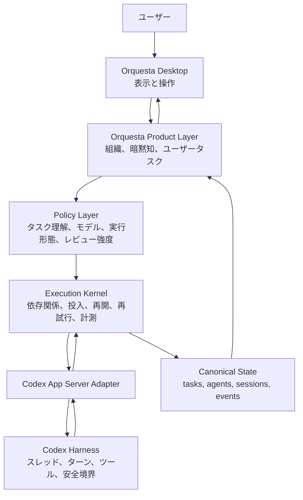

# Orquesta V4 Fast 実行カーネル再設計

作成日: 2026-07-31

対象: Orquesta V4 Fast
状態: 段階Eのactive実測を3件実施。性能と受理処理が不合格のため切り替えは保留

## 結論

Orquestaに別のマルチエージェントフレームワークを追加しない。Codexと別にエージェント実体を持つと、以前起きた「Desktopには表示されるがCodexには存在しない」という不一致を再発させるためである。

OpenAI Symphonyの仕様から、次の実行制御だけをNode.jsへ移植する。

- 単一のスケジューラが実行状態を更新する
- 依存関係を満たした仕事を、空いた枠へすぐ投入する
- 同じ仕事を二重に起動しない
- App Serverの通知を実行事実として扱う
- 停止、失敗、無応答を区別し、再試行を制御する
- 再起動後に正規状態とCodexの実体から復旧する
- 時間とトークンを実行単位で計測する

一方、Orquesta固有の次の部分は残す。

- 長期専門家と組織
- ユーザー質問、判断、暗黙知の蓄積
- ファイルに保存された正規状態
- タスクごとの限定コンテキスト
- Desktopの組織図、現在、ユーザータスク、記録
- Lucaと利用者支援
- モデルと推論量の選択方針

採用する考え方は「SymphonyをOrquestaへ入れる」ではなく、「Symphony互換の小さな実行カーネルをOrquestaの内側へ作る」である。

## 今回確認できた問題

現在のOrquestaには、必要な部品の多くがすでにある。

- `packages/codex-adapter/src/app-server-adapter.js`はCodex App Serverのスレッド、ターン、通知、承認を扱う
- `apps/orquesta-desktop/electron/core/project-thread-reconciler.ts`はCodexの実在スレッドとOrquestaのセッションを照合する
- `orquesta/scripts/capacity-gate.js`は投入、開始、進捗、失敗、容量回路を扱う
- `orquesta/scripts/task-acceptance-reconciler.js`は報告、レビュー、受理を正規状態へ反映する
- `packages/core/src/execution-policy.js`は`fast / standard / critical`のレビュー量を決める
- `packages/core/src/task-profiler.js`はタスクの危険度や必要コンテキストを推定する

問題は、これらが一つの実行状態機械としてつながっていないことである。Desktop、スキル、正規JSON、容量台帳、受理処理がそれぞれ部分的に実行状態を持っている。そのため、確認の往復、重複した状態更新、実体のないエージェント表示、完了後の再開漏れが起きやすい。

現在のベンチマークでは、追加した二つのタスクにおいてPlainが合計403.091秒、570,897トークン、Orquestaが合計560.214秒、2,012,175トークンだった。Orquestaは時間が約39%増え、トークンは約3.52倍になった。特に競合要件の整理では時間が73.3%、トークンが425.5%増えた。これは品質機構の存在だけでは説明できず、実行経路そのものを整理する必要がある。

## 目標構造

Desktopは実行の真実を作らない。正規状態とCodexの実体を表示し、操作を実行カーネルへ渡すだけにする。Desktopが閉じていても、Codex側の統括実行が同じカーネル契約を使えるようにする。

## 二つの独立した判断軸

現行の`fast / standard / critical`だけでは、実行人数とレビュー量が一緒に決まってしまう。これを二軸へ分ける。

### 実行形態

`solo_direct`

- 一人のCodexが最初から最後まで行う
- 小さい修正、順序依存が強い作業、共有ファイルが多い作業の既定値
- Orquestaの状態記録は行うが、専門家の報告書と独立レビューを自動では要求しない

`bounded_parallel`

- 二つ以上の独立した成果物を中央の統括がまとめる
- 依存関係が弱く、編集範囲が重ならず、並列化の利益が見込める場合だけ使う
- 全員を待つ一括バリアを使わず、一つ終わるたびに次の処理を始める

`durable_specialist`

- 長期的な専門知識を保つ必要がある仕事を既存の専門家へ渡す
- 単発タスクの高速化ではなく、数週間から数か月の文脈保持が目的
- 専門家は割り当てられた資料だけを読む

`independent_review`

- 実装形態ではなく追加工程
- 高影響、意味判断、公開、破壊操作、検証困難のときだけ付ける

### レビュー強度

`light`

- 決定的な検証だけ
- 低リスクで簡単に戻せる変更

`normal`

- 実装者の検証に加え、一回の独立確認
- 複数境界、依存関係変更、曖昧さが残る変更

`strict`

- 人間判断または独立確認を必要とする
- 公開、外部書き込み、認証情報、不可逆変更、高い意味判断

この分離により、たとえば「一人で素早く実装し、最後だけ厳格に確認する」ことが可能になる。

現在のCore実装では、この二軸を`execution-plan`のpolicy version 2として保存する。構造化した`execution_evidence`がない新規プロファイルは`solo_direct`にし、`bounded_parallel`は独立成果物、依存関係、書き込み非重複、独立検証、並列利益がすべて明示された場合だけ選ぶ。`durable_specialist`も長期文脈保持が明示された場合だけである。`review_intensity`はrisk profileから別に決めるため、`solo_direct`でもnormalまたはstrictの独立レビューは残る。既存policy version 1のlane契約とproduction Desktop execution-kernelの既定は変更していない。

## タスク理解はキーワード一致を主役にしない

現行の`packages/core/src/task-profiler.js`には、日本語と英語の単語を正規表現で拾って効果や検証方法を推定する処理がある。これは安全側の補助検出には使えるが、実行形態を決める根拠には弱い。

新しい判断順は次の通りにする。

1. ユーザーの依頼から、構造化した`TaskIntent`を作る
2. 目的、成果物、依存関係、編集範囲、検証方法、影響をLLMが構造化する
3. 明示されたファイル範囲や外部操作から、決定的な安全下限を加える
4. 不確実な項目には`unknown`と根拠不足を残す
5. 実行形態とレビュー強度を別々に決める
6. 実行中の証拠に応じて上げ下げする

キーワード推定は次の用途に限定する。

- 明示された危険操作を見落とさないための安全下限
- LLMの構造化結果との矛盾検出
- 入力が壊れているときの保守的なフォールバック

キーワードだけで専門家、並列化、レビュー回数を決めてはならない。

## 並列化の判定

人数や「大きそう」という印象では判定しない。次の項目を構造化して判断する。

- `decomposability`: 成果物を独立に分けられるか
- `dependency_ratio`: 前の結果を待つ必要がある割合
- `shared_context_ratio`: 複数担当が同じ大量資料を読む必要があるか
- `write_overlap`: 同じファイルや状態境界を編集するか
- `integration_cost`: 統合と競合解消に必要な仕事量
- `verification_independence`: 各成果物を別々に検証できるか
- `expected_parallel_gain`: 待ち時間を含めて短縮が見込めるか

`bounded_parallel`を選べるのは、少なくとも次を満たすときだけにする。

- 二つ以上の独立成果物がある
- 依存関係が明示されている
- 同じファイルを同時編集しない
- 担当ごとの必要資料を限定できる
- 統合作業が成果物本体より小さい

条件が足りない場合は`solo_direct`へ戻す。マルチエージェントを使うこと自体を成功条件にしない。

## コンテキストの分離

### 統括が持つもの

- プロジェクトの短い目的
- 現在の決定事項
- 未完了タスクの依存関係
- 各担当の短い状態
- ユーザー判断と禁止事項
- 受理に必要な証拠

統括は専門家の全文資料、全会話、全ログを常時読まない。

### 実行担当が持つもの

- 一つの`TaskIntent`
- 成果物と受理条件
- 許可されたファイル
- 直接必要な資料
- 関係する決定事項
- やってはいけないこと

### 戻すもの

- 変更したもの
- 実行した検証
- 未解決点
- ユーザー判断が必要な候補
- 短い差分要約

報告本文、チャット全文、同じ設計書を何度も統括へ戻さない。継続ターンでは元の依頼を再送せず、差分指示だけを同じCodexスレッドへ送る。

## 実行カーネルの状態

スケジューラだけが次の実行状態を更新する。

- `pending`
- `eligible`
- `claimed`
- `dispatching`
- `running`
- `waiting_for_user`
- `waiting_for_dependency`
- `retry_queued`
- `verifying`
- `accepted`
- `failed`
- `cancelled`

製品上のタスク状態とCodexのターン状態は混同しない。`dispatch_accepted`は`turn_started`ではなく、`turn_started`は`progress_observed`でもない。

各実行単位には`task_id + execution_revision + cycle_id`から決定的に作る`execution_key`を付ける。個別の投入には`execution_key + attempt`から`dispatch_id`を作る。同じ`execution_key`がすでに`claimed`または`running`なら並行して再投入せず、失敗後の明示的な再試行だけ次の`attempt`を使う。

## 単一更新者と復旧

`.orquesta/state/tasks.json`を複数の処理が直接書き換える状態をやめる。実行カーネルがイベントを受け、正規状態を一回だけ更新する。

DesktopとCodex側の統括が同時に動く可能性があるため、実行カーネルは短いリースを持つ。

- `owner_id`
- `epoch`
- `acquired_at`
- `heartbeat_at`
- `expires_at`

期限内の別所有者がいる場合は、表示と読み取りだけ行う。期限切れ後の復旧では、Codexの実在スレッド、進行中ターン、正規タスク、イベント記録を照合してから新しい`epoch`で引き継ぐ。

Desktopを閉じたときは「見えなくなる」だけで、実行結果の正規状態は失われない。常駐プロセスが存在しない環境では、次のCodexターンが正規状態から再開する。存在しない監視処理を動作中と表示してはならない。

## 待ち方

統括を常時LLM推論させない。待機中はトークンを使わないイベント待ちにする。

1. 実行中の対象とカーソルを一回の待機へ渡す
2. 最初に完了または要対応になった対象だけ処理する
3. その成果物の検証、修正、後続タスクをすぐ開始する
4. 残りの対象を再び待つ

Desktopが閉じていても、Codexの`wait_threads`または短い完了通知を使える場合は同じ流れを使う。どちらも使えない場合は正規状態に証拠を残し、次の実ターンで復旧する。

## 既存モジュールの扱い

| 現在の場所 | 判断 | 今後の役割 |
|---|---|---|
| `packages/codex-adapter/src/app-server-adapter.js` | 残す | Codexプロトコルの唯一の接続口 |
| `apps/orquesta-desktop/electron/core/desktop-codex-service.ts` | 残して薄くする | Desktop操作を実行カーネルへ渡す |
| `apps/orquesta-desktop/electron/core/project-thread-reconciler.ts` | 残す | Codex実体との照合。正規状態の真実を捏造しない |
| `apps/orquesta-desktop/electron/core/repository-runtime.ts` | 残す | ファイル監視と画面用スナップショット |
| `packages/core/src/task-intent.js` | 残す | タスク意味の正規契約 |
| `packages/core/src/projectors.js` | 残して拡張 | イベントから画面・状態を投影 |
| `packages/core/src/execution-policy.js` | 置き換え | 実行形態とレビュー強度を二軸化 |
| `packages/core/src/task-profiler.js` | 置き換え | キーワード主導から構造化判断へ変更 |
| `packages/core/src/profiled-execution-plan.js` | 置き換え | 新しい二軸の計画を生成 |
| `orquesta/scripts/capacity-gate.js` | 吸収 | 容量回路と投入事実を実行カーネルへ統合 |
| `orquesta/scripts/task-acceptance-reconciler.js` | 分割 | 報告の検証は残し、実行状態更新はカーネルへ移す |
| `apps/orquesta-desktop/electron/core/core-runner.ts` | 薄くする | 巨大な分岐ではなく、IPCとカーネルの橋にする |
| `orquesta/references/orchestration-protocol.md` | 更新 | 人間が守る手順から、カーネルの不変条件中心へ変える |
| Beta V3互換の制御状態 | 後で削除 | V4 Fast切り替え後、移行読取だけ残す |

この段階では既存ファイルを削除しない。新カーネルが同じ入力に対して同じ正規結果を作れることを確認してから、重複経路を消す。

## 取り入れないSymphony要素

- Linear、GitHub Issuesなどを必須の制御面にしない
- Elixir実装をそのまま持ち込まない
- すべてのタスクに別ワークスペースを強制しない
- SymphonyのHTTPダッシュボードを追加しない
- 高信頼環境向けの自動承認を既定にしない
- タスクごとに使い捨てエージェントを作る設計へ変えない
- Orquestaの長期専門家、ユーザー質問、暗黙知を捨てない

Symphonyは再起動後にタスクトラッカーから再投入するが、現在の参照実装は再試行タイマーや実行中セッションを永続化しない。Orquestaは長期運用を目的にするため、この点はそのまま真似せず、ファイル状態とCodex実体の照合を残す。

## 段階的な実装

### 段階A: 設計監査

この文書で完了する。

- 責務の重複を特定
- 残すものと置き換えるものを決定
- 性能以外の確認条件を決定

完了。実装境界と中止条件をこの文書に固定した。

### 段階B: 小さい実行カーネル

新しい`packages/execution-kernel`を作る。

- 純粋な状態遷移
- 依存関係判定
- 投入予約と重複防止
- 空き枠判定
- 再試行と停止
- イベント投影
- 模擬Codexアダプターによる決定的テスト

既存経路は残し、機能フラグが有効なテストだけ新カーネルを使う。

完了。`packages/execution-kernel`に純粋な状態遷移、依存関係、容量、重複防止、再試行、停止、App Server橋を実装した。2026-07-31時点でカーネル試験18件が通過している。

### 段階C: App Serverの二タスク実証

二つの独立タスクだけを新カーネルで実行する。

- Desktopに実在するスレッドだけ表示される
- 一つが終わったら後続をすぐ始める
- Desktopを閉じても証拠が残る
- 再起動しても二重ターンを開始しない
- 同じスレッドの継続では元プロンプトを再送しない

完了。`ORQUESTA_EXECUTION_KERNEL_V2=1`のときだけDesktop送信を新カーネルへ渡す。二つの実ターン、完了通知、再起動後の復旧、二重投入なしを開発版とWindowsパッケージで確認した。

### 段階D: 影実行

既存スケジューラは実行を続け、新カーネルは同じ状態を読んで「何を実行するはずか」だけ記録する。判断の違いを比較し、新カーネルからはCodexターンを開始しない。

完了。`ORQUESTA_EXECUTION_KERNEL_SHADOW_V2=1`で有効になり、既存のDesktop送信を一回だけ実行したまま、投入、依存待ち、容量待ち、重複抑止、失敗、完了、再起動復旧を`.orquesta/state/execution-kernel-shadow-v2.json`へ記録する。本文は保存せずSHA-256と件数だけを残す。日本語と英語で言い換えた二つの送信を使ったDesktop E2Eで、既存送信2回、新カーネル追加送信0回、完了2件、再起動後の再送0回を確認した。

### 段階E: ベンチマークと切り替え

既存二タスクだけでなく、未知のタスクを加えて比較する。合格後に実行所有権を新カーネルへ切り替え、古い重複経路を削除する。

切替判定器まで完了。Desktopの送信記録だけでは、専門家への実タスク配分を評価できないことが分かった。そのため、次の証拠が全部そろうまで切り替えない。

- 実際の`orquesta_task_dispatch`を8件以上
- 未知タスクを2件以上
- 独立、依存待ち、容量待ち、重複抑止、復旧、再試行をすべて観測
- 新カーネルによる追加Codexターンが0件
- Plainと品質が一致した実測を3件以上
- `solo_direct`と`bounded_parallel`の両方を含む
- 時間とトークンが欠損していない

`packages/execution-kernel/src/cutover-evaluator.js`は、タスク本文や名称のキーワードを読まず、構造化された依存関係、容量、実行ID、復旧証拠、時間、トークンだけで判定する。証拠不足は合格にせず`insufficient_evidence`にする。現時点では実行所有権は既存経路のままである。

ベンチマークには`--kernel-mode shadow`と`--kernel-mode active`を追加した。`active`はベンチマーク内の専門家投入だけを新カーネルで行い、依存完了後の即時解放と最大2件の容量制限を実測する。製品の既定経路やDesktopのフラグは変更しない。

2026-07-31に、既存のPlain実測を再利用してactiveを3件実行した。全件で決定論的な成果物検証は通ったが、結果は次の通りだった。

| タスク | 実行形態 | Plain時間 | active時間 | 時間比 | Plain token | active token | token比 | 実行結果 |
|---|---|---:|---:|---:|---:|---:|---:|---|
| parallel-integration | solo_direct | 221.100秒 | 176.271秒 | 0.797倍 | 327,352 | 574,793 | 1.756倍 | 合格 |
| conflicting-requirements-triage | bounded_parallel | 181.991秒 | 399.393秒 | 2.195倍 | 243,545 | 1,239,165 | 5.088倍 | 合格 |
| organization-json-generator | solo_direct | 264.912秒 | 184.342秒 | 0.696倍 | 360,455 | 546,277 | 1.516倍 | 成果物合格、実行状態は失敗 |

二つのsolo_directでは時間が短くなったが、tokenはどちらも目標の1.25倍を超えた。bounded_parallelは最大2件の容量制限そのものは動いたが、時間とtokenの両方がPlainより悪化した。organization-json-generatorは成果物の検証に合格した後、fast laneのタスクへhandoff、独立レビュー、報告書の実績が記録されたことを理由に`TASK_ACCEPTANCE_GATE_FAILED`になった。仕事の失敗ではなく、実行形態と旧レビュー予算が矛盾したことによる失敗である。

この結果から、実行カーネルへの切り替えはまだ行わない。次に直す対象は、スケジューラの待ち方ではなく次の三点である。

- solo_directで専門家を起動せず、統括の同一ターンまたは同一スレッド継続で完了できる経路
- bounded_parallelの各担当へ巨大な共通コンテキストを渡さず、TaskIntentと必要資料だけを渡す境界
- 実行形態とレビュー強度を分離し、成果物合格後に旧fast lane予算との矛盾で失敗させない受理契約

実測証拠は`benchmarks/orquesta-v4-product/reports/matrix-20260731-kernel-active-stage2-evidence.json`に固定した。切替判定器の合格条件は緩めない。

## 私が代わりに行う包括確認

### Orquestaらしさ

- 長期専門家が使い捨てワーカーへ変わっていない
- ユーザー質問と暗黙知が残っている
- ユーザーが組織と進行を把握できる
- Desktopが単なるログ画面になっていない

### 実体の一致

- Desktopの全エージェントが実在するCodexスレッドへ結び付く
- Codex側で存在しないエージェントを稼働中と表示しない
- Desktopから送ったメッセージが対象スレッドへ届く
- Desktopを閉じても正規状態が壊れない

### 性能

- `solo_direct`に振り分けた未知タスクで、Plain比の時間中央値を1.10倍以内にする
- 同じ条件のトークン中央値をPlain比1.25倍以内にする
- `bounded_parallel`は、時間を15%以上短縮するか、検証品質を明確に上げる場合だけ採用する
- 並列化でトークンが2倍を超える場合は、品質上の明確な利益がない限り不合格にする
- 待機中のLLMトークン消費をゼロにする

数値は最初の合格目標であり、特定ベンチマークへ合わせてルールを書き換えない。達成できない場合は、数値を隠すのではなく実行形態をPlainへ近づける。

### 汎用性

- キーワードを言い換えたタスクでも同じ構造なら同じ判断になる
- 日本語と英語で判断が大きく変わらない
- タスク名に特定単語を入れただけで専門家やレビューが増えない
- 既存ベンチマークに似ていない未知タスクを使う
- タスクの順序、ファイル名、説明文を変える変異テストを行う

### 長期運用

- コンテキスト圧縮後も正規状態から再開できる
- 一週間以上の履歴を全担当が読み直さない
- 統括、専門家、ユーザー判断の保存先が混ざらない
- 完了報告がチャット全文を汚染しない
- 古い報告書より現在のJSON状態を優先する

### ユーザー負担

- 技術方式の選択をユーザーへ戻さない
- ユーザーへ聞くのは、価値判断、見た目、優先順位、外部操作だけにする
- 同じ質問を複数担当から送らない
- レビュー依頼には、見る場所と判断項目を短く示す

### 移行と他プロジェクト

- この開発ワークツリーだけでなく`help`でも同じスキルと実行契約を使える
- 旧状態を読めても、旧経路を新規作成しない
- 未コミット作業があるプロジェクトを勝手に整理しない
- Windowsの実インストール版で最後に確認する
- リポジトリのビルドだけでDesktop修正完了としない

## 中止条件

次のどれかが起きた場合は、実装を広げず原因を直す。

- 新カーネルがCodexとは別のエージェント実体を作った
- Desktopを開かないと実行できない
- 一つの小タスクでも専門家報告と独立レビューが自動で増えた
- キーワード一致が実行形態の最終決定になった
- 同じタスクのターンが二重に始まった
- 待機中にLLMターンを回し続けた
- ベンチマーク専用の例外が本体へ入った
- 既存のユーザー質問、暗黙知、長期専門家を壊した

## 採用元とライセンス

参考にしたのはOpenAI Symphonyの2026-07-31時点のコミット`f8e8b8a670c799f6e0ade7a8c25c4bf4a4a56ec7`である。

- リポジトリ: https://github.com/openai/symphony
- 仕様: https://github.com/openai/symphony/blob/main/SPEC.md
- ライセンス: Apache License 2.0

実装を直接移植する場合は、元の著作権表示、ライセンス、NOTICE、変更点の記録を保持する。仕様の考え方だけを独自実装する場合も、設計文書で参照元を残す。
