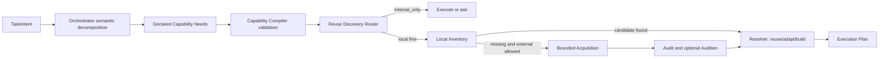

# Orquesta Proactive Reuse Router

## 目的

Orquestaが実装を始める前に、既存のローカル資産、公式ドキュメント、OSS、registry、UI catalogを使う方が速いかを自分で判断できるようにする。ただし、すべてのタスクでWeb検索を行う仕組みにはしない。小さな修正を遅くせず、既存資産が開発経路を大きく短縮できる場合だけ探索する。

## 現状の問題

Scout、Acquisition、Audit、Audition、Resolverはすでに存在する。通常運用で欠けているのは次の接続である。

- Capability Needが通常のタスク作成から渡されない。
- 既存のCapability Compilerはキーワード規則が中心で、想定外の専門領域を一般化できない。
- `execution-plan.create`は直前に生成したCapability Graphを使わず、呼び出し側が同じNeedを再送しない限り空配列になる。
- ローカル確認、外部探索、探索省略の判断がTask Profileに残らない。

このため、機能は存在していてもユーザーが「先に調べて」と言わなければ発動しない。

## 設計原則

### 意味理解と機械的制御を分離する

統括者はLLMの意味理解を使い、任意の専門領域をCapability Needへ構造化する。CoreはそのNeedを検証し、探索順序、予算、停止条件を決める。

キーワード規則は古い呼び出しとの互換用fallbackに限定する。キーワード一致を、自動探索の根拠や万能な分類器として使わない。

### Needごとに取得方針を明示する

Capability Needへ任意の `acquisition_mode` を追加する。

- `internal_only`: Orquesta内部の能力で完結させ、資産探索をしない。
- `local_only`: リポジトリ、導入済みpackage、Codex skillだけ確認する。
- `external_if_missing`: ローカル候補がなければ外部探索する。
- `compare_external`: ローカル候補の有無にかかわらず、外部候補とbuildを比較する。

未指定時の互換fallbackは、permissionとhuman judgmentを`internal_only`、codeを`local_only`、その他を`external_if_missing`とする。このfallbackは最終判断ではなく、理由コードに残す。

### 探索はlocal-firstにする

1. 構造化Needを検証する。
2. ローカルinventoryを確認する。
3. `external_if_missing`でローカル候補がないNeedだけlive Acquisitionへ送る。
4. `compare_external`は比較価値が明示されたNeedだけlive Acquisitionへ送る。
5. Resolverがreuse、adapt、build、ask、abandonを比較する。
6. install、課金、ログイン、外部書き込みは既存のCodex承認境界を通す。

### 小タスクを重くしない

次は原則として探索を省略する。

- 既存ファイル内の局所的な不具合修正
- 採用済みの実装方式を維持する小変更
- permissionまたはhuman judgmentだけのNeed
- ユーザーが利用資産を指定済みの作業
- 外部探索禁止が構造化Needに明記された作業

省略した場合も `reuse_discovery.status = skipped` と理由をTask Profileへ残す。

## データフロー

## Task Profile出力

`task_profile.reuse_discovery` は次を持つ。

- `status`: `skipped`、`local_inventory_required`、`live_acquisition_required`、`resolution_required`、`semantic_decomposition_required`
- `need_routes`: Needごとのmode、local結果、次のaction
- `reason_codes`: 省略または発動理由
- `budget`: 既存Acquisitionと同じ、Needあたり外部request最大8、connectorあたり2、候補最大3
- `local_first: true`

## 通常運用の接続

- `capability.compile` は `declared_needs` があればそれを権威ある入力として検証する。
- `declared_needs` がなければ既存rule catalogを互換fallbackとして使う。
- `execution-plan.create` はpayloadにNeedがなければ、現在のCapability GraphのNeedを自動で使う。
- Task ProfilerはNeedからReuse Discovery Planを作り、Task Profileに保存する。
- Orquesta skillは非自明な新規作成の前に意味ベースのNeedを作り、Reuse Discovery Planに従う。キーワード表を増やして分類しない。

## 実装段階

### Stage 1: 接続修復

- Capability Needに`acquisition_mode`を追加する。
- 宣言済みNeedをCompilerへ渡せるようにする。
- Execution Planが現在のGraphを自動利用する。
- pureなReuse Discovery Routerとテストを追加する。

### Stage 2: 実運用発動

- Orquesta skillへsemantic decompositionとlocal-first gateを追加する。
- Task Profileへ発動・省略理由を残す。
- UI、世界観、データ、ツール、局所修正のfixtureで汎用性を確認する。

### Stage 3: live経路

- unresolved Needだけ既存Acquisition connectorへ渡す。
- Audit、Audition、Resolverを通し、buildを必ず比較対象に残す。
- 外部操作は既存承認境界を維持する。

## 実装結果

Stage 3までCoreへ接続した。`runReuseDiscovery` は現在のCapability Graphとlocal inventoryから開始し、必要なNeedだけ既存Acquisition connectorへ送る。取得候補はsource refとhashを固定してAuditへ渡し、Resolverがlocal、live、buildを同じ比較に載せる。

結果はacquisition snapshot、live provider、candidate evaluation、resolutionとしてEventStoreへ保存する。同時にTask Profileの`reuse_discovery`を実行結果へ更新し、Execution Planを新しいrevisionへ差し替える。候補の採用とinstallは自動化せず、既存のユーザー承認境界を使う。

connectorとtransportはCoreへ注入する。Core自身が勝手にネットワーク接続先や認証情報を持つ設計にはしない。connector未設定、source binding不一致、出典不足の場合はpartialまたはuser reviewへ閉じる。

## 受入条件

- 任意の宣言済みNeedをキーワード規則なしで安定したCapability Graphへできる。
- `execution-plan.create`でNeedを二重送信しなくてもTask Profileに探索計画が残る。
- 小さな局所修正は外部探索を要求しない。
- UI assetや未知のtoolはlocal-firstになり、ローカル不在時だけlive探索になる。
- permissionとhuman judgmentは自動でWeb探索されない。
- 候補数とrequest予算は既存の上限を超えない。
- install、課金、ログイン、外部書き込みを自動承認しない。
- 既存のキーワードfixtureは互換fallbackとして壊れない。

## やらないこと

- LLM判断を巨大なキーワード表へ置き換えること
- 全タスクで無条件にWeb検索すること
- 検索結果を監査せず自動導入すること
- Scout、Acquisition、Resolverを別実装で複製すること
