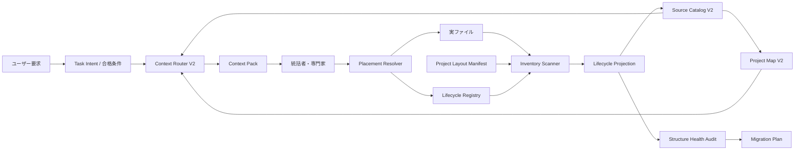

# Orquesta Project Structure & Lifecycle Layer 詳細設計

日付: 2026-08-01

状態: ユーザーレビュー待ち
対象: Orquesta V4 Fast以降の初回セットアップ、長期運用、Context V2、既存プロジェクト移行

## 結論

今回作るべきものは、全プロジェクトへ同じフォルダ構造を押し付ける仕組みではない。

必要なのは、プロジェクト内の情報について次の四点を機械的に判断できる層である。

- 何が現在の正本か
- 何が作業途中、旧版、参考資料、自動生成物、隔離対象か
- 新しいファイルをどこへ置くべきか
- そのタスクと専門家が何を読み、何を読まないか

この層を `Project Structure & Lifecycle Layer` と呼ぶ。物理的なファイル配置、情報の有効状態、AIの読取範囲を分離して管理する。

MSの`90_dust`は正式な設計として採用しない。あれは整理不能になった情報を一か所へ逃がすための緊急避難であり、旧版、作業途中、却下済み、要確認が混ざっている。今回の設計では、その混在自体を発生させにくくする。

現行OrquestaにはSource Catalog、Project Map、Context Broker、Context Pack V2がすでにある。これらは捨てない。足りない「構造台帳」「ライフサイクル台帳」「配置判断」「安全な移行」を追加し、Context V2の前段として接続する。

## この設計で変わること

現在は、AIがファイル名、配置、会話履歴、古い設計書から「たぶんこれが最新」と推測する場面が残っている。これがV3の起動方法をV4で拾う、古い設定を現在の規約として扱う、生成レポートを何度も読む、といった問題につながっている。

変更後は、ファイルの場所だけでなく台帳上の状態を見て判断する。

例えばV3の設定ファイルが残っていても、削除しなければ動かないのではなく、`superseded + explicit_only`として通常の実行経路から外す。V4の正本には、何の正本なのかを示す一意のキーを付ける。同じキーに二つの現行正本が存在した場合だけ、曖昧なまま進めず停止する。

新しい専門家は、役職名に応じた固定フォルダを読むのではない。タスク、合格条件、対象コンポーネント、依存関係をもとにContext V2が必要資料を選ぶ。世界観構築係、UI係、外部比較係など、事前に想定していない専門家でも同じ方法で動く。

## 現状から確認できた問題

今回の設計は、単一プロジェクトの見た目だけを整えるものではない。実際の長期プロジェクトで起きた問題を共通要件へ変換する。

### Orquesta

- V3、V4、V4 Fastの設計、互換処理、実装が同じ探索範囲に残っている。
- `orquesta/`が配布元で、`.agents/skills/orquesta/`が同期先であるにもかかわらず、見た目上は二つの実装に見える。
- `.orquesta/state/`に正規状態だけでなく、`.bak`や一時ファイルも残っている。
- ベンチマークのworkspace、レビュー用コピー、ビルド生成物が通常検索へ入りやすい。
- 現在の作業ツリーには多数の未コミット変更があるため、即座の一括移動は危険である。

### MS

- 最初に作った大量の文書が上位階層へ残り、後から整理するため`90_dust`へまとめて退避した。
- `dust`内には異なる状態の資料が混ざるため、「読まない方がよい」のか「まだ判断していない」のか区別できない。

### Enlightened

- 上位階層へ多数の番号付き文書とhandoffが残った。
- 現行handoffに「番号付き文書を既定では読まない」と書くことで対処しているが、これは文章による注意であり、機械的な読取境界ではない。
- 大量の出力、tmp、素材workbenchがプロジェクト理解の探索対象へ混ざりやすい。

### SILK

- 複数バージョンのディレクトリが通常の探索範囲に残っている。
- `ACTIVE_VERSION.json`は良い仕組みだが、旧版を読取候補から外すところまでは担保していない。

### slvGlitch

- レポート、出力、データが長期運用で増え続ける。
- 生成物と正本を同じ方法で索引すると、検索量とContext Pack候補が膨らむ。

## 設計目標

### 必須目標

1. 古い設定や旧版が、現在の正本として自動選択されない。
2. AIが新しいファイルをプロジェクト直下へ場当たり的に増やさない。
3. ソフトウェア、創作、研究、データ、画像中心のプロジェクトで同じ原則を使える。
4. 初めは小規模でも、後から大規模化したときに構造を成長させられる。
5. 統括者は全体像を短いProject Mapで把握し、専門家は担当資料だけを読む。
6. Desktopを開いていなくても、CLIとCodexだけで同じ読取境界が働く。
7. 既存の汚れたプロジェクトを、ユーザーのファイルを消さずに段階移行できる。
8. 整理のための台帳自体が巨大化しない。

### 非目標

- 全プロジェクトへ同じ番号付きフォルダを強制しない。
- 古いファイルを自動削除しない。
- LLMの推測だけで正本を決めない。
- 全ファイルを人間が一件ずつ登録しない。
- タスク実行のたびに全リポジトリを走査しない。
- 整理違反のたびに新しい承認作業をユーザーへ要求しない。
- Backstage、Aider、Copierなどを製品ごと導入しない。

## 基本原則

### 物理配置と意味を分ける

同じ`docs/`内にあっても、現在の仕様、参考資料、旧版では意味が違う。逆に、別ディレクトリにあっても同じ機能の正本である場合がある。フォルダ名だけを真実にしない。

### 正本と現行を分ける

`current`は今も利用可能という意味で、`canonical`は特定の判断や機能について最終的な根拠であるという意味にする。現在利用できるテストやレポートが複数あってもよいが、同じ意味を支配する正本が二つあってはいけない。

### 共通規則は少なく、プロジェクト差はmanifestへ出す

共通層が持つのは、状態、権威、読取規則、配置判断の形式だけにする。`src/`を使うか、`world/`を使うか、`data/`を使うかはプロジェクトmanifestで決める。

### 初期構造を作りすぎない

空のファイルや将来使うか不明なディレクトリを大量生成すると、それ自体がノイズになる。初回セットアップでは、現在判明しているコンポーネントと最小限の入口だけを作る。必要になった時点でmanifestへコンポーネントを追加する。

### 読取禁止より、候補から外す

通常の旧版や参考資料は削除も全面禁止もしない。`explicit_only`として、ユーザーやタスクが明示した場合だけ読めるようにする。完全な`never`は生成キャッシュ、秘密情報、壊れたバイナリ、依存物などに限定する。

### 整理は通常作業を止めない

警告で済む問題と、停止すべき問題を分ける。曖昧な正本競合やプロジェクト外書込みは停止するが、ファイル名の好みや軽微な配置ずれは警告と修正候補にする。

## 全体構成



### Project Layout Manifest

プロジェクトの主要コンポーネント、格納先、生成物、除外領域を定義する。物理ファイルの正本ではなく、構造の正本である。

保存先は`.orquesta/project/layout.json`とする。

```json
{
  "schema_version": 1,
  "project_id": "orquesta",
  "project_kind": "hybrid_software_product",
  "components": [
    {
      "component_id": "desktop-app",
      "kind": "application",
      "roots": ["apps/orquesta-desktop"],
      "owner": "desktop-product",
      "default_lifecycle": "current",
      "default_authority": "supporting",
      "default_read_policy": "task_candidate",
      "include": ["src/**", "electron/**", "package.json"],
      "exclude": ["dist/**", "release/**", "node_modules/**"]
    }
  ],
  "generated_roots": ["dist", "out", "coverage"],
  "external_storage_roots": [],
  "updated_at": "2026-08-01T00:00:00Z"
}
```

`roots`は一つに限定しない。モノレポ、創作資料、データ、外部素材を一つのプロジェクトとして扱えるようにする。

### Lifecycle Registry

各コンポーネントの既定値と、例外だけを保存する。全ファイルの巨大な一覧にはしない。

保存先は`.orquesta/project/lifecycle.json`とする。

```json
{
  "schema_version": 1,
  "rules": [
    {
      "rule_id": "legacy-v3",
      "match": ["legacy/v3/**"],
      "lifecycle": "superseded",
      "authority": "supporting",
      "read_policy": "explicit_only",
      "reason": "V4へ移行済み"
    },
    {
      "rule_id": "generated-benchmark-workspaces",
      "match": ["benchmarks/**/workspaces/**"],
      "lifecycle": "current",
      "authority": "derived",
      "read_policy": "never",
      "storage_policy": "gitignored"
    }
  ],
  "overrides": [],
  "canonical_claims": [
    {
      "claim_key": "orquesta.skill.source",
      "source_ref": "orquesta/SKILL.md"
    }
  ]
}
```

### Lifecycle Projection

Layout Manifest、Lifecycle Registry、実ファイル、Git状態を組み合わせ、Context V2が使えるSource Recordへ投影する。既存の`source-record.schema.json`は初期段階では変更しない。

追加情報はprojection側に保持し、既存フィールドへ次のように変換する。

| 新しい意味 | Source Record V2への投影 |
|---|---|
| canonical | `authority: canonical` |
| supporting | `authority: workspace`または`accepted` |
| derived | `authority: workspace`、通常は候補外 |
| external | `authority: external` |
| current | `status: current` |
| superseded | `status: superseded` |
| archived | 通常のCatalogから除外し、履歴Catalogへ記録 |
| quarantined | 通常のCatalogから除外 |
| delete_candidate | 通常のCatalogから除外、削除は別承認 |

この方法なら、現在動いているContext Pack V2、Broker、テストを壊さずに機能を足せる。

### Placement Resolver

AIがファイルを作る前に、保存先と状態を決める。役職名ではなく、作ろうとしている成果物の性質で判断する。

入力は次の通りである。

- task id
- 対象コンポーネント
- 成果物の種類
- 正本を更新するのか、補助資料を作るのか
- 既存ファイルを置き換えるのか
- 人間向けか、機械状態か、生成物か
- 保存期間

出力は次の通りである。

```json
{
  "target_path": "docs/design/2026-08-01-example.md",
  "component_id": "orquesta-core",
  "lifecycle": "draft",
  "authority": "supporting",
  "read_policy": "task_candidate",
  "supersedes": [],
  "reason": "承認前の設計書"
}
```

保存先を確定できない場合、プロジェクト直下へ置かない。`workbench/inbox/<task-id>/`に一時配置し、`unclassified`警告を出す。このinboxは永久保管場所ではなく、タスク完了時に空であることを確認する。

### Structure Health Audit

次の問題を検出する。

- 同じ`claim_key`に複数の現行正本がある
- 旧版が`task_candidate`になっている
- 生成物や依存物が通常のSource Catalogへ入っている
- 宣言外のルートへ新規ファイルが増えている
- 参照されているのに存在しないファイルがある
- 同じhashのコピーが別の正本として存在する
- 一時ファイル、`.bak`、`tmp`が正規状態と同じ場所に残っている
- `workbench/inbox`に完了タスクの未分類物がある
- 一つのディレクトリが過度に広い

監査結果は自動削除を行わない。`error`、`warning`、`suggestion`の三段階で出す。

停止するのは原則として次の三つだけである。

- 同じ意味に複数の現行正本があり、実行結果が変わる
- 読取禁止領域をContext Packへ含めようとした
- 宣言されたプロジェクト外へ書き込もうとした

## 三つの独立した分類軸

### Authority

- `canonical`: 特定の判断、設定、契約について正本
- `supporting`: 現在利用する補助資料、実装、テスト、根拠
- `derived`: 再生成できる出力、キャッシュ、集計、ビルド成果物
- `external`: 外部資料、OSS、Web情報、ユーザー提供素材

### Lifecycle

- `draft`: 作業中で未承認
- `review`: レビュー対象
- `current`: 現在利用可能
- `superseded`: 新しいものに置き換えられた
- `archived`: 履歴として保存するが通常運用では使わない
- `quarantined`: 正体や安全性や帰属が未確認
- `delete_candidate`: 削除候補。自動削除しない

`dust`は使わない。何で退避されたか分からなくなるためである。

### Read Policy

- `bootstrap_candidate`: 初回の短いProject Mapを作る候補
- `task_candidate`: タスクとの関連がある場合だけContext Pack候補になる
- `explicit_only`: ユーザー、タスク、移行調査が明示した場合だけ開ける
- `never`: 通常のAI読取対象にしない

`bootstrap_candidate`であっても、全員へ全文を渡す意味ではない。Project Map用の短い要約候補である。

## 正本競合の防止

古い設定を拾う問題は、単に`archive/`へ移すだけでは完全に解決しない。設定や設計が何についての正本なのかを識別する必要がある。

そのため重要な正本には`canonical_claims`を付ける。

例:

- `orquesta.launch.surface`
- `orquesta.skill.source`
- `orquesta.context.routing.policy`
- `project.active.version`
- `world.city.mobility.rules`

同じclaimに二つの`canonical + current`があれば、ルーターは片方を勝手に選ばない。競合レポートを出し、移行またはユーザー判断を要求する。

全ソースコードの関数へclaimを付ける必要はない。入口、契約、設定、採用済み判断など、誤るとプロジェクト全体へ影響するものだけに使う。

## Context V2との接続

### 統括者

統括者が常時持つのは次だけにする。

- プロジェクト目的の短い要約
- 現在の主要コンポーネント
- active workstreamとタスクグラフ
- 採用済みの重要判断
- 正本競合と構造警告
- 必要時に詳細を取得するBroker

統括者は全ファイル一覧、全レポート、全専門家資料を読まない。

### 専門家

専門家へは次の順で渡す。

1. 最小のOrquesta運用契約
2. Task Envelopeと合格条件
3. その専門家の能力範囲
4. 対象コンポーネントのcurrentな資料
5. 必要時に追加取得できるBroker

役職別固定表を作らない。Context Requirementが要求する知識と、Project Mapの関係から候補を選ぶ。

### 読取選択の順序

1. 明示対象と合格条件に必要な正本を必須候補にする。
2. `never`、`quarantined`、`archived`、`delete_candidate`を除外する。
3. `superseded`を除外する。ただし移行、回帰、歴史調査では明示的に許可する。
4. 対象コンポーネントと依存関係から候補を集める。
5. AiderのRepository Mapと同様に、依存関係と重要度を使ってtoken予算内へ絞る。
6. Coverage Matrixで合格条件を支える資料が揃ったか確認する。
7. 不足時だけBrokerで追加取得する。

キーワード一致は補助に限定する。最終判断はタスク構造、依存関係、authority、lifecycle、coverageで行う。

## 初回セットアップ

### 新規プロジェクト

ユーザー入力後、セットアップエンジンが次を行う。

1. プロジェクト目的と最初の成果物を把握する。
2. `software`、`writing_world`、`data_research`、`asset_heavy`、`hybrid`から初期archetypeを推定する。
3. 必要なコンポーネントだけを提案する。
4. `.orquesta/project/layout.json`と`lifecycle.json`を作る。
5. 必要な物理ディレクトリだけを作る。
6. READMEまたは入口文書を一つ作る。
7. Source CatalogとProject Mapを生成する。
8. 最初のタスクと専門家のContext Packを作る。

空の専門資料を大量生成しない。専門家の資料は、その専門家が必要になったとき、実際のプロジェクト資料からContext Viewとして生成する。

### 既存プロジェクト

既存ファイルを最初から移動しない。

1. Git、ignore、主要manifest、ディレクトリ幅、ファイル種類を読取専用で調べる。
2. 既存の入口、active version、README、現在タスクから正本候補を出す。
3. Layout Manifestのdraftを作る。
4. 生成物、依存物、旧版、重複の候補を出す。
5. Source Catalogをshadow生成する。
6. 現行読取と新読取の差分を見せる。
7. ユーザー承認後に新読取経路を有効にする。
8. 物理移動はさらに後のMigration Planで行う。

## プロジェクトarchetype

archetypeは固定テンプレートではなく、初期提案と監査規則の重み付けに使う。

### software

主なコンポーネントはapplication、library、test、documentation、tooling、generated artifactである。`src`、`apps`、`packages`などは既存構成を優先する。

### writing_world

主なコンポーネントはcanon、draft、research、characters、locations、timeline、manuscript、reviewである。採用済み設定と草稿を同じauthorityにしない。

### data_research

主なコンポーネントはsource data、processed data、analysis code、experiment、report、result snapshotである。巨大データはGit管理とAI全文読取を分離する。

### asset_heavy

主なコンポーネントはsource asset、workbench、approved asset、export、metadataである。画像や動画はメタデータと承認状態を索引し、必要時だけ実体を開く。

### hybrid

複数archetypeをcomponent単位で組み合わせる。OrquestaとEnlightenedはこの形になる。

## 外部探索との接続

V4のAcquisitionは「不足した能力や既存資産を探す」機能であり、この構造層は探索結果の保存先と読取状態を決める。

外部資料は最初から正本にしない。

1. `external + quarantined`または`external + review`で登録する。
2. URL、取得日時、license、version、hashを記録する。
3. Auditと必要な試用を通す。
4. 採用した場合だけ、providerまたはproject dependencyとしてcurrentにする。
5. キャッシュや取得物はderivedとして通常Context Packから外す。

これにより、検索が増えても外部資料がプロジェクトの正本を上書きしない。

## 既存資産から採用する考え方

### Aider Repository Map

依存グラフとtoken予算を使い、リポジトリ全体のうち重要な部分だけを短いmapへ入れる考え方を採用する。Orquestaではコードだけでなく、設計、世界設定、判断、レポートへ拡張する。

### Backstage Software Catalog

コンポーネント、owner、type、lifecycleをコードの近くに置き、中央の一覧へ投影する考え方を採用する。ただしOrquestaでは巨大なサービスカタログ製品を導入せず、小さなJSON manifestとして実装する。

### Copier

初回テンプレートを一度コピーして終わりにせず、テンプレートのversionと回答を残し、後から差分更新やmigrationを行う考え方を採用する。Orquestaの初回セットアップも`template_version`と`setup_answers`を残す。

### Git LFSと外部保存

大きな画像、動画、データは、ソースコードと同じ方法でGitへ積み続けない。必要に応じてGit LFSまたは外部保存を使い、プロジェクトにはpointerとmetadataを残す。ただしLFS導入を全プロジェクトへ強制しない。

## Orquesta自身への適用案

Orquestaを最初のpilotにする。ただし、最初は論理分類だけを適用し、ファイル移動はしない。

### コンポーネント案

- `orquesta-core`: `packages/core`、`packages/contracts`、Context Compilerなど
- `desktop-product`: `apps/orquesta-desktop`
- `skill-source`: `orquesta/`
- `skill-distribution`: `.agents/skills/orquesta/`
- `control-scripts`: `scripts/`、`orquesta/scripts/`
- `product-docs`: `docs/design/`と採用済み仕様
- `legacy-design-history`: 古いV3/V4途中設計
- `benchmarks`: ベンチマーク定義、fixture、runner
- `benchmark-generated`: workspace、ログ、出力
- `runtime-state`: `.orquesta/state`などの正規状態
- `runtime-ephemeral`: `.bak`、`.tmp`、cache

### 正本claim案

- `orquesta.skill.source` → `orquesta/SKILL.md`
- `orquesta.desktop.application` → `apps/orquesta-desktop`
- `orquesta.context.contracts` → `packages/contracts/schemas`
- `orquesta.context.compiler` → `packages/context-compiler`
- `orquesta.project.structure` → `.orquesta/project/layout.json`

`.agents/skills/orquesta/`は削除しない。`scripts/sync-orquesta-skill.js`が`orquesta/`から生成する配布物として`derived + explicit_only`にする。実行時には配布物を使うが、編集元と設計判断の正本にはしない。

### 旧版の扱い

V3互換コードは、存在するだけでlegacyにしない。現在も互換読取に必要なものは`current + supporting + explicit_only`とする。完全に使われなくなったものだけ`supported_by`、呼出元、テストを確認した上で`superseded`へ移す。

設計書は「日付が古いから旧版」ではなく、後続設計の`supersedes`関係で判定する。

### 最初に除外する生成領域

- `node_modules/**`
- `dist/**`
- `out/**`
- `coverage/**`
- `.worktrees/**`
- `.codex-review/**`
- `benchmarks/**/workspaces/**`
- 一時ログ、`.tmp`、自動バックアップ

これらは通常のSource CatalogとContext Packへ入れない。ベンチマーク調査など対象タスクが明示した場合だけ、別のartifact catalogから必要な結果を開く。

## 既存プロジェクト移行

### 移行原則

- 最初はread-only inventory
- hashを保存する
- 未コミット変更を保持する
- moveと内容修正を同じ段階で行わない
- 参照更新計画を先に作る
- rollback manifestを残す
- 削除は最後まで行わない

### Migration Plan

```json
{
  "migration_id": "MIG-20260801-001",
  "status": "draft",
  "operations": [
    {
      "kind": "classify_only",
      "source": "docs/old-v3-design.md",
      "lifecycle": "superseded",
      "read_policy": "explicit_only"
    }
  ],
  "reference_updates": [],
  "preconditions": [],
  "rollback": [],
  "user_approval_required_for_apply": true
}
```

分類だけの変更、物理move、参照書換え、削除候補を別operationにする。dry-runでは変更後のProject MapとContext Pack差分まで生成する。

## 実装段階

今回は設計書だけを作成し、以下は承認後に進める。

### 段階1: Schemaとshadow inventory

実装内容:

- Layout Manifest schema
- Lifecycle Registry schema
- inventory scanner
- lifecycle projector
- Structure Health Audit
- Orquesta用draft manifest

既存のファイル配置、Context Pack、Desktop表示は変更しない。

合格条件:

- Orquestaの現行、旧版、生成物、配布コピーを分類できる。
- 同じhashのコピーと正本候補を検出できる。
- 通常読取対象から生成物を除いた場合の差分を報告できる。
- 既存テストが壊れない。

ユーザーレビュー:

- 分類結果が人間の感覚と大きくずれていないか。
- 現在使っているものを旧版扱いしていないか。

### 段階2: Context V2読取境界

実装内容:

- projectionをSource Catalogへ接続
- read policyによる候補除外
- canonical claim競合検出
- Project Mapへのcomponent、lifecycle要約追加
- Context Receiptへの除外理由追加

物理ファイルはまだ移動しない。

合格条件:

- V3資料が明示なしでV4タスクへ入らない。
- 生成workspaceを読まずに現在のOrquestaタスクを実行できる。
- 未知の専門家を含む複数領域でCoverageが落ちない。
- V1、現行V2、新構造V2の比較結果を出せる。

ユーザーレビュー:

- 実際のタスクで「昔の設定を拾う」挙動が消えたか。
- 情報不足による性能低下がないか。

### 段階3: Placement Resolver

実装内容:

- 新規ファイルの配置提案
- inboxへの一時配置
- supersedes候補の検出
- タスク完了時の未分類チェック
- 既存の書込み経路への軽量hook

通常の配置ミスは警告にし、プロジェクト外書込みと正本競合だけをhard gateにする。

合格条件:

- AIが新規文書を無条件でrootへ置かない。
- ソフトウェア、創作、データの各fixtureで妥当な場所を選べる。
- 想定外の専門家でも役職名に依存せず配置できる。

### 段階4: 初回セットアップ統合

実装内容:

- archetype推定
- 最小構造の生成
- template versionとsetup answersの保存
- 既存プロジェクトのshadow導入
- Context Viewの初期生成

合格条件:

- 新規プロジェクトに不要な空ファイルを大量生成しない。
- 既存プロジェクトを移動せず導入できる。
- 後からcomponentを追加して構造を成長させられる。

### 段階5: 安全な物理移行

実装内容:

- dry-run Migration Plan
- move後の参照書換え計画
- hashとrollback検証
- Orquesta内の重複、旧版、生成物の整理
- MS、Enlightened、SILK、slvGlitchへの個別移行案

この段階だけは、移動対象ごとではなくMigration Plan全体をユーザーが承認してから適用する。

### 段階6: Desktop表示

実装内容:

- 現在の正本
- 旧版と隔離物
- 構造警告
- 専門家が読んでいる資料
- Migration Plan

これはCoreが完成してから行う。Desktopを開かないと整理機能が動かない構造にはしない。

## 検証方法

### fixture

- 小規模な単一アプリ
- モノレポ
- 世界観と小説
- データ分析と大量CSV
- 画像、動画、生成物を含むゲーム
- V1からV4まで旧版が混ざったOrquesta型

### 性能

- cold inventory時間
- 差分refresh時間
- Source Catalog候補数
- Project Map token数
- Context Pack token数
- 生成物と旧版を除外したtoken削減量
- 不足によるBroker追加取得量

### 品質

- 正本を誤って除外しない率
- 旧版を誤って選ぶ率
- 合格条件coverage
- 配置提案の妥当性
- 未知の専門家での再現性
- 圧縮後の再水和で同じ正本を選べるか

### 移行安全性

- dirty worktreeを変更しないdry-run
- symlinkとworkspace外pathの拒否
- move前後hash一致
- 参照切れ検出
- rollback再現
- UTF-8の日本語を壊さない

## コスト設計

全タスクで全ファイルを走査すると、整理機構そのものがOrquestaを重くする。そのため処理を三段階へ分ける。

- full inventory: 初回セットアップ、明示移行、定期保守だけ
- incremental refresh: Git差分、mtime、hash差分だけ
- task routing: 既存CatalogとMapだけを使う

LLMを使うのは、archetype推定、曖昧な分類候補、成果物の意味判断である。path除外、hash、重複、claim競合、project boundaryは決定的なコードで処理する。

監査のたびに別エージェントを起動しない。通常は同じタスク理解ターンと決定的処理で済ませる。

## 主なリスクと対策

### 台帳が新しいゴミになる

全ファイルを手登録せず、component既定値と例外だけを正規状態にする。Source CatalogとProject Mapは再生成可能な派生物にする。

### 分類を厳しくしすぎる

通常違反はwarningにする。hard gateは正本競合、禁止読取、プロジェクト外書込みに限定する。

### 古い資料を消して回帰調査できなくなる

`superseded`と`archived`は残し、明示時だけ取得できるようにする。削除とは分離する。

### LLMが誤分類する

LLMの結果は候補であり、claim競合、path、hash、Git、参照関係で検証する。自信が低いものは`quarantined`ではなく、まず`unclassified warning`にする。隔離は実害の可能性がある場合に限る。

### フォルダ整理で既存参照が壊れる

最初は論理分類だけにする。物理moveは参照グラフ、dry-run、hash、rollbackを通した後に限定する。

### テンプレートがプロジェクトの個性を潰す

共通の物理テンプレートは作らず、archetypeとcomponentを組み合わせる。既存構造が妥当なら、その構造をmanifestへ登録して維持する。

## ユーザーへ要求しない判断

次は実装側で判断し、通常はユーザーへ質問しない。

- JSON schemaの細部
- hash方式
- 差分索引の実装
- 生成物の一般的な除外
- warningの表示形式
- token予算の初期値
- 既存Context V2との内部接続

ユーザー判断が必要なのは次だけである。

- 二つの資料が同じ意味の現行正本を主張し、証拠だけでは決められない
- 物理ファイルを大量移動するMigration Planを適用する
- 削除候補を実際に削除する
- プロジェクトの意味や創作上の採用判断が変わる

## 承認後の最初の実装範囲

承認後は段階1だけを実装する。

- schema
- shadow inventory
- health audit
- Orquesta用draft manifest
- 変更を加えない差分レポート

現行ファイルの移動、削除、Context V2の本番切替、Desktop変更は行わない。段階1のレポートをユーザーが確認してから段階2へ進む。

## 参照した既存設計

- [Aider Repository Map](https://aider.chat/docs/repomap.html)
- [Backstage Software Catalog](https://backstage.io/docs/features/software-catalog/)
- [Backstage Catalog Descriptor Format](https://backstage.io/docs/next/features/software-catalog/descriptor-format/)
- [Copier: Updating a project](https://copier.readthedocs.io/en/stable/updating/)
- [GitHub Repository Limits](https://docs.github.com/en/repositories/creating-and-managing-repositories/repository-limits)
- [Git Large File Storage](https://docs.github.com/en/repositories/working-with-files/managing-large-files/about-git-large-file-storage)

これらは実装を丸ごとコピーする対象ではない。Aiderからは予算付きMap、Backstageからはcomponentとlifecycle、Copierからは更新可能な初期構造、GitHubからは生成物と大容量ファイルの分離を採用する。

## 最終判断

この問題は「きれいなフォルダを作る」だけでは解決しない。フォルダを整理しても、AIが旧版と正本を区別できなければ再発する。逆に、台帳だけ作って新規ファイルの置き場を制御しなければ、数か月後にまた汚れる。

したがって、構造、ライフサイクル、読取境界、配置、移行を一つの層として扱う。ただし実装は段階分けし、最初は現在のOrquestaを一切移動せず、分類と差分を見せるところから始める。
