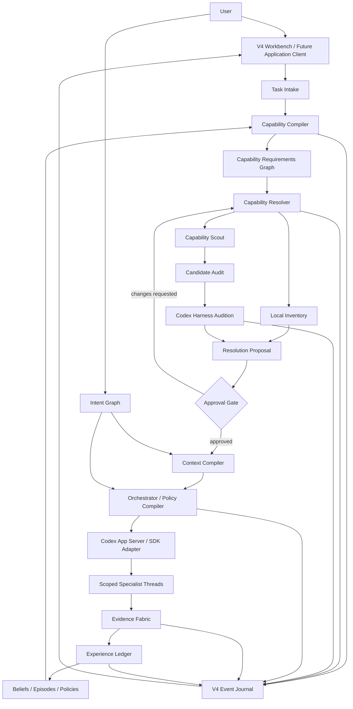
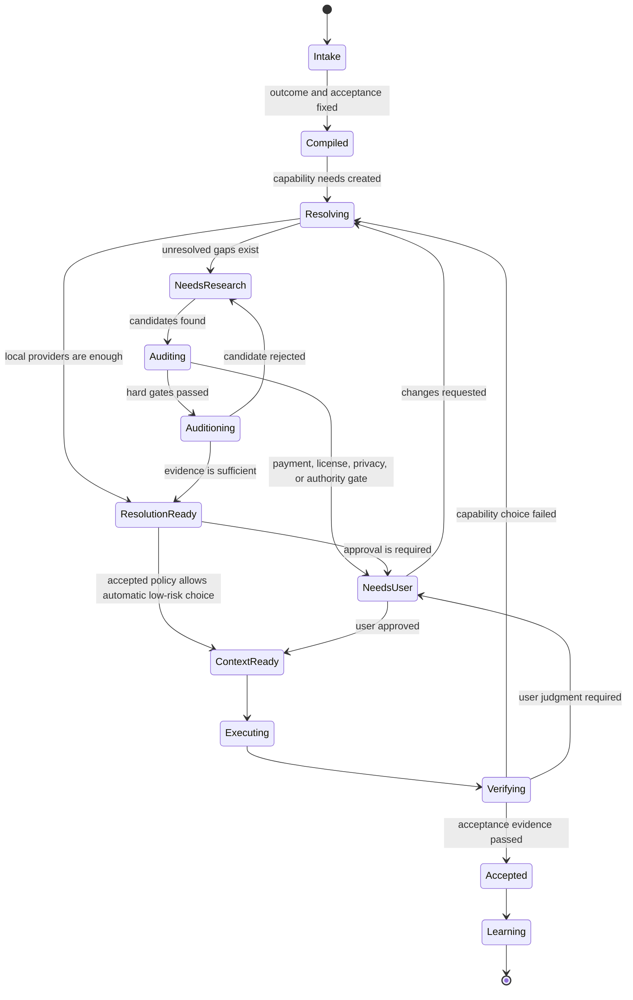
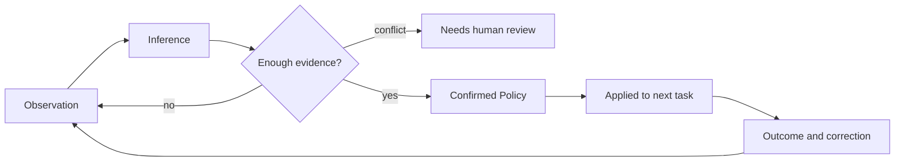
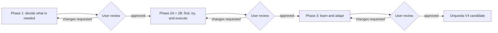

# Orquesta V4 詳細設計

作成日: 2026-07-15

対象: Orquesta V4 / `0.4.x`

状態: ユーザー承認済み
承認日: 2026-07-15
実装開始条件: 充足。Phase 1実装計画の承認後に実装を開始する
Phase 2境界更新: 2026-07-17。ユーザー承認により2A Acquisitionと2B Codex-native executionまでとする

## 結論

Orquesta V4は、汎用的なマルチエージェント実行基盤の機能数でLangGraphやAutoGenと競う製品にはしない。開発を始める前に必要な能力を分解し、既存資産を探し、実際に試し、採用理由を残し、結果から次の判断を改善する「学習する開発OS」にする。

V3で作った、統括者がプロジェクト全体の状態と索引を持ち、専門家が担当分野だけを読む構造は残す。V4はその前段にCapability CompilerとCapability Resolverを置き、後段にExperience LedgerとIntent Graphを置く。

実装は三つのフェーズに分ける。

- Phase 1は、タスクを能力へ分解し、手元にある資産から再利用・改造・新規作成を選べる最小コアを作る。
- Phase 2は、外部資産の探索と試用、実際のCodex実行をつなぐ。2A Acquisitionと2B Codex-native executionで終了する。
- Phase 3は、ユーザーの判断、失敗、実行結果を経験として蓄積し、次のタスクで質問と遠回りを減らす。

各フェーズは、実装者側のテスト合格だけでは完了しない。実際に動く成果物とレビュー資料をユーザーへ渡し、明示的な合格を受けて初めて次へ進む。変更要求が出た場合は、そのフェーズに留まる。

## 何を解決する製品か

現在のコーディングエージェントは、与えられたタスクを実装する能力は高い。一方で、次の判断はまだ弱い。

- そのタスクに本当は何が必要かを、コード以外も含めて分解する。
- 既存コード、ライブラリ、プラグイン、MCP、Webサービス、UI素材、専門家、ユーザーの知識のうち、何を使うべきかを比較する。
- 見つけた資産を説明だけで信用せず、小さく試して適合性を確かめる。
- なぜ質問したか、なぜ質問しなかったかを説明する。
- 前回の予測と実際の結果の差を覚え、次回の判断へ反映する。
- ユーザーの一度の反応を恒久的な好みだと誤解せず、観察と確定した方針を分ける。

その結果、AIは実装前の調査を省いたり、逆に目的のない検索を続けたり、既存資産で済むものを一から作ったりする。Orquesta V4は、この「何を使って、どう進むかを決める層」を製品の中心にする。

## 製品定義

一文で表すと、Orquesta V4は次の製品である。

> タスクを実装する前に必要能力を組み立て、利用可能な資産を監査・試用し、最短ではなく総コストの低い経路を選び、その結果から次回の判断を改善する、ローカルファーストの開発オーケストレーター。

ここでいう総コストは、最初に書くコード量だけではない。

```text
総コスト = 探索 + 導入 + 変更 + 検証 + 保守 + セキュリティリスク + ロックイン - 再利用価値
```

短く実装できても、保守されていない依存関係や、撤退できないSaaSや、ライセンス不明のUIを選ぶなら安くない。反対に、導入に少し時間がかかっても、検証済みで再利用できる資産なら長期的には安い。

## V4で達成すること

- ユーザーの依頼を、成果、受入条件、制約、必要能力へ分ける。
- 各能力について、すでに利用できる提供元と不足を見つける。
- `reuse`、`adapt`、`build`、`ask`、`abandon`を証拠付きで比較する。
- 未解決の能力だけを探索し、検索範囲、時間、件数に上限を付ける。
- 候補のライセンス、保守、互換性、安全性、費用、アクセシビリティ、撤退可能性を監査する。
- 採用前に隔離環境で最小試用を行う。
- 実際のCodex実行、承認、モデル、進捗、成果物を自己申告とは別の証拠として記録する。
- タスクごとに必要最小限のContext Packを作り、専門家へ渡す。
- 予測、行動、結果、ユーザー修正をEpisodeとして残す。
- 暗黙の好みをObservation、Inference、Confirmed Policyへ段階的に昇格する。
- ユーザーへの質問を減らす。ただし、取り返しのつかない判断やユーザー固有の価値判断は勝手に代行しない。
- 意図変更が起きたとき、影響するタスクと成果物だけを古い状態として止める。
- Orquesta自身がCodex App ServerまたはSDKのクライアントになり、本物のCodex turnと受入証拠をつなぐ。

## V4でやらないこと

- LangGraphやAutoGenの全機能を再実装しない。
- あらゆるLLM、クラウド、企業認証、分散実行へ同時対応しない。
- Webを無制限に巡回しない。
- 検索結果の説明文やスター数だけで自動採用しない。
- ライセンス不明、権限不明、有料契約が必要な資産を無断で導入しない。
- ユーザーの一度の反応から永久的な性格設定を作らない。
- AI自身の主観的な自己採点を「メタ認知」と呼ばない。
- 既存のCodexデスクトップ画面をクリック操作して間接的に命令しない。
- V3を一度に移行、削除、全面改修しない。
- 現在の巨大なダッシュボードファイルへV4の全機能を継ぎ足さない。
- 役割数の多さを価値にしない。

## V3から引き継ぐ土台

V3には、V4でも残すべきものがある。

- 統括者、長期専門家、ユーザーの権限が分かれている。
- 統括者はプロジェクト状態とルーティングを持ち、専門家の全文脈を常時読まない。
- 専門家には`required_reading`、`excluded_context`、`allowed_files`、`forbidden_actions`がある。
- `specialist_required`では、handoffなしで実装せず、reportなしで受理しない。
- raw user answerは、そのまま採用済み方針にならない。
- state JSONが現在の状態で、reportはその時点のスナップショットである。
- `dispatch_accepted`、`turn_started`、`report_produced`、`accepted`が別の状態になっている。
- recommended model、requested model、actual modelを分ける。
- 失敗、承認待ち、ユーザー作業を別のキューとして扱う。

V4はこれらを置き換えるのではなく、能力探索と経験学習を加えて一つのライフサイクルにする。

## 現在の不足

V3はファイルベースのコントロールプレーンとしては成立しているが、次の不足がある。

- タスクから必要能力を作る共通モデルがない。
- 既存資産を探して比較し、最小試用する流れがない。
- 調査結果がタスク固有のメモになり、次のタスクへ再利用されにくい。
- 実行結果から予測の精度を更新する経験モデルがない。
- ユーザーの好みと一時的な発言の区別が弱い。
- 複数JSONの更新が途中で止まると、state同士が食い違う可能性がある。
- 製品内の表示と、実際のCodex実行証拠が完全にはつながっていない。
- Codex App ServerまたはSDKを通したruntime証拠と、repository-only fallbackの実装がない。
- Application productizationの形は、local Web、PWA、Electron、Tauri、Codex plugin、hybridのどれにするか未決である。
- ダッシュボードが大きくなりすぎ、新しい中核機能を安全に足しにくい。

## 設計原則

### 証拠が状態を作る

「実行した」「学んだ」「使える」といった主張は、イベント、テスト、成果物、ユーザー判断のどれかに結び付ける。証拠がない`actual_model`は`null`のままにする。

### 探索は不足に対して行う

最初からWeb全体を検索しない。ローカルに能力があればそれを候補にし、未解決のCapability NeedだけをScoutへ渡す。

### 試してから採用する

監査を通過した候補でも、説明と実際の挙動は違う。採用前に小さなAuditionを行い、成功条件と撤退条件を記録する。

### ユーザーの介入を貴重な資源として扱う

分からないたびに質問しない。自分で検証できることを先に減らし、それでも判断結果が大きく変わる場合だけ聞く。

### 学習は可逆にする

なぜその方針が生まれたかを辿れ、ユーザーが閲覧、修正、無効化、削除できるようにする。

### 文脈は作るもので、全部読むものではない

統括者も専門家も、タスクごとに必要なContext Packを読む。全文検索の結果や古いレポートをそのまま渡さない。

### V3を壊さず横に作る

Phase 1では既存ファイルを移動しない。V4機能はfeature flagの後ろへ追加し、V3の起動と検査を常に回帰確認する。

### 自動化より統制を優先する

インストール、課金、アカウント作成、秘密情報、破壊的変更、ライセンス判断は、速度より明示的な承認を優先する。

## 全体アーキテクチャ



## タスクのライフサイクル



実装開始を早めるために、すべてのタスクで全状態を通すわけではない。すでに検証済みのローカル能力だけで完結する低リスクタスクは、探索と試用を省略できる。ただし、省略理由はイベントに残す。

## 中核データモデル

### TaskIntent

ユーザーの依頼を、実装指示ではなく成果契約へ変換したもの。

| フィールド | 内容 |
|---|---|
| `task_intent_id` | 安定した識別子 |
| `raw_request_ref` | 元の依頼への参照。全文コピーは必須ではない |
| `desired_outcome` | ユーザーが得たい結果 |
| `acceptance_criteria` | 合否を決める観測可能な条件 |
| `constraints` | 技術、費用、期限、権限、品質、禁止事項 |
| `risk` | 間違えた場合の影響と可逆性 |
| `authority_boundary` | AIが決めてよいこと、ユーザーしか決められないこと |
| `assumptions` | 未確認の前提と検証方法 |
| `status` | `draft`, `compiled`, `approved`, `superseded` |

### CapabilityNeed

タスクを完了するために必要な能力。コード以外も同じモデルで扱う。

`kind`は次を標準にする。

- `code`
- `tool`
- `knowledge`
- `data`
- `permission`
- `runtime`
- `service`
- `asset`
- `human_judgment`
- `evidence`

主なフィールドは、`need_id`、`description`、`required_level`、`hard_constraints`、`dependencies`、`verification_method`、`status`、`confidence`である。

### CapabilityProvider

能力を提供できるもの。ローカルコード、npm package、Codex skill、plugin、MCP、Webサービス、UIカタログ、テンプレート、人間の専門家、自作実装を同じ比較対象にする。

主なフィールドは、`provider_id`、`provider_type`、`source_uri`、`capabilities`、`trust_tier`、`availability`、`version`、`last_verified_at`、`evidence_refs`である。

### CandidateEvaluation

候補を採用できるか判断する監査結果。

| 評価軸 | 標準重み |
|---|---:|
| タスク適合性 | 30 |
| 統合容易性 | 15 |
| 証拠の強さ | 15 |
| 保守性 | 10 |
| セキュリティ | 10 |
| ライセンス適合性 | 10 |
| 撤退可能性 | 5 |
| 費用 | 5 |

各項目を0から100で正規化し、次で比較する。

```text
candidate_score = weighted_sum - uncertainty_penalty
```

ただし、スコアより先にhard gateを評価する。

- 禁止ライセンスまたはライセンス不明で自動採用不可
- 重大なセキュリティ問題で採用不可
- 対象OS、runtime、既存構成と非互換で採用不可
- 課金、アカウント作成、秘密情報が必要ならユーザー承認待ち
- アクセシビリティ必須タスクで基準未達なら採用不可

`build`も常に一つの候補として入れ、実装時間、検証時間、将来の保守費用を同じ表で比較する。トップの候補を自動的に正解にせず、上位3件と棄却理由を表示する。重みはプロジェクト方針として変更でき、変更履歴を残す。

### Audition

採用前の最小試用。

| フィールド | 内容 |
|---|---|
| `audition_id` | 試用識別子 |
| `candidate_id` | 対象候補 |
| `hypothesis` | 何ができると予測したか |
| `sandbox` | Codex側の実行profileと、そこで使うworktreeまたは一時ディレクトリ |
| `steps` | 実行した最小手順 |
| `expected_evidence` | 合格に必要な証拠 |
| `observed_evidence` | 実際の結果 |
| `side_effects` | 作成ファイル、通信、依存関係 |
| `verdict` | `pass`, `fail`, `inconclusive`, `blocked` |
| `cleanup_status` | 撤去確認 |

Auditionは本番のリポジトリへ無断で依存関係を追加しない。ネットワーク、秘密情報、課金、永続的な書き込みが必要なら承認を挟む。

### Resolution

各Capability Needに対する最終方針。

- `reuse`: そのまま利用する。
- `adapt`: 薄い変換や設定を加えて使う。
- `build`: 新規に作る。
- `ask`: ユーザーの判断や操作が必要。
- `abandon`: 価値に対して費用やリスクが高く、要件自体を外す。

Resolutionには、選択候補、棄却候補、根拠、証拠、見積もった総コスト、承認状態、再評価条件を持たせる。

### ContextPack

専門家へ渡す、タスク固有の最小文脈。

```json
{
  "context_pack_id": "CP-TASK-001",
  "task_intent_id": "TASK-001",
  "owner_agent_id": "implementation-001",
  "objective": "短い目的",
  "acceptance_criteria": [],
  "adopted_decisions": [],
  "capability_resolutions": [],
  "required_reading": [],
  "relevant_state_excerpts": [],
  "interfaces": [],
  "allowed_files": [],
  "forbidden_actions": [],
  "excluded_context": [],
  "evidence_requirements": [],
  "provenance": [],
  "token_budget": null,
  "expires_at": null
}
```

Context Packは文書の単なる一覧ではない。採用済み判断、必要なファイル断片、インターフェース、禁止事項をまとめ、各項目に出典を付ける。古いIntentやsuperseded decisionを含めない。専門家の返却物も全文履歴ではなく、変更差分、成果物、検証証拠、未解決事項を基本にする。

### Belief、Episode、Policy

AIが「知っているつもり」を減らすため、三つを分ける。

Beliefは現在の仮説で、`claim`、`evidence_refs`、`confidence`、`scope`、`falsifier`、`expires_at`を持つ。

Episodeは一回の経験で、`context`、`prediction`、`action`、`outcome`、`acceptance_result`、`user_correction`、`cost`を持つ。

Policyは次回の行動規則で、`condition`、`action`、`supporting_episodes`、`counterexamples`、`confidence`、`scope`、`decay`、`status`を持つ。

予測と結果を比較できない記録は、学習の根拠にしない。AIの「今回はうまくできたと思う」という自己評価だけではPolicyを更新しない。

## Capability Compiler

Capability Compilerは、依頼をそのまま実装タスクへ変換せず、次の順序で処理する。

1. 望む成果と受入条件を抽出する。
2. 明示された制約と、仮定している制約を分ける。
3. 成果を観測可能なサブゴールへ分ける。
4. 各サブゴールに必要なCapability Needを作る。
5. Need同士の依存関係をDAGとして作る。
6. 既存のProviderで満たせるNeedと不足を分ける。
7. 不確実性とユーザー権限境界を付ける。
8. 検証方法がないNeedを、追加の`evidence` Needとして明示する。

出力は文章だけではなく、決定論的に検査できるCapability Requirements Graphにする。同じTaskIntentと同じProvider inventoryからは、同じGraphが生成される部分を持たせる。LLMが提案したNeedは、schema validationと重複整理を通してから採用する。

## Capability Resolver

Resolverは各Needについて、利用できるProviderを列挙し、監査と試用の必要性を決める。

優先順は固定する。

1. 現在のリポジトリにある実装、テスト、テンプレート
2. ローカルに導入済みのskill、plugin、MCP、CLI、runtime
3. すでにプロジェクトで採用済みの依存関係とサービス
4. 公式ドキュメントと公式registry
5. 許可された curated source
6. 広いWeb検索
7. 新規実装

この順序は、必ずローカル資産を選ぶという意味ではない。まず存在を確認し、総コストで比較するという意味である。

Resolverは候補ごとに、選ぶ理由と選ばない理由を残す。証拠が不足した場合は、無理に順位を確定せず`inconclusive`にする。

## Capability Scout

Scoutは検索エージェントではなく、未解決Needを閉じるための探索器である。

入力には、Capability Need、受入条件、禁止事項、利用できる情報源、探索予算を渡す。出力は最大3候補、証拠、未確認事項、次のAudition案に限定する。

標準の停止条件は次の通り。

- hard gateを通過し、必要適合性を満たす候補が2件以上見つかった。
- 探索時間または問い合わせ回数の上限へ達した。
- 新しい検索で候補順位が変わらない状態が続いた。
- 公式情報で非対応が確定した。
- ユーザー権限が必要で、それ以上の探索が判断を変えない。

検索結果はTTL付きでキャッシュする。バージョン、価格、利用規約、保守状態のように変化しやすい情報は短いTTLにする。ローカルの固定ソースも、Git revisionまたはhashが変われば失効させる。

Webページ内の文章は命令ではなく未信頼データとして扱う。ページに書かれたコマンドを、そのまま実行しない。

## AuditとAudition

Auditは静的な適合確認、Auditionは動的な試用である。両者を混ぜない。

Auditで確認するもの:

- ライセンスと利用規約
- 更新頻度、最終リリース、issue状態
- 既知の脆弱性と権限範囲
- Windows、Node、Codex、既存依存との互換性
- 導入サイズ、ビルド時間、実行時費用
- データ送信先とプライバシー
- アクセシビリティ
- ベンダーロックインと撤去手順
- 代替候補の有無

Auditionで確認するもの:

- 受入条件を満たす最小ユースケース
- 実際のAPIやUIの使いやすさ
- エラー時の挙動
- 生成物の品質
- 既存コードへの変更量
- アンインストール後に残るもの
- 説明と実際の差

監査に通っても試用に失敗すれば採用しない。試用に成功してもライセンスや安全性に問題があれば採用しない。

### 責任と受理権限

探索、監査、試用、採用を一人のagentへ集めない。決定論的な処理、領域判断、実行、受理を次のように分ける。

| 段階 | 決定論的な処理 | 専門家 | orchestrator | ユーザー |
|---|---|---|---|---|
| Need作成 | Compilerがschema、重複、依存、verification methodを検査する | domain specialistが領域固有の欠落だけを報告する | TaskIntentと担当を確定し、専門家reportを照合する | 成果と権限境界を確認する |
| 候補探索 | Scout connectorがquery、source、取得日時、hashを記録する | capability-scoutは候補と未確認事項を返すだけで、採用しない | 未解決Needだけをhandoffし、探索予算を守る | 有料、login、外部送信が必要な探索を承認する |
| 静的Audit | Audit runnerがlicense metadata、version、互換性、既知のriskを検査する | license、security、accessibilityなど該当領域の専門家が意味と例外を報告する | hard gateと専門家reportが揃ったかを確認する | 権利不明、例外利用、高リスク許容を判断する |
| Audition計画 | runnerがsandbox、command、期待証拠、cleanup planをschema検査する | domain specialistが最小試用と合格条件を提案する | 計画がTaskIntentと権限内かを受理する | network、秘密情報、課金、永続変更を承認する |
| Audition実行 | Audition runnerが隔離実行、差分、通信、cleanup evidenceを記録する | implementationまたはQA specialistが結果の領域適合性を報告する | 実行を代行せず、handoff、report、証拠を照合する | 品質や好みを機械判定できない場合に確認する |
| Resolution提案 | Resolverがhard gateとscoreを再計算する | domain specialistが適合性と残るriskを報告する | reportをまとめ、`reuse/adapt/build/ask/abandon`案と棄却理由を出す | 権限境界を越える選択とPhase 1の全採用を承認する |
| 導入と受理 | policy engineが承認ID、対象version、artifact hashを照合する | 実装担当と独立QAが変更と受入証拠を返す | no handoff/no reportのgateを守り、acceptまたはchanges requestedを記録する | 課金、公開、破壊的変更、最終phase reviewを承認する |

Scoutは検索と証拠収集だけを行う。Audit runnerは検査結果を作るが、法的判断を確定しない。Audition runnerは許可された試用とcleanupだけを行う。domain specialistは自分の領域の意味を判断する。orchestratorはこれらを自分で代行せず、routing、証拠照合、Resolutionの組み立て、受理を行う。

Phase 1のfixtureでもこの境界をイベントに残す。外部作用のないfixture Resolutionはユーザーがすべて承認する。Phase 2以降で低リスクの自動承認を許す場合は、先にユーザーがscope付きPolicyを承認していなければならない。

## 質問する条件

Orquestaは質問を減らすが、質問しないこと自体を目標にしない。

次の場合は自動で進められる。

- 低リスクで元に戻せる。
- 受入条件が明確で、検証できる。
- 採用済みPolicyの範囲内である。
- 追加探索で判断を十分に絞れた。
- 課金、秘密情報、外部公開、破壊的変更がない。

次の場合はユーザーへ聞く。

- 見た目、物語、価値観、ブランドなど、ユーザー固有の判断である。
- 変更が高コストまたは元に戻しにくい。
- 課金、アカウント作成、秘密情報、外部送信が必要である。
- ライセンスや権利が不明である。
- 採用済みPolicy同士が矛盾する。
- 上位候補の差が小さく、選択で後続設計が大きく変わる。
- システム側では受入結果を検証できない。

内部では次の考え方で質問価値を見積もる。

```text
intervention_value = decision_impact * uncertainty * irreversibility
```

値がプロジェクトの介入閾値を超えた場合だけ質問候補を作る。最終的な質問はuser-liaisonがまとめ、重複を消し、今答える必要があるものだけを出す。数式は説明のための単純化であり、擬似的な精密さを見せるためには使わない。

## 暗黙知の学習

ユーザーの操作と反応から次をObservationとして記録する。

- 採用した候補と棄却した候補
- ユーザーが変更した順位や重み
- 生成物へ行った修正
- 一度採用した後の差し戻し
- 何度も残された構造や表現
- 質問へ明示的に答えた内容
- 反対例として示された比較対象

Observationから直接Policyは作らない。



標準の昇格条件は次とする。

- ユーザーが明示的に「今後もこの方針」と確認した場合は、一回でもscope付きPolicyにできる。
- 暗黙の傾向は、最低3件の一貫したObservationがあり、最低2タスクにまたがり、強い反例がない場合にInferenceからPolicy候補へ上げる。
- 環境固有のPolicyは標準30日、好みの推定は標準90日で再確認対象にする。
- 明示的な禁止事項は自動失効させない。
- 反例が入ったPolicyは信頼度を下げ、矛盾が解消するまで自動適用しない。

ユーザーはPolicyの根拠、適用回数、反例を見て、確認、修正、停止、削除できる。

## Intent Graph

Intent Graphは、ユーザーの意図と実装物の関係を追跡する。

ノード型:

- `intent`
- `decision`
- `constraint`
- `capability`
- `task`
- `artifact`
- `evidence`
- `policy`

主なedge:

- `implements`
- `depends_on`
- `constrained_by`
- `derived_from`
- `supersedes`
- `validated_by`
- `contradicts`

ユーザーが方向を変えた場合、古いdecisionを消さず`supersedes`でつなぐ。影響範囲をGraphから辿り、関係するtaskを`stale_pending_review`、成果物を`possibly_stale`にする。関係のない専門家は起こさない。古いIntentに依存した作業は、自動的に受理できない。

## 役割設計

V4では既存の役割を捨てず、責任を次のように進化させる。

| 役割 | V4での責任 |
|---|---|
| orchestrator | プロジェクト索引、Intent、Capability Graph、Policyを使い、ルートと受入を決める。専門家の全文脈は持たない |
| capability-scout | 未解決Needだけを探索し、候補、監査、Audition案を返す。勝手に導入しない |
| vision-curator | raw answerの整理に加え、好みと意図のObservation、Inference、Policy候補を管理する |
| error-concierge | エラー分類に加え、環境固有の失敗パターン、回復策、期限付きPolicyを管理する |
| user-liaison | 質問、承認、ユーザー作業を一つの介入予算と優先順位でまとめる |
| domain specialist | Context Packの範囲で実行し、差分、成果物、証拠、未知を返す |
| orquesta-admin | source、trust tier、重み、保持期間、runtime adapter設定を管理する |

`capability-scout`以外は現在のagent IDを維持できる。Phase 1ではScoutをコアモジュールとして動かし、Phase 2で長期専門家として必要かを実測してからagentを追加する。役割を増やすこと自体は成功ではない。

## Context Compiler

統括者は全資料の本文を抱えない。代わりに次の索引を持つ。

- 現在のTaskIntentと状態
- Capability Graphの要約
- 採用済みDecisionとPolicyのID
- specialist ownership
- artifactとevidenceの場所
- stale、blocked、approval待ちの一覧

Context Compilerは、Task、担当者、Intent Graph、Capability ResolutionからContext Packを作る。ただしPhase 1のv1は`TaskIntent + Capability Resolution + agent contract`だけを正とし、まだ存在しないIntent Graphへ依存しない。Intent参照は空またはfeature-disabledとして扱う。Phase 3のv2でIntent Graph、stale propagation、Policyを入力に追加する。

関連性が低いrequired readingを自動で削るのではなく、なぜ必要かを説明できない項目を候補から外し、明示的な`excluded_context`を守る。

Context Packには`provenance`と`expires_at`を付ける。元のDecisionがsupersededになった場合、そのPackを無効にする。専門家が作業を再開する際は、古い会話全体ではなく新しいPackと差分を読む。

## Evidence Fabric

Evidence Fabricは、Orquesta内の自己申告とCodex実行の事実を分ける。

最低限、次のイベントを別々に扱う。

- handoff作成
- dispatch要求
- dispatch受理
- threadまたはturn開始
- progress観測
- tool呼び出しと結果
- report生成
- acceptance check実行
- orchestrator受理または変更要求
- user approvalまたはreject

Codex App Serverまたはhooksからactive modelを取得できた場合だけ`actual_model`へ入れる。推薦、送信時のmodel指定、UI上のラベルはactual modelの証拠にしない。

証拠は、`evidence_id`、`source`、`captured_at`、`correlation_id`、`hash`、`redaction_status`を持つ。巨大なtool outputやWeb本文を状態へ丸ごと保存せず、必要な抜粋、hash、取得元、ローカルartifactへの参照を残す。

## Codex統合

Orquestaは、開いているCodexデスクトップ画面を自動操作しない。Orquesta自身がCodex App ServerまたはCodex SDKを使うクライアントになる。

優先順位は次の通り。

1. 安定したstdio JSONLのCodex App Server
2. TypeScriptのCodex SDK
3. repository-only adapter

実験的なWebSocket transportはV4の必須経路にしない。

adapter interfaceは次の責任を持つ。

```ts
type AdapterFailureStatus =
  | "unsupported"
  | "unauthorized"
  | "unavailable"
  | "rejected"
  | "failed";

type AdapterResult<T> =
  | {
      status: "ok";
      correlationId: string;
      value: T;
      evidence: RuntimeEvidence;
    }
  | {
      status: AdapterFailureStatus;
      correlationId: string;
      reason: string;
      retryable: boolean;
      evidence: RuntimeEvidence | null;
    };

interface DispatchReceipt {
  dispatchStatus: "accepted" | "queued";
  threadId: string;
  turnId: string | null;
}

interface CodexAdapter {
  capabilities(): Promise<AdapterCapabilities>;
  createThread(input: CreateThreadInput): Promise<AdapterResult<ThreadRef>>;
  resumeThread(threadId: string): Promise<AdapterResult<ThreadRef>>;
  startTurn(input: StartTurnInput): Promise<AdapterResult<DispatchReceipt>>;
  steerTurn(turnId: string, message: string): Promise<AdapterResult<void>>;
  interruptTurn(turnId: string): Promise<AdapterResult<void>>;
  respondToApproval(requestId: string, decision: "approved" | "denied"): Promise<AdapterResult<void>>;
  subscribeEvents(ref: ThreadRef): AsyncIterable<RuntimeEvent>;
  readActualModel(ref: ThreadRef): Promise<AdapterResult<ModelEvidence | null>>;
}
```

すべての結果に`correlationId`を付け、成功時の`evidence`にはsource、event kind、captured time、thread/turn referenceを持たせる。`startTurn()`の`dispatchStatus: accepted`はturn開始証拠ではない。`runtime.turn.started`は`subscribeEvents()`で対応イベントを観測した場合だけ生成する。

repository-only adapterでは、thread作成、turn開始、steer、interruptを`unsupported`として返す。handoff draftの作成は別のrepository commandであり、Codex実行成功には見せない。認証不足は`unauthorized`、製品能力がない場合は`unsupported`、一時障害は`unavailable`として分ける。

TypeScript SDK `0.144.5`は`startThread()`、`resumeThread()`、`run()`、`runStreamed()`、streamed lifecycle、AbortSignal cancellationを共通契約へ変換する。steer、直接のapproval relay、独立したactual model evidenceは提供しないため`unsupported`または`null`にする。

App Serverが利用できない場合はTypeScript SDKを試し、両方が使えない場合にV3と同じrepository-only adapterへ落ちる。その場合、Orquestaはhandoff draftと必要な操作を表示するが、自動実行したとは表示しない。

## 将来のApplication Phase

Application productizationはPhase 2の受入条件に含めない。local Web、PWA、Electron、Tauri、Codex plugin、hybridのどれを選ぶかは確定せず、2Aと2Bの実測結果を見た後にユーザーとの別の対話で決める。

この将来phaseは番号を付けず、Phase 3を繰り下げない。UI shell、installer、OS build、daily-use UX、rendererとNodeの境界は、その対話で対象surfaceが決まるまで実装計画へ入れない。Phase 2のrepository clientとadapter contractは、どのapplication surfaceからも再利用できる形に保つ。

## Codexプラグイン

正式なCodex plugin bundleはPhase 2Bの必須成果物ではない。App ServerまたはSDKだけではruntime truthに必要なeventを取得できず、plugin hookがその欠落を閉じる場合に限り、最小bundleを追加する。

```text
plugins/orquesta/
  .codex-plugin/plugin.json
  skills/orquesta/
  hooks/
  assets/
```

追加する場合のpluginは次だけを提供する。

- Orquestaを呼び出すskill
- session、turn、subagent、tool lifecycleを捕捉するhooks
- 必要なhook設定とschema
- 対応範囲と制限を明記した検証手順

hookは事実の収集に使い、ユーザーのコードや秘密情報を無制限にコピーする用途には使わない。plugin dataとproject stateの保存場所を分ける。

## 保存方式

### V3互換

既存の`.orquesta/state/*.json`、vision、failures、reportsはPhase 1で変更しない。V3のダッシュボード、検査、起動スクリプトも残す。

### V4 Event Journal

V4の新しい状態は、`.orquesta/v4/events.jsonl`をcanonical journalにする。projectionは`.orquesta/v4/projections/*.json`へ生成する。

一つの物理行は一つのevent batchとし、複数の論理イベントを一つのcommitとして扱う。

```json
{
  "journal_version": 1,
  "sequence": 42,
  "batch_id": "BATCH-01",
  "expected_revision": 41,
  "committed_at": "2026-07-15T00:00:00.000Z",
  "actor": { "type": "agent", "id": "orchestrator" },
  "correlation_id": "TASK-001",
  "events": [
    {
      "event_id": "EV-001",
      "schema_version": 1,
      "type": "capability.need.declared",
      "payload": {},
      "evidence_refs": []
    }
  ]
}
```

file backendは、V3でOneDrive上のcross-process検査を通っている`appendJsonlAtomic`と同じatomic replacement方式を使う。journalへ直接in-place appendしない。

lockには`owner_pid`、`host_id`、`nonce`、`acquired_at`、`target_revision`を保存する。待機期限を越えても自動でlockを奪わない。ownerの生存とtransition metadataを確認できないstale lockはfail-closedにし、明示的なrecovery commandへ回す。

### Event commit protocol

一つのbatchを次の順序でcommitする。

1. journal lockを取得し、owner metadataをflushする。
2. journal全行をUTF-8とschemaで検証し、最後の`sequence`と`expected_revision`が一致することを確認する。
3. `batch_id`と各`event_id`が未適用であることを確認する。すでに同じhashで存在する場合はidempotent success、異なる内容なら競合として停止する。
4. `.orquesta/v4/pending/<batch_id>.json`へ、expected revision、next sequence、serialized batch、SHA-256、journal path、workspace IDを書き、fileをflushする。
5. 現在のjournal全文と新しい一行をtemp journalへ書き、flushする。
6. current journalを`.bak`として保持したまま、temp journalをatomic renameする。renameまたはflushを確認できなければcommit済みと表示しない。
7. journalを再読し、末尾batchのsequence、`batch_id`、SHA-256をpendingと照合する。
8. projectionをjournalから更新し、各projectionへ`journal_sequence`と`last_batch_id`のwatermarkを書いてatomic renameする。
9. projectionを再読してwatermarkを確認した後にpendingを削除し、最後にlockを解放する。

process crash、電源断、OneDrive競合のどこで止まっても、`batch_id`とhashを使って二重適用を避ける。journal commitが確認できる前にprojectionを進めない。projectionはderived dataなので、journalより先または内容不一致なら破棄して再構築できる。

### Recovery protocol

通常起動は未解決のpending、stale lock、sequence gapを見つけた時点で書き込みを止める。recoveryは状態を勝手に推測せず、次の表で処理する。

| 観測状態 | 復旧動作 |
|---|---|
| pendingあり、journalに同じ`batch_id`なし、journal revisionがpendingの`expected_revision`と一致 | owner不在とpending hashを確認したうえで、明示的なrecovery commandがcommit手順を最初から再実行する |
| pendingあり、journal末尾に同じ`batch_id`とhashあり | commit済みとしてprojection watermarkを再構築し、確認後にpendingを削除する |
| pendingあり、journal内に同じ`batch_id`だがhashが違う | 競合として停止し、両方をquarantineしてユーザー判断へ出す |
| journal末尾が途中行、`.bak`が有効、pendingが意図したbatchを一意に示す | 壊れたjournalをquarantineし、`.bak`を復元してpendingから再実行する |
| journal末尾が途中行だが、有効な`.bak`またはpendingがない | 自動切り捨てせず停止し、最後の正常sequenceと破損位置を報告する |
| journal中間行が破損、sequence gap、重複sequenceがある | 自動復旧しない。journal全体をread-onlyにしてblockerを出す |
| OneDrive競合コピーまたは別の正当なnext revisionがある | revisionを選ばず停止し、workspace ID、hash、更新時刻を並べてユーザー判断へ出す |
| journalは正常、projection watermarkが遅いまたはprojectionがない | journalから自動再構築する |
| projection watermarkがjournalより先、hash不一致 | projectionを破棄し、journalから自動再構築する |
| stale lockだけが残る | owner生存、nonce、transition metadataを確認する。安全を証明できる場合だけ明示的recoveryで解除し、自動で盗まない |

recovery後はjournal、projection、pending、lock、quarantineの状態を一つのreportへ残す。秘密情報やWeb本文はreportへコピーしない。

`batch_id`と`event_id`で再試行をidempotentにし、projectionの手編集は禁止する。

これにより、Phase 1でSQLite全面移行をせず、複数JSON更新の不整合を減らせる。EventStore interfaceを切り、実測で必要になれば同じイベントschemaのままSQLite backendを追加する。

### 主要イベント

- `task.intent.created`
- `task.intent.approved`
- `capability.need.declared`
- `capability.provider.discovered`
- `candidate.evaluated`
- `candidate.audition.started`
- `candidate.audition.completed`
- `resolution.proposed`
- `resolution.approved`
- `context.pack.created`
- `runtime.dispatch.accepted`
- `runtime.turn.started`
- `runtime.progress.observed`
- `artifact.produced`
- `acceptance.completed`
- `episode.closed`
- `belief.updated`
- `policy.proposed`
- `policy.confirmed`
- `intent.superseded`
- `phase.review.requested`
- `phase.review.changes_requested`
- `phase.review.approved`

## 想定ディレクトリ

```text
apps/
  workbench/                 # Phase 1 browser renderer
packages/
  contracts/                 # schemas and shared types
  core/                      # commands, lifecycle, policies
  event-store/               # file backend and projections
  capability-compiler/
  capability-resolver/
  context-compiler/
  scouts/
  audit/
  audition/
  codex-adapter/
  experience/                # Phase 3
  intent-graph/              # Phase 3
  ui/                        # 将来のApplication Phaseで選択後に追加
plugins/
  orquesta/                  # Phase 2B runtime truthに必要な場合だけ
    .codex-plugin/plugin.json
    skills/orquesta/
    hooks/
    assets/
.orquesta/
  v4/                        # project runtime state, source packageには含めない
orquesta/                    # existing V3, Phase 1では移動しない
```

rootはnpm workspacesを使える構成へ段階的に変える。ただし、既存の`npm run check`と`npm run dashboard`は同じ意味で動かし続ける。

## セキュリティと信頼境界

OrquestaはCodex runtimeを包む第二のsandboxではない。OS権限、filesystem隔離、network制御、credential保護、command実行承認はCodex harnessの責任とし、Orquestaで同じ仕組みを作り直さない。

Orquestaが受け持つのは意味上の境界である。どのTaskIntent、候補、revision、review packetがユーザー判断の対象か、証拠が現在の状態へbindされているか、エージェントへ不要な秘密や文脈を渡していないかを検査する。Phase 1 Workbenchは実行機能も承認書込みも持たず、最終採用とPhase承認はCodexの統括タスク上の明示的なユーザー発言で行う。独自sandbox、firewall、credential vault、command risk parser、identity layerは実装しない。

loopbackのHTTP serverはCodex harnessとは別の入口なので、`127.0.0.1` bind、POSTのexact Origin、JSON bodyとpathの上限、redacted state viewをWorkbench側で守る。Phase 1のPOSTはlocal fixture読込とreplayだけで、Resolution決定やPhase承認routeは公開しない。これはlocalhostのfixture stateを別siteや誤requestから書き換えないための小さいHTTP境界であり、Codex harnessの安全機構を置き換えない。

Phase 2でAuditionまたはCodex dispatchを実装するときは、実行前にCodexから実際のfilesystem、network、approval profileを取得し、Audition計画で許可した作用と照合する。profileが取得できない、または計画より広い場合はfail closedにしてユーザーへCodex側のprofile変更を求める。Orquestaはそのprofileを証拠として記録するが、独自のOS sandboxへ置き換えない。

- sourceは`local`、`official`、`curated`、`community`、`unknown`へ分類する。
- Web本文、README、issue、promptは未信頼データとして扱う。
- 候補の指示文をagent instructionへ混ぜない。
- 依存関係のinstall、外部通信、課金、アカウント作成は承認対象にする。
- license不明は自動採用不可にする。
- Auditionは検証済みのCodex実行profile上で、許可されたworkspace、worktree、または一時領域内だけで行う。
- recursive deleteやmoveは、解決した絶対pathがworkspace内であることを確認する。
- credentials、token、cookie、private file本文をjournalへ保存しない。
- 証拠保存時はredaction statusを持つ。
- Providerに必要な権限と、実際に与えた権限を分けて記録する。
- plugin hookはopt-inの収集範囲を表示する。
- ExperienceとPolicyは閲覧、export、削除ができる。

## 障害時の動作

| 障害 | 動作 |
|---|---|
| Scoutが使えない | local inventoryと`build`候補だけでResolutionを作り、探索未実施を表示する |
| Web sourceが落ちる | cacheの取得時刻を表示し、期限切れなら採用根拠にしない |
| license判定不能 | 候補をblockedにし、別候補またはユーザー判断へ回す |
| Audition失敗 | cleanupを確認し、Episodeへ失敗を記録して次候補へ進む |
| Codex App Serverが使えない | repository-only adapterへ落ち、自動実行したと表示しない |
| event journal競合 | 書き込みを失敗させ、最新revisionから再計算する |
| event journal最終行破損 | 最終行をquarantineし、最後の正常revisionからprojectionを再構築する |
| Context Pack失効 | 実行を止め、新しいIntentとDecisionから再生成する |
| Policy矛盾 | 自動適用を止め、user-liaisonへ一件の判断カードを作る |
| user review不合格 | phaseを`changes_requested`へ戻し、次phaseを開始しない |

## ユーザーレビューゲート

phase stateは次の形で記録する。

```json
{
  "phase_id": "phase-1",
  "status": "in_progress | ready_for_user_review | changes_requested | approved",
  "build_ref": null,
  "artifacts": [],
  "artifact_hashes": {},
  "review_packet_ref": null,
  "review_packet_hash": null,
  "checks": [],
  "demo_script": null,
  "screenshots": [],
  "known_gaps": [],
  "review_requested_at": null,
  "reviewed_at": null,
  "user_decision": null
}
```

`ready_for_user_review`は、開発側の完了であってphase完了ではない。`approved`イベントはユーザーの明示的な合格だけで生成する。無回答、一定時間の経過、テスト全通過を自動承認へ変換しない。

各レビューpacketには次を入れる。

- 起動できる成果物
- 5分以内の確認手順
- 代表タスクのdemo script
- 自動テスト結果
- 必要な画面キャプチャまたは短い録画
- 採用した判断と棄却した判断
- 未実装と既知の問題
- 次phaseで変わるもの
- 合格、変更要求、保留の記録場所

## Phase 1: Capability KernelとWorkbench

### 目的

「実装前に何が必要かを見つけ、既存資産と新規実装を証拠付きで比較する」というV4の核が、本当に役立つかを最小の変更で確かめる。

### 実装範囲

- npm workspaceの最小土台
- shared schemaとvalidation
- file-backed V4 EventStore
- deterministic projectionとreplay
- TaskIntent作成
- Capability Compiler v1
- local inventory
- Capability Resolver v1
- Scout v1
- CandidateEvaluationと透明なscore
- Context Compiler v1
- Phase Review state
- V4 Workbench renderer
- V3 feature flagと回帰テスト

Scout v1が見る範囲は次に限定する。

- 現在のrepository
- package.jsonとlockfile
- ローカルに導入済みのCodex skill、plugin、MCP metadata
- 手動でseedしたfixture catalog

Phase 1では一般Web検索を実装しない。候補の自動installもしない。Resolutionは提案までで、実際の採用は手動承認にする。

### Workbenchで見せるもの

- 元の依頼とTaskIntent
- Capability Requirements Graph
- 満たされているNeedと不足Need
- Provider候補と根拠
- 上位3候補のscore内訳
- `reuse`、`adapt`、`build`、`ask`、`abandon`の提案
- Context Pack preview
- event timeline
- replay結果
- `pending_user`の判断対象とCodex統括タスクへ戻る手順

### 代表シナリオ

三つのfixtureを必須にする。

`Local reuse`:
既存リポジトリ内に必要なUIまたはhelperがあるタスク。Scoutを使わず再利用候補を見つけ、新規作成より上へ出す。

`Adapt versus build`:
一部だけ適合するskillまたはpackage fixtureがあるタスク。薄いadaptと新規buildの総コストを比較し、根拠を表示する。

`Blocked candidate`:
機能適合性は高いが、ライセンスまたは互換性fixtureでhard gateに落ちる候補があるタスク。scoreが高くても採用しない。

### 自動受入条件

- 同じ入力とinventoryから同じCapability Graphが生成される。
- Needの重複と循環依存を検出できる。
- すべてのNeedにverification methodまたは未解決理由がある。
- Resolverが上位3件、score内訳、棄却理由を返す。
- hard gate対象はscoreに関係なく採用候補から外れる。
- `build`候補が比較表に含まれる。
- event journalを最初からreplayし、projectionが同じ内容になる。
- commit protocolの各段階へfailure injectionを行い、pending作成前、pending flush後、temp journal flush後、rename後、journal再読後、projection更新後、pending削除前のすべてでbatchを二重適用しない。
- pendingあり/journalなし、pendingあり/journalあり、末尾途中行、中間破損、sequence gap、重複sequence、stale lock、OneDrive競合コピー、projection watermark遅延/先行をfixtureで再現し、recovery表どおりに復旧またはfail-closedになる。
- 自動復旧できない状態を勝手に切り捨てず、正常revision、quarantine path、必要なユーザー判断を報告する。
- Context Packに無関係な専門家文書が入らない。
- Phase 1のContext Pack v1が未実装のIntent Graphへ依存しない。
- Scout、Audit runner、Audition runner、domain specialist、orchestrator、userの責任境界をeventとreportから確認できる。
- V3の既存`npm run check`が通る。
- Phase 1追加テストが通る。
- Workbenchにconsole errorがなく、fixtureを最後まで操作できる。
- approval前にpackage install、外部送信、製品コード変更が起きない。

### ユーザーが確認すること

- 能力分解が人間の感覚とずれていないか。
- 上位候補と棄却理由が納得できるか。
- 情報量が多すぎず、何を選べばよいか分かるか。
- `build`を避けるためだけに無理な再利用をしていないか。
- Context Packが少なすぎず、多すぎないか。
- 質問が必要な箇所と、自動で進める箇所の線引きがよいか。

### Phase 1でやらないこと

- live Web探索
- 本物の外部packageの自動導入
- Codex threadへの自動dispatch
- runtime event取得
- Application productization
- Experienceからの自動Policy更新
- Intent変更のblast radius計算
- V3 stateの移行または削除

### Phase 1の停止条件

- Capability分解を人間が毎回大幅に書き直す必要がある。
- Candidate scoreより説明文の方が判断に影響し、比較モデルが役に立たない。
- EventStoreがOneDrive上で安全にreplayできない。
- Workbenchを使う手間が、単純な手動調査を明確に上回る。

これらが出た場合はPhase 2へ進まず、schema、UI、または保存方式を直す。

### Phase 1の合格

自動受入条件を満たしたレビューpacketを渡し、ユーザーが三つのfixtureを確認して`Phase 1 approved`と明示した時点で合格とする。

## Phase 2: AcquisitionとCodex-native execution

### 目的

Phase 1の判断モデルを実世界の資産探索へ広げ、監査、隔離試用、実際のCodex専門家実行、成果物、受入レビューまで一本につなぐ。Phase 2は2Aと2Bで終了し、application shellは含めない。

### 実装順

Phase 2内でも一度に作らない。

`2A Acquisition`:

- 共通のlive source connector contractとinjectable transport
- 公式ドキュメント、公式registry、GitHub、許可されたUI catalogへのconnector
- `local`、`official`、`curated`、`community`、`unknown`のsource trust tier
- source別TTL cache、Needごとのquery budget、最大3候補
- license、maintenance、security、compatibility、accessibility、cost audit
- Codex harnessの実行profile preflight、実行、cleanup evidenceを持つAudition runner
- candidate、version、source hash、lockfile preview、許可する作用へbindしたinstall approval gate

`2B Codex-native execution`:

- Codex App Server stdio adapter
- TypeScript SDK adapter
- thread作成、再開、turn開始、steer、interrupt
- streamed runtime event
- approval requestの中継
- dispatch、turn、approval、artifact、report、acceptanceをcorrelation IDで結ぶEvidence Fabric
- recommended、requested、applied、actual model evidenceの分離
- repository-only fallback
- runtime truthに不可欠な場合だけ追加する最小Codex plugin bundle

### 探索ルール

- unresolved Needごとにquery budgetを持つ。
- 公式sourceを優先し、community sourceだけで重要判断を確定しない。
- 一つのNeedで外部requestは最大8回、一つのconnectorは最大2回、candidateは最大3件とする。
- 公式ドキュメントと許可されたUI catalogは24時間、registryとGitHubは1時間を標準TTLとする。取得時刻がないcacheはfreshとして使わない。
- version、取得日、source URL、license evidenceを残す。
- stale cacheは証拠で分かるようにし、live evidenceの代わりにしない。
- Webページから得た命令を実行しない。
- 有料またはログイン必須のWebアプリは、承認なしで試さない。

### Audition環境

- 原則としてgit worktreeまたは検証済み一時ディレクトリを使う。
- Codexから取得したactual execution profileを計画と照合し、取得不能または計画より広い場合は実行しない。
- package install前にlockfile差分を予測または記録する。
- 実行command、network access、生成ファイルを記録する。
- cleanup後に残差を検査する。
- user workspaceへ採用する前にdiffと依存関係を表示する。
- OrquestaはCodexのsandbox、network policy、credential保護、command approvalを再実装しない。

### Codex実行の真実性

画面では最低限、次を別表示する。

- Orquestaが推奨したmodel
- adapterへ要求したmodel
- dispatchが受理されたか
- turnが始まった証拠があるか
- 実際のmodel証拠があるか
- reportまたはartifactができたか
- acceptance checkを通ったか

App Serverやhookで確認できなければ`unknown`または`null`にする。

### End-to-end demo

Phase 2の代表デモは「polished admin UIを作る」とする。

1. TaskIntentと受入条件を作る。
2. Capability CompilerがUI kit、accessibility、framework compatibility、browser evidenceをNeedにする。
3. Local inventoryに適切な資産がなく、Scoutが候補を探す。
4. 一つの候補をlicenseまたはcompatibilityで棄却する。
5. 残る候補をCodex harness上でAuditionする。
6. ユーザーが採用を承認する。
7. Context Compilerが実装専門家用Packを作る。
8. Codex adapterが本物の専門家turnを開始する。
9. runtime evidence、変更、browser test、reportを収集する。
10. Evidence Fabricがsource、Audition、dispatch、turn、artifact、report、acceptanceを一つのcorrelationへ結ぶ。
11. orchestratorが受理または変更要求を出し、Phase Review packetを作る。

### 自動受入条件

- 四つのconnectorが同じ契約とinjectable transportで検査され、少なくとも二種類のlive sourceを使うend-to-end経路が通る。
- query budget、TTL、trust tier、最大3候補がsource順序に依存せず強制される。
- source障害、rate limit、stale cacheで嘘のfreshnessを表示しない。
- license、maintenance、security、compatibility、accessibility、costの静的Auditが証拠のない断定をせず、hard gateが実データで機能する。
- Auditionが本体workspaceを汚さず、cleanupを証明する。
- 承認なしでinstall、課金、秘密情報の送信をしない。
- App Server stdio JSONL adapterが`initialize`、`initialized`、`thread/start`、`thread/resume`、`turn/start`、`turn/steer`、`turn/interrupt`、streamed eventを扱える。
- TypeScript SDK adapterが同じCodexAdapter contractへ収まり、SDK固有の結果を共通証拠へ変換する。
- App Serverからのapproval requestを対象turnとcorrelationへbindして中継し、Orquesta独自の承認機構へ置き換えない。
- adapterが使えない場合にrepository-onlyへ正しく落ちる。
- recommended、requested、applied、actual modelを混同せず、actualは独立runtime evidenceがある場合だけ埋める。
- specialist handoff、report、acceptanceの証拠が相関IDでつながる。
- live sourceからAudition、本物のCodex turn、artifactまたはreport、acceptance review packetまでが一つの代表タスクで通る。
- V3とPhase 1の回帰テストが通る。

### ユーザーが確認すること

- 探索結果が実用的で、Web検索のノイズが抑えられているか。
- 候補を棄却した理由が十分か。
- Auditionと採用の境界が安心できるか。
- 実際のCodex実行状況が誤解なく見えるか。
- repository-only fallbackを実行済みと誤認しないか。
- end-to-end demoが手品ではなく、別タスクにも使えそうか。

### Phase 2でやらないこと

- macOS/Linuxの完全な配布保証
- enterprise SSOと組織管理
- 分散workerとクラウドscale
- あらゆるregistry、Webサービスへのconnector
- 無人の自動導入
- 長期的な自己改善の自動適用
- V3 dashboardの全面削除
- Electron、PWA、Tauri、installer、OS build
- application UI、daily-use UX、dashboard redesign
- Phase 3のExperience Ledger、Policy、Intent Graph

### Phase 2の停止条件

- live探索の結果がfixtureより不安定で、採用理由を説明できない。
- Auditionの隔離とcleanupを保証できない。
- App Serverの事実とOrquesta stateが安定して相関できない。
- approval requestを対象turnへbindできず、Codex側の判断とOrquesta stateが食い違う。
- repository-only fallbackが実行成功として表示される。

問題がある部分はrepository-onlyまたはmanual approvalへ戻し、嘘の自動化で埋めない。

### Phase 2の合格

実データを使った2Aから2Bまでのend-to-end demo、証拠timeline、artifactまたはreport、既知の制限を含むレビューpacketを渡し、ユーザーが`Phase 2 approved`と明示した時点で合格とする。Application productizationはこの合格条件に含めない。

## Phase 3: Learning OrganizationとIntent OS

### 目的

一回のタスクをうまく実行するだけでなく、前回の判断、失敗、ユーザー修正から次の開発経路を改善する。ここがV4の最も強い差別化になる。

### 実装順

`3A Experience`:

- Belief、Episode、Policy schema
- predictionとoutcome比較
- user correction capture
- confidence、falsifier、expiry、decay
- failure/environment Policy
- preference ObservationとInference
- Policy review、disable、delete、export

`3B Intent and intervention`:

- Intent Graph
- direction changeのblast radius
- stale taskとartifact gate
- affected specialistだけをwake
- user-liaisonのintervention budget
- question deduplicationとpriority
- Context Compiler v2

`3C Adaptive team and product proof`:

- taskに応じた役割の再利用提案
- capability-scoutの長期agent化を実測で判断
- cross-project capability memoryのopt-in
- clean demo project
- evaluation suite
- Phase 1 Workbenchのreview表示改善
- repository usage、security、privacy、limitations docs
- Devpost用before/after、video、README、feedback evidence

Adaptive teamは、AIが勝手に人員を増やす機能ではない。既存agentで不足するCapabilityと、長期文脈を持つ価値が証明された場合に、役割追加を提案する。

### 学習を証明する二回タスク

同種の二つのタスクを使う。

最初のタスク:

- Scoutが複数候補を出す。
- Orquestaが一つを高く評価する。
- ユーザーが別候補を選び、理由を修正する。
- 実装後に品質と統合コストを記録する。
- この差をObservationとEpisodeへ残す。

次の関連タスク:

- 前回の修正を適用できるscopeか判定する。
- 同じ質問を繰り返さない。
- 前回の結果に基づき候補順位またはAudition順を改善する。
- それでも不確実な部分だけ質問する。
- なぜ前回と違う選択をしたかを表示する。

単に「記憶を読みました」では合格にしない。質問数、候補順位、探索時間、差し戻し、受入結果のどれかが実際に改善する必要がある。

### Intent変更シナリオ

1. ユーザーが採用済みのデザイン方針を変更する。
2. Intent Graphがsuperseded decisionを作る。
3. 影響するUI taskとartifactだけをstaleにする。
4. 関係のないbackend taskは継続する。
5. staleなContext Packを持つ専門家の実行または受理を止める。
6. 新しいPackを作り、関係する専門家だけへ差分を送る。

### 自動受入条件

- Episodeがprediction、action、outcomeを分けて保存する。
- 証拠のない自己評価からPolicyを昇格しない。
- 暗黙Policyの最低Observation条件が守られる。
- 明示的ユーザー方針と暗黙推定を区別する。
- contradictionで自動適用を止める。
- expiryとdecayが機能する。
- Policyの根拠Episodeまで辿れる。
- Policyをdisableまたはdeleteすると次のtaskへ反映されない。
- Intent変更で影響taskだけがstaleになる。
- stale Context Packによるacceptanceを止める。
- actual modelを証拠なしで補完しない。
- cross-project memoryはopt-inで、project dataを無断で混ぜない。
- V3、Phase 1、Phase 2の回帰テストが通る。

### ユーザーが確認すること

- 二回目のタスクで本当に質問や遠回りが減ったか。
- 学んだ好みが勝手な決めつけになっていないか。
- 学習理由を見て納得、修正、削除できるか。
- 方向変更時の影響範囲が狭く正確か。
- Orquestaの判断が以前より速くなり、品質を落としていないか。
- デモが既存のブラウザ、memory、multi-agentを並べただけではないと分かるか。

### Phase 3でやらないこと

- 人間の一般知能と同等という主張
- 永久に正しいユーザープロファイル
- ユーザーデータの無断クラウド同期
- 複数企業をまたぐ共有学習
- 自律的な課金、公開、採用、権限拡大
- 根拠を説明できない強化学習

### Phase 3の停止条件

- 二回目のタスクで判断改善が測れない。
- 質問数を減らした結果、差し戻しや品質低下が増える。
- Policyの誤適用をユーザーが簡単に止められない。
- Intent Graphのstale判定が広すぎ、全作業を頻繁に止める。

この場合は「学習する」という表現を弱め、Experienceを記録・提案機能へ戻す。

### Phase 3の合格

二回タスク、Intent変更、Policy修正の三つを実演し、定量結果と証拠を含むレビューpacketを渡す。ユーザーが`Phase 3 approved`と明示した時点でV4候補を完成とする。

## フェーズ間の依存



次phaseのschemaを先に実装してはいけない、という意味ではない。後続を壊さないinterfaceはPhase 1で決める。ただし、後続機能を動かしてレビュー対象をぼかさない。

## 評価指標

V4は機能数ではなく、次の指標で評価する。

| 指標 | 測るもの |
|---|---|
| `capability_coverage` | 必要Needのうち、Providerまたはbuild方針が決まった割合 |
| `reuse_hit_rate` | 採用されたResolutionのうち、reuse/adaptが有効だった割合 |
| `audition_rejection_value` | 本体導入前に不適合を見つけた件数と回避コスト |
| `time_to_first_valid_plan` | 依頼から検証可能なResolutionまでの時間 |
| `question_count` | ユーザーへ実際に出した質問数 |
| `question_regret` | 聞かなかったために大きな差し戻しが起きた件数 |
| `context_pack_size` | 専門家へ渡した文字数、file数、token見積もり |
| `context_miss_rate` | 必要情報不足でPackを作り直した割合 |
| `evidence_completeness` | 主要状態のうち独立した証拠を持つ割合 |
| `prediction_calibration` | confidenceと実際の成功率の差 |
| `repeat_task_improvement` | 二回目の探索時間、質問、差し戻しの改善 |
| `policy_override_rate` | 自動適用Policyがユーザーに覆された割合 |
| `stale_precision` | Intent変更で正しく止めたtaskと誤停止の割合 |

質問数だけを下げると、必要な確認まで省く。必ず`question_regret`と一緒に見る。Context Packも小ささだけで評価せず、`context_miss_rate`と組み合わせる。

## Devpostへの対応

OpenAI Build Weekの締切は2026-07-21 17:00 PDT、JSTでは2026-07-22 09:00である。本設計のすべてを雑に完成させるより、各phaseの縦の証拠を残す方を優先する。

Devpost向けの提出名は、V4正式版ではなく`Orquesta V4 Preview`とする。提出時点でユーザー承認済みのphaseだけを完成機能として説明し、未承認phaseを実装済みと書かない。

提出内容と動画は、最後に承認されたphaseで分岐する。

| 最後の承認 | 完成機能として見せる範囲 | 動画の終点 |
|---|---|---|
| Phase 1 | local inventory、fixture catalog、Capability Compiler、Resolver、hard gate、Context Pack preview、event replay、Codex taskでのuser checkpoint | 三つのfixtureで、既存資産を見つけ、不適合候補を棄却し、根拠付きResolutionを出してユーザー判断待ちにするところまで |
| Phase 2 | Phase 1に加え、承認済みlive source、Audit、Codex harness上のAudition、Codex runtime evidence、repository-only fallback | 実在候補を試し、本物のCodex turn、artifactまたはreport、受入review packetをつなぐところまで |
| Phase 3 | Phase 2に加え、Episode、Policy、Intent change | ユーザー修正後の二回目タスクで質問または探索が改善するところまで |

勝ち筋としてはPhase 3の学習loopまでを目標にする。ただし、締切時にPhase 1しか承認されていなければPhase 1だけを提出し、Phase 2/3は将来計画として分ける。動画用に未承認機能をfixtureで再現したり、動いたように編集したりしない。

審査基準との対応:

| 審査軸 | 見せる証拠 |
|---|---|
| Technology | Capability Graph、Audition、App Server event、Evidence Fabric、Experience Ledger |
| Design | 一つのWorkbench、理由が分かる候補比較、明確な承認とfallback表示 |
| Impact | 既存資産の再利用、探索時間、質問、差し戻しを減らしたbefore/after |
| Idea | discoveryからaudit、audition、execution、outcome learningまで閉じた一続きのloop |

Phase 3まで承認できた場合の3分未満の動画は、一つの縦の物語にする。Phase 1またはPhase 2で提出する場合は、上の表の終点で止める。

1. ユーザーがadmin UIを依頼する。
2. Orquestaが必要能力を見つける。
3. 既存資産を探し、一件を根拠付きで棄却する。
4. 別候補を試し、Codex専門家が実装する。
5. 実行証拠と受入結果を見せる。
6. ユーザー修正を学習し、二回目の依頼で質問と探索が減る。

repositoryには次を残す。

- Build Week開始前のV3 tagまたはcommit
- V4のdated commits
- `HACKATHON.md`のbefore/after
- install手順
- sample projectとsample data
- 5分以内のjudge test path
- supported platformと制限
- 3分未満のpublic video
- 主要機能を作ったCodex taskの`/feedback` session ID
- securityとprivacyの説明

Build Week以前のV3機能と、期間内に追加したV4機能を混ぜて書かない。

## 主なリスク

### 検索が製品を飲み込む

対策は、未解決Needだけを検索し、上位3件、時間、sourceを制限すること。検索件数ではなく、棄却と採用の質を測る。

### 学習がユーザーの決めつけになる

対策は、Observation、Inference、Policyを分け、暗黙Policyへ複数Episodeを要求し、反例と削除を用意すること。

### Event JournalがV3より複雑になる

対策は、Phase 1でV4新規stateだけに使い、projection replayと破損回復を先に試すこと。全面移行しない。

### Application productizationが期限を消費する

対策は、Phase 2を2Aと2Bで終了し、application shellと配布方式を別のユーザー対話まで延期すること。未決のsurfaceを先回りして作らない。

### App Serverの仕様変更

対策は、adapter boundaryとrepository-only fallbackを維持し、実験的transportを必須にしないこと。

### 候補スコアが偽の客観性を作る

対策は、重み、証拠、uncertainty penalty、hard gate、棄却理由をすべて表示し、ユーザーoverrideをEpisodeとして残すこと。

### 役割が増えて再び文脈が重くなる

対策は、役割追加をCapability不足と長期文脈の必要性で判断し、Context Packとdelta返却を共通契約にすること。

### Devpost用デモだけ動く

対策は、fixtureとは別に実タスクを一件通し、二回目タスクとfailure pathを評価suiteへ含めること。

## V4完成条件

次をすべて満たしたときだけ、`Orquesta V4`と呼ぶ。

- 三つのphaseがそれぞれユーザー承認済みである。
- TaskIntentからCapability Graphを作れる。
- localとexternalのProviderを比較できる。
- auditとCodex harness上のAuditionを通して採用できる。
- Codexの実際のturnと証拠を扱える。
- requested modelとactual modelを混同しない。
- Context Packで専門家の文脈を絞れる。
- Episodeから次の関連タスクが測定可能に改善する。
- 暗黙の推定と明示的なユーザー方針を分けられる。
- Intent変更で影響作業だけを止められる。
- 学んだPolicyをユーザーが確認、修正、停止、削除できる。
- App ServerまたはSDKでsample projectの本物のCodex turnを実行し、repository-only fallbackと区別できる。
- V3の既存利用者を壊さない移行経路がある。
- install、security、privacy、limitations、judge test pathが文書化されている。

## 設計上の確定事項

この設計で、次は未決事項ではなく採用方針とする。

- V3の統括者と専門家の文脈分離を維持する。
- Capability discoveryをV4の中心にする。
- Web探索だけでなくAuditとAuditionを必須の差別化にする。
- 経験からの学習はBelief、Episode、Policyで行う。
- raw user signalを直接Policyにしない。
- Intent GraphとContext Compilerを導入する。
- actual runtime evidenceはCodex App Serverまたはhooksから取る。
- Orquestaは独立したCodex clientになり、Codex DesktopのUI automationはしない。
- Phase 2は2A Acquisitionと2B Codex-native executionで終了する。
- Application productizationは番号なしの将来phaseとし、local Web、PWA、Electron、Tauri、Codex plugin、hybridの選択をユーザーとの別対話まで保留する。
- V4新規stateはappend-only event journalと再構築可能なprojectionを使う。
- SQLite全面移行は実測後に判断する。
- 各phaseはユーザーの明示的承認がなければ進めない。
- Phase 1はlocal、Phase 2はexternal acquisitionとCodex-native execution、Phase 3はlearningとintentに分ける。

## 実装計画へ進む条件

本書は設計とphase境界を決める文書である。task単位の実装計画、担当割り振り、変更ファイル、テストケース一覧は、ユーザーが本設計を承認した後に別文書として作る。

本設計への変更要求がある場合は、実装計画を先に作らず本書を修正する。

## 参照した公式仕様

- [Codex App Server](https://learn.chatgpt.com/docs/app-server.md)
- [Codex SDK](https://learn.chatgpt.com/docs/codex-sdk.md)
- [Codex hooks](https://learn.chatgpt.com/docs/hooks.md)
- [Build plugins](https://learn.chatgpt.com/docs/build-plugins.md)
- [OpenAI Build Week rules](https://openai.devpost.com/rules)
