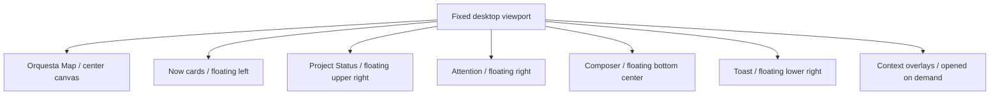
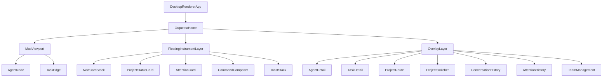

# Orquesta Desktop Renderer 受け渡し設計

作成日: 2026-07-17

対象: Orquesta V4 Desktop UI / ChatGPT制作 → Codex統合

状態: ユーザーレビュー待ち
実装状態: 未着手

## 結論

Orquestaのデスクトップ画面は、ChatGPTとCodexが同じUIソースを引き継ぐ形で作る。

- ChatGPTは、承認済み画像を基準にReact製のRendererを作る。
- ChatGPTはElectron、Codex App Server、ローカルファイル、実際のOrquesta stateには接続しない。
- UI確認中は、型付きのモックデータとブラウザプレビューを使う。
- ユーザーがUIを合格にした後、Codexが同じソースへElectronのmain、preload、実データbridgeを追加する。
- CodexはUIを作り直さない。必要な変更があれば、先に差分と理由をユーザーへ示す。

この分担の狙いは、ChatGPTとCodexを別々の実装者にすることではない。見た目の試行錯誤とローカル統合を分離し、同じ画面を二度作らないことで、総作業量とCodex側の消費を減らすことである。

## この設計書を渡す相手

本書には二つの読者がいる。

1. ChatGPT側のUI制作者
   - 承認済み画像から、ブラウザで確認できるReact Rendererを作る。
   - 見た目、レイアウト、状態表現、基本操作を完成させる。
2. Codex側のデスクトップ統合者
   - ChatGPTが作ったRendererをそのまま受け取る。
   - Electron、Windows、Codex App Server、Orquesta stateへ接続する。

どちらの読者も、過去の会話を読んでいることを前提にしない。本書、承認済み画像、受け渡されたソースだけで判断できるようにする。

## 設計対象

今回設計するのは、Orquestaデスクトップアプリの中心となるホーム画面と、その画面上で開く主要な詳細表示である。

対象に含むもの:

- 中央のOrquesta Map
- 全エージェントの組織図
- タスクの委譲経路と実行状態
- 左側のNowカード
- 右上のProject Status
- 右側のAttention
- 右下の一時通知
- 画面下中央の統括者向け入力欄
- エージェント詳細
- タスク詳細
- プロジェクト切り替え
- Project Route
- 会話履歴
- Attention履歴
- オフライン、データ不明、エラー時の表示

今回のChatGPT制作範囲に含めないもの:

- Electronのmainとpreload
- Windowsインストーラー
- Codex App Serverへの実接続
- ローカルファイルの読み書き
- `.orquesta` stateの更新
- 実際のプロジェクトフォルダ選択
- 実際の会話送信
- 外部Webサービス、認証、クラウドDB

これらはUI合格後のCodex統合範囲とする。ただし、後で接続できるように、Renderer内には最初から型付きのbridge境界を置く。

## ユーザーが達成したいこと

Orquestaの自動化が進むほど、ユーザーは「何が起きているのか」を把握しにくくなる。ユーザーが毎回統括者へ、今何をしているのか、誰へ仕事を渡したのか、どこで詰まっているのかを聞かなくても、画面を見れば組織全体を理解できることが必要である。

ホーム画面を見たユーザーは、五秒以内に次を把握できなければならない。

- 現在のOrquestaの組織図
- 存在する全エージェント
- 今動いているエージェント
- 各エージェントが担当しているタスク
- 統括者から誰へ仕事が渡ったか
- どの仕事が待機、実行、停止、完了に近いか
- ユーザーへ質問、承認、レビュー、修復依頼が来ているか
- 現在のプロジェクトと大きな進行段階
- 統括者へどこから指示を送るか

この画面は単なる管理ダッシュボードではない。Orquestaという組織を覗く望遠鏡であり、同時にユーザーが組織へ命令を送る操作盤である。

## 情報源と優先順位

UI制作時に仕様が衝突した場合、次の順で優先する。

1. 本書に書かれた明示的な要求
2. 承認済みの最終ビジュアル
3. `docs/superpowers/specs/2026-07-15-orquesta-v4-design.md`
4. `orquesta/references/state-schema.md`
5. 現在のOrquesta dashboardから読み取れるデータの意味
6. 旧Dashboard Mission Control設計

承認済み画像は、新しいChatGPT作業へ必ず別ファイルとして添付する。

- 現在のローカル参照: `C:\Users\kouki\.codex\generated_images\019f6291-cd59-7183-b799-aee36005b738\exec-7ff9a3fa-6014-4284-b5a7-50b0217e0bb7.png`
- ChatGPTへ添付するときの推奨名: `orquesta-desktop-home-approved.png`

ローカルパスだけをChatGPTへ渡してはいけない。画像自体を添付する。

## 以前のDashboard設計から上書きすること

旧Dashboard Mission Control設計には、右側の固定レール、上部のコマンドバー、複数の常設タブ、下部のProject Routeがあった。今回の承認方向では、これらをそのまま引き継がない。

新設計で上書きする点:

- 上部に幅いっぱいのナビゲーションを置かない。
- 左右に高さ全部を使う固定サイドバーを置かない。
- Homeでタブを横並びにしない。
- AttentionとNowは、中央マップの周辺に浮く独立した情報窓にする。
- Project Routeは常時大きく表示せず、Project Statusから必要なときだけ開く。
- 完了タスク、回答済み質問、低レベルログはHomeへ常時表示しない。
- 画面全体を縦スクロールさせない。

旧Dashboardから残すもの:

- 全エージェントを確認できる組織図
- panとzoom
- エージェント選択と詳細確認
- ユーザー作業の優先表示
- approval、blocked、stale、report-readyの区別
- Completion Mapの考え方
- 日本語と英語の表示に耐えられる構造
- 実データが不明なときに断定しない姿勢

現在の`orquesta/assets/dashboard/`は、データ項目と既存機能を理解する参考にはするが、HTML構造、CSS、画面配置を移植しない。新しいRendererは別ディレクトリへ作る。

## 固定する設計原則

### 中央マップが最優先

Homeで最も広い面積と最も強い視線を受けるのはOrquesta Mapである。周囲の窓が中央マップより強く見えてはいけない。

### 全エージェントを常にマップへ出す

standby、idle、blockedを理由に、エージェントをマップから消してはいけない。待機中の専門家を一つの集約ノードへ畳んでもいけない。

- rosterに存在するエージェントは全員、個別ノードとして存在する。
- フィルターや選択で一時的に薄くすることはできる。
- 非表示、折り畳み、`+12 agents`のような代替表示は禁止する。
- エージェント数が増えたら、マップ領域を広げてpanとzoomで見る。

左側のNowカードが一部の稼働者しか見せなくても問題ない。Nowは現在作業の要約であり、組織の全体像は中央マップが担う。

### 中央マップは2Dカメラである

ユーザーが求めている自由移動は、3D表現ではなく、広い2D組織図を望遠鏡のように覗く操作である。

- ドラッグでpanする。
- ホイールまたはトラックパッドでzoomする。
- fit-to-viewで全体へ戻れる。
- 選択したエージェントへfocusできる。
- 透視投影、奥行き演出、3D回転は使わない。

### Home全体をスクロールさせない

`html`、`body`、app rootはウィンドウ高へ固定し、Home全体の`overflow`を隠す。

スクロールが必要な場合は、次の範囲だけを個別にスクロールさせる。

- Attentionの未処理一覧
- Attention履歴
- 会話履歴
- エージェント詳細
- タスク詳細
- Project Routeの詳細
- プロジェクト一覧

一つの部分をスクロールしても、中央マップ、入力欄、他の情報窓は動かさない。

### 現在と履歴を混ぜない

- Attentionには未処理項目だけを置く。
- 回答済み質問はAttention履歴へ移す。
- 完了タスクはHomeから退き、Project Routeまたは履歴で見られるようにする。
- 解消済みエラーは現在のAttentionへ残さない。
- ただし履歴を削除するのではなく、必要なときに開けるようにする。

### 動画のように動かし続けない

常時動くものは、実際に稼働している経路とエージェントだけにする。背景の線、粒子、光が常に流れる演出は禁止する。

### 状態を証拠より強く見せない

- dispatch受理だけで「実行中」と表示しない。
- turn開始またはprogress証拠があるときだけ、working表現を使う。
- actual modelの証拠がなければ`unknown`とする。
- 古いsnapshotしかないときは、最後に確認した時刻とstale表示を出す。
- モックデータである間は`Demo data`または`Prototype data`を明示する。

## Homeの画面構成

Homeは一枚の固定キャンバスとして構成する。



基準viewport:

- 推奨確認サイズ: 1440 × 900
- 必須確認サイズ: 1366 × 768
- 大画面確認: 1920 × 1080
- Electronで設定する最小ウィンドウ候補: 1180 × 720

1180 × 720未満を初期リリースの正式対象にしない。小さいウィンドウへ全情報を詰め込むために、中央マップを縮小しすぎてはいけない。

### レイヤー

下から上へ次の順に重ねる。

1. 紙のような静かな背景
2. Orquesta Map
3. Now、Project Status、Attention
4. Composer
5. 選択中の詳細overlay
6. Toast
7. modalまたはproject switcher

浮遊窓はviewportへ固定する。マップをpanしても窓は動かない。

### 初期配置

承認画像を基準に、次の相対配置を守る。

- Orquesta Map: 画面中央。直径または主要描画範囲は画面高の約80〜94%。
- Now: 左端付近に最大三枚。縦一列に見えるが、幅いっぱいのrailにはしない。
- Project Status: 右上の小さな独立カード。
- Attention: 右中央の独立カード。Project Statusと結合しない。
- Composer: 下中央。左右いっぱいへ広げず、マップの操作盤として見せる。
- Toast: 右下。Composerと重ならない。

画面幅が狭いときは、NowとAttentionのカード幅を先に縮める。中央マップを先に犠牲にしない。

## Orquesta Map

### 組織図の基本構造

- Userは上部に置く。
- Orchestratorは中央に置く。
- UserとOrchestratorの関係を縦の主軸にする。
- Domain specialist、foundation agent、support agentは、Orchestratorから伸びる個別ノードとして置く。
- specialist間の線は、実際のcollaborationまたはhandoffがあるときだけ出す。
- roster全体が一画面へ収まらない場合は、マップ自体を拡張する。

foundation agentやsupport agentも省略しない。ただし役割ごとに空間的なまとまりを作ることはできる。まとまりは位置関係で表し、集約ノードにはしない。

### 安定したレイアウト

state更新のたびにノードが大きく移動すると、ユーザーが組織を覚えられない。

- agent IDを安定キーにする。
- 同じrosterでは、基本位置を維持する。
- taskやstatusの更新だけで再レイアウトしない。
- 新しいagentが追加されたときだけ、必要な範囲を再配置する。
- 再配置後も、選択中ノードとcamera位置を可能な限り維持する。
- 新規agent追加で勝手にfit-to-viewしない。ユーザーが全体表示を選んだときだけ移動する。

panとzoomは、手書き実装ではなく実績のあるgraph/canvasライブラリを優先する。候補として`@xyflow/react`とDagreまたはELKを想定するが、ChatGPTは採用前にライセンス、bundleサイズ、必要機能を確認する。ライブラリを使っても、見た目は承認画像に合わせ、ライブラリ標準のnodeやcontrolをそのまま出さない。

### Agent Node

各agent nodeは、最低限次を見せる。

- role icon
- display nameまたはrole name
- 短いrole label
- 現在状態
- current task ID。ない場合は表示しない。

node自体に長い説明や複数のbadgeを詰めない。詳細は選択後のfloating inspectorへ出す。

状態表現:

| 状態 | 見た目 | 動き |
|---|---|---|
| working | 黒いstatus dot、やや強い外周、task ID | ごく弱いbreathing |
| assigned_waiting | 黒枠、灰色dot、task ID | なし |
| standby / idle | 薄い灰色dot | なし |
| approval_wait | amberのdotまたは細い外周 | なし |
| blocked | amberまたはredの細い外周 | なし |
| stale | muted表示とstale marker | なし |
| report_ready | greenの小さな証拠marker | なし |
| unknown | `Unknown`を明示 | なし |

status colorは意味の補助であり、色だけで状態を区別しない。文字、形、tooltipも使う。

### Task Edge

線は仕事の関係を示す。

- User → Orchestrator: ユーザー指示または意図の主軸
- Orchestrator → Specialist: 委譲または担当関係
- Specialist → Specialist: 明示されたcollaboration
- Agent → User: approval、質問、ユーザー作業待ち

edge上には、必要な場合だけ短いtask ID chipを置く。task IDを選ぶとTask Detailを開く。

動くdotまたは線のflowは、`turn_started`または`progress_observed`がある経路だけに使う。`dispatch_accepted`、handoff draft、queuedだけでは動かさない。

### 選択とfocus

agentを選ぶと:

- nodeと直接つながるedgeを強調する。
- その他のnodeを消さず、少しだけ弱くする。
- selected nodeの近くにAgent Detailを開く。
- nodeが画面外に近い場合だけ、見える位置へ穏やかにcameraを動かす。

空白を選ぶかEscapeで選択を解除する。

### Map操作

- 左ドラッグ: pan
- ホイール、トラックパッド: zoom
- node click: agent選択
- task chip click: task選択
- double click: selected nodeへfocus
- `Fit` control: 全roster表示
- `Reset` control: projectごとの初期cameraへ戻す
- `+` / `-`: keyboardまたはcontrolでzoom
- Escape: overlayまたは選択を一段閉じる

map上のホイールはzoomに使い、floating panel上のホイールはそのpanel内部のscrollに使う。イベントを混同しない。

## 左側のNowカード

Nowは、全rosterではなく「現在進行中の仕事」を要約する。

各カードに表示するもの:

- `NOW` label
- agent icon
- agent名またはrole
- task title
- task ID
- 短い進捗文
- 経過時間または最後の更新からの時間
- 証拠がある場合だけ進捗表現

通常表示は最大三枚とする。四件以上のactive workがある場合、三枚目を`N more active`の入口にして、選択するとNow一覧overlayを開く。マップ上では全稼働agentを引き続き確認できる。

Nowカードを選ぶと、該当agentとtaskをマップ上でfocusし、Task Detailを開く。

Nowカードへerror、approval、質問を混ぜない。それらはAttentionが担当する。

## Project Status

右上のProject Statusは、現在開いているプロジェクトを示す小さなカードである。

通常表示:

- project title
- project healthまたはconnection status
- agent総数
- 証拠付きworking agent数
- current phaseまたは短いproject summary

カードを選ぶと、次の二段階で展開する。

1. 小展開
   - 現在phase
   - 次のmilestone
   - blocked phase
   - `Open Project Route`
   - `Switch project`
2. Project Route overlay
   - 画面上部から約3分の1を使う横長のfloating overlay
   - phaseを横方向のrouteとして表示
   - current、next、blocked、doneを区別
   - phase選択でitem詳細を内部scroll表示

Project Routeを開いても、Home全体を別ページへ移動させない。中央マップは背後に残す。

### Global menuとAdvanced Operations

初期Homeには、常設のhamburger menu、上部tab bar、左navigation railを置かない。これらは中央マップより強い「管理画面らしさ」を作り、今回の構図を壊すためである。

低レベル機能への入口は、Project Statusの小展開内に`Open operations`として置く。選択すると、同じwindow内に大きなAdvanced Operations overlayを開く。

Advanced Operationsが将来扱うもの:

- Control Plane
- raw task state
- event log
- setup
- pluginとdesktop設定
- language
- diagnostics

このoverlayは必要な間だけHomeの上に開き、閉じると同じcameraと選択状態へ戻る。画面全体を別の長いpageにせず、overlay内部だけをscrollする。

ChatGPT Prototypeでは、Advanced Operationsへの入口、section一覧、開閉、戻り動作までを作る。既存Dashboardの全Control PlaneやSetup UIを移植しない。詳細内容はCodex統合以降の別設計へ残す。

## プロジェクト切り替え

Project Statusの`Switch project`からProject Switcherを開く。

Prototypeで表示するもの:

- 現在のproject
- 最近開いたproject一覧
- 各projectのpathの短縮表示
- last opened
- active、blocked、offlineなどの短い状態
- `Open project folder` actionの見た目

ChatGPT制作時はモックprojectの切り替えだけを行い、選択後にsnapshotとmapが切り替わることを確認する。

Codex統合時に、実際のdirectory picker、project registry、最近使ったprojectの保存へ置き換える。

Project Switcherは一つのmodalまたは大きなfloating overlayとし、別のブラウザページにはしない。

## Attention

Attentionには、ユーザーが現在対応する必要があるものだけを置く。

対象:

- question
- approval
- report review
- user capability review
- user-side repair
- unresolved error
- direction decision

優先順位:

1. 作業全体を止めているapprovalまたはdirection decision
2. blocker errorまたはuser repair
3. acceptance前のreport review
4. 今答える必要があるquestion
5. その他のuser action

各itemに表示するもの:

- type icon
- type label
- source agent
- task ID
- 一文の要約
- primary action
- priorityまたはblocking状態

回答済み、解消済み、却下済みのitemを未処理一覧へ残さない。カード下部に`View history`を置き、履歴overlayへ分離する。

Attentionが0件の場合は大きな空白を埋めるための偽情報を出さず、短い`All clear`状態へ縮める。

件数が多い場合はカード内部だけをscrollさせる。Home全体は動かさない。

## 一時通知

右下のToastは、状態変化を一時的に知らせる。

例:

- specialistがtaskを開始した
- reportが提出された
- errorが発生した
- approval待ちになった
- project connectionが復帰した

Toastは4〜6秒で消える。ただし、対応が必要なものは同時にAttentionへ残す。Toastが消えたことを、問題が解消した証拠にしてはいけない。

同時表示は最大三件。多い場合はqueueに入れる。画面読み上げでは`aria-live="polite"`を使い、blockerだけ`assertive`を検討する。

## 下中央のComposer

ComposerはHomeに常時存在し、統括者へ命令を送る主操作になる。

表示:

- target selector。初期値はOrchestrator。
- text input
- file attachment icon
- map selectionまたはcontext attachment icon
- send button

操作:

- Enterで送信
- Shift+Enterで改行
- 送信中は二重送信を防ぐ
- offlineまたはrepository-onlyで送信できない場合は、理由と可能な代替を表示
- selected agentへtargetを変えられるが、初期リリースではOrchestratorを基本とする

ChatGPT Prototypeでは、送信するとモックconversationへmessageを追加し、送信済み状態を確認できるようにする。実際のCodex turnを開始したとは表示しない。

Composerの上端またはtarget部分からConversation Historyを開ける。

## 会話履歴

Conversation Historyは、Composerの上に展開するfloating sheetにする。

- 幅はComposerと同程度から少し広い程度
- 高さはviewportの約40〜50%
- sheet内部だけscrollする
- 現在targetとの会話を表示する
- user message、agent message、system eventを見分ける
- tool log全量は表示せず、必要なら`View evidence`へ分ける
- 最新へ戻るcontrolを持つ

初期UI Prototypeではモック履歴を使う。Codex統合時にApp Serverのthreadとturn historyへ接続する。

会話履歴を常時Homeへ表示して、中央マップの面積を奪ってはいけない。

## Agent Detail

agent nodeを選択すると、そのnodeの近くにfloating inspectorを開く。固定右railにはしない。

最低限表示するもの:

- display name
- role
- status
- current task
- taskを渡した相手
- last heartbeatまたはlast runtime evidence
- blocked reason
- waiting on
- expected artifactまたはreport
- context scope
- required readingの件数と参照入口
- recent evidence

初期tab:

- `Now`: current task、progress、blocker
- `Context`: role、scope、required reading、forbidden actionsの要約
- `Evidence`: turn、progress、report、acceptanceの証拠
- `History`: 最近のtaskと状態変化

長い内容はinspector内部だけをscrollする。nodeを隠す位置には出さず、viewport端では反対側へ開く。

## Task Detail

task chip、Nowカード、Attention itemからTask Detailを開ける。

表示するもの:

- task IDとtitle
- state
- owner
- assigned by
- dependencies
- blocked by
- routing class
- handoff status
- dispatch status
- turn started evidence
- progress evidence
- expected artifact
- report pathまたはreport status
- acceptance checks
- user actionとの関連
- recommended、requested、actual model。証拠のない値はunknown。

`dispatch accepted`と`turn started`を一つの行へまとめない。Orquestaが嘘の進捗を見せないための重要な区別である。

## Team管理とAdd Agent

承認画像の`Add agent`は、無条件で新しいagentを生成するボタンにはしない。

選択するとTeam Management overlayを開き、次を表示する。

- current roster
- active capacity
- standby roster
- proposed roleまたは追加候補
- 追加理由
- 想定context scope
- user approvalが必要か

ChatGPT Prototypeでは、モック候補を確認してrosterへ追加するUI状態だけを作れる。実際のCodex thread作成やagent appointmentはCodex統合後に実装する。

## Visual Design

### 全体方向

承認方向は、真っ白なSaaS dashboardではない。少し古いノートや紙のような温かさを持つ、白黒中心の現代的なテックUIである。

参考にする感覚:

- 最近のOpenAI広告やプロダクトビジュアルに見られる白黒と幾何学
- 紙、ノート、設計図のような静かな物質感
- 精密な細線と点線
- 余白の大きいeditorial layout
- 人間とAI組織の関係が図として読めること

避けるもの:

- cyberpunk
- neon glow
- 背景で動き続けるparticle
- 強いgradient
- 青紫中心のAI SaaS
- glassmorphismだらけの画面
- 大量のbadge
- 角丸カードを均等gridへ並べたgeneric admin UI
- emoji icon

### Palette

基準token:

```css
--canvas: #f3f0e8;
--paper: #faf8f2;
--paper-strong: #fffdf8;
--ink: #141414;
--ink-muted: #68645d;
--line: #d8d2c7;
--line-strong: #aaa398;
--shadow: rgba(36, 31, 24, 0.12);
--success: #4f9278;
--warning: #b97a2f;
--danger: #d7473f;
--info: #557795;
```

最終色は承認画像との比較で調整する。semantic colorは小さなdot、細いborder、件数badgeへ限定し、大きな面を塗らない。

### 背景

- 一色の純白にはしない。
- 生成り色のbaseを使う。
- ごく薄い紙grainを実画像assetとして重ねる。
- grainは文字の可読性を落とさない。
- 背景全体を点滅または移動させない。

paper textureが必要な場合、適当なCSSノイズでごまかさず、用途に合う小さなraster texture assetを用意する。

### Geometry

- Mapの大きな境界は細い点線circleまたは楕円。
- Orchestrator周囲に一〜二本の細い補助circleを置ける。
- edgeは1px前後。
- task chipは小さな長方形。
- panelは細いborderと柔らかいshadow。
- panel radiusは12〜18px程度。丸くしすぎない。

### Typography

- まずsystem sansまたはInter系を使い、外部font読み込みを必須にしない。
- agent roleやsection labelは小さなuppercaseを使える。
- body textは日本語でも読めるサイズとline heightを確保する。
- すべてを極端に細いfont weightにしない。
- titleを巨大にしてmapを圧迫しない。

### Language

- UI文字列をcomponentへ直書きせず、少なくとも`ja`と`en`の辞書へ分ける。
- Homeに常設のlanguage toggleを置かない。
- PrototypeではAdvanced Operationsまたは開発用controlから言語を切り替えられるようにする。
- 日本語と英語で、panel幅、task title、Attention item、node labelの崩れを確認する。
- 翻訳がないkeyを空欄にせず、fallback languageを使う。

### Icons

- Lucideなど一貫したicon libraryを使う。
- role iconは役割が区別できるものを選ぶ。
- iconだけで意味を確定せず、labelまたはtooltipを付ける。
- emoji、text symbol、手作りの近似iconを使わない。

## Motion

motionは状態を伝えるためだけに使う。

| 対象 | motion | 目安 |
|---|---|---|
| active agent | ごく弱いscaleまたはshadow breathing | 2.8〜3.6秒 |
| active edge | dotまたはdashの移動 | 1.4〜2.2秒 |
| overlay open | fade + 4〜8px移動 | 160〜220ms |
| selection | borderとopacity transition | 120〜180ms |
| toast | fade + short slide | 180〜240ms |
| new agent | 一度だけfade in | 220〜320ms |

禁止:

- idle nodeの常時pulse
- 背景lineの常時走行
- panelの浮遊animation
- decorative particle
- 大きなzoom animationの連続

`prefers-reduced-motion`では、active edgeの移動を静的な強調へ変え、breathingを停止する。

## Rendererの技術境界

RendererはReactとTypeScriptで作る。Viteで単独起動できる構成を基本とする。

想定配置:

```text
apps/orquesta-desktop/
  package.json
  vite.config.ts
  index.html
  src/
    renderer/
      app/
      components/
      features/
        map/
        now/
        attention/
        project/
        conversation/
        composer/
        operations/
        i18n/
      styles/
      assets/
    contracts/
      orquesta-ui.ts
      bridge.ts
    fixtures/
      active-project.ts
      idle-project.ts
      attention-heavy.ts
      offline-project.ts
    bridges/
      mock-bridge.ts
  tests/
    interaction/
    visual/
```

ChatGPTは`electron/`、`main/`、`preload/`を作らない。Codex統合時に、同じ`apps/orquesta-desktop/`へ追加する。

Rendererの禁止事項:

- Node.js APIへ直接アクセスしない。
- `fs`、`child_process`、`path`をimportしない。
- localhostのdashboard serverへ直接fetchしない。
- Codex App Serverを直接起動しない。
- `.orquesta`を直接読まない。
- Sites固有のD1、R2、auth、server functionへ依存しない。
- state JSONの形をcomponent内へ直接埋め込まない。
- fixtureをcomponent内へhard-codeしない。
- Webから受け取ったHTMLをそのまま描画しない。

## Component構成



componentは表示用propsとcallbackを受け取り、直接bridgeを呼ばない。bridgeの呼び出しとstate調整はfeature controllerまたはapp layerへ集める。

## Renderer用データ契約

実際の`.orquesta` schemaをそのまま全componentへ渡さない。Codex統合時に変更を局所化するため、UI用projectionを定義する。

```ts
type EvidenceLevel =
  | "proven"
  | "reported"
  | "inferred"
  | "unknown";

type AgentUiStatus =
  | "working"
  | "assigned_waiting"
  | "standby"
  | "approval_wait"
  | "blocked"
  | "stale"
  | "report_ready"
  | "unknown";

interface AgentUiModel {
  id: string;
  displayName: string;
  role: string;
  roleSummary: string;
  iconKey: string;
  status: AgentUiStatus;
  statusLabel: string;
  statusEvidence: EvidenceLevel;
  currentTaskId: string | null;
  currentTaskTitle: string | null;
  assignedByAgentId: string | null;
  blockedReason: string | null;
  waitingOn: string | null;
  contextScope: string | null;
  requiredReadingCount: number;
  expectedArtifact: string | null;
  lastEvidenceAt: string | null;
  lastHeartbeatAt: string | null;
}

type TaskUiState =
  | "queued"
  | "assigned"
  | "dispatch_accepted"
  | "turn_started"
  | "in_progress"
  | "blocked"
  | "approval_wait"
  | "report_ready"
  | "needs_review"
  | "accepted"
  | "failed"
  | "unknown";

interface TaskUiModel {
  id: string;
  title: string;
  state: TaskUiState;
  ownerAgentId: string | null;
  assignedByAgentId: string | null;
  dependencies: string[];
  blockedBy: string[];
  routingClass: string | null;
  handoffSent: boolean;
  dispatchAccepted: boolean;
  turnStarted: boolean;
  progressObserved: boolean;
  reportStatus: string | null;
  reportPath: string | null;
  expectedArtifact: string | null;
  acceptanceChecks: string[];
  recommendedModel: string | null;
  requestedModel: string | null;
  actualModel: string | null;
  actualModelEvidence: EvidenceLevel;
  startedAt: string | null;
  updatedAt: string | null;
}

type AttentionType =
  | "question"
  | "approval"
  | "report_review"
  | "user_capability_review"
  | "repair"
  | "error"
  | "direction";

interface AttentionUiItem {
  id: string;
  type: AttentionType;
  priority: "low" | "medium" | "high" | "blocker";
  title: string;
  summary: string;
  sourceAgentId: string | null;
  taskId: string | null;
  blocking: boolean;
  primaryActionLabel: string;
  createdAt: string;
}

interface ProjectPhaseUiModel {
  id: string;
  title: string;
  summary: string;
  status: "queued" | "current" | "blocked" | "done" | "unknown";
  ownerAgentIds: string[];
  itemCount: number;
  completedItemCount: number;
}

interface ProjectUiModel {
  id: string;
  title: string;
  rootPathLabel: string | null;
  status: "ready" | "working" | "blocked" | "offline" | "unknown";
  connectionLabel: string;
  isDemoData: boolean;
  lastSyncedAt: string | null;
  currentPhaseId: string | null;
  agentCount: number;
  provenWorkingAgentCount: number;
}

interface OrquestaUiSnapshot {
  project: ProjectUiModel;
  agents: AgentUiModel[];
  tasks: TaskUiModel[];
  attention: AttentionUiItem[];
  phases: ProjectPhaseUiModel[];
  recentEvents: RuntimeUiEvent[];
}
```

UI projectionでは、missing fieldを都合よく補完しない。不明なものは`null`または`unknown`で残す。

## Bridge契約

ChatGPT PrototypeとElectron版で、componentコードを変えずbridgeだけ差し替える。

```ts
interface OrquestaRendererBridge {
  getInitialSnapshot(): Promise<OrquestaUiSnapshot>;

  subscribe(
    listener: (event: RuntimeUiEvent) => void
  ): () => void;

  sendMessage(input: {
    targetAgentId: string;
    text: string;
    attachmentIds: string[];
    selectedContextIds: string[];
  }): Promise<UiActionResult>;

  openAttentionItem(id: string): Promise<UiActionResult>;
  resolveAttentionItem(input: AttentionResolutionInput): Promise<UiActionResult>;
  listConversation(input: ConversationQuery): Promise<ConversationPage>;
  listProjects(): Promise<ProjectSummary[]>;
  switchProject(projectId: string): Promise<UiActionResult>;
  requestOpenProject(): Promise<UiActionResult>;
  requestAgentProposal(): Promise<UiActionResult>;
}

type UiActionResult =
  | {
      status: "accepted";
      correlationId: string;
    }
  | {
      status: "unsupported" | "unavailable" | "rejected" | "failed";
      correlationId: string;
      reason: string;
      retryable: boolean;
    };
```

`accepted`は処理完了を意味しない。送信、dispatch、turn開始、結果受理は別eventとして画面へ届く。

ChatGPTは`MockOrquestaBridge`を作る。Codexは後で`ElectronOrquestaBridge`を実装し、preload経由で同じinterfaceを満たす。

## UI state

サーバーまたはOrquesta stateと、画面だけの一時状態を分ける。

UIだけが持つもの:

- selected agent
- selected task
- camera positionとzoom
- open overlay
- Attentionのscroll位置
- Conversation Historyのscroll位置
- Composer draft
- 開いているproject switcher
- toast queue
- reduced motionの反映状態

これらをtask stateや`.orquesta`へ書き戻さない。projectごとのcameraやdraftを保存するかはCodex統合時に決める。ChatGPT Prototypeではsession内保持でよい。

## Prototype fixture

ChatGPTは最低限、次のfixtureを用意する。

### `active-project`

- User
- Orchestrator
- 六人以上のagent
- 三人working
- 一件のactive delegation
- question一件
- approval一件
- error一件
- Project Statusとcurrent phase
- 会話履歴

承認画像に近い標準確認fixtureとする。

### `all-idle`

- 全agentがstandbyまたはidle
- Attention 0件
- active edgeなし
- Composer利用可能

画面が寂しいからといって偽のactivityを出さないことを確認する。

### `attention-heavy`

- Attention 40件以上
- 回答済み履歴 100件以上
- Home全体はscrollしない
- Attentionと履歴だけが内部scrollする

### `large-roster`

- 30agent以上
- idle agentを一人も畳まない
- fit-to-view、pan、zoomが使える
- node labelとedgeが完全に崩れない

### `offline-project`

- 最後のsnapshotは残る
- connectionはoffline
- last synced timeを表示
- workingを断定しない
- Composerは送信不可理由を表示

### `unknown-evidence`

- assigned taskはある
- dispatch acceptedはある
- turn started evidenceはない
- actual modelはnull
- active animationを出さない

### `long-japanese-text`

- 長い日本語project名
- 長いtask title
- 長い質問
- 長いagent role
- overflow、重なり、極端な高さ変化がない

fixtureはcomponent内へ書かず、独立したデータファイルとして切り替えられるようにする。開発用query parameterまたはfixture selectorを使ってよいが、production Homeへ大きなdebug UIを残さない。

## 起動状態

### Electron統合前

Vite起動後、標準fixtureを読み込み、画面上に`Prototype data`を明示する。

### Electron統合後

想定する起動状態:

1. Splash
2. project registry読み込み
3. project未選択ならProject Switcher
4. snapshot読み込み
5. App Serverまたはrepository-only adapterの状態確認
6. Home表示

SplashはCodex側のElectron範囲で実装する。

- 透明windowまたは背景のないlogo表示を使える。
- Orquesta logoを短くfadeまたはscaleする。
- 650〜900ms程度を目安にする。
- Splashのためにアプリ起動を不必要に遅らせない。
- main window準備完了後に短く切り替える。
- reduced motionでは静的logoへする。

ChatGPTはSplashのWindows制御を実装しない。必要ならlogo assetと静的な見本だけをRenderer資産として用意する。

## エラーと不明状態

### snapshot読み込み失敗

- Home全体を白画面にしない。
- 最後の正常snapshotがあれば残す。
- stale bannerまたはProject Statusで失敗を示す。
- retry actionを出す。
- error detailはAttentionまたはdetail overlayへ出す。

### 一部データ不正

- 問題のあるagentやtaskだけ`unknown`にする。
- Map全体を落とさない。
- 開発時はconsoleに構造化errorを残す。
- productionでは秘密情報やstate全文を表示しない。

### action失敗

- optimisticに完了扱いしない。
- `accepted`、`processing`、`completed`、`failed`を分ける。
- retry可能性を表示する。
- user actionが必要な場合だけAttentionへ残す。

### connection切断

- mapを消さない。
- moving edgeとworking animationを停止する。
- last evidence timeを見せる。
- Composerをdisableまたはdraft-onlyにする。

## Accessibility

- map node、task chip、floating cardはkeyboardで選択できる。
- focus ringを消さない。
- tab順は、主要floating instrument、map control、map node、Composer、overlayの順で理解できるようにする。
- colorだけでstatusを伝えない。
- iconにaccessible nameを付ける。
- panel内scrollにはkeyboard focusが入る。
- Escapeで一段ずつ閉じられる。
- modal中はfocus trapを使う。
- reduced motionを尊重する。
- 200% zoomでも主要操作が失われない。
- 日本語と英語の文字列でoverflowを確認する。

## Security boundary

Rendererは未信頼データを表示する面である。

- raw HTMLをrenderしない。
- markdown表示が必要なら安全なsubsetとsanitizeを使う。
- file path、Web URL、report pathを直接OSで開かず、bridgeへ依頼する。
- external navigationはpreload/main側でallowlistまたは確認を通す。
- secret、token、cookie、credentialをRenderer logへ渡さない。
- attachmentはRendererがpathへ直接アクセスせず、bridgeからopaque IDを受け取る。
- nodeIntegrationを前提にしたコードを書かない。

ChatGPT Prototypeでは、これらの機能を偽装するための危険なbrowser API fallbackを作らない。

## ChatGPTへ依頼する範囲

ChatGPTは次を完成させる。

- 通常のローカルReact/Vite source project
- 承認画像に忠実なHome
- panとzoomが動くOrquesta Map
- 全agentが個別に見えるlayout
- Agent DetailとTask Detail
- Now、Project Status、Attention、Composer、Toast
- Project Route、Project Switcher、Conversation History、Attention History
- Team ManagementのUI状態
- Advanced Operationsの入口とoverlay shell
- 日本語と英語の文字列辞書と切り替え確認
- `MockOrquestaBridge`
- 必須fixture
- responsive desktop layout
- keyboard、reduced motion、基本accessibility
- unit test、主要interaction test、visual screenshot
- ローカル起動とbuild方法を書いたREADME

最低限、次のcommandをproject内で提供する。

- `npm run dev`
- `npm run build`
- `npm run test`
- `npm run test:visual`または同等のvisual check

ChatGPTはSitesをpreviewまたは共有に使ってよい。ただし、Sites deploymentを唯一の成果物にしてはいけない。source projectが正であり、Codexがそのまま受け取れることが必要である。ユーザーが明示的に公開を求めない限り、public deploymentにしない。

ChatGPTがしないこと:

- Electron化
- Windows API操作
- App Server接続
- 本物のmessage送信
- `.orquesta` state書き込み
- cloud database追加
- login追加
- backend追加
- 旧Dashboardへの直接実装
- 承認画像からの大幅なredesign
- 独自design systemの開発
- モバイルアプリ化

## Codexへ依頼する範囲

UI合格後、Codexは同じsourceへ次を追加する。

- Electron main
- context isolationされたpreload
- typed IPC
- Windows window設定
- Splash
- project registry
- directory picker
- `.orquesta` readerとUI projection
- filesystem watcherまたはevent更新
- Codex App Server stdio adapter
- repository-only fallback
- conversation history接続
- message、approval、review action接続
- attachment処理
- installerまたは展開build
- Electron上のbrowser QA

Codexがしないこと:

- Rendererを別frameworkへ書き直す
- ChatGPT sourceを捨てて一から作る
- 旧DashboardのCSSを混ぜる
- user reviewなしにlayoutを変える
- App Serverの都合を理由にcomponentへNode APIを漏らす
- 証拠のないworking、actual model、completionを表示する

App Serverの仕様変更は、main側のadapterとUI projectionで吸収する。Renderer componentへApp Server schemaを直接流さない。

## 受け渡し成果物

ChatGPTからCodexへ、最低限次を渡す。

- source project一式
- lockfile
- `README-UI-HANDOFF.md`
- 本設計書
- 承認画像
- fixture一覧
- UI data contract
- bridge interface
- component一覧
- 1440 × 900 screenshot
- 1366 × 768 screenshot
- visual比較結果
- test結果
- 未実装一覧
- Sitesを使った場合は、local sourceとdeploymentの関係

`README-UI-HANDOFF.md`には次を書く。

- install command
- dev command
- build command
- test command
- fixture切り替え方法
- source entry point
- visual asset一覧
- 既知の差分
- Electron統合時に触ってよい境界
- 触ってはいけないcomponentまたはvisual invariant

## レビューゲート

### Gate 1: ChatGPT初回Renderer

ChatGPTは標準fixtureでHomeを作る。ここでは細かい全overlayより、中央構成とmapの視認性を先に見る。

合格条件:

- 承認画像と同じ情報階層に見える。
- 左右固定railになっていない。
- 中央mapが最も強い。
- Composerが下中央にある。
- 全agentが見える。
- Home全体にscrollがない。

### Gate 2: Interactionと状態

合格条件:

- pan、zoom、focusが動く。
- Nowからagentとtaskへ移動できる。
- Attentionを処理できるモック操作がある。
- Project Routeを開ける。
- Projectを切り替えられる。
- 会話履歴を開ける。
- Composerからモック送信できる。
- Advanced Operationsを開いてHomeへ戻れる。
- 日本語と英語を切り替えて主要layoutが維持される。
- idle、offline、unknown、attention-heavyが崩れない。

### Gate 3: UI user review

自動テストだけで合格にしない。ユーザーが実際にブラウザpreviewを操作し、明示的に合格または変更要求を出す。

ユーザーが確認すること:

- Orquesta Mapが本当に主役か
- 組織全体を把握しやすいか
- 浮遊窓がmapを邪魔しないか
- 何が動いているか理解できるか
- Attentionの重みが適切か
- 会話履歴やProject Routeへ無理なく入れるか
- 見た目が温かく、古臭くなく、OpenAI広告風の白黒幾何学として成立しているか
- animationがうるさくないか

### Gate 4: Codex intake

CodexはElectronを追加する前に、次を確認する。

- sourceがlocalでbuildできる。
- Sites専用APIに依存していない。
- fixtureがcomponentから分離されている。
- bridgeが差し替え可能である。
- RendererがNode APIをimportしていない。
- screenshotとtestを再現できる。

### Gate 5: Desktop integration

Electron統合後に確認する。

- 同じvisualがElectronでも維持される。
- project切り替えが実folderで動く。
- App Serverのthread、turn、eventが正しく表示される。
- repository-only fallbackで嘘の実行状態を出さない。
- file、process、App Serverはmain側だけが触る。
- installerまたは展開buildで起動できる。

## ChatGPT Rendererの受入条件

### Visual

- 1440 × 900で承認画像と同じ構図に見える。
- warm off-whiteの紙感がある。
- white、black、grayが主で、semantic colorは限定されている。
- 中央mapが画面の主役である。
- floating cardがrailまたはgridに見えない。
- map、panel、Composerの重なりが破綻しない。
- 日本語の長い文字列でoverflowしない。
- generic admin SaaSに見えない。

### Map

- rosterの全agent nodeがDOMまたはcanvas上に個別に存在する。
- idle agentを畳まない。
- 30agent fixtureでもpanとzoomで全員へ到達できる。
- active証拠がないedgeは動かない。
- state更新だけでnodeが大きく飛ばない。
- agentとtaskをkeyboardで選べる。

### Information hierarchy

- Homeで未処理Attentionと履歴が混ざらない。
- 完了taskがHomeを埋めない。
- user actionが0件なら短いempty stateになる。
- NowとAttentionの役割が混ざらない。
- Project Routeは必要なときだけ展開する。
- 会話履歴はComposerから開ける。

### Truthfulness

- demo fixtureをlive dataに見せない。
- dispatch acceptedだけでworking animationを出さない。
- actual modelがnullならunknownと表示する。
- offline時に古いworking表示を続けない。
- action acceptedをcompletedと表示しない。

### Interaction

- map pan、zoom、fit、resetが動く。
- Agent Detail、Task Detailが開閉できる。
- Project Route、Project Switcher、Conversation Historyが開閉できる。
- Advanced Operationsが開閉でき、閉じた後にmap cameraが維持される。
- 日本語と英語を切り替えられる。
- Attention cardだけが内部scrollする。
- ComposerがEnterとShift+Enterを区別する。
- Escapeでoverlayを閉じられる。
- reduced motionで常時animationが止まる。

### Quality

- production buildが成功する。
- browser consoleに未処理のerrorがない。
- unit testが通る。
- 主要interaction testが通る。
- 1440 × 900と1366 × 768のvisual screenshotがある。
- 承認画像と実装screenshotを並べた比較がある。
- sourceにsecret、絶対user path、ChatGPT conversation dumpが入っていない。

## 推奨テスト

ChatGPT Renderer:

- Vitestまたは同等のunit test
- Testing Libraryによる主要component interaction
- Playwrightによるbrowser interaction
- Playwright screenshotによるvisual regression
- axeまたは同等の基本accessibility check

最低限のbrowser test:

1. 標準fixtureで全agentが表示される。
2. mapをpanとzoomできる。
3. agentを選ぶとAgent Detailが開く。
4. task chipを選ぶとTask Detailが開く。
5. Attention 40件でHome全体がscrollしない。
6. Conversation Historyだけをscrollできる。
7. Project Switcherでfixture projectを切り替えられる。
8. offline fixtureでanimationと送信が止まる。
9. unknown evidence fixtureでworkingを誤表示しない。
10. 1366 × 768でComposerとfloating panelが重ならない。

Electron統合後のテストは別計画で作る。

## コストを抑える実行ルール

ChatGPTとCodexの利用枠を別財布だと決めつけない。公式仕様では、ChatGPT WorkとCodexは同じpricing、credits、usage limitsを共有する。今回の節約は、別枠へ逃がすことではなく、重複作業を消すことで行う。

実行時のルール:

- visual directionは一案に固定済みとし、三案生成をやり直さない。
- ChatGPTへ過去の会話全文を渡さず、本書と承認画像を渡す。
- ChatGPTは一画面のRendererへ集中し、backendを作らない。
- UI review前にElectron化しない。
- Codexへは合格済みsource、contract、fixture、test結果だけを渡す。
- Codexは見た目の再設計をしない。
- UI制作とElectron統合を同時に複数agentへ書かせない。
- 多数のreview agentを常設せず、visual comparisonと統合境界の二点だけを重点確認する。
- 同じfailureを無制限にretryしない。二回同じ原因で失敗したら、原因を記録して方針を変える。
- screenshot差分が小さい場合、画面全体を書き直さず、該当componentだけ直す。

## 明示的な非目標

- 旧ブラウザdashboardの互換UI
- mobile-first対応
- macOSとLinuxの配布
- cloud collaboration
- multiplayer editing
- enterprise auth
- Web公開版Orquesta
- ChatGPT内で動くApps SDKアプリ
- Sites専用プロダクト
- full-text log viewer
- IDE
- 3D組織図
- 無制限にagentを自動生成する操作
- Homeへすべてのstate fieldを表示すること
- Devpost動画のためだけの偽runtime

## 主なリスクと対策

### ChatGPTが普通のdashboardへ戻す

対策:

- 承認画像を必ず添付する。
- fixed rail、top tab、grid dashboard禁止をpromptへ書く。
- Gate 1で中央構成だけを先に確認する。

### Sites固有実装になりCodexが使えない

対策:

- local React/Vite sourceを正とする。
- D1、R2、auth、server functionを禁止する。
- Codex intakeでlocal buildを再現する。

### CodexがRendererを作り直す

対策:

- bridgeとprojectionを先に定義する。
- Electron都合をRendererへ漏らさない。
- visual screenshotを回帰基準にする。
- layout変更はuser review gateへ戻す。

### agent数増加でmapが崩れる

対策:

- graph libraryとstable layoutを使う。
- large-roster fixtureを最初から持つ。
- groupingではなくpanとzoomで解決する。

### 情報窓がmapを覆う

対策:

- 初期cameraにsafe areaを持つ。
- overlayを開いたときもselected nodeを隠さない。
- 1366 × 768 screenshotを必須にする。

### animationがうるさくなる

対策:

- motionをworking証拠のあるものだけに限定する。
- background animationを禁止する。
- reduced motion fixtureを確認する。

### UIが嘘の実行状態を見せる

対策:

- `assigned`、`dispatch_accepted`、`turn_started`、`progress_observed`を分ける。
- evidence levelをUI modelへ含める。
- unknown fixtureを受入条件にする。

## 確定事項

- ChatGPTでUI Rendererを作り、Codexが同じsourceをElectron化する。
- React、TypeScript、Viteを基本とする。
- Build Weekのdesktop shellはElectronを使う。
- 中央のOrquesta MapをHomeの主役にする。
- rosterの全agentを常時個別表示する。
- idle agentを畳まない。
- mapは2D panとzoomを持つ。
- floating instrument構成を使い、左右固定railは使わない。
- Home全体をscrollさせない。
- 現在の項目と履歴を分ける。
- Composerを下中央へ常設する。
- Conversation Historyをアプリ内で開ける構造にする。
- Project StatusからProject RouteとProject Switcherを開く。
- animationはactive workだけに限定する。
- rendererはNode API、filesystem、App Serverへ直接触れない。
- ChatGPT PrototypeはMock Bridgeを使う。
- Codexはmain、preload、実bridgeだけを追加する。
- visual user reviewに合格するまでElectron統合へ進まない。

## 今回は後回しにする判断

後回しにするものは、曖昧なままChatGPTへ自由判断させず、初期制作範囲から外す。

- 最終app logoの細部
- Windows installerの形式
- auto update
- tray icon
- global shortcut
- native notificationの細部
- crash reporting provider
- camera位置の永続保存
- userごとのlayout customization
- floating cardのdrag再配置
- multi-window
- mobile companion

これらを理由にRenderer制作を止めない。

## ChatGPTへ渡す最初の指示文

次の文章と本書、承認画像を一緒に渡す。

```text
添付した設計書と承認画像を基準に、Orquesta DesktopのUI Rendererを作ってください。

これは独立したWebサービスを作る依頼ではありません。最終的にCodexが同じsourceへElectronのmain、preload、Codex App Server接続を追加します。したがって、通常のローカルReact + TypeScript + Vite projectとして作り、RendererからNode.js、filesystem、child_process、localhost dashboard、Codex App Serverへ直接アクセスしないでください。

今回作るのはUI、interaction、fixture、Mock Bridgeまでです。Electron、backend、login、cloud DB、Sites固有APIは作らないでください。Sitesを使う場合もpreview用途に限定し、local sourceを正としてください。

承認画像の構図を変更しないでください。中央のOrquesta Mapが主役です。左側には小さなNowカード、右上にはProject Status、右側にはAttention、下中央にはComposer、右下には一時通知を浮かせます。左右固定rail、上部tab bar、均等grid dashboard、Home全体の縦scrollは禁止します。

rosterの全agentを、idleやstandbyを含めて個別にmapへ表示してください。待機中agentを折り畳んだり、集約nodeへ置き換えたりしないでください。agent数が多い場合はmapを広げ、panとzoomで見るようにします。

まず標準fixtureによるHomeの中央構成を作り、1440 × 900で承認画像と比較してください。その後、Agent Detail、Task Detail、Project Route、Project Switcher、Conversation History、Attention History、Team Managementを追加してください。

完成前に、設計書の受入条件とfixture一覧を一つずつ確認し、visual screenshot、interaction test、known gaps、Codex向けREADMEを残してください。設計書にない大きな判断が必要になった場合は、勝手にredesignせず質問してください。
```

## 公式仕様への依存

- ChatGPT Sitesは、promptまたは互換local projectからWeb appを作成、preview、保存、公開できる。今回は公開先ではなくUI previewとして使える。
- Work modeとCodexは同じpricing、credits、usage limitsを共有するため、UIの分業は重複削減を目的にする。
- Codex App Serverは、独自clientへauthentication、conversation history、approval、streamed eventを統合するためのinterfaceとして使う。
- App Serverの実験的な部分をRendererへ漏らさず、Codex側adapterで吸収する。

参照:

- [Orquesta V4詳細設計](./2026-07-15-orquesta-v4-design.md)
- [旧Dashboard Mission Control設計](./2026-06-23-dashboard-mission-control-redesign.md)
- [ChatGPT Sites](https://learn.chatgpt.com/docs/sites.md)
- [Codex pricing](https://learn.chatgpt.com/docs/pricing.md)
- [Codex App Server](https://learn.chatgpt.com/docs/app-server.md)

## 本書のレビュー条件

本書は、ユーザーが次を確認して明示的に承認した後、実装計画へ進める。

- ChatGPTとCodexの分担が意図どおりか
- 承認画像の構図を正しく言語化できているか
- 全agent常時表示が守られているか
- Home全体scroll禁止が守られているか
- Now、Attention、履歴の役割分担が正しいか
- Project Route、project切り替え、会話履歴の入り方が正しいか
- ChatGPT制作範囲が広すぎないか
- CodexがUIを作り直さない境界が十分か
- cost削減が別実装ではなくsource再利用で成立しているか

承認前に、ChatGPTへUI実装を依頼しない。
