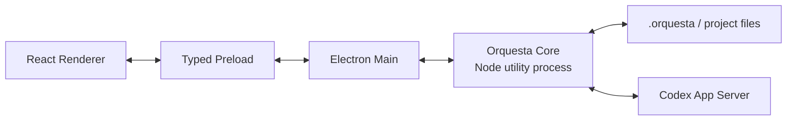

# Orquesta Desktop Electronアーキテクチャ設計

作成日: 2026-07-18

状態: ユーザー承認済み

## 結論

Orquesta DesktopはElectronで作る。

ブラウザ版を完成させて最後にElectronで包むのではなく、開発中からElectronを正式な実行環境にする。ユーザーが操作する製品はWindowsのデスクトップアプリであり、外部ブラウザを開く運用はしない。

React Rendererと現在のJavaScript、Node資産はそのまま利用する。Electron固有の処理は薄く保ち、将来、実測したメモリや配布サイズが問題になった場合だけTauriを再検討する。

この設計は、次の既存設計を上書きせず、デスクトップ部分を具体化する。

- `docs/superpowers/specs/2026-07-15-orquesta-v4-design.md`
- `docs/superpowers/specs/2026-07-17-orquesta-desktop-renderer-handoff-design.md`

## Electronを選ぶ理由

OrquestaにはすでにReact製Rendererがあり、本体もJavaScriptとNodeを中心に作られている。Electronなら、Rendererも本体も同じTypeScript、JavaScript系の道具で接続できる。

Tauriは配布サイズと基本メモリを小さくできる可能性があるが、現在のOrquestaを使うにはNode sidecarを追加するか、本体をRustへ移植する必要がある。前者はプロセス管理と通信が増え、後者は作り直しになる。今この費用を払う根拠はない。

WinUI 3へ全面移植すると、中央マップ、pan、zoom、overlay、animationを作り直す必要がある。WinUIの中にWebView2を置く方法もあるが、React、C#、Nodeの三層になり、Electronより管理が難しくなる。

そのため、現在はElectronが開発費、完成速度、既存資産の再利用、故障時の調査しやすさを合わせた最小コストの選択になる。

## 製品と開発環境

### 正式な実行環境

Windows上のElectronだけを正式な製品環境とする。

通常の開発コマンドはElectronウィンドウを起動する。開発中はVite dev serverをRendererのhot reloadに使ってよいが、外部ブラウザは開かない。

```text
npm run dev:desktop
  -> Vite dev serverを内部起動
  -> Electron mainを起動
  -> Electron windowがRendererを表示
```

本番buildではlocalhost serverを起動しない。Rendererをpackageへ含め、アプリ専用のlocal protocolから読み込む。

### ブラウザ実行の扱い

ブラウザfixtureは削除しない。Renderer component、fixture、layout計算を早く確認する補助環境として残す。

ただし、次の合格証拠には使わない。

- Windows DPIでの見え方
- フォントの鮮明さ
- native windowの起動と復帰
- file dialog
- process lifecycle
- installerから起動した状態
- Codex App Serverとの接続

これらはElectronまたはpackage済みWindowsアプリで確認する。

## プロセス構成



### Renderer

既存のReact Rendererを使う。

Rendererの責任は表示、入力、選択、画面内stateだけにする。`fs`、`path`、`child_process`、Electron API、Codex App Serverへ直接触れない。

Rendererは既存の`OrquestaRendererBridge`を通して操作する。Mock版とElectron版でcomponentを分岐させない。

### Preload

Preloadは、Rendererに許可する小さいAPIだけを公開する。

生の`ipcRenderer.send`、任意channel名、任意filesystem pathは公開しない。Rendererが使う入力と戻り値はTypeScriptの契約として定義する。

例:

- initial snapshotを取得する
- project一覧を取得する
- directory pickerを開く
- messageを送信する
- attentionを解決する
- runtime eventを購読する

### Electron Main

MainはWindowsアプリの外枠を担当する。

- application lifecycle
- BrowserWindow
- local application protocol
- navigation制限
- native dialog
- window位置と大きさ
- utility processの起動、監視、終了
- rendererとCoreのIPC中継
- app logの保存先

MainへOrquestaの判断ロジックやstate projectionを入れない。Mainが肥大化すると、window障害とOrquesta障害を分けて調べにくくなるためである。

### Orquesta Core

既存のNode資産をElectronのutility processで動かす。

- project registry
- `.orquesta`読込
- filesystem watcher
- stateからUI modelへのprojection
- Codex App Server adapter
- repository-only fallback
- action validation
- runtime evidence
- event subscription

重い探索や監査をCore process自身で長時間同期実行しない。必要な処理は既存のOrquesta taskや別processへ渡し、CoreはUIへ状態を返せる状態を保つ。

CoreとMainの通信契約はElectron APIの型へ直接依存させない。将来Tauriへ移る場合、Coreをsidecarとして再利用できる形を保つ。

### Codex App Server

Codex App ServerはCoreが管理する。

MainやRendererから直接stdioへ書かない。Coreは起動、stdin、stdout、stderr、終了code、再接続を管理し、App Serverの生eventをUIへそのまま渡さず、Orquestaのruntime evidenceへ変換する。

App Serverが利用できない場合はrepository-onlyへ落とす。命令を送れていないのに、送信済み、turn開始済み、workingとは表示しない。

## セキュリティの範囲

Electron公式の基本設定だけを最初から入れる。

- `contextIsolation: true`
- `nodeIntegration: false`
- renderer sandboxを有効にする
- local packaged contentだけをmain windowへ読み込む
- Content Security Policyを設定する
- navigationと新規window作成を制限する
- IPC channelと入力を検証する
- rendererへElectron API全体を公開しない

独自の多段セキュリティ審査システムは、このデスクトップ基盤の初期範囲へ入れない。基礎設定、境界テスト、依存関係の通常監査を行い、それ以上は具体的な脅威か実事故が見つかった場合に追加する。

## 配布

Electron ForgeでWindows packageを作る。

開発の早い段階からpackage済みの`Orquesta.exe`を生成し、dev serverがなくても起動できることを確認する。最初は署名無しの内部検証buildでよい。

一般配布前には、installer、application icon、product metadata、code signing、update方針を別タスクで決める。code signing証明書の取得は、開発用packageの完成条件にしない。

## 軽量化方針

ElectronのChromium同梱による基本コストは受け入れる。その代わり、アプリ側で増やす負荷を抑える。

- 通常はmain windowを一つだけ使う
- hidden BrowserWindowを常駐させない
- background animationを増やさない
- blur、backdrop-filter、巨大shadowを必要以上に使わない
- Attentionと履歴はvirtualizeまたはpage単位で読む
- projectを切り替えたとき、不要なwatcherとsubscriptionを止める
- Coreをproject未選択時に重い状態で動かさない
- App Serverと子processを二重起動しない
- Mapはnode数だけでなく、衝突、label描画、edge描画を検証する
- semantic zoomを使い、小さい文字をworld全体と一緒に過度に縮小しない

35 agentという数自体はElectronにとって重い規模ではない。現在見つかっている問題は、固定ring配置とworld全体の小数scaleによる衝突と可読性であり、Electronへ変えるだけでは直らない。

## Windows実測の合格条件

測定対象はpackage済みx64 buildとし、Codex App Serverを起動していないidle状態と、代表projectを開いた状態を分けて記録する。

初期の合格基準は次とする。

- package済みアプリがdev serverなしで起動する
- target PCでcold startからHome操作可能まで4秒以内
- Home表示後60秒のidle working setが合計400 MB以下
- 展開後のapplication footprintが350 MB以下
- 35 agent fixtureのpanとzoomで、500 ms以上のUI停止が発生しない
- 30分のidle後、working setの増加が起動後5分時点から75 MB以内
- Windows表示倍率100%、125%、150%、200%で主要文字が読める
- 1366 x 768でHome全体がscreen scrollを必要としない
- 主要panelがMap操作、Composer、agent選択を完全に塞がない
- app終了後にCore、App Server、watcher processが残らない

数値はユーザーPCで測る。CIの仮想環境だけで合格にしない。

## Tauriを再検討する条件

Electronが一つの測定に失敗しただけでは移行しない。最初にprofileし、Renderer、layout、画像、watcher、不要processを直す。

次の条件がそろった場合にTauriとNode sidecarの小さい比較試作を作る。

- package sizeまたはidle memoryが、二回の改善後も上の基準を超える
- 超過の主因がOrquestaやRendererではなく、Electronの基本runtimeである
- Tauri化によるRust、sidecar、installer、IPCの追加費用を受け入れる価値がある

比較試作では同じRenderer、同じCore、同じproject fixtureを使い、cold start、memory、package size、Map操作を同じPCで測る。Tauriの数値が良いという予想だけでは移行しない。

## 開発順

### Desktop Foundation

- Renderer sourceを正式repositoryへ取り込む
- Electron main、preload、Core entryを追加する
- Electronを起動する開発commandを作る
- package済みWindows buildを作る
- Electron smoke testとprocess終了testを作る
- Windows実測値を記録する

### Map Stabilization

- agentの親子関係と一時subagentの契約を追加する
- 固定arc、ringを衝突回避layoutへ置き換える
- semantic zoomを追加する
- 1、3、12、20、35 agentと3階層fixtureで確認する
- Electron上のDPI別表示を確認する

### Read-only Integration

- project registry
- directory picker
- `.orquesta` reader
- filesystem watcher
- UI projection
- offlineとinvalid state

### Runtime Actions

- Codex App Server接続
- conversation
- approvalとreview
- attention resolution
- attachment
- agent proposal
- failure recovery

読み取りと書き込みを一度に入れない。最初に本物のstateを正しく表示し、その後に一種類ずつ操作を追加する。

## テスト

### Unit

- UI projection
- typed IPC validation
- project registry
- window state
- Core process message
- App Server event mapping

### Renderer

- 現在のVitestとbrowser fixture testを残す
- node数だけでなくnode同士の衝突を検出する
- dispatch acceptedとturn startedを分ける
- actual model unknownを保つ

### Electron integration

- package contentを読み込める
- rendererからNode APIへ直接触れない
- preloadで許可されたAPIだけが存在する
- project pickerがnative dialogを経由する
- windowを閉じるとCoreが終了する
- invalid IPC inputを拒否する

### Windows manual gate

- DPI
- IME
- multi-monitor
- minimize、restore、maximize
- cold start
- package済みexe
- launcher、log、異常終了

スクリーンショットは必須成果物にしない。必要な不具合の証拠としてだけ保存する。

## 今回決めないこと

- code signing証明書の購入
- Microsoft Store公開
- auto update provider
- macOSとLinux対応
- Tauri移行
- 完全WinUI移植
- 複数window UI
- 高度なplugin marketplace UI

これらはDesktop Foundation、Map Stabilization、read-only integrationの結果を見てから決める。
