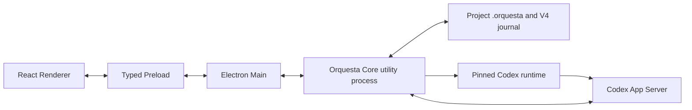

# Orquesta V4 Desktop統合設計

作成日: 2026-07-18

状態: ユーザーが方式1「pinned Codex runtime同梱」を承認。書面レビュー待ち

## 結論

Orquesta Desktopを、見た目だけのElectron shellではなく、V4 Phase 1とPhase 2の正規機能を使うWindowsアプリへ統合する。

Codex実行には`@openai/codex-sdk@0.144.5`が依存するWindows x64 runtimeを同梱する。`PATH`、`ORQUESTA_CODEX_PATH`、一般的なCLI探索、WindowsApps内のCodex Desktop実行ファイルは使わない。Orquestaが検証済みの一つのruntimeを所有し、App ServerをCoreから`spawn(..., { shell: false })`で起動する。

この判断により、展開後サイズ350 MiB以下という初期目標は製品全体には適用できない。Electron UI/CoreとCodex runtimeを分けて測定し、合計値も隠さず表示する。runtimeは初回のCodex操作まで起動しないため、未使用時のidle memory目標は維持する。

## 正とする成果物

統合元は次の二本である。

- V4 Phase 1、1.5、2A、2B: `codex/orquesta-v4-phase1`の`6427ffd`
- Electron Desktop: `codex/orquesta-desktop-electron`の`c150fda`

統合先は`codex/orquesta-desktop-electron`とする。V4側の履歴をmerge commitで取り込み、Phase 1・2の個別commitを潰さない。

設計文書の優先順位は次の通り。

1. 本書
2. `2026-07-18-orquesta-desktop-electron-architecture-design.md`
3. `2026-07-17-orquesta-desktop-renderer-handoff-design.md`
4. `2026-07-15-orquesta-v4-design.md`のPhase 1、1.5、2A、2B

本書は、Application productizationをPhase 2から分離した判断を維持する。DesktopはPhase 2の一部へ戻さず、2A・2Bの後に行う独立したApplication成果物とする。

## 完成後にできること

ユーザーは一つのWindowsアプリから次を行える。

- Orquesta projectを開き、最近使ったprojectを切り替える
- `.orquesta`のagent、task、Attention、phase、runtime evidenceをMapと各overlayで確認する
- 統括者または選択したagent宛てに文章と画像を送る
- project専用のCodex threadを新規作成、再開する
- dispatch accepted、turn started、progress、completion、failureを別々に確認する
- App Serverから届いた承認要求を確認し、許可または拒否する
- 同じthreadの会話履歴をアプリ内で読む
- Phase 1のCapability Graph、Resolution、Context Packを確認する
- Phase 2のsource、Audit、Audition、Evidence correlationを確認する
- App Serverが起動できない場合、実行済みと偽らないrepository-only状態を見る
- 必要なら、文章をCodex DesktopのComposerへ転記するdeep linkを使う。ただし自動送信とは表示しない

## プロセス構成

### Renderer

Rendererは表示、入力、選択、画面内stateだけを扱う。Node.js、filesystem、Electron、App Serverへ直接触れない。現在の中央Mapとfloating instrument構成は維持する。

fixture modeとlive modeは同じcomponentを使う。fixtureがlive dataに見えない表示も維持する。

### Preload

Preloadは固定したIPCだけを公開する。生のchannel名、任意path、任意commandはRendererへ渡さない。

追加する主な操作は次の通り。

- runtime capabilities取得
- approvalへの応答
- Capability、Audit、Audition、Evidence detail取得
- Codex Desktop deep linkを開く

### Electron Main

MainはWindows固有の処理だけを持つ。

- window、splash、application lifecycle
- directory pickerと画像picker
- opaque attachment ID
- app-owned project registry
- Core utility processの起動、監視、終了
- typed IPCの中継
- local packaged contentと外部navigationの制限

`.orquesta`の解釈、task state判定、runtime evidence生成、App Server protocolはMainへ置かない。

### Orquesta Core

CoreはOrquestaの製品ロジックを持つ。

- `.orquesta` readerとwatcher
- V3 stateとV4 projectionからUI snapshotを作る
- V4 Capability、Resolution、Context Pack、Audit、Audition、Evidenceの読取
- Codex Adapterの選択
- App Server lifecycle
- thread、turn、history、approval
- runtime eventとUI eventの対応
- repository-only fallback

project未選択時は起動しないか、最低限の待機状態にする。project選択後は一つだけ起動する。project切り替え時に古いwatcher、subscription、App Server thread bindingを解除する。

## Codex runtime

### 同梱するもの

次をexact versionで固定する。

- `@openai/codex-sdk@0.144.5`
- `@openai/codex@0.144.5`
- `@openai/codex-win32-x64@0.144.5-win32-x64`

runtime packageはnpm lockfileのintegrityとpackage metadataを検査する。実行時も、package root、realpath、platform、architecture、version、実行ファイルが同梱resources内にあることを確認する。

### 禁止する経路

- `PATH`検索
- `ORQUESTA_CODEX_PATH`
- 任意の実行ファイルpath注入
- WindowsApps直起動
- standalone CLI fallback
- `shell: true`
- RendererまたはMainからのApp Server直接起動

### 起動と停止

Coreは最初の送信、会話履歴、runtime診断のいずれかでApp Serverを遅延起動する。`initialize`と`initialized`を一接続につき一度だけ行う。

通常終了ではstdinを閉じ、短い終了猶予後に残ったprocessを終了する。App Server、code-mode host、watcher、Coreがアプリ終了後に残らないことをpackage済みアプリで確認する。

## 正規Codex Adapter

`packages/codex-adapter`を唯一のruntime protocol実装にする。Desktop独自の`app-server-client.ts`と`codex-runtime.ts`は、正規Adapterへ移行後に削除する。

Applicationで必要な次の機能を、正規contractへ後方互換で追加する。

- thread detailまたはconversation pageの読取
- approval request detailの読取
- runtime healthとversion evidence
- graceful shutdown

既存のPhase 2 testとAPIを壊さず、追加機能はcapabilityで判別できるようにする。

### model evidence

次を混同しない。

- recommended model
- requested model
- applied model
- actual model

`thread/start`や`thread/resume`のmodel返却値はapplied modelであり、actual modelではない。actual modelは独立したruntime eventで観測した場合だけ入れる。証拠がなければ`null`と`unknown`を維持する。

### runtime state

次の状態を別eventとして扱う。

- dispatch accepted
- thread started
- turn started
- progress observed
- approval requested
- agent message
- turn completed
- turn failed

dispatch acceptedだけでworking animationを始めない。turn startedを観測した後だけactive表示にする。

## approvalとAttention

現在のDesktopはApp Serverからのserver requestを一律`-32601`で拒否し、threadを`approvalPolicy: never`で開始している。この動作を廃止する。

threadはCodexの通常のapproval boundaryを使う。App Serverのapproval requestを、thread ID、turn ID、correlation ID、request IDへbindしてCoreで保持する。

RendererのAttentionには、対応中のruntime approvalだけを追加する。ユーザーが許可または拒否すると、Coreが同じpending requestへ一度だけ応答する。

次を拒否する。

- 存在しないrequest ID
- 別threadまたは別turnの応答
- 二重応答
- stale request
- App Serverが提示していない選択肢

repository上のcanonical Attentionを、runtime approvalと同じ操作で勝手に書き換えない。report review、question、direction decisionなどのrepository actionは、対応する正規commandがあるものだけ有効化する。

## conversation

projectごとに統括thread IDをapp-owned registryへ保存する。保存済みthreadを再開できない場合は、新しいthreadを作り、置換したことをUIへ通知する。

conversation historyはApp Serverのthread dataから読み、user message、agent message、system/runtime eventを分ける。tool output全文や秘密情報はRendererへ渡さない。

専門家宛てのメッセージは、初期版では統括thread内のOrquesta routing envelopeとして送る。別threadを作った証拠がない限り、専門家threadへ直接送ったとは表示しない。

## V4機能の表示

中央Mapの面積は減らさない。Capability、Acquisition、Audit、Audition、EvidenceはHomeへ常設せず、Advanced Operationsから開く大きなoverlayへ置く。

overlayは次の四面を持つ。

- Capability: TaskIntent、Need、Provider、Resolution、Context Pack
- Acquisition: source、freshness、trust、query budget、candidate
- Audit and Audition: hard gate、score内訳、実行profile、cleanup、verdict
- Evidence: correlation timeline、artifact、report、acceptance、model evidence

Phase 1 Workbenchの既存projectionとAPIを再利用し、同じ判断ロジックをRendererで作り直さない。

初期統合では読取を先に完成させる。Resolution承認、install authorization、Audition実行は、正規commandとcurrent revision bindingを通せるものだけ有効化する。未接続のボタンは表示しない。

## repository projection

V3の`.orquesta/state`とV4 Event Journalは同時に存在できる。Coreは両方を読み、出所を保持したUI modelへ変換する。

不明な値を推測で埋めない。partial corruptionがある場合、問題のあるagentまたはtaskだけをunknownにし、最後の正常snapshotがあればstaleとして残す。

watch対象はproject切り替え時にすべて解除する。OneDrive上の一時file、atomic replace、複数回change eventをdebounceし、途中状態をlive snapshotとして公開しない。

## deep-link fallback

runtimeが起動不能な場合、repository-onlyへ落とす。Composerで同じ送信ボタンを成功扱いにしない。

代わりに`codex://threads/new?prompt=...&path=...`を明示的な別操作として出せる。これはCodex DesktopのComposerを開いて文章を転記するだけで、自動送信しない。UIには`Codexで確認して送信`と表示する。

UI automationでCodex Desktopの送信ボタンを押さない。

## packageと容量

Electron Forgeで次を生成する。

- Windows x64 Setup
- Windows x64 ZIP
- 展開済み検証package

packageへ含めるruntimeはWindows x64だけにする。source map、test、fixture screenshot、Forge、未使用locale、他OS runtimeを配布物へ含めない。

容量は次の三つを記録する。

- Electron UI/Core footprint
- Codex runtime footprint
- 合計footprint

初期実測の見込みはUI/Core約305 MiB、runtime約390 MiB、合計約695 MiBである。実際の最終値はpackage済み成果物で測り直す。

## performance gate

runtime未起動状態と、runtime起動後を分けて測る。

必須条件は次の通り。

- cold startからHome操作可能まで4秒以内
- runtime未起動idle working set合計400 MiB以下
- 35 agent fixtureのpanとzoomで500 ms以上の停止なし
- 30分idle後の増加が起動5分時点から75 MiB以内
- 1366 x 768でHome全体scrollなし
- Windows表示倍率100、125、150、200%で主要文字が読める
- runtime起動後もRenderer入力とMap操作が固まらない
- 終了後に子processとwatcherが残らない

合計disk footprintは350 MiB以下を必須条件から外す。代わりに内訳と合計を公開する。

## security boundary

OrquestaはCodexのsandboxを再実装しない。Codex runtimeのsandbox、network、command approvalを利用する。

Desktop側が受け持つのは次の境界だけである。

- Electron sandbox、context isolation、nodeIntegration無効
- typed IPCと入力上限
- attachment opaque ID
- packaged local contentだけの読込
- navigation制限
- pinned runtimeのidentity、realpath、version、integrity
- approval requestのthread、turn、correlation binding
- secretと巨大outputをRendererへ渡さない

独自の多段security review、command risk parser、別sandbox、別credential vaultは追加しない。

## branchとdependency構成

V4とDesktopをmergeした後も、Desktopは独立したpackage lockを維持する。root workspaceは`apps/workbench`と`packages/*`を対象にし、`apps/orquesta-desktop`をrootの一括testへ暗黙に混ぜない。

Desktopから正規Adapterを使うため、`@orquesta/codex-adapter`を明示的なlocal dependencyとして参照する。package工程では必要なAdapter codeとpinned runtime resourcesを再現可能な手順で収集する。

Phase 1・2のtestとDesktop testは別commandで実行でき、最終gateだけ両方をまとめる。通常の小変更で巨大な全suiteを毎回回す運用にはしない。

## 実装順

一度に全層を変更しない。

### Slice 1: repository統合

- V4 branchをmergeする
- 文書conflictを本書の優先順位で解決する
- root workspaceとDesktop lockfileを分離する
- Phase 1、1.5、2A、2B、Desktopの既存testを通す

### Slice 2: runtime統合

- pinned runtimeをDesktop packageへ入れる
- 正規Codex Adapterへ置き換える
- model evidenceとruntime eventを正しく変換する
- Desktop独自runtime clientを削除する

### Slice 3: interaction

- conversation historyを正規Adapterへ移す
- approval relayとAttentionを接続する
- failure、repository-only、deep-link fallbackを接続する

### Slice 4: V4 operations

- Capability、Acquisition、Audit、Audition、Evidence overlayを追加する
- Phase 1・2の正規projectionを使う
- 接続済みの正規commandだけ操作可能にする

### Slice 5: package gate

- Setup、ZIP、展開packageを作る
- runtime同梱とintegrityを検査する
- fake App Server integrationを通す
- pinned本物runtimeでinitializeとschema/version probeを通す
- ユーザー承認がある場合だけ有料の実model turnを一回行う
- Windows performanceと終了processを測る

## test

新しいproduction behaviorはTDDで追加する。

最低限、次を自動化する。

- merge後のPhase 1、1.5、2A、2B回帰
- pinned runtime path、realpath、version、integrity
- PATH、環境変数、WindowsAppsを使わないこと
- App Server initialize、thread、turn、history、approval、shutdown
- dispatch acceptedとturn startedの分離
- applied modelとactual modelの分離
- approvalの誤binding、二重応答、stale拒否
- project切り替え時のwatcherとsubscription解除
- repository破損時のstale/unknown表示
- RendererからNode APIへ到達できないこと
- package済みEXEでComposer、history、approvalが動くこと
- app終了後にprocessが残らないこと

browser fixtureはlayoutとinteractionの補助証拠に使う。Codex接続、filesystem、window、packageの合格証拠には使わない。

## ユーザーレビュー

実装は五つのSliceごとに自動testを通す。Slice 3とSlice 5でユーザー確認を行う。

Slice 3では次を確認する。

- Composerから本当にCodexへ届く
- dispatch、turn、completionが誤解なく見える
- approvalをアプリ内で処理できる
- 会話履歴が使える
- failure時に嘘をつかない

Slice 5では次を確認する。

- SetupまたはZIPから迷わず起動できる
- Mapとfloating UIが見やすい
- project切り替えが自然に使える
- runtime同梱サイズを許容できる
- 日常利用で重さや待ちが問題にならない

ユーザーの明示的な合格前に、Desktop完成またはPhase承認と記録しない。

## 完成条件

次をすべて満たしたときだけ、今回のDesktop統合を完成とする。

- V4 Phase 1、1.5、2A、2BとDesktopが一つのbranchに存在する
- 正規Codex AdapterだけがApp Server protocolを実装する
- pinned Windows runtime以外を起動しない
- Composer、画像、conversation、approvalがpackage済みアプリで動く
- runtime stateとmodel evidenceを誤表示しない
- Capability、Audit、Audition、EvidenceをDesktopから確認できる
- project切り替え後に古いstateやwatcherが残らない
- repository-onlyとdeep-linkを実行成功に見せない
- unit、integration、browser、Electron、V4 verifierが通る
- Setup、ZIP、展開packageが同じbuildから生成される
- Windows性能gateを実機で満たす
- code signing未実施なら、その制限を配布説明へ明記する
- ユーザーが最終成果物を確認し、明示的に合格する

## 今回含めないもの

- macOSとLinux package
- Microsoft Store公開
- auto update
- cloud worker
- enterprise SSO
- Codex Desktop UI automation
- general OpenAI APIへの置換
- Phase 3のExperience LedgerとIntent Graph実装

Phase 3はDesktop統合完了後の別phaseとして維持する。
