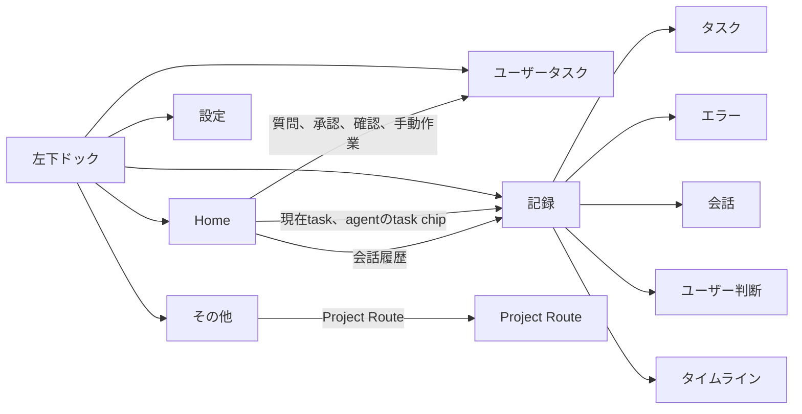

# Orquesta Desktop 情報設計の再構成

日付: 2026-07-19

状態: ユーザーレビュー待ち

対象: `apps/orquesta-desktop`

この文書は、`2026-07-19-orquesta-desktop-ux-recovery-design.md`の画面構成、導線、D1からD4の区分を置き換える。円形のHome、色、質感、既存の主要部品は残す。Orquesta Mapの組織構成と最終配置は、今回も別の設計として扱う。

## 結論

最上位の画面は次の5つにする。

1. Home
2. ユーザータスク
3. 記録
4. 設定
5. その他

Homeは、今起きていることを短時間で把握する場所にする。ユーザーが回答、承認、確認、手動作業を行う場所は「ユーザータスク」にまとめる。タスク、エラー、会話、ユーザー判断の全記録は、一つの「記録」画面で切り替えて見る。設定は独立させる。

Project Routeは本来ならHome付近に置けるが、現在の機能が古く、主要機能でもない。今回は「その他」に残す。「その他」を設定や管理機能の置き場にはしない。

## 今回直す理由

現在の設計には、次の問題がある。

- Homeと「その他」の両方に、同じTeam Managementがある
- 質問数をHomeで確認する条件が設計書にあるのに、入口も件数もない
- Tasks、Failures、会話が、ユーザーの目的ではなく内部データの種類ごとに分かれている
- 「その他」にProject Route、Operations、Team Management、言語、診断が混ざっている
- 設定画面を作る話が、言語切り替えの直置きに変わっている
- 実装段階とテスト項目は多いが、ユーザーの発言と画面の対応を追跡できない

今回の設計では、情報ごとに正式な置き場所を一つだけ決める。Homeに同じ情報を出す場合は、概要と入口だけにする。

## 検討した案

### 案1: 現在の6画面を維持する

Home、要対応、Tasks、Failures、会話、その他をそのまま残す。既存コードへの変更は最も少ないが、画面の分裂と重複が残る。今回の問題を直せないので採用しない。

### 案2: Home、ユーザータスク、記録、設定、その他に整理する

現在の外観とHomeを残し、Tasks、Failures、会話を「記録」に統合する。ユーザーが行うことは「ユーザータスク」、環境変更は「設定」、古い補助機能であるProject Routeは「その他」に置く。

既存部品を再利用しながら、情報の置き場所を整理できる。この案を採用する。

### 案3: Homeだけにすべてのdrawerを重ねる

最上位画面を減らせるが、100件を超えるタスク、エラー履歴、長い会話を扱うとHomeが再び複雑になる。中央マップの視認性も落ちるため採用しない。

## 設計規則

### 画面を決めるときの判断手順

画面名とデータの置き場所だけでは、見やすさは決まらない。各領域について、実装前に次の順で考える。

1. ユーザーがその画面で最初に答えたいことを決める
2. 一度に何と何を見比べるかを決める
3. その比較に必要な切り替えを常設する
4. 一列、二列、左右分割のどれが合うかを選ぶ
5. 0件、10件、100件以上で破綻しないか確認する
6. Homeや別画面から開いたとき、再検索が必要にならないか確認する

同じworkspaceの中でも、task、error、conversationへ同じ一覧部品を無理に使わない。ユーザーが見比べる軸が違う場合は、それぞれに合う表示を使う。

### 正式な置き場所は一つにする

| 情報 | 正式な置き場所 | Homeでの表示 |
| --- | --- | --- |
| 現在動いている作業 | Homeの現在カード | 本体を表示 |
| 組織図とagentの状態 | HomeのOrquesta Map | 本体を表示 |
| 未処理の質問、承認、確認、手動作業 | ユーザータスク | 件数と優先項目だけ表示 |
| 全タスク | 記録 > タスク | 現在作業から対象へ移動できる |
| エラーと反復障害 | 記録 > エラー | ユーザー対応が必要なものだけ表示 |
| 会話履歴 | 記録 > 会話 | Composerから対象会話へ移動できる |
| 回答、承認、確認の履歴 | 記録 > ユーザー判断 | 表示しない |
| 表示、通知、接続、診断 | 設定 | 表示しない |
| Project Route | その他 | 表示しない |
| チーム構成の確認と変更 | HomeのMap内Team Management | Map内に一つだけ置く |

同じ編集画面への同格の入口を二つ作らない。Homeに概要を置く場合は、押すと必ず正式な置き場所へ移動する。概要と正式な画面は、同じprojectionと同じ件数定義を使う。

### 内部データと画面を一対一にしない

task、failure、conversationを内部で別のデータとして持つことは問題ない。ただし、ユーザーから見れば「プロジェクトで何が起きたかを調べる」という一つの目的なので、一つの記録画面にまとめる。

### 新しい機能を勝手に置かない

新しい機能を追加するときは、次の四点を先に決める。

- 正式な置き場所
- Homeに概要が必要か
- どのボタンから開くか
- ユーザーが何を確認したら合格か

これを決められない機能は実装しない。

## 全体の導線



## 共通ナビゲーション

現在の左下にある浮遊型ドックを残す。項目だけを次の順に変更する。

1. Home
2. ユーザータスク
3. 記録
4. 設定
5. その他

日常的に使うHome、ユーザータスク、記録を左側の一群にする。設定とその他の前には小さい区切りを入れ、日常操作と補助操作を視覚的に分ける。

ユーザータスクだけ、未処理総数をbadgeに出す。0件でもアイコンと名前は消さない。記録、設定、その他には通常badgeを付けない。

記録をドックから開いた場合は、そのprojectで最後に見ていた種類を復元する。初めて開く場合はタスクを表示する。Homeのtask、error、会話から開いた場合は、最後の種類よりdeep linkを優先する。

ドックは全画面で同じ位置に残す。現在地だけラベルを表示する既存の見せ方は維持する。Home全体と各workspace全体はスクロールさせない。長い一覧と詳細だけを内部scrollにする。

キーボード操作では、ドックを一つのnavigationとして読み上げ、現在地を`aria-current`で示す。戻る操作をしたときは、直前のfilter、選択項目、scroll位置へ戻る。

## Home

### 目的

Homeは、アプリを開いて数秒で次を把握する場所にする。

- どのprojectを開いているか
- 今どのagentが何をしているか
- ユーザーに何件の作業があるか
- projectとrepositoryが正常か
- 統括者へどこから命令を送るか

履歴を探す、設定を変える、長い一覧を読む場所にはしない。

### 配置

| 位置 | 表示するもの | 既存部品の扱い |
| --- | --- | --- |
| 左上 | Project Launcher | 維持する |
| 左中央 | 現在カード | 意味を整理して維持する |
| 左下 | workspace dock | 項目を5つに変更する |
| 上中央 | repository状態pillとMap操作 | 維持する |
| 中央 | 円形Orquesta Map | 見た目と大枠を維持する |
| Map下部内側 | Team Management | ここだけに残す |
| 右上 | Project Status | 維持する |
| 右中央 | ユーザータスク概要 | 現在の要対応カードを作り替える |
| 下中央 | Composer | 維持する |
| 右下 | 一時通知 | 位置と重複制御を維持する |

### repository状態pillとProject Statusの役割

上中央のpillと右上のProject Statusは、同じ状態を二重表示しない。

- 上中央のpill: canonical repository stateの鮮度だけを示す。live、stale、offlineと最終同期を短く表示する
- 右上のProject Status: project名、現在phase、agent総数、稼働数を示す

connection状態を両方に出さない。pillを押す場合は`設定 > 詳細と診断`へ移動する。Project Statusはproject切り替えや設定の入口にしない。

### 現在カードとMapの役割

現在カードとMapは同じtaskを表示することがあるが、目的が違う。

- 現在カード: 今動いているtaskを短い一覧で確認する
- Map: どのagentにtaskが所属し、組織がどう動いているかを見る

両方とも同じactive work projectionを使う。現在カードが0件なのにMapではworkingと表示する状態を許さない。

### Project Launcher

現在のproject名とrootの短い表示を出す。押すとproject一覧を開き、別projectへ切り替えられる。新しいprojectを開く操作もここに置く。

Project Routeはここへ追加しない。今回は「その他」に残す。

### 現在カード

実行証拠のある作業だけを表示する。queued、review待ち、完了報告、古い参照を現在作業に見せない。

表示する項目は次のとおり。

- task IDと短いtitle
- 担当agent
- 現在の短い進捗
- 最後に動いた時刻
- working、blockedなどの状態

最大3件を表示し、それ以上は`ほかN件`にまとめる。taskを押すと`記録 > タスク`を開き、対象taskを選択した状態にする。footerの`すべて見る`は、同じ画面を稼働中filter付きで開く。

0件の場合は「実行証拠のある作業はありません」と表示する。データを読めなかった場合は0件にせず、読み込み失敗として表示する。

### Orquesta Map

円形、pan、zoom、agent node、task chip、状態表示を残す。nodeには常時、次だけを出す。

- agent名または係名
- idle、working、blockedなどの状態
- 現在task ID

役割説明と長いtask説明はnodeへ直接出さず、押した後の詳細に出す。

Team ManagementはMap下部内側のボタンからだけ開く。「その他」や設定には同じ入口を作らない。組織構成、管理係の要否、role group、最終配置は別のMap再設計まで変更しない。

### Project Status

表示するのは次の短い情報だけにする。

- project名
- 現在phase
- agent総数と稼働数

言語切り替え、Project Route、Team Managementは置かない。

### ユーザータスク概要

現在の要対応カードを「ユーザータスク」に変える。Homeから質問の存在と件数が分からない問題をここで直す。

headerに未処理総数を出し、その下に次の件数を常に表示する。

- 質問
- 承認
- 確認
- 手動作業

0件の種類も隠さない。たとえば、`ユーザータスク 2 / 質問 0 / 承認 1 / 確認 1 / 手動作業 0`と分かるようにする。

本文には優先度の高いものを最大3件だけ出す。各項目には種類、短いtitle、関連task、待ち時間を表示する。headerを押すとユーザータスク全体、種類の件数を押すとそのfilter、項目を押すと対象を選択した状態で開く。

0件でもカードを消さない。「今すぐ行う作業はありません」と表示し、ユーザータスク画面への入口は残す。

### Composer

送信先を常に文字で表示する。送信前のtargetと、実際のdelivery先が異なる場合は、送信結果に実deliveryを表示する。

`会話履歴`ボタンは`記録 > 会話`を開き、現在のtarget channelを選択する。別の会話専用画面は作らない。

### 一時通知

一時通知は、完了、失敗、新しい返答など、その瞬間の変化だけを知らせる。永続的な情報の保管場所にはしない。

押したときの移動先は情報の種類で決める。

- ユーザーの操作が必要: ユーザータスク
- taskの更新: 記録 > タスク
- error: 記録 > エラー
- 新しい返答: 記録 > 会話

通知が消えても、元の情報は正式な置き場所に残る。

### Homeに置かないもの

- 全task一覧
- 完了task一覧
- エラー履歴と反復clusterの詳細
- 会話全文
- 回答済み質問と承認履歴
- question candidate
- agentの長い役割説明
- Operationsの詳細
- 診断情報
- 設定
- Project Route

## ユーザータスク

### 目的

ユーザーの操作がないと進まないものを、一か所で処理する。単なる通知一覧にはしない。

対象は次の四種類に限定する。

| 種類 | 内容 | 主な操作 |
| --- | --- | --- |
| 質問 | 要件、優先順位、曖昧な判断 | 回答する、保留する |
| 承認 | 次の段階、変更、外部操作 | 承認する、却下する |
| 確認 | 成果物、レビュー、ユーザー検収 | 合格、修正依頼 |
| 手動作業 | login、device、権限などユーザーしかできない作業 | 完了、まだできない |

Codexだけで解決できるerrorや内部判断は入れない。単なる報告も入れない。

### 画面構成

上部に未処理総数と種類filterを置く。

- すべて
- 質問
- 承認
- 確認
- 手動作業

左側38%に一覧、右側62%に選択項目の詳細を出す。一覧と詳細はそれぞれ内部scrollにする。項目を選んでもfilterと一覧位置を失わない。

二列のcard gridは使わない。ユーザータスクでは、複数項目を眺めることより、一つを選んで背景を読み、その場で回答することが中心だからである。左の一覧は短く、右の詳細は広く取る。

一覧には、種類、title、関連task、依頼元、作成時刻、待ち時間、優先度を表示する。詳細には、質問または依頼本文、必要な背景、選択肢、影響、関連taskとagent、操作欄を表示する。

回答や判断を送信した後は未処理一覧から外し、`記録 > ユーザー判断`へ残す。ユーザータスク側に別の履歴tabは作らない。

### 状態

- 未処理
- 保留
- 送信中
- 反映待ち
- 完了
- 失敗

送信失敗時は入力内容を失わず、再送できる。反映待ちを完了に見せない。Homeの件数とユーザータスクの未処理件数は、必ず同じquery結果から計算する。

## 記録

### 目的

現在までにprojectで何が起きたかを調べる場所にする。Tasks、Failures、会話を最上位画面へ分けない。

### 共通構成

記録は一つのworkspaceに置くが、中身を一つの混合一覧にはしない。上部に次の種類切り替えを常設し、それぞれ別の見せ方を使う。

1. タスク
2. エラー
3. 会話
4. ユーザー判断
5. タイムライン

これは細かいfilterではなく、記録workspace内の主表示切り替えである。アイコンだけにせず、文字も常に表示する。

タスクは状態を見比べる。エラーはseverity、発生回数、最終発生を見比べる。会話は相手とmessageの流れを見る。ユーザー判断は元の依頼と判断結果を見る。比較するものが違うため、同じ一列のcomponentへ押し込まない。

大量データはcursorで追加取得し、task gridと長いlistはvirtualizeする。種類ごとの検索条件とscroll位置は、そのprojectを開いている間は保持する。

記録を一つのworkspaceにまとめる理由は、ユーザーの目的が「projectで起きたことを調べる」で共通しているためである。一方、task、error、conversationを一つの一覧へ混ぜない理由は、見比べる軸と操作が違うためである。

最上位ドックへタスク、エラー、会話を再び分ける案も採用しない。ドックが増え、Homeからの移動先を覚える負担が戻る。Homeと通知からは目的の種類へ直接deep linkできるので、記録を経由する余分な操作は発生しない。

### 表示方法の選択

| 種類 | 最初に知りたいこと | 採用する表示 | 採用しない表示 |
| --- | --- | --- | --- |
| タスク | 未完了、完了、全体のどれがどう進んだか | 状態filterと二列card grid | 一列だけの長いcard一覧 |
| エラー | 重大度、回数、最終発生、修復状態 | 密度の高い一列listと詳細 | 二列card grid |
| 会話 | 誰との会話か、どのthreadへ届いたか | 左に会話先、右にmessage | Composerのselectorだけで切り替える方式 |
| ユーザー判断 | 元の依頼へ何を答えたか | 一列listと詳細 | taskやerrorと混ぜた時系列だけの表示 |
| タイムライン | 複数種類を時系列で追いたい | 集約したactivity list | raw event log |

### タスク

進行中と過去を含む全taskを扱う。100件、200件を超えても検索できることを前提にする。

上部には操作しない件数summaryを常設する。並びは次のとおりにする。

1. すべて
2. 完了
3. 未完了

このsummaryはbuttonにしない。すべて、完了、未完了の操作と詳細stateを別々に置くと、同じ目的の切り替えが二重になるためである。操作は一つの状態filterへ統合し、すべて、完了、未完了、稼働中、待機、ユーザー待ち、レビュー待ち、blocked、失敗を選べるようにする。初期表示はすべてにする。完了はcanonical stateが`accepted`のtaskとする。failed、blocked、review待ちを完了へ混ぜない。未完了にはaccepted以外が入るが、失敗やblockedであることはcard上ではっきり区別する。

件数summaryの下に、検索、agent、状態、更新期間、並び順を一つのfilter列として置く。

desktopでは、固定高さのtask cardを二列で表示する。一列では横の空間が余り、100件以上を見渡す距離が長くなるためである。cardには次だけを表示する。

- task IDとtitle。titleは2行まで
- state
- owner agent
- 最終更新
- blocked理由または進捗を1行

cardを押すと中央に大きな詳細popupを開く。popupの背後は薄く暗くするが、二列gridの配置は変えない。popup外側、右上の閉じるbutton、Escのどれでも閉じられるようにする。詳細を開くたびにcardが一列へ組み替わる方式は、視線位置がずれて一覧と詳細の両方が小さくなるため採用しない。利用可能な横幅が1100px未満の場合はgridを一列にする。

一覧に表示するもの:

- task IDとtitle
- state
- owner agent
- parentまたは関連task
- 作成時刻と最終更新
- blocked理由または現在の短い進捗

詳細state filter:

- 稼働中
- 待機
- ユーザー待ち
- レビュー待ち
- blocked
- 完了
- 失敗

詳細には、依頼内容、成果物、進捗、委譲先、関連report、verification、関連error、関連会話、関連するユーザー判断を出す。

完了だけを見た状態でtask詳細を閉じても、完了filterとscroll位置を維持する。Homeの現在カードから開いた場合は、未完了へ切り替えて対象taskを選択する。検索で対象が見えない場合は、一時的にfilter外として対象を表示し、理由を示す。

### エラー

単発errorと反復errorを同じ場所で扱う。

上部の主切り替えは次の四つにする。

1. 未解決
2. 反復
3. 解決済み
4. すべて

初期表示は未解決にする。反復は同じclassが2回以上、またはhigh以上が再発したclusterを優先して表示する。

エラーは二列cardにしない。severity、発生回数、最後の発生、修復状態を横方向に揃えて比べる必要があるため、左側に列を揃えた一列のcompact list、右側に詳細を出す。

一覧に表示するもの:

- error classと短い説明
- severity
- openまたはresolved
- 発生回数
- 最初と最後の発生時刻
- 影響したtaskとagent
- 修復状態

同じ原因のerrorはclusterとしてまとめる。詳細には各発生、retry、修復案、実施結果、再発の有無を出す。ユーザーの操作が必要なerrorだけは、同時にユーザータスクにも出す。

### 会話

統括者、agent route、実threadを区別して表示する。送信先の見せかけと実delivery先を混同しない。

会話画面の中に、送信先と会話先を切り替える場所を持たせる。HomeのComposerにあるtarget selectorだけへ依存しない。

左側に論理的な会話先の一覧、右側にmessage履歴を表示する。左側では統括者、agent route、system channelをグループ分けし、検索と未読数を出す。会話先を選ぶと右側の履歴と画面下のComposer targetを同時に切り替える。

右側headerには、ユーザーが選んだ論理的な送信先と、実際のthreadまたはdelivery routeを別の行で表示する。送信中、accepted、delivered、failedの状態を必要な範囲で表示する。

HomeのComposerから開いた場合は、現在targetの会話を選択する。新しい返答の通知から開いた場合は、該当messageまで移動する。

会話先を変更しても、別channelのscroll位置と未送信draftを失わない。会話先一覧は、Mapに現在表示されているagentだけに限定せず、履歴があるchannelも表示する。

### ユーザー判断

回答済み質問、承認、却下、確認結果、手動作業の完了報告を残す。

上部に、すべて、回答、承認、確認、手動作業の切り替えを置く。一覧には、種類、判断内容、日時、関連task、判断したユーザーを表示する。詳細には元の依頼、与えた回答、判断によって変わったものを表示する。

ここは過去の判断を探す場所なので、左右分割の一列listにする。taskのような二列gridにはしない。

### タイムライン

task、error、conversation、ユーザー判断を時系列で横断して調べたい場合に使う。これは補助的な表示であり、記録を開いたときの初期表示にはしない。

raw logをそのまま並べず、同じtaskの短時間の更新、同じerrorの再発、同じ会話の連続messageをまとめる。種類、期間、agent、task IDで絞り込める。項目を押すと、対応するタスク、エラー、会話、ユーザー判断の主表示へ移動する。

## 設定

設定は独立したworkspaceにする。「その他」に言語切り替えを直接置かない。

左側にsection一覧、右側に設定内容を表示する。設定は項目同士を比較する画面ではないため、card gridにしない。変更可能な項目、現在状態だけを示すread-only項目、外部接続の状態を見た目で区別する。

最初に必要なsectionは次のとおり。

### 表示

- 日本語、英語
- motionを減らす
- 文字と表示倍率に対する説明

### 通知

- 一時通知の表示
- ユーザータスクだけを強く通知する設定

### Codex接続

- App Server接続状態
- 現在のdelivery mode
- 送信可能またはread-onlyの状態
- 接続し直す操作

実modelが確認できない場合は推測値を出さない。

### 起動とproject

- 前回のprojectを開くか
- 起動時にproject選択を表示するか

projectの実際の切り替えは、引き続き左上のProject Launcherで行う。

### 詳細と診断

- repository読込状態
- 最終同期時刻
- Operations
- capability、探索、監査、証拠の説明
- 診断情報の表示

canonical write contractがない設定は、変更可能に見せない。read-onlyの状態と設定項目を同じ見た目にしない。

## その他

今回はProject Routeだけを残す。Project Routeが古く、主要機能ではないため、Homeや最上位の専用画面へ昇格させない。

「その他」へ新しい機能を追加する場合は、ユーザーが日常的に使わない補助機能であることと、Home、ユーザータスク、記録、設定のどこにも属さないことを確認する。単に置き場所が決まらない機能を入れてはいけない。

Team Management、言語、Operations、診断は置かない。Operationsと診断は設定の詳細sectionへ移す。

## 入口と移動先

| 入口 | 移動先 |
| --- | --- |
| Homeのユーザータスクheader | ユーザータスク > すべて |
| Homeの質問件数 | ユーザータスク > 質問 |
| Homeの承認件数 | ユーザータスク > 承認 |
| Homeの確認件数 | ユーザータスク > 確認 |
| Homeの手動作業件数 | ユーザータスク > 手動作業 |
| Homeのユーザータスク項目 | ユーザータスク > 該当項目 |
| 現在カードのtask | 記録 > タスク > 該当task |
| 現在カードのすべて見る | 記録 > タスク > 稼働中 |
| Mapのtask chip | 記録 > タスク > 該当task |
| Composerの会話履歴 | 記録 > 会話 > 現在target |
| error通知 | 記録 > エラー > 該当errorまたはcluster |
| 返答通知 | 記録 > 会話 > 該当message |
| MapのTeam Management | Team Management overlay |
| 左上のProject Launcher | project選択 |
| その他のProject Route | Project Route overlay |

routeは最低でも次の状態を表現できるようにする。

```text
home
user-tasks?kind=question&item=Q123
records?kind=task&item=T069
records?kind=error&item=ERR12
records?kind=conversation&channel=orchestrator
records?kind=decision&item=D44
settings?section=connection
more?tool=project-route
```

## 読み込み、空、offline

全画面で、空と読込失敗を区別する。

- loading: 読み込み中と分かる表示
- empty: 正常に読めたが0件
- stale: 最終同期時刻を表示
- offline: 記録は読めるが、送信と更新を無効にする
- error: 失敗理由と再試行を表示

Homeの件数、ユーザータスク一覧、記録の一覧で別々の古いsnapshotを表示しない。projectを切り替えたときは、前projectの一覧を新projectのものとして残さない。

## 既存部品の扱い

大枠を作り直さないため、次の部品を再利用する。

| 既存部品 | 方針 |
| --- | --- |
| `DesktopRendererApp`の固定キャンバス | 維持 |
| `ProjectLauncher` | 維持 |
| `MapViewport` | IA変更の対象外 |
| `NowCardStack` | 現在カードの意味と件数だけ整理 |
| `ProjectStatusCard` | 短いstatus表示として維持 |
| `AttentionCard` | ユーザータスク概要へ変更 |
| `CommandComposer` | 維持し、履歴の移動先だけ変更 |
| `ToastStack` | 維持し、deep linkだけ整理 |
| `WorkspaceDock` | 見た目を維持し、項目を変更 |
| `WorkspaceSurface` | 同じ外枠を使い、ユーザータスク、記録、設定、その他を表示 |

削除するのは、独立したTasks、Failures、会話workspaceと、「その他」内のTeam Management、言語直置き、Operations、診断である。機能データは削除せず、新しい正式な置き場所へ移す。

## 実装順序とユーザー確認

旧D1からD4の区分は使わない。次の小さい単位で進める。

### I1: 入口とHomeの不足を直す

- dockをHome、ユーザータスク、記録、設定、その他へ変更
- Homeの要対応カードをユーザータスク概要へ変更
- 質問、承認、確認、手動作業の件数を0件でも表示
- 既存のTasks、Failures、会話は記録内の切り替え入口へ変更
- Team Managementの重複を削除
- Project Routeをその他に残す

ユーザー確認:

- Homeを見て質問数とユーザータスク総数が分かる
- 5つの行き先を迷わず見つけられる
- Team Managementが二か所にない
- 現在のHomeの円形構図と余白が壊れていない

I1では、各workspaceの中身を完成したように見せない。未実装なら明記する。

### I2: ユーザータスクを完成させる

- 四種類のfilter
- 一覧と詳細
- 回答、承認、確認、手動作業の操作
- 送信中、反映待ち、失敗
- Home件数との一致

ユーザー確認:

- Homeの質問件数から一回で該当一覧へ行ける
- 一覧から質問へ回答できる
- 完了後にHomeと一覧の件数が同時に減る
- 回答内容が記録へ残る

### I3: 記録を種類ごとに完成させる

同じ記録workspaceの中で、順番に追加する。

1. タスク
2. エラー
3. 会話
4. ユーザー判断
5. タイムライン

一種類できるたびにユーザーへ見せる。五種類をまとめて完成させてから初めて見せる進め方はしない。

ユーザー確認:

- 100件以上のtaskから目的のtaskを探せる
- 同じerrorの回数、最後の発生、修復結果が分かる
- 送信先と実threadを区別して会話を読める
- 回答や承認の過去判断を探せる
- 画面を切り替えず種類filterだけで移動できる

### I4: 設定とその他を整理する

- 設定workspace
- 言語を設定へ移動
- Operationsと診断を設定の詳細へ移動
- その他をProject Routeだけに整理

ユーザー確認:

- 設定を一回の操作で開ける
- 言語の置き場所が初見で分かる
- Project Routeがその他に残っている
- Team Managementがその他にない

### I5: 全体検証

I1からI4をユーザーが確認した後に行う。

- 全test suite
- packaged appの起動とproject切り替え
- 1366 x 768と1440 x 900で全体scrollがないこと
- keyboard、focus、200% zoom
- 大量taskと長い会話
- 変更した入力または描画部分だけperformance確認

Map、pointer、memoryの長時間検証は、該当コードを変更した場合か症状が再発した場合だけ行う。

## 実装漏れを防ぐ方法

実装前に、各項目を次の表へ追加する。表にないものは完成条件に含めない。設計書にあるものを表から落とさない。

| 要件 | 表示場所 | 入口 | データ元 | 空状態 | ユーザー確認 | 実装状態 |
| --- | --- | --- | --- | --- | --- | --- |
| 質問件数 | Homeのユーザータスク概要 | 質問件数 | user task projection | 質問0を表示 | Homeだけで件数を読める | 未実装 |
| Team Management | Map下部内側 | Map内ボタン | agent projection | agent 0を表示 | 入口が一つだけ | 既存、重複修正待ち |
| task履歴 | 記録 > タスク | dock、Now、task chip | task query | 0件表示 | taskを検索できる | 実装済み、ユーザー承認済み |
| taskの状態filter | 記録 > タスク上部 | すべて、完了、未完了、詳細state | task query | 各0件を表示 | 一つのfilterで状態を切り替えられる | 実装済み、ユーザー承認済み |
| taskの二列表示 | 記録 > タスク本文 | task card | task query | 空表示 | desktop幅で二列を維持し、詳細popupで崩れない | 実装済み、ユーザー承認済み |
| error履歴 | 記録 > エラー | dock、通知、関連task | failure query | 0件表示 | 反復回数を読める | 実装済み、ユーザー承認済み |
| errorの主切り替え | 記録 > エラー上部 | 未解決、反復、解決済み、すべて | failure query | 各0件を表示 | 状態を混同せず切り替えられる | 実装済み、ユーザー承認済み |
| 会話履歴 | 記録 > 会話 | dock、Composer、通知 | conversation query | 0件表示 | 実threadを読める | 可視UI実装済み、ユーザー承認済み |
| 会話先切り替え | 記録 > 会話左側 | 会話先一覧 | agent projection、後続で履歴channel index | 会話先0件を表示 | 会話画面内で相手を変えられる | 可視UI実装済み、ユーザー承認済み |
| ユーザー判断履歴 | 記録 > ユーザー判断 | 記録内の種類切り替え | attention history query | 0件表示 | 元の依頼と判断結果を種類別に探せる | 可視UI実装済み、ユーザー確認待ち |
| 集約タイムライン | 記録 > タイムライン | 記録内の種類切り替え | task、failure、conversation、attention history | 0件表示 | 種類、期間、agent、taskで横断して探せる | 実装済み、ユーザー確認待ち |
| 記録の種類切り替え | 記録上部 | タスク、エラー、会話、ユーザー判断、タイムライン | record summaries | 各0件を表示 | 最上位画面を移動せず切り替えられる | 未実装 |
| 設定 | 設定 | dock | locale、project snapshot、runtime info | 初期値と未対応状態を表示 | section移動、言語変更、Codex再接続、Operations表示 | I4A可視UI実装済み、ユーザー確認待ち |
| Project Route | その他 | dock > その他 | phase projection | 不足を明記 | 既存Routeを開ける | 既存 |

実装担当は、変更前に対象行を示す。完了報告では、変更した行とユーザー確認結果を示す。機械testだけで`ユーザー確認済み`にしない。

## 今回の非目標

- Homeの色、紙の質感、円形構図を作り直す
- Mapのagent roleと最終階層を決める
- 管理係など既存roleの要否を決める
- Project Routeを作り直す
- Codex Desktopのsidebarへthreadを強制表示する
- すべてのdiagnostic logを一般ユーザーへ見せる

## 完成条件

- Homeに、project、現在作業、組織図、ユーザータスク件数、Project Status、Composerがある
- Homeで質問0件の場合も、質問件数と入口が見える
- Homeに全task、全error、会話全文、設定を詰め込んでいない
- ユーザータスクで、質問、承認、確認、手動作業を処理できる
- 記録の一つの画面で、タスク、エラー、会話、ユーザー判断を切り替えられる
- 設定が独立した画面として存在する
- その他にはProject Routeが残り、Team Managementと設定はない
- Team Managementの入口はMap内の一か所だけである
- 各Home概要から、対象を選択した正式な画面へ一回で移動できる
- 各実装段階で、重い全体検証より前にユーザー確認を行う
