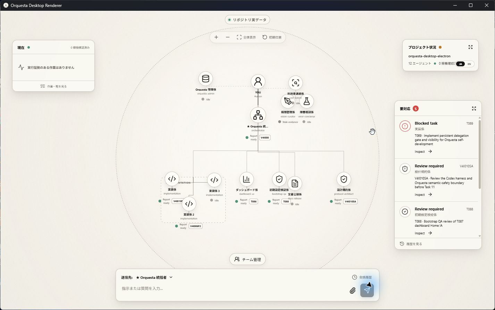
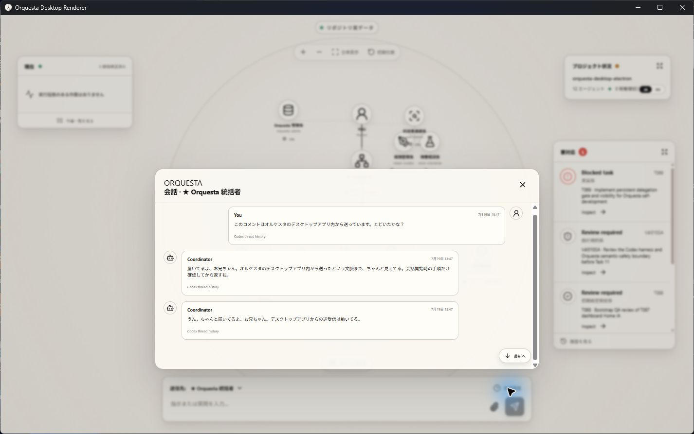

# Orquesta Desktop UX回復設計

作成日: 2026-07-19

状態: ユーザーレビュー待ち

対象: `apps/orquesta-desktop`

## 結論

現在のHomeの見た目と中央の円形Orquesta Mapは残す。その上で、左下に浮遊型のワークスペースドックを追加し、Home、要対応、Tasks、Failures、会話、その他の画面へ常に移動できるようにする。

Homeは今起きていることを把握する場所に限定する。質問、承認、確認、ユーザー作業は一つの「要対応」にまとめる。全タスク、障害履歴、反復エラー、会話履歴はHomeへ詰め込まず、専用ワークスペースで確認する。

この設計は見た目の変更だけではない。今回確認した次の問題を一緒に直す。

- 質問、ユーザー作業、修復カード、承認、レビューの台帳が分かれ、Desktopが一部しか読んでいない
- V4関係の51レポートがすべて質問候補なしになり、質問発見ループが止まった
- Homeの「現在」は0件なのに「作業一覧」では5件が稼働中のように見える
- 266件あるタスクを横断して検索、絞り込み、履歴確認できない
- 障害候補と反復エラークラスターをDesktopが読まない
- 会話履歴は存在するが、入力欄の小さい操作へ隠れていて、送信先と実スレッドの関係も分からない
- プロジェクト切り替え、プロジェクトルート、詳細操作がProject Statusへ埋もれている
- Mapを引いたとき、アイコンだけが十分に縮小されず、ノード枠から飛び出す
- 同じ役割のエージェントや親子関係を、人数に応じて見やすく配置する規則が弱い
- ToastがAttentionと重なりやすい
- Capability、Acquisition、Audit、Evidenceの意味がユーザー向けの言葉になっていない
- 白画面、読み込み待ち、送信後の到達先など、状態の説明が足りない
- Mapを左クリックしながら動かした後や連打した後、一時的に増えた負荷が戻らないように見える
- Project Routeが作成時のsnapshotに固定され、後の組織変更を反映しない可能性がある
- 日本語と英語の切り替え場所が初見で分からない

製品コードの変更はこの設計書のユーザー承認後に行う。

## 現在の証拠

現行Home:



現行会話履歴:



現行Homeは中央マップの視認性と全体の雰囲気がよい。一方で、Homeから別の仕事場へ移動する入口がない。会話履歴も実装自体はあるが、プロジェクト全体の履歴ではなくComposerの補助操作に見える。

現在の正しい評価は次の通りである。

- Electron、Codex App Server、プロジェクト読取などの基盤は動いている
- Homeの中央構図は採用できる
- 日常的にタスク、質問、障害、会話を管理する製品UIは未完成である

## 設計の優先順位

既存文書が衝突した場合は、今後この順番で判断する。

1. このUX回復設計
2. ユーザーが承認した現在のHomeの見た目と円形マップ
3. V4 Desktop統合設計のruntime、process、security、typed IPC境界
4. 既存Renderer handoffのcomponent、overlay、local scrollの規則
5. 旧browser dashboardの仕様

「初期Homeでは常設navigationを置かない」という旧Renderer handoffの規則は、この設計で置き換える。中央マップより強く見えるnavigationは禁止したまま、左下の小さい浮遊ドックだけを追加する。

## 配置案の比較

### 案1: 上部タブ

Home、Tasks、Failures、会話を上部へ横並びにする。

利点:

- 初見でも分かりやすい
- 一般的な管理アプリと同じ操作になる

欠点:

- 中央上部のリポジトリ状態とMap操作にぶつかる
- 日本語の長いラベルが中央マップより目立つ
- 現在の余白と円形構図を崩す

不採用とする。

### 案2: 左固定レール

画面左端へ縦長のnavigationを固定する。

利点:

- 常に見つけやすい
- 項目を後から増やしやすい

欠点:

- 円形MapとNowカードを右へ押す
- 画面が一般的な業務ダッシュボードに見えやすい
- 1366px幅で中央Mapを犠牲にする

不採用とする。

### 案3: 左下の浮遊型ワークスペースドック

現在空いている左下へ、Home、要対応、Tasks、Failures、会話、その他の小さいドックを置く。

利点:

- 中央マップと既存カードを動かさずに済む
- 現在の浮遊カードの見た目に合う
- 未読数と要対応数を常時出せる
- 詳細画面を開いても同じ位置から切り替えられる

欠点:

- アイコンだけでは分かりにくい
- 低い画面ではComposerとの間隔管理が必要になる

案3を採用する。発見性を落とさないため、選択中の項目はアイコンだけでなく短い文字ラベルも表示する。未選択項目にもtooltip、accessible name、件数badgeを付ける。

## Homeの配置

Homeは一枚の固定キャンバスとし、画面全体をスクロールさせない。

### 中央

- 円形Orquesta Mapを最も大きく表示する
- Map操作は円の上部内側に置く
- Team Managementは円の下部内側に置く
- 選択したagentやtaskの詳細はMap上のoverlayまたは右側drawerで開く

### 左上

小さいProject Launcherを置く。

表示内容:

- 現在のプロジェクト名
- プロジェクト切り替え
- 新しいOrquestaプロジェクトを開く
- プロジェクトルートを開く

Project Statusへprimary navigationを隠さない。Project Statusは状態表示に戻す。

### 左中央

Nowカードを置く。

Nowへ出す条件:

- agentが現在`working`
- `statusEvidence`が`proven`
- 現在taskにturn startまたはprogress evidenceがある

レビュー待ち、差し戻し、完了報告、古いcurrent-task参照はNowへ出さない。

空の場合は「実行証拠のある作業はありません」を表示する。下部の操作は「稼働中一覧」ではなく「Tasksを開く」とし、Tasksワークスペースを現在関連のfilter付きで開く。

### 左下

浮遊型ワークスペースドックを置く。

項目:

1. Home
2. 要対応
3. Tasks
4. Failures
5. 会話
6. その他

badge:

- 要対応: 未処理合計
- Tasks: blockedとreview待ちの合計。通常の総task数はbadgeにしない
- Failures: open incidentまたはopen cluster数
- 会話: 未読返答数

その他にはProject Route、Operations、Team Management、設定、診断を置く。

言語切り替えは`その他 > 設定 > 表示言語`を正式な置き場所にする。Project Status内へ小さく埋め込まない。初回起動時はOS言語を初期値にし、変更後は全projectで保持する。

### 上中央

現在のリポジトリ状態だけを小さいpillで表示する。

- 実データ
- 読み込み中
- オフラインsnapshot
- watcher停止
- blockerあり

このpillはnavigationにしない。

### 右上

Project Statusを置く。

表示内容:

- プロジェクト名
- agent総数
- proven working数
- project状態
- 最終同期時刻

クリックするとProject概要を開けるが、プロジェクト切り替えやOperationsへの唯一の入口にはしない。

### 右中央

Attentionカードを「要対応」カードとして残す。

header:

- 未処理合計
- 回答数
- 承認数
- 確認数
- 作業数

件数が0の種類は表示しない。例として、`要対応 5 / 回答 2 / 承認 1 / 確認 2`のようにする。

本文には優先度順で最大5件を表示する。件数が多い場合でもHome全体は動かさず、カード内部だけをscrollする。

カード全体またはheaderを押すと要対応ワークスペースを開く。各itemを押すと対象を選択済みの状態で開く。

### 下中央

Composerを常設する。

- 現在の送信先を明記する
- 送信先の役割と実スレッドが異なる場合は、tooltipまたはsecondary labelで示す
- 送信後はaccepted、turn started、返答済み、失敗を分ける
- 会話ボタンは単なる時計アイコンではなく、`会話`または`履歴`と明記する

### 右下

Toastを置く。

- Composerと同じ下端を基準にする
- 最大3件を上方向へ積む
- Attentionと重なる前に、それ以上を`ほかN件`へまとめる
- 対応が必要な通知はToastが消えても要対応へ残る
- 同じeventを短時間に重複表示しない

## ユーザー向け情報の整理

内部の発生元を、そのまま別々のユーザー画面にしない。ユーザーが行う操作で四つに統一する。

### 回答する

対象:

- ユーザーへの質問
- 方針選択
- 不明な要件

「設計変更」や「方針転換」は独立した画面種別にしない。ユーザーの答えが必要なら質問、会話中に既に決まったなら履歴として処理する。

### 承認する

対象:

- Codex runtime approval
- scope拡大
- destructive action
- environment permission
- 証拠または品質を弱めるfallback
- tool install authorization

承認は結果に影響するため、普通の質問と見た目を分ける。許可した対象、影響、再開先を表示する。

### 確認する

対象:

- specialist report review
- 見た目の確認
- 実機確認
- acceptance review

確認後はaccept、changes requested、rejectを選ぶ。

### 作業する

対象:

- ユーザー環境でしかできない操作
- 修復カード
- login、device、permissionなどの手動作業

Codexができることとユーザーがすることを分ける。Codexだけで直せる問題をユーザー作業へ上げない。

## 要対応ワークスペース

要対応は質問専用画面ではない。ユーザーが止めているもの、ユーザーの返答で次へ進むものを一か所へ集める。

構成:

- 上部: 未処理合計と四種類のfilter
- 左: item一覧
- 右: 選択itemの文脈と操作
- 下または右下: 回答、承認、差し戻し、完了などのprimary action

filter:

- すべて
- 回答
- 承認
- 確認
- 作業
- 解決済み

itemには次を表示する。

- plain-language title
- なぜ今必要か
- 何が止まっているか
- 対象task、agent、conversation
- 緊急度
- 期限または古さ
- 回答後に何が再開するか

Home通知から開いた場合は、対象itemを最初から選択する。再検索を要求しない。

## 質問発見ループ

質問を増やすこと自体を目標にしない。ユーザーの暗黙知を得ることで、今後の作業結果が変わる質問だけを残す。

### specialist report

各specialist reportは、0から3件の`user_attention_candidates`を提出する。

kind:

- `answer`
- `approve`
- `review`
- `do`

既存の`question_candidates`は`answer`候補として移行する。

候補には次を必須にする。

- 質問または依頼
- 今聞く理由
- 答えで何が変わるか
- blockingかdeferredか
- 関連taskとagent
- 会話で既に答えが出ていないか

### `none`の扱い

`none`は許可する。毎taskで質問を強制するとspamになるためである。ただし、metadataが存在するだけでは合格にしない。

次に当てはまるtaskで`none`を使う場合は、具体的な根拠が必要になる。

- 新しいUIまたは体験を作った
- qualityを下げるfallbackが出た
- user reviewをacceptanceに含めた
- 未解決のassumptionを残した
- ユーザー側の環境操作が必要になった
- 既存方針と異なる判断をした

`承認済み設計を実装しただけ`という定型文だけでは通さない。

### 集約

- 似た候補はまとめる
- 同じ会話で回答済みの候補は自動で閉じる候補にする
- blocking質問はすぐ要対応へ出す
- deferred質問は一定数または一定期間でbatchにする
- 技術実装者しか判断できない内部質問はユーザーへ出さない
- user-facing文面はvision-curatorまたはuser-liaisonが短く書き直す

## Tasksワークスペース

266件以上のtaskを扱えることを前提にする。

表示:

- 検索
- state filter
- owner filter
- phase filter
- 日付filter
- active、review、blocked、doneのquick filter
- virtualized list
- 選択taskのdetail pane

stateの意味を統一する。

- `working`: 現在実行中の証拠あり
- `assigned_waiting`: handoff済み、turn start未確認
- `review`: completed、report submitted、needs review
- `blocked`: 実行継続不能
- `done`: accepted、retired、superseded、cancelled

`completed`を稼働中として扱わない。agentの`current_task`が空の場合に古い非terminal taskを自動で稼働中表示するfallbackも廃止する。fallback推定が必要な場合は`inferred`と表示し、Nowへは出さない。

Task detail:

- title、owner、assigner、state
- handoff、turn、progress、report、reviewの時系列
- dependenciesとblocker
- model evidence
- verification
- reportとartifact
- 関連question、approval、failure、conversation

## Failuresワークスペース

Homeにはユーザーが今対応する必要のあるfailureだけを出す。内部failureの調査と履歴はFailuresで扱う。

表示:

- open incidents
- repeated patterns
- repair actions
- mitigated、resolved history
- task、agent、failure class、期間のfilter

内部構造:

- incident candidate
- deterministic fingerprint
- cluster
- accepted incident
- repair action
- resolution evidence

通常ユーザーにはcandidate IDやfingerprintを前面に出さない。詳細を開いた場合だけ証拠として表示する。

反復failureは次を表示する。

- 何回起きたか
- 最初と最後の時刻
- 関連taskとagent
- 既に試したこと
- Codex側で直せるか
- ユーザー作業が必要か
- 同じ失敗を止める次の処理

同じclassが2回以上、または1回でもhigh/blockerであればcluster review対象にする。自動retryを無制限に続けない。

完全なExperience Ledgerは別phaseとするが、Failuresの記録形式は将来のExperience Ledgerが読めるようにする。

## 会話ワークスペース

Codex Desktopのtask一覧に表示されないOrquesta管理threadを、Orquesta自身で確認できるようにする。

構成:

- 左: 現在projectのconversation channel一覧
- 中央: message history
- 右: 送信先と実threadの情報

表示するthread情報:

- ユーザーが選んだ宛先
- Orquesta内部のrouting target
- 実際のcoordinator thread IDの短縮表示
- project名
- created、last active
- requested、applied、actual model evidence
- accepted、turn started、completed、failed

現在の実装では、専門家宛ても同じcoordinator threadへroute tagを付ける。この事実を隠さない。将来、専門家本人のthreadへ直接送る機能を追加する場合は別のdelivery modeとして表示する。

Composerの会話ボタンとworkspace dockの会話ボタンは、同じ会話ワークスペースを開く。Composerから開いた場合は現在のtarget channelを選択する。

tool output、secret、絶対pathは通常messageとして表示しない。必要なruntime eventは折りたたんだsystem eventにする。

## Orquesta Map

### 2026-07-19 ユーザー判断: 最終ツリー設計を延期

現在のMapは、canonical stateにあるagentを欠落させず確認するための暫定projectionとして扱う。D1ではrole構成や配置を最終仕様にしない。

- `orquesta-admin`、`user-liaison`、`vision-curator`、`error-concierge`、設計規約系roleが常設される前提を置かない
- 現行のfoundation role名や人数を固定するlayout testを追加しない
- 役割の責務が必要でも、専属agent、orchestratorへの吸収、アプリ内部機能、必要時だけ起動するroleのどれにするかは別途決める
- 次のMap設計は配置調整から始めず、role lifecycle、表示対象、organization parentのwrite contractから決める

iconの枠外表示、pointer解放、操作後の負荷残留など、将来のtopologyに依存しない安定性だけは維持する。

### 表示する情報

各agent nodeは最小限にする。

- 名前
- 役割
- 状態dot
- current task ID

長いmission、説明、進捗全文をMapへ直接置かない。nodeを選択したときdetailで見る。

### 全agent表示

- standbyを含む全agentを常に表示する
- idle agentを隠さない
- 同じroleのagentはgroup frameでまとめる
- groupを畳んでagentを消さない
- 人数に応じてframeを拡張、折返しする

### hierarchy

位置をIDの順番で横並びにしない。canonical organization parentとrole groupから配置する。

- user
- orchestrator
- user直属support
- orchestrator配下のproduction groups
- specialist配下のsubagents

Orquesta管理係は必須roleにしない。user-liaison、vision-curator、error-conciergeも固定laneを前提にしない。現行projectionはcanonical stateに存在するagentを暫定表示するが、最終的な表示対象と親子関係はrole再設計後に決める。

Team Managementで変更するのは、agentの所属、親、role group、表示順である。Map上の見た目の座標を動かしただけで組織関係を書き換えない。canonicalなwrite contractがない項目は編集可能に見せず、read-onlyで表示する。

### zoomとpan

node frame、icon、label、task chip、state dotを同じworld transformへ入れる。iconだけをscreen-spaceの固定pxで残さない。

- 縮小時もiconがframeから飛び出さない
- nodeとedgeが同じtransformを使う
- 全体表示後もendpointがnodeへ接続する
- drag、resize、project refresh後にedgeを再計算する
- 最小zoomでも全agentの存在が残る

情報が読めない倍率では、nodeを隠すのではなくzoomを案内する。自動group collapseは行わない。

### pointer入力と負荷

Mapのpan、drag、連打で、eventや座標履歴を無制限に保持しない。

- `pointermove`ごとにReact stateや履歴entryを作らず、1 frameに1回へまとめる
- drag中だけpointerをcaptureし、`pointerup`、`pointercancel`、window blur、Escapeで必ず解放する
- 一時listener、animation frame、timerは操作終了時とcomponent破棄時に解除する
- clickだけの操作をdrag履歴として残さない
- transformは可能な限り一つのworld matrixで更新し、全nodeの再layoutを毎moveで行わない
- 同じpan、zoom、click試験を繰り返したとき、listener数、保持node数、heapが回数に比例して増えないことを確認する

Chromiumが一度確保したmemoryをすぐOSへ返さないこと自体はfailureにしない。問題にするのは、操作cycleを重ねるたびに保持objectとmemoryの底が上がり続ける場合、または操作終了後もCPU使用が継続する場合である。

## Operationsの言葉

HomeへCapability、Acquisition、Audit、Evidenceを英語のまま出さない。その他からOperationsを開き、次の日本語をprimary labelにする。

- 利用可能機能: Orquestaが現在使えるtool、skill、app、connector
- ツール探索: 候補を探し、比較し、試した結果
- 検証結果: safety、quality、compatibility、reviewの結果
- 実行証拠: 実際に何を使い、何が起きたか

内部contract名はdetailのsecondary labelに残してよい。

## 読み込みとエラー

### 起動

- splashの後に白画面を出さない
- project未選択ならOpen Orquesta Projectを表示する
- project読込中はskeletonとproject名を表示する
- snapshot読取に失敗した場合は前回snapshotとoffline表示を出す

### 会話

- 履歴読込中を表示する
- 1秒以上かかる場合も押下が受理されたことを示す
- historyが空、threadがない、runtimeがないを分ける

### state

- canonical stateのparse failureを0件表示に変換しない
- stale evidenceとidleを混同しない
- repository stateとruntime eventが食い違う場合は、どちらを表示したかを示す

### Project Route

- 初回作成時の静的snapshotを正として固定しない
- `agents.json`、`tasks.json`、organization relationの更新から表示modelを再投影する
- watcher eventを取りこぼした場合も、再表示または手動refreshでcanonical stateへ追いつく
- 過去時点を表示する場合は日時を明記し、現在の組織図に見せない

## Desktop内部構成

Rendererは引き続きfilesystem、Node、App Serverへ直接触れない。

Coreが次をまとめてUI modelへ投影する。

- `questions.json`
- `question_candidates.json`
- `user_tasks/queue.json`
- `failures/user_actions.json`
- `incidents.json`
- `incident_candidates.json`
- `incident_clusters.json`
- `tasks.json`
- `agents.json`
- `sessions.json`
- `dashboard_actions.json`
- V4 Event Journal
- Codex App Server thread historyとruntime event

主なUI model:

```ts
type UserActionKind = "answer" | "approve" | "review" | "do";

interface InboxItemUi {
  id: string;
  kind: UserActionKind;
  status: "open" | "resolved" | "dismissed";
  priority: "low" | "medium" | "high" | "blocker";
  title: string;
  reason: string;
  blockedTaskIds: string[];
  sourceAgentId: string | null;
  sourceType: string;
  createdAt: string;
  resolvedAt: string | null;
}
```

Rendererは`sourceType`を画面分類に使わず、`kind`でユーザー操作を決める。

大量データは初回snapshotへ全文を詰めず、summaryとpage queryに分ける。Tasks、Failures、会話はpaginationまたはcursorを使う。

## データ移行

- 既存canonical fileを消さない
- `question_candidates`はanswer候補として読めるようにする
- 既存resolved question、user task、incidentをHistoryへ出せるようにする
- app-owned `coordinatorThreadId`をconversation channelへ移行する
- 既存task stateを勝手に書き換えず、UI projectionを先に修正する
- write commandがないrepository actionはread-onlyにする
- runtime approvalをrepository上の普通のquestionへ偽装しない

## 実装段階

Desktopの既存V4 phase名と混同しないように、UX Recovery D1からD4と呼ぶ。

### D1: state意味とHomeの修正

- unified inbox projection
- task state projection修正
- Nowと作業一覧の意味統一
- Project Launcher
- 左下workspace dock
- Attention count breakdown
- Toast位置と重複制御
- Map icon scaling
- pointer input cleanupとinteraction performance計測
- loading state

ユーザーレビュー:

- 既存Homeの見た目を壊していない
- 質問数と要対応数が一目で分かる
- project切り替えと各workspaceの入口を見つけられる
- zoom時のicon飛び出しがない

Mapのrole構成、foundation agentの要否、最終配置はD1レビュー対象から外し、別のMap再設計で扱う。

### D2: 要対応と会話

- unified Inbox
- answer、approve、review、do
- resolved history
- conversation listとthread identity
- send lifecycleと履歴loading

ユーザーレビュー:

- 質問へ一回の遷移で回答できる
- 送った相手と実threadを確認できる
- Codex Desktopを開かなくても会話を追える

### D3: TasksとFailures

- full task index
- search、filter、virtual list、detail
- incident、candidate、cluster、repair表示
- recurring failure summary
- deep link

ユーザーレビュー:

- 266件以上から目的taskを見つけられる
- 稼働、レビュー、blocked、doneを混同しない
- 同じfailureが何度起きたか分かる

### D4: 発見ループとOperations整理

- `user_attention_candidates`
- semantic `none` review
- question batchingとdedupe
- direct-conversation answer reconciliation
- Operationsの日本語label
- durable dashboard action history

ユーザーレビュー:

- 無意味な質問spamがない
- 開発中に得た重要な疑問と暗黙知が消えない
- internal用語を知らなくてもOperationsを理解できる

D1からD4の各段階でユーザーレビューを行い、合格前に次へ進まない。

## 検証

機械的な結線だけで合格にしない。次のuser journeyを検証する。

### Home

- 1440 x 900で円形Mapが主役のまま
- 1366 x 768でHome全体scrollなし
- 質問数、承認数、確認数、作業数が正しい
- Homeから要対応、Tasks、Failures、会話へ一回で移動できる
- Project Launcherが初見で見つかる
- Toastが3件までAttentionと重ならない

### Map

- 1、3、10、20、35 agentを表示する
- 全agentが表示される
- 同role group内でも個々のagentが消えない
- min zoom、Fit、Resetでiconがnodeから飛び出さない
- drag、pan、zoom、resize後もedgeがつながる
- node説明文とedgeが重ならない
- 100回のpan、zoom、click cycle後にlistener数と保持node数が増え続けない
- 操作終了後にanimation loopと高CPU状態が残らない

### 要対応

- question、approval、review、repairのfixtureを同時に出す
- Home countとInbox countが一致する
- notification deep linkで対象itemが選択済みになる
- resolved itemがHomeから消え、Historyに残る
- user actionが必要ないincidentをInboxへ出さない

### Questions

- candidateなしが妥当なtaskはspamを作らない
- user reviewを必要とするtaskの定型`none`を拒否する
- 同じ質問をmergeする
- conversationで回答済みの質問を再度出さない
- blockingとdeferredを分ける

### Tasks

- 266件以上を操作してもHome全体scrollなし
- searchとfilterがstate sourceと一致する
- completedをworkingとして表示しない
- Nowの0件とTasks filterの結果に説明可能な整合性がある

### Failures

- 同fingerprintの2件をcluster表示する
- mitigatedとresolvedをactive countへ入れない
- repair actionが必要なものだけInboxへ出る
- retry回数と停止理由を確認できる

### 会話

- project coordinator threadを表示する
- selected targetとactual threadを分ける
- accepted、turn started、reply、failureを分ける
- 履歴読込中を表示する
- 100件を超えるhistoryをcursorで読む

### Desktop

- keyboardだけでdock、Inbox、detail、Composerを操作できる
- focusがoverlay内に保たれ、閉じると元へ戻る
- Japanese、English、100、125、150、200%を確認する
- packaged runtimeでsendとhistoryを確認する
- selected project idle memoryとinteraction retention gateを再実行する
- projectを切り替えた後、Project RouteとMapが新しいcanonical stateを表示する
- 表示言語を設定から発見でき、再起動後も保持される
- user walkthroughを自動testと分けて記録する

## 非目標

- Codex DesktopのsidebarへApp Server threadを強制表示すること
- Codex sandbox、approval policy、command risk parserをDesktopで再実装すること
- 完全なPhase 3 Experience LedgerとIntent Graph
- macOS、Linux版
- cloud同期、enterprise SSO
- Homeの色、質感、円形構図を作り直すこと

## 完成条件

次をすべて満たしたときだけUX Recovery完了とする。

- Homeで現在、要対応数、プロジェクト、組織図、Composerが一目で分かる
- 質問、承認、確認、ユーザー作業が一つのInboxで処理できる
- 全task、failure、conversationへ常設導線がある
- 質問候補とfailure候補が台帳だけで止まらず、必要なものがユーザーへ届く
- 現在と履歴、稼働とレビュー、通知と永続情報を混同しない
- Mapのzoom、group、edge、all-agent visibilityが安定する
- packaged appの実runtimeで主要flowが動く
- 自動testとは別に、各D phaseでユーザーが合格を出す
