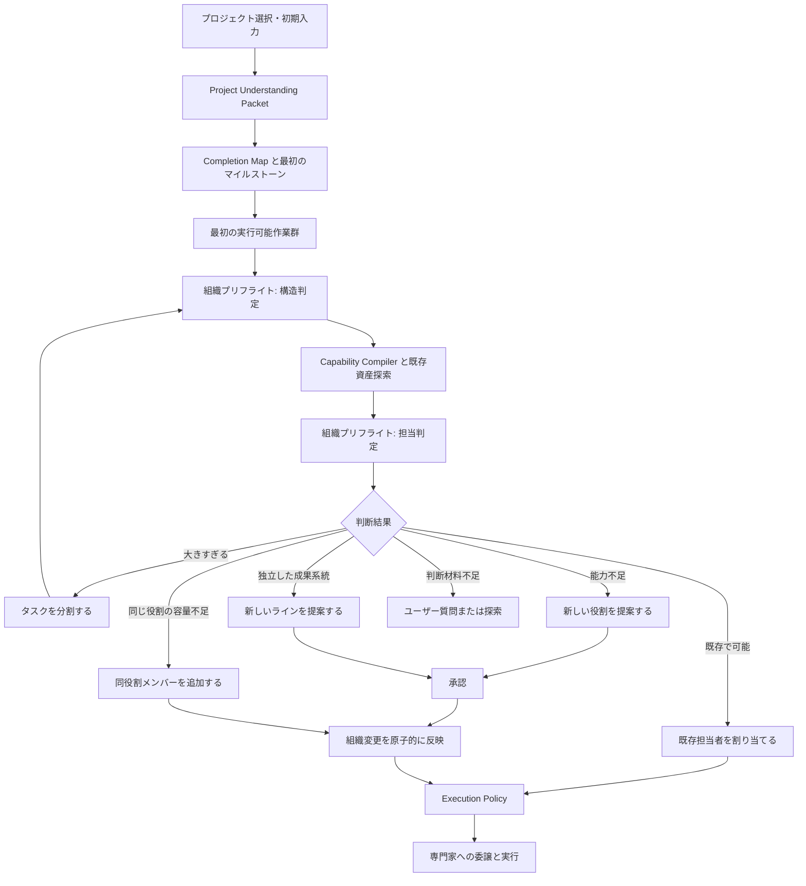

# Orquesta 適応型組織・初回セットアップ統合設計

作成日: 2026-07-20
状態: ユーザーレビュー待ち
対象: Orquesta Core、初回セットアップ、タスク実行前判断、Desktop の組織表示

## この設計の目的

現在の Orquesta には、プロジェクト開始時に固定の専門家候補を並べる仕組みはある。しかし、プロジェクトの内容から本当に必要な役割を判断する仕組みと、運用途中で組織を組み替える仕組みは、まだ一つの機構として成立していない。

この設計では、次の二つを同じ判断エンジンで扱う。

- 初回セットアップで、最初の実行可能な作業群に必要な専門家を配置する
- 各タスクの開始前に、現在の専門家だけで安全かつ効率よく実行できるかを判断する

判断結果は、既存担当者の再利用、タスク分割、同じ役割の人員追加、新しい役割の追加、新しい生産ラインの提案のいずれかになる。

ここで重要なのは、人数を増やすこと自体を目的にしないことである。最初の専門家が2体や3体でも、その時点の作業に十分なら正常とする。将来必要になる役割は候補として残し、実際の作業が発生した時点で再評価する。

## 現行実装で確認した問題

この設計は会話だけから作ったものではなく、現在の実装で次を確認した上で作成している。

- `orquesta/dashboard-server.js` の `buildSpecialistCandidates()` は、`implementation-001`、`dashboard-ux-001`、`bootstrap-qa-001`、`protocol-architect-001`、`docs-release-001` を固定候補として返す
- `generateSpecialistPlan()` は Completion Map を読むが、プロジェクト内容から役割を組み立てる用途には使っていない
- `startProduction()` は task と handoff 状態を準備するが、専門家の session、thread、Membership まで一貫して作らない
- New Thread Gate は規約文として存在するが、能力不足やライン分割を判定する実行機構ではない
- Capability Compiler は code、tool、knowledge、asset などの必要能力を扱えるが、役割、個体、チーム、ラインへ接続されていない
- capacity gate は渡された既存候補から選ぶだけで、新しい専門家やラインを提案できない
- Desktop の組織表示は、IDと役割名の正規表現、タスク委譲関係から組織を推測する部分が残っている
- 現在の state には、統括者、管理係に加え、旧3支援係と固定候補由来の専門家が残っている

このため、画面だけを変更しても問題は解決しない。Core の正式な組織契約、初回セットアップ、タスク実行前判断、Desktop の読み取りを同じ段階で接続する必要がある。

### 旧仕様から新仕様への対応

| 現在 | 変更後 |
| --- | --- |
| 固定5候補から初期専門家を選ぶ | 最初の実行可能作業群から必要役割と個体数を決める |
| 旧3支援係が別々に存在する | 利用者支援係へ統合し、旧個体は履歴付きで引退する |
| Completion Map と専門家生成が分離している | Completion Map を組織プリフライトの入力にする |
| 能力解決とエージェント配置が分離している | AgentCapabilityProfile を通して接続する |
| タスクが大きいまま実行ポリシーへ進む | 構造判定と分割後に実行ポリシーへ進む |
| 組織変更をユーザーが指示することが多い | Orquesta が不足を検出し、権限内で実行または提案する |
| IDや表示名から組織を推測する | role、team、line、membership を正式データにする |
| Production Start が handoff 準備で止まる | provisioning と thread handoff の成否まで追跡する |

## 既存設計との関係

この文書は、次の既存設計を置き換えるものではなく、組織生成と組織変更に関する部分を更新する。

- `docs/design/2026-07-20-orquesta-initial-setup-overhaul.md`
  - 画面遷移、セットアップ演出、入力体験は引き継ぐ
  - 固定専門家候補と初期組織生成の部分は、この文書を正とする
- `docs/superpowers/specs/2026-07-15-orquesta-v4-design.md`
  - Capability Compiler、既存資産探索、証拠、可逆的な学習という方針を引き継ぐ
- Phase 1.5 の実行ポリシー
  - fast、standard、critical の判定と同一タスク内のレビューサイクルは引き継ぐ
  - ただし、組織プリフライトは実行ポリシーより前に置く

次の旧仕様は、この設計の実装完了後に廃止する。

- 初回セットアップで5種類の専門家候補を固定生成する処理
- `user-liaison`、`vision-curator`、`error-concierge` を新規プロジェクトで別々に作る処理
- `bootstrap-qa-001` をすべてのプロジェクトに必要な専門家として扱う処理
- エージェントIDや表示名の正規表現だけでチームを推測する処理
- タスクの委譲元を組織上の上司として表示する処理

## 今回やらないこと

- 組織図の最終的な見た目の作り直し
- 稼働中エージェントの接続線アニメーション
- 人数だけを基準にしたチームやリーダーの自動生成
- ラインをまたいだ一時的な応援配置
- 過去のエージェント、タスク、会話履歴の削除
- 専門家の最低人数を固定すること
- 毎タスクで重いレビューを繰り返すこと

## 設計の原則

### 役割と人を分ける

「実装係」という役割と、「実装係として働く個々のエージェント」は別のデータにする。

実装係が3体いる場合、役割定義は一つだけで、エージェントは3体存在する。

```text
role_id: implementation
  ├─ implementation-001
  ├─ implementation-002
  └─ implementation-003
```

`implementation-001` と `implementation-002` を別の役割として作ってはいけない。番号は個体識別のためだけに使い、意味の真実は `role_id`、`team_id`、`line_id` に置く。

### 組織とタスク委譲を分ける

誰からタスクを受け取ったかと、組織上どこに所属するかは同じではない。

- 組織関係: 所属、責任者、支援、レビュー
- 実行関係: 今回のタスクの依頼元、担当者、レビュー担当

Desktop の線も、この二種類を混ぜない。

### 組織変更は作業構造から判断する

人数が3人を超えたらリーダー、8人を超えたらライン分割、という決め方はしない。

判断材料は、成果物、完了条件、作業境界、コンテキスト、ファイル所有、依存関係、継続性である。

### 初回と運用中で同じ判断機構を使う

初回セットアップだけ別の固定ロジックにすると、開始時と運用時で組織の考え方がずれる。そのため、初回セットアップも Completion Map と最初のマイルストーンを入力にして、通常と同じ組織プリフライトを実行する。

## 全体の流れ



## 初回セットアップ

### 起動経路

入口は二つある。

1. Codex に GitHub から Orquesta をインストールさせた後、自動起動する
2. ユーザーが手動でアプリをインストールし、自分でプロジェクトを選ぶ

どちらもプロジェクト選択後は同じセットアップ処理に合流する。Codex から起動された場合は、Codex が作業中のフォルダーを候補として表示するが、確定前にユーザーへ確認する。

### 初期入力

ユーザーに見せる入力は次の三つに絞る。

- プロジェクトフォルダー
- プロジェクト名
- プロジェクト説明

プロジェクト名と説明は、README、manifest、既存の設計書、引き継ぎ文書、フォルダー名から下書きを作る。ユーザーは修正できる。

補完質問は0件から3件までとし、プロジェクトの方向を決められない場合だけ出す。すべて任意回答にし、飛ばせるようにする。固定の必須質問とオプションパック選択は廃止する。

### セットアップ開始時の権限

ユーザーが「セットアップ開始」を押すことで、次の処理を一括で許可したものと扱う。

- 基盤3エージェントの登録
- 初期 Completion Map の作成
- 最初の実行可能作業群に必要な専門家の登録
- 初期チームと初期ラインの作成
- 各専門家の長期スレッド作成

初期組織が存在しないため、セットアップ中は役割やラインごとの追加承認を挟まない。完了画面には、なぜその役割とラインを作ったかを表示し、ユーザーが後から修正できるようにする。

### 必ず登録する基盤3エージェント

新規プロジェクトで必ず登録するのは次の3体だけである。

#### 統括者

- プロジェクト全体の責任者
- Completion Map と作業構造を把握する
- 組織プリフライトの最終提案をまとめる
- ライン間の依存関係と統合作業を担当する

#### 利用者支援係

旧 `user-liaison`、`vision-curator`、`error-concierge` を統合する。

- ユーザーへの質問を整理する
- ユーザー判断、確認、手作業を一つの入口にまとめる
- エラーが反復したときにユーザーの暗黙知を取り込む
- 構想の曖昧さをユーザーに確認する

通常は待機し、質問候補、反復エラー、ユーザータスクが発生したときだけ起動する。

#### 管理係

- セットアップ中の状態確認
- Orquesta 内のタスクや用語に関するユーザー向け説明
- 状態ファイルの整合性診断
- Desktop からの軽い問い合わせ対応

セットアップ中は稼働し、完了後は待機する。独立した品質レビュー担当ではない。

### 基盤3体と専門家の違い

基盤3体は、どのプロジェクトでも必要な運用役である。実装係、設計係、調査係、文書係、テスト係などは、プロジェクトの最初の作業から必要性を判断して作る専門家である。

`bootstrap-qa-001` は基盤エージェントではない。セットアップ検証が独立した継続作業として必要なプロジェクトだけで、通常の専門家候補として選ばれる。

### 六つのセットアップ段階

#### Phase 1: 環境確認

- プロジェクトフォルダーを実在確認する
- 読み書き可能範囲を確認する
- Git、Node.js、Codex App Server など、実際に必要な実行環境だけ確認する
- 既存の `.orquesta` がある場合は新規作成ではなく移行判定へ進む

ここでは環境を修復しない。問題があれば、修復可能、ユーザー判断が必要、継続不能に分ける。

#### Phase 2: プロジェクト理解

一度の限定された読み取りで Project Understanding Packet を作る。

優先して読むものは次の通りである。

- ユーザーが渡した説明と Codex の引き継ぎ
- README、manifest、package 定義
- 現在の設計書と作業引き継ぎ
- 主要なディレクトリ構造
- 既存の `.orquesta` 状態

リポジトリ全体を無制限に読まない。情報が足りなければ、必要な部分だけ追加探索する。

Project Understanding Packet には次を保存する。

- プロジェクトの目的
- 現在の段階
- 主要な成果物
- 技術スタック
- 既存資産
- 既知の制約
- ユーザーが重視する品質
- 不明点と、その確信度
- 読んだ証拠の一覧

#### Phase 3: 基盤構築

- 3つの基盤役割を役割台帳へ登録する
- 3体のエージェントを登録する
- 統括者を稼働状態にする
- 管理係をセットアップ稼働状態にする
- 利用者支援係を待機状態にする
- 基盤チームと組織関係を登録する

#### Phase 4: 初期計画

Project Understanding Packet から次を作る。

- Completion Map
- 最初のマイルストーン
- 最初の実行可能作業群
- 各作業に必要な能力
- 既存資産の探索候補
- 検証方法
- 判断できない情報

最初の実行可能作業群とは、依存関係が解けていて、現在すぐ開始できるタスクの集合である。将来の全工程に必要そうな人を先回りで全員作ることはしない。

#### Phase 5: 専門家形成

最初の実行可能作業群を組織プリフライトに通す。

- 必要な役割を正規化する
- 同じ役割を重複作成しない
- 並行作業が必要なら同じ役割の複数エージェントを作る
- 独立した成果系統があれば初期ラインを作る
- 専門家ごとに担当範囲と読んでよいコンテキストを決める
- 将来必要になりそうな役割は `candidate` として保存する

専門家の最低人数は設けない。最初の作業群に2体で足りるなら2体、5体必要なら5体作る。少人数の場合も、完了画面で「なぜ現在の人数で足りるか」と将来候補を表示する。

専門家構成は次の順番で決める。

1. 最初の実行可能作業群を、成果物、完了条件、所有範囲ごとに分ける
2. 各作業に必要な能力と検証方法を Capability Compiler で定義する
3. 既存コード、OSS、スキル、ツール、サービスで補える能力を取り除く
4. 残った責任を、同じ成果物、同じコンテキスト、同じ役割へまとめる
5. 役割台帳から同じ役割を再利用する
6. 同時実行でき、所有範囲が衝突しない作業の数から、必要な個体数を決める
7. 各個体に、開始時点で実行可能なタスクを少なくとも一つ割り当てる
8. まだ実行できない作業の役割は、個体を作らず将来候補へ残す

一つの操作だけを行う使い捨てエージェントは作らない。専門家を作るのは、担当範囲を継続して保持する価値がある場合、独立した検証責任がある場合、または今後も同じコンテキストを再利用する場合である。一回限りの能力は、まず既存資産、ツール、既存専門家の短い作業として解決する。

必要個体数は、単純なタスク件数では決めない。二つのタスクが同じファイルを変更するなら並列化せず、一人へ順番に割り当てる。逆に、異なる成果物と所有範囲を持ち、統合方法が明確なら、同じ役割の個体を複数作れる。

#### Phase 6: 稼働開始

- 初期タスクと専門家を接続する
- Desktop が新しい組織状態を読めることを確認する
- スレッド作成の成否を確認する
- セットアップ結果を一度だけ統合検証する
- ホーム画面へ移る

専門家スレッドの作成に失敗した場合、その専門家を稼働中と表示しない。`provisioning_failed` として同じIDで再試行できるようにする。

## Project Understanding Packet

```json
{
  "schema_version": 1,
  "project_id": "orquesta",
  "goal": "Orquesta を適応型の開発オーケストレーターにする",
  "stage": "active-development",
  "deliverables": [
    {
      "deliverable_id": "desktop-app",
      "name": "Windows desktop application",
      "completion_evidence": ["packaged app", "user UAT"]
    }
  ],
  "stack": ["TypeScript", "Electron", "React"],
  "constraints": ["Windows first", "preserve user changes"],
  "existing_assets": [],
  "unknowns": [],
  "evidence": [
    {
      "path": "README.md",
      "content_hash": "sha256:...",
      "read_at": "2026-07-20T00:00:00Z"
    }
  ],
  "confidence": 0.82
}
```

Packet はプロジェクトの要約であり、すべての専門家へ丸ごと渡すコンテキストではない。統括者が全体を保持し、専門家には担当タスクに必要な部分だけを Context Compiler が渡す。

## 組織プリフライト

### 実行位置

非自明なタスクは、次の順番で処理する。組織プリフライトは一つの機構だが、タスク構造を判定する前半と、必要能力が分かった後に担当者を判定する後半に分ける。

1. Task Intent を正規化する
2. 組織プリフライト前半で、成果物、境界、ライン候補を判定する
3. 必要ならタスクを分割し、各子タスクを前半から再評価する
4. Capability Compiler で必要能力を定義する
5. Resolver で既存資産、OSS、ツール、サービス、既存エージェントを探索する
6. 組織プリフライト後半で、既存担当者の再利用または組織変更を判断する
7. Execution Policy で fast、standard、critical を決める
8. 専門家へ委譲する

一つの巨大タスクを先に critical と判定してから一人へ渡すのではなく、担当可能な大きさへ分けてから実行ポリシーを適用する。

能力不足が見つかっても、すぐに新しい専門家を作らない。既存コード、OSS、スキル、MCP、外部サービスで安全かつ安く補えるなら、それを先に候補化する。新しい役割や人員は、既存資産を使っても継続的な責任主体が不足する場合に選ぶ。

### 軽量判定と詳細判定

毎回重い分析を行わない。

#### Fast path

次のすべてを満たす場合は、既存担当者をそのまま使う。

- 必要能力が既知である
- 担当範囲内である
- ファイル所有が競合しない
- 既存担当者に容量がある
- 独立した成果物や新しいラインを生まない
- 類似タスクで反復失敗がない

入力タスク、組織リビジョン、能力プロファイルのハッシュが同じなら、前回の判定を再利用する。

#### Deep path の起動条件

次のどれかがある場合だけ詳細判定を行う。

- 必要能力を持つ担当者がいない
- 一つのタスクに複数の成果物や完了条件がある
- 複数のファイル所有範囲やコンテキスト境界をまたぐ
- 既存担当者に継続的な容量不足がある
- 一つのラインを止めずに別の成果系統を進める必要がある
- 同種タスクで時間超過や修正の反復が記録されている
- 誰が責任を持つべきか決められない
- 既存ツール、OSS、外部サービスの探索が先に必要である

### 判断材料

- 必要な能力
- 既存エージェントの検証済み能力
- 担当範囲とコンテキスト
- 現在のタスク負荷
- ファイル、成果物、意思決定の所有権
- タスクが一時的か継続的か
- 既存資産、OSS、ツール、サービスの利用可能性
- 受け入れ条件と検証方法
- 過去の類似タスクの失敗と修正履歴

技術的に実行できるだけでは十分ではない。適切な責任範囲、コンテキスト量、衝突の少なさ、コストまで含めて判断する。

### 担当可能性の判定順

組織プリフライト後半は、候補ごとに次の順で判定する。途中で不適格になった候補を、後段の条件で復活させない。

1. 必須能力を満たすか
2. タスクの成果物とコンテキストが担当範囲に入るか
3. ファイルや状態の所有権が衝突しないか
4. 現在のラインとタスクのラインが一致するか
5. 現在の容量で受けられるか
6. 受け入れ証拠を自分または別の正式なレビュー担当で作れるか

候補が0体なら、資産探索、タスク分割、同役割追加、新役割提案の順で検討する。候補が複数なら、コンテキスト再利用量、所有権の近さ、現在負荷、過去の成功証拠で選ぶ。説明できない総合点だけで選ばず、選択理由を reason code と証拠参照で残す。

### 判断結果

#### `reuse_agent`

既存の担当者が能力、範囲、容量を満たす場合に選ぶ。

#### `split_task`

タスクが一人へ渡すには大きすぎるか、異なる受け入れ条件を持つ場合に選ぶ。

#### `add_member`

必要な役割はすでに存在するが、継続的な並列作業に対して容量が足りない場合に、同じ役割の新しい個体を同じラインへ追加する。

#### `add_role`

現在のライン内で新しい能力と責任範囲が継続的に必要な場合に、新しい役割を提案する。

#### `propose_line`

既存ラインとは独立して進行、停止、受け入れ、公開できる成果系統がある場合に、新しいラインを提案する。

#### `blocked_unknown`

判断材料が不足し、探索でも解消できない場合にユーザー質問を作る。

#### `user_capability`

認証、支払い、法的判断、外部サービス操作、主観的な最終承認など、ユーザー自身が担当すべき能力としてユーザータスクを作る。

### 判定記録

```json
{
  "decision_id": "orgdec-20260720-0001",
  "task_id": "T120",
  "organization_revision": 18,
  "input_hash": "sha256:...",
  "mode": "deep",
  "selected_action": "split_task",
  "reason_codes": [
    "MULTIPLE_ACCEPTANCE_ROOTS",
    "FILE_OWNERSHIP_BOUNDARY"
  ],
  "child_task_drafts": ["T120-A", "T120-B"],
  "approval_state": "not_required",
  "created_at": "2026-07-20T00:00:00Z"
}
```

## タスク分割

次のどれかがあれば分割候補にする。

- 独立した成果物や受け入れ条件が複数ある
- 所有するファイルや状態が分かれている
- 一部だけでも独立してユーザー確認できる
- 一人の専門家契約として境界を明確に書けない
- 並行しても同じファイルや状態を壊さない
- 設計、実装、検証で明確に異なる専門性が必要である
- 類似タスクで長時間化や修正反復が起きている

推定時間や推定トークンだけでは分割しない。AIの時間見積もりは不安定なため、成果物と境界を主な根拠にする。

分割後の子タスクには、親タスク、完了条件、所有範囲、必要能力、統合方法を必ず持たせる。

Phase 1.5 のレビューと修正は、製品タスクを分割して別の補助タスクを大量生成する仕組みではない。同じタスク内の実行サイクルとして維持する。

## 役割台帳

役割はプロジェクト内で正規化し、同じ意味の役割を重複作成しない。

保存先:

```text
.orquesta/state/roles.json
```

```json
{
  "schema_version": 1,
  "roles": [
    {
      "role_id": "implementation",
      "version": 1,
      "display_names": {
        "ja": "実装係",
        "en": "Implementation"
      },
      "aliases": ["coder", "developer", "実装担当"],
      "capability_ids": ["code.change", "code.test"],
      "default_contract_template": "specialist-implementation-v1",
      "lifecycle_state": "active"
    }
  ]
}
```

### 正規化ルール

- 新しい表示名をそのまま `role_id` にしない
- aliases と capability の重なりから既存役割を検索する
- 同じ役割と判断できる場合は既存 `role_id` を使う
- 新しい役割の作成は `add_role` として扱う
- 役割定義を変更するときは version を上げる
- 過去のエージェントが参照する旧versionは追跡できるようにする

## エージェント個体

既存の `agents.json` を拡張し、役割、組織、稼働状態を明示する。

```json
{
  "agent_id": "implementation-003",
  "role_id": "implementation",
  "role_version": 1,
  "thread_id": "...",
  "mission": "Desktop renderer の実装を担当する",
  "organization_scope": "line",
  "context_scope": ["apps/orquesta-desktop/src/renderer"],
  "lifecycle_state": "active",
  "operational_status": "working",
  "capability_evidence_refs": ["capev-001"],
  "created_by_decision_id": "orgdec-20260720-0001",
  "superseded_by": null
}
```

`lifecycle_state` と `operational_status` は分ける。

- lifecycle: `proposed`、`provisioning`、`active`、`retired`、`superseded`
- operational: `standby`、`working`、`blocked`、`reviewing`、`provisioning_failed`

引退したエージェントは削除しない。組織図で表示を切り替えられ、履歴から追跡できるようにする。

`organization_scope` は `project` または `line` とする。統括者、利用者支援係、管理係は project scope であり、特定の生産ラインへ所属しない。生産専門家は line scope とし、一つの稼働中ラインだけに所属する。

## 能力と専門家の接続

RoleDefinition の能力は、その役割に期待する能力である。実際にその個体へ任せられるかは、AgentCapabilityProfile で判断する。

```json
{
  "agent_id": "implementation-003",
  "capabilities": [
    {
      "capability_id": "code.change",
      "status": "verified",
      "evidence_refs": ["capev-001"],
      "scope": ["TypeScript", "Electron renderer"]
    }
  ],
  "availability": "available",
  "organization_revision": 18
}
```

Capability Resolver では、既存エージェントを `provider_type: agent` として候補化できるようにする。ただし、能力が一致しただけで自動委譲はしない。組織プリフライトが範囲、容量、所有権を確認した後に割り当てる。

## チームと所属

保存先:

```text
.orquesta/state/organization.json
```

```json
{
  "schema_version": 2,
  "revision": 18,
  "teams": [
    {
      "team_id": "desktop-implementation",
      "line_id": "desktop-line",
      "display_name": "Desktop 実装チーム",
      "purpose": "Desktop renderer と Electron shell を実装する",
      "lifecycle_state": "active"
    }
  ],
  "memberships": [
    {
      "membership_id": "membership-001",
      "agent_id": "implementation-003",
      "team_id": "desktop-implementation",
      "position": "member",
      "ordinal": 3,
      "active_from": "2026-07-20T00:00:00Z",
      "active_to": null
    }
  ],
  "relationships": [
    {
      "relationship_id": "rel-001",
      "type": "reports_to",
      "from_agent_id": "implementation-003",
      "to_agent_id": "orchestrator"
    }
  ],
  "lines": []
}
```

メンバー一覧を Team と Membership の両方へ重複保存しない。Team の所属者は Membership から導出する。

Project scope の基盤チームは `line_id: null` を持てる。生産専門家のチームは必ず実在する `line_id` を持つ。

### 組織の不変条件

- `agent_id` は一意である
- `role_id`、`team_id`、`line_id` の参照先が存在する
- 一つのチームに稼働中の lead は最大1体である
- lead はそのチームの稼働中メンバーである
- 同じチーム、同じ役割で ordinal は重複しない
- 組織上の `reports_to` は循環しない
- タスクの依頼元を `reports_to` として保存しない
- 同じ idempotency key から同じエージェントを二重生成しない
- line scope のエージェントは同時に一つの生産ラインだけに所属する
- project scope の基盤エージェントは生産ラインへ所属せず、複数ラインを統括または支援できる

## 生産ライン

生産ラインは、独立した成果系統を表す。単なる一時的なタスクの束ではない。

```json
{
  "line_id": "desktop-line",
  "display_name": "Desktop application",
  "goal": "Windows desktop application を完成させる",
  "deliverable_ids": ["desktop-app"],
  "completion_root_ids": ["CM-DESKTOP"],
  "scope": ["apps/orquesta-desktop"],
  "owner_agent_id": "orchestrator",
  "dedicated_lead_agent_id": null,
  "status": "active",
  "approval_source": "setup_confirmation"
}
```

### ライン候補の判断

次の条件を複数満たす場合に、ライン候補を作る。

- 独立した成果物と完了条件を持つ
- 独自のタスク列やクリティカルパスを持つ
- 別のコンテキスト、ファイル、資産境界を持つ
- 片方が停止しても、もう片方は進められる
- 一度のタスクで終わらず、複数タスクにわたり継続する
- 独立して確認、公開、保留できる

一つのタスクだけを見て決めず、Completion Map と周辺のタスクグラフから判断する。

AIが無言で新しいラインを増やしてはいけない。運用中は理由、成果物、範囲、責任者候補を含むライン提案を作り、ユーザー承認を待つ。初回セットアップだけは、セットアップ開始時の一括承認を `approval_source: setup_confirmation` として使える。

### 同じ役割が複数ラインにいる場合

役割定義は共有するが、エージェント、チーム、タスク列、担当範囲は分ける。

```text
role: implementation
  ├─ desktop-line / desktop-implementation / implementation-003
  └─ core-line / core-implementation / implementation-004
```

両者は同じ実装係だが、別の個体である。タスクの `line_id` と担当者の所属ラインは一致しなければならない。

### ライン間の一時応援を禁止する

ラインB所属のエージェントを、一つのタスクだけラインAへ貸す仕組みは作らない。

- 一時的な `temporary_assignment` は持たない
- ラインをまたぐ作業は、統括者が持つ統合タスクとして扱う
- 継続的な共通作業がある場合は、共通サービスチームまたは統合ラインを正式に提案する
- 恒久移籍は、現在のタスクを閉じ、所有物と未完了handoffがないことを確認した後、組織プリフライトが自動で行う
- 所属を変えずに別ラインのタスクを持たせない

## 責任者とリーダー

すべてのラインには `owner_agent_id` が必要である。初期状態では project scope の統括者が複数ラインを兼任できる。これはライン間の一時応援ではなく、プロジェクト全体の統括責任である。

専任リーダーは人数で配置しない。次の閉じた管理ループが必要な場合だけ候補にする。

1. ライン内の計画を作る
2. 複数の担当者へ割り当てる
3. 依存関係と衝突を解消する
4. 一次受け入れを行う
5. 統括者へ成果を報告する

古参、最初に作られた人、番号が若い人を自動昇格させない。lead は新しい役割ではなく Membership の `position` である。候補者に必要な能力証拠がなければ、専任リーダーを置かず統括者が責任を持つ。

運用中の専任リーダー配置は、閉じた管理ループが必要で、候補者の能力証拠が揃っていれば組織プリフライトが自動で行う。配置理由と解除条件は組織判断履歴へ残す。

## 組織変更の承認範囲

### 自動で実行できること

- 既存エージェントの再利用
- タスクの構造的な分割
- 既存ライン内でのタスク割り当て変更
- 同役割メンバーの追加
- 新しい役割の作成
- 専任リーダーの配置または交代
- 既存ライン間の恒久移籍

自動変更は無制限な増殖を意味しない。新しい個体には開始可能なタスクが一つ以上必要で、一度に provision する個体数だけを制限する。既定値は次の通りとする。

```json
{
  "organization_changes": "autonomous_except_new_line",
  "max_concurrent_provisioning": 3,
  "require_executable_task_per_new_agent": true,
  "require_no_file_ownership_conflict": true
}
```

同時生成上限を超える場合は承認待ちにせず、最初の組を provision してから次の組を処理する。追加理由、新しい役割、リーダー変更、恒久移籍はすべて組織判断履歴へ記録する。

### ユーザー承認が必要なこと

- 新しい生産ラインの作成
- 外部費用、認証、秘密情報、破壊的操作を伴う能力取得

初回セットアップでは、セットアップ開始の一回の確認が初期役割、初期ライン、初期専門家の承認を兼ねる。

組織形成に関する承認対象は新しい生産ラインだけである。外部費用や破壊的操作などの承認は、組織形成とは別のCodex実行境界として残す。

## タスク契約の拡張

`tasks.json` に、組織判断の結果を明示する。

```json
{
  "task_id": "T120-A",
  "parent_task_id": "T120",
  "root_intent_id": "intent-001",
  "line_id": "desktop-line",
  "related_line_ids": ["desktop-line"],
  "team_id": "desktop-implementation",
  "owner_agent_id": "implementation-003",
  "required_role_ids": ["implementation"],
  "required_capability_need_ids": ["need-001"],
  "organization_preflight_id": "orgdec-20260720-0001",
  "scope_boundaries": ["apps/orquesta-desktop/src/renderer"],
  "acceptance_criteria": ["..."],
  "integration_owner_agent_id": "orchestrator"
}
```

line scope の専門家が持つ生産タスクは、`owner_agent_id` の所属ラインと `line_id` が一致しなければ開始できない。ライン横断の統合タスクは `line_id: null` と複数の `related_line_ids` を持たせ、project scope の統括者または正式な統合チームを owner にする。

## 初期専門家計画

保存先:

```text
.orquesta/setup/specialist_plan.json
```

固定候補配列は廃止し、次の形式へ変更する。

```json
{
  "schema_version": 2,
  "source_understanding_hash": "sha256:...",
  "source_completion_map_revision": 4,
  "first_executable_batch": ["T001", "T002"],
  "selected_specialists": [
    {
      "role_id": "implementation",
      "quantity": 2,
      "line_id": "desktop-line",
      "team_id": "desktop-implementation",
      "reason_codes": ["PARALLEL_NON_CONFLICTING_WORK"],
      "task_ids": ["T001", "T002"]
    }
  ],
  "future_candidates": [
    {
      "role_id": "release",
      "activation_condition": "packaging milestone becomes executable"
    }
  ],
  "approval_source": "setup_confirmation"
}
```

`startProduction()` は計画ファイルとタスクを作るだけで終わらせない。承認済みの計画について、役割、個体、Membership、スレッド、handoff の状態を一つの処理として進める。

ただし、途中失敗を隠さないため、次の状態遷移を使う。

```text
proposed -> approved -> provisioning -> standby/working
                              └-------> provisioning_failed
```

再試行時は同じ idempotency key と agent_id を使い、重複した個体を作らない。

## Desktop への組織投影

Desktop は `agent_id` や表示名の正規表現で組織を組み立てない。

表示に必要な値を、Core の組織状態から明示的に受け取る。

- `organizationParentAgentId`
- `delegatedByAgentId`
- `roleId`
- `teamId`
- `lineId`
- `position`
- `displayOrder`
- `lifecycleState`
- `operationalStatus`
- `relationshipType`
- `organizationRevision`

組織図は待機中、稼働中、停止中、引退済みを含め、ユーザーが非表示にしない限り全個体を表示する。引退済みは見た目で区別する。

同じ役割の個体はチーム枠内にまとめるが、個体を省略したり折り畳んで存在を隠したりしない。名前の下に同じ役割名を二重表示しない。詳細説明は選択時の詳細画面へ置く。

旧データしかないプロジェクトでは、一時的に従来の推測表示を使ってよい。ただし、画面と診断ログへ `legacy_inferred_organization` を表示し、新しい正式データと混同しない。

## 旧プロジェクトの移行

### 移行前

- `.orquesta` 全体のバックアップを作る
- 現在の agent、task、session、question、history の参照整合性を確認する
- 途中状態のセットアップがある場合は移行を止める

### 基盤エージェントの移行

- 既存の統括者はそのまま残す
- 既存の管理係は役割定義を新形式へ接続する
- 新しい利用者支援係を作る
- `user-liaison`、`vision-curator`、`error-concierge` は削除せず `superseded` にする
- 旧3体の履歴とスレッドは保存する
- 旧3体に `superseded_by: user-support` を設定する
- 移行後は旧3体と新しい利用者支援係が同じ質問やエラーへ同時反応しない

### 専門家の移行

- `bootstrap-qa-001` を削除しない
- 既存プロジェクトで実際に使われている場合は通常の専門家として残す
- 新規プロジェクトでは固定生成しない
- 現在の実装係1、2、3は、共通の `role_id: implementation` へ接続する
- 既存の表示名、履歴、agent_id は変えない

### 組織データの移行

- 既存状態から role、team、membership、relationship、line の候補を作る
- 推測で確定できない所属は `migration_review_required` にする
- タスク委譲関係を組織上の上司として自動確定しない
- 変換結果を一時ファイルで検証してから、revision を一度だけ進める
- 新旧形式への二重書き込みはしない。移行は原子的に行い、読み取り側だけ旧形式互換を持つ
- 失敗時はバックアップへ戻し、旧形式を継続する。半分だけ移行した状態を残さない

## 変更対象

実装時に確認する範囲を、先に固定する。

### Orquesta の規約とスキル

- `orquesta/SKILL.md`
- `orquesta/references/initial-setup.md`
- `orquesta/references/orchestration-protocol.md`
- `orquesta/references/agent-contract.md`
- `orquesta/references/state-schema.md`
- 必要なテンプレートと検証スクリプト

### セットアップとダッシュボードサーバー

- `orquesta/dashboard-server.js`
  - 固定 `buildSpecialistCandidates()` の廃止
  - Completion Map を実際に利用する計画生成
  - foundation 3体の生成
  - startProduction の provisioning 対応
- `.orquesta/setup/*`
- `.orquesta/state/*`

### Core と契約

- Task Intent
- Organization Preflight の新規契約
- role、team、membership、line、relationship の schema
- 組織 revision と原子的更新
- reason code と監査記録

### Capability 層

- Capability Compiler
- Capability Resolver
- AgentCapabilityProfile
- Agent を capability provider 候補へ投影する処理
- 既存資産探索と人員追加の優先順位

### Routing と Context

- capacity gate
- specialist appointment
- task delegation
- Context Compiler
- ライン、チーム、所有範囲の適用

### Desktop

- repository reader と renderer contract
- setup 画面の実データ接続
- map の明示的な組織投影
- team management
- agent detail、task detail
- migration diagnostic の表示

### テストと資料

- schema tests
- migration fixtures
- setup fixtures
- organization preflight fixtures
- Desktop repository-reader tests
- ユーザー向けセットアップ説明

## 段階的な実装

この設計は一度に全部実装しない。各段階でユーザー確認を挟む。

### Stage A: データ契約と旧形式の読み取り

- role、team、membership、line、relationship の schema
- Agent と Task の拡張
- 組織 revision と不変条件検証
- 旧形式からの読み取り互換
- 移行の dry-run レポート

この段階では組織を自動変更しない。

確認内容:

- 現在のプロジェクトを壊さず読み取れる
- 実装係1、2、3が同じ役割の別個体として表現される
- タスク委譲と組織関係が分離される

### Stage B: 新しい初回セットアップ基盤

- 新規プロジェクトで基盤3体を生成
- 旧5体前提の廃止
- Project Understanding Packet
- Completion Map と最初の実行可能作業群
- セットアップUIと実エンジンの接続

確認内容:

- 新規プロジェクトで旧3支援係が別々に作られない
- 固定の `bootstrap-qa-001` が作られない
- セットアップ画面の6段階と実処理が一致する

### Stage C: 初期専門家の動的生成

- 初回セットアップから組織プリフライトを呼ぶ
- 必要役割の正規化
- 最初の実行可能作業群だけを対象に個体を作る
- future candidates を保存
- スレッド、Membership、handoff まで provisioning する

確認内容:

- プロジェクトごとに違う専門家構成になる
- 同じ役割が重複定義されない
- 人数に固定下限がない
- 失敗時に稼働中と誤表示されない

### Stage D: 運用中の組織プリフライト

- fast path と deep path
- タスク分割
- 同役割メンバーの自動追加
- 新役割とリーダーの自動配置
- 恒久移籍の自動実行
- 新ラインだけをユーザーへ提案し、承認後に作成
- 反復失敗を次回判断へ利用

確認内容:

- ユーザーが指示しなくても必要な増員候補を出せる
- 簡単なタスクでは余計な判定が増えない
- ライン間の一時応援が発生しない

### Stage E: Desktop の正式な組織表示

- 明示的な team、line、position を表示
- 同役割の個体を見やすくまとめる
- 全エージェントを表示する
- lifecycle と operational status を分ける
- legacy 推測表示を診断付きで残す

確認内容:

- 小規模、複数ライン、35体程度の fixture で組織が破綻しない
- 役割名の二重表示がない
- どのタスクを誰がどのラインで担当しているか追える

### Stage F: 旧生成処理の撤去

- 固定専門家候補の生成経路を削除
- 旧5体の新規生成経路を削除
- 正規表現による組織推測を新形式では使用禁止にする
- 移行済みプロジェクトで不要になった互換分岐を整理する

撤去は、Stage A からEまでの移行証拠が揃った後に行う。

## 検証方針

検証は変更の危険度に合わせる。小さなUI変更のたびに長時間の負荷試験や全面レビューを繰り返さない。

### 各Stageで行うこと

- schema と不変条件の自動テスト
- 決定ロジックの固定 fixture テスト
- 変更範囲に対応する統合テスト
- Stage の最後に一度だけ実アプリの smoke test
- ユーザーによる画面と動作の確認

### 統合段階で行うこと

- 連続操作時の負荷
- 長時間稼働
- 大量タスクと大量タイムライン
- 35体以上の組織図
- 移行とロールバック

同じ検証を根拠なく何度も繰り返さない。前回検証の入力ハッシュ、対象コミット、結果を残し、影響範囲が変わらなければ再利用する。

### 必須fixture

1. 小さな単一成果物プロジェクト
2. Desktop と Core の二つの成果系統を持つプロジェクト
3. ゲーム開発プロジェクト
4. 調査と文書作成が中心のプロジェクト
5. 情報不足で質問が必要なプロジェクト
6. 同じ実装役が同一ラインに複数必要なプロジェクト
7. 同じ実装役が別ラインにそれぞれ必要なプロジェクト
8. 旧5体と既存専門家を持つ移行対象プロジェクト

### 必須の受け入れ条件

- 同じ入力と同じ organization revision から、同じ判定が得られる
- 再試行でエージェントが重複しない
- 役割定義が重複しない
- line scope の生産タスクでは、担当者と所属ラインが一致する
- ライン間の一時応援データが存在しない
- 新ラインが無承認で作られない
- 新役割、リーダー、恒久移籍は判断理由を残して自動実行される
- 初回セットアップでは一回の確認で初期組織を構築できる
- 旧エージェントの履歴が失われない
- 利用者支援係と旧3支援係が同時に同じイベントへ反応しない
- Desktop が推測ではなく明示された組織を表示する

## コストと速度

- セットアップのプロジェクト理解は、一度の統合読み取りを基本にする
- 不足情報だけを追加探索する
- 初期専門家は最初の実行可能作業群に限定する
- 通常タスクは fast path を使い、組織が変わらない限り結果を再利用する
- 専門家ごとの準備完了確認ターンを作らない
- 組織判断だけの多段レビューを作らない
- 新しいスレッドは組織判断の確定後にまとめて provisioning する。新ライン所属の個体だけはライン承認後に進める
- 検証はStage末にまとめ、同一条件の試験結果を再利用する

目標は、品質を上げるために評価層を無制限に厚くすることではない。早い経路で処理できない理由がある場合だけ、深い判断へ進む。

## 監査とメタ認知

Orquesta は、組織判断が外れたこと自体を次の判断材料にする。

記録するもの:

- どのタスクで fast path または deep path を選んだか
- なぜ担当者を再利用、追加、分割したか
- 予想外に長期化したか
- ファイル衝突やコンテキスト不足が起きたか
- ユーザーが組織提案を承認、修正、却下したか
- 同じ種類のエラーや再作業が反復したか

ただし、失敗一回で役割やラインを自動変更しない。反復傾向を候補として示し、構造変更の根拠に使う。

主要な reason code:

```text
CAPABILITY_MATCH
CAPABILITY_GAP
CONTEXT_SCOPE_MISMATCH
CAPACITY_TEMPORARY
CAPACITY_DURABLE
MULTIPLE_ACCEPTANCE_ROOTS
FILE_OWNERSHIP_BOUNDARY
INDEPENDENT_DELIVERABLE
REPEATED_OVERRUN
REPEATED_CORRECTION
NEW_LINE_CANDIDATE
DEDICATED_LEAD_CANDIDATE
USER_DECISION_REQUIRED
```

## 障害時の扱い

- 理解が不十分な場合は、勝手に役割を作らず探索かユーザー質問へ進む
- 組織状態の revision が更新済みなら、古い判定を破棄して再評価する
- スレッド作成だけ失敗した場合は、同じ個体を `provisioning_failed` にする
- 組織状態の書き込みは一時ファイルで検証してから一括置換する
- 一部だけ書き込まれた場合は起動を続けず、直前revisionへ戻す
- ユーザー承認待ちのラインは、実在する組織として表示しない。提案として表示する

## 完了の定義

この設計の実装完了は、単に新しいJSONを追加した状態ではない。次を満たしたときに完了とする。

- 新規プロジェクトが基盤3体と動的専門家で開始できる
- 固定専門家候補に依存しない
- 運用途中で、統括者が自発的に組織不足を検出できる
- タスクを適切に分割し、必要なら同役割メンバー、新役割、新ラインを選び分けられる
- ユーザー承認境界が守られる
- 複数ラインで同じ役割が混線しない
- 一時的なライン間応援が存在しない
- Desktop の組織図が Core の正式な組織状態を表示する
- 旧プロジェクトの履歴を保ったまま移行できる
- 通常タスクの実行コストが、重い組織判定によって常時増えない

## ユーザーレビューで確認してほしい点

この文書には未確定の実装項目を残していない。実装前に、次の方針が意図と一致するかを確認する。

- 初回は基盤3体に加え、最初の実行可能作業群に必要な専門家だけを作る
- 初回の専門家数に最低人数を設けない
- 初回セットアップの一回の確認が、初期役割と初期ラインの承認を兼ねる
- 運用中は、同役割追加、新役割、専任リーダー、恒久移籍を組織プリフライトが自動実行する
- 新しい生産ラインの作成だけはユーザー承認を必要とする
- ライン間の一時応援は作らない
- 旧3支援係は利用者支援係へ統合し、履歴を残して引退状態にする
- `bootstrap-qa-001` は固定生成せず、必要なときだけ選ぶ通常の専門家にする
