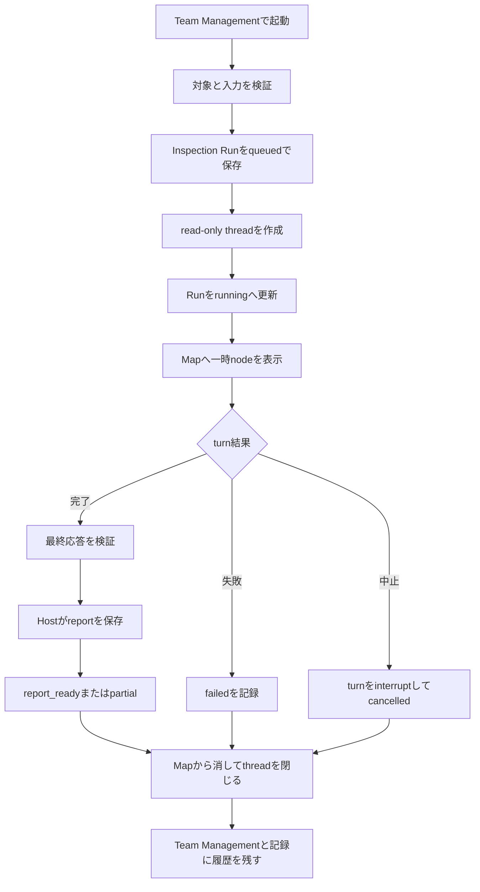

# Orquesta 一時検査エージェント設計

作成日: 2026-07-21

状態: ユーザーレビュー待ち

対象: Orquesta Core、Codex App Server連携、Desktop Team Management、中央組織マップ、記録画面

## 目的

ユーザーが好きなタイミングで、通常の生産組織とは別の検査エージェントを起動できるようにする。検査エージェントはプロジェクトを変更せず、調査または監査レポートだけを提出する。処理が終われば実行個体とCodex threadを閉じ、レポートと実行履歴だけを残す。

常時存在するのはTeam Management上の起動テンプレートであり、正式組織のAgentではない。起動中だけ一時的な検査個体をMapへ表示する。

## 採用する二種類

### 外部比較エージェント

表示名は「外部比較」、内部IDは`external-benchmark`とする。

- Project Understanding Packetと現在の成果物を読む
- 類似OSS、製品、研究、Webサービスを探す
- 同じ比較軸で現在のプロジェクトと外部事例を比べる
- 強み、弱み、差別化、欠落、参考になる既存資産を報告する
- URL、確認日時、比較根拠を必須にする
- 外部ソースを取得できない場合は、推測で比較レポートを作らない

V4のAcquisitionは、タスク実行に使える既存資産を探して採用候補を作る機構である。外部比較はプロジェクトの相対的位置を評価する機構であり、Acquisitionの代わりにはしない。

### 敵対監査エージェント

表示名は「敵対監査」、内部IDは`adversarial-audit`とする。

- Project全体、Line、Team、複数Agentのいずれかを対象にできる
- タスク時間、差し戻し、委譲、成果物、検証、エラー、待機、コンテキスト境界を読む
- 過剰レビュー、重複役割、巨大タスク、不要な往復、責任範囲の曖昧さを探す
- 指摘ごとに証拠、重大度、影響、改善案、変更コストを出す
- 対象Agentへ質問、反論、指示を送らない
- 組織、タスク、成果物を変更しない

## 検討した実装方式

### 正式組織へ一時Agentを追加する

既存のRole、Team、Line、Membership、Agent provisioningを使える。しかし、実行のたびに組織revisionとRosterが増え、役目を終えたAgentも残す既存ルールと衝突するため採用しない。

### 独立したInspection Runを作る

二つの起動テンプレートを常設し、起動時だけInspection Run、専用Codex thread、Map上の一時nodeを作る。正式組織は変更しない。今回はこちらを採用する。

### 一つの万能監査Agentへ二つのmodeを持たせる

実装量は減るが、外部比較と内部監査では入力、証拠、失敗条件、出力形式が違う。ユーザーが直感的に使い分けにくくなるため採用しない。

## UX

### Team Management

現行のTeam Managementを正とし、生成画像の全体配置や寸法は写さない。右側の「追加候補」領域へ、二つの一時エージェントを常時表示する。

- 外部比較は青いアクセントを持つ横長カード
- 敵対監査は赤いアクセントを持つ横長カード
- カード面は既存の温かい紙色を保つ
- 名前、短い説明、`読み取り専用`、状態、起動ボタンを表示する
- 実行中は起動ボタンを進捗表示と中止ボタンへ変える
- 完了後は再び起動可能にし、直近レポートを開く導線を残す
- 同じ種類のInspection Runは同時に一つだけ許可する

通常の役割追加候補が存在する場合は、一時エージェントの下へ別グループとして表示する。二つを通常の役割提案として承認させない。

### 起動前入力

外部比較はProject全体を既定範囲とし、任意の注目点を一つ入力できる。初版では検索深度や比較軸を大量に選ばせない。

敵対監査は次から一つを選ぶ。

- Project全体
- 一つのLine
- 一つのTeam
- 複数Agent

ユーザーが起動ボタンを押したことを、この読み取り専用Inspection Runの実行許可とする。別の承認画面は挟まない。

### Map

Inspection Runは正式組織へ含めないが、起動中の作業をユーザーが把握できるようにMapへ一時nodeとして表示する。

- 外部比較は統括者の左
- 敵対監査は統括者の右
- 両方とも統括者へ点線で接続する
- 通常Agentと同じ外寸にする
- 青または赤の少し太い外縁、二重の細い光跡、弱いhaloを加える
- 光量を約2.8秒でゆっくり強弱させる
- 点滅、急な明滅、位置移動、常時回転は使わない
- animationは`transform`、`opacity`、`box-shadow`だけで行い、layoutを変えない
- `prefers-reduced-motion`ではanimationを止め、発光縁だけ残す
- semantic zoomとhit areaは通常Agentと同じ規則を使う

Runが`report_ready`、`failed`、`cancelled`のいずれかになったらMapから消す。履歴は記録画面に残す。

## 正式組織との境界

Inspection Runは次へ書き込まない。

- `roles.json`
- `agents.json`
- `organization.json`
- `sessions.json`
- 通常の`tasks.json`

このため、組織revision、Agent数、Line、Team、Role cluster、全Agent表示ルールへ影響しない。Map上の一時nodeは`AgentUiModel`ではなく`InspectionRunUiModel`として描画する。

## 状態契約

状態は`.orquesta/state/inspection-runs.json`へ保存する。

```ts
type InspectionKind = 'external_benchmark' | 'adversarial_audit';
type InspectionRunStatus =
  | 'queued'
  | 'running'
  | 'cancelling'
  | 'report_ready'
  | 'partial'
  | 'failed'
  | 'cancelled'
  | 'closed';

interface InspectionTarget {
  kind: 'project' | 'line' | 'team' | 'agents';
  ids: string[];
}

interface InspectionRun {
  runId: string;
  kind: InspectionKind;
  requestedBy: 'user';
  target: InspectionTarget;
  focus: string | null;
  status: InspectionRunStatus;
  threadId: string | null;
  turnId: string | null;
  reportPath: string | null;
  sourceCount: number;
  errorCode: string | null;
  errorMessage: string | null;
  createdAt: string;
  startedAt: string | null;
  completedAt: string | null;
  closedAt: string | null;
}
```

ファイルはversion付き配列とし、原子的に更新する。現在Projectと対象IDの参照を起動前に検証する。壊れたRunは黙って削除せず、`failed`として残す。

Rendererへは次を投影する。

```ts
interface InspectionTemplateUiModel {
  kind: InspectionKind;
  displayName: string;
  summary: string;
  color: 'blue' | 'red';
  activeRunId: string | null;
  lastReportRunId: string | null;
}

interface InspectionRunUiModel {
  runId: string;
  kind: InspectionKind;
  displayName: string;
  status: InspectionRunStatus;
  targetLabel: string;
  reportPath: string | null;
  errorMessage: string | null;
}
```

`OrquestaUiSnapshot`へ`inspectionTemplates`と`inspectionRuns`を追加する。既存プロジェクトでは両方を空配列として読めるようにする。

## 実行境界

通常のComposerと専門家threadは現在のruntime設定を引き継ぐ。Inspection Runだけ専用の起動経路を使う。

- App Server `thread/start`へ`sandbox: "read-only"`を明示する
- `approvalPolicy: "never"`を明示する
- Inspection Runnerの契約に`webSearchMode: "live" | "disabled"`を持たせる
- 外部比較だけ`webSearchMode: "live"`を必須にし、敵対監査は`disabled`にする
- 作業ディレクトリは現在Project rootに固定する
- 追加の書き込み可能ディレクトリを渡さない
- 対象Agentへメッセージを送る機能を公開しない
- file changeまたはcommand approvalが万一起きた場合は自動拒否し、境界違反としてRunを失敗させる

プロンプト上の「変更しない」だけを読み取り専用の根拠にしない。実際にApp Serverへ渡したsandboxとapproval policyを実行証拠として保存する。

`webSearchMode`はInspection Runnerの公開契約とし、App Server adapterが現在のruntimeで対応する起動パラメータへ変換する。外部比較では、adapter testでlive指定が送られたことを確認できない場合、またはruntimeがlive探索を利用できない場合、turnを開始せず`failed/source_unavailable`にする。ローカル知識だけで外部比較を代用しない。敵対監査には外部探索を許可せず、Project内の証拠だけを使わせる。

Agent自身にはレポートファイルを書かせない。turn完了後、Desktopの信頼されたHostが最終応答を読み、検証してから`.orquesta/reports/inspections/<run-id>.md`へ保存する。これにより、検査Agentのsandboxは最後までread-onlyのままになる。

## レポート

### 共通項目

- Run ID、種類、対象、開始時刻、完了時刻
- 読んだProject revisionと証拠一覧
- 結論
- 指摘ごとの根拠
- 不明点と取得できなかった証拠
- 提案
- 実際に使用したruntime境界

### 外部比較

- 比較対象
- URLと確認日時
- 選定理由
- 共通比較軸
- 現在の強み
- 不足または劣位
- 差別化できている点
- 既存資産から学べる点

外部ソースが0件、URLがない、比較軸がない場合は`report_ready`にしない。取得不能なら`failed`、一部だけ取得できた場合は`partial`にする。

### 敵対監査

- 対象と監査範囲
- 問題または反証
- evidence reference
- severity
- 現在の影響
- 改善案
- 改善コスト
- 変更しない場合のリスク

証拠がない批判は本文の指摘へ入れず、仮説として分ける。人格やAgent名を攻撃する文章は作らない。

## 実行フロー



## 失敗時

- Runtime unavailable: Runを作らず、カード上で再試行可能にする
- Thread作成失敗: `failed/runtime_unavailable`
- Web探索不能: 外部比較を`failed/source_unavailable`
- 対象が消えた: `failed/target_stale`
- 読み取り境界違反: `failed/read_only_boundary_violation`
- Turn失敗: `failed/runtime_turn_failed`
- レポート形式不正: `failed/invalid_report`
- アプリ終了中: Runを`cancelling`へ移し、次回起動時にthread状態を照合する

失敗したnodeも終了処理後はMapから消す。Team Managementには失敗理由と再試行を表示し、記録にはRunを残す。

## 記録画面

既存のTask、Error、Conversation、User Decision、Timelineへ混ぜず、記録画面に「検査」種別を追加する。

- 全て
- 外部比較
- 敵対監査
- 完了
- 失敗

一覧はRun単位にし、詳細から保存レポートと証拠を開ける。レポートを閉じてもRun履歴は削除しない。

## 実装段階

### Stage 1: 契約と読み取り専用Runner

- 状態schema
- Core request/event
- read-only runtime profile
- Run lifecycle
- trusted report writer
- unit/integration tests

### Stage 2: Team Managementと記録

- 二つの常設カード
- 起動前入力
- 実行中、中止、失敗、直近レポート
- Inspection記録一覧と詳細

### Stage 3: Map nodeとpolish

- 統括者左右の一時node
- 点線
- 青赤の発光縁
- motionとreduced-motion
- Desktop visual QA

Stage 1で実行境界が証明される前に、起動ボタンだけを有効にしない。

## テストと受け入れ条件

- 二つのテンプレートがProject状態に関係なくTeam Managementへ表示される
- テンプレートはAgent数と正式組織へ含まれない
- 同じ種類を二重起動できない
- 外部比較はProject全体を対象に起動できる
- 敵対監査はProject、Line、Team、複数Agentを選べる
- inspection threadが`read-only`かつ`never`で作成される
- 外部比較だけlive Web探索を要求し、敵対監査ではWeb探索を無効にする
- live Web探索を適用できない外部比較は、推測で続けず`source_unavailable`になる
- 通常Composerのruntime profileは変更されない
- inspection agentがProject fileを変更できない
- Hostだけがレポートを保存できる
- 完了、失敗、中止後にMap nodeが消える
- レポートと履歴は残る
- 青は統括者左、赤は右へ表示される
- nodeは通常Agentと同じ外寸で、通常Agentのlayoutを押し動かさない
- 100%、125%、150%、200%で見出しやnodeと重ならない
- 35体、80体表示でも一時nodeのslotが維持される
- animation中にlayout shiftと500ms以上の停止がない
- reduced-motionでanimationが停止する
- 外部比較のURLと確認日時が欠けた出力を合格にしない
- 敵対監査の無根拠な批判を正式findingにしない

## 今回やらないこと

- 検査エージェントによる自動修正
- 対象Agentへの尋問、反論、指示
- 定期実行とバックグラウンド監視
- 検査結果による自動的な組織変更
- 通常AgentとしてのRole、Team、Line登録
- 複数の同種Inspection Runの並列起動
- 生成画像どおりの画面全体レイアウト変更

## Visual source

- LED参考: `C:\Users\kouki\AppData\Local\Temp\codex-clipboard-f476423f-6a72-4273-9176-97dc656a40fa.png`
- 現行Desktop: `apps/orquesta-desktop/artifacts/screenshots/renderer-active-1440x900.png`
- 選択方向の参考: `C:\Users\kouki\.codex\generated_images\019f6291-cd59-7183-b799-aee36005b738\exec-441c7db3-0a93-4481-a998-48d2633e2a00.png`

選択方向の画像は、発光、色、左右配置、カードの縦横比を確認する参考にだけ使う。実装時の余白、寸法、overlay位置、Map layoutは現行Desktopを正とする。
