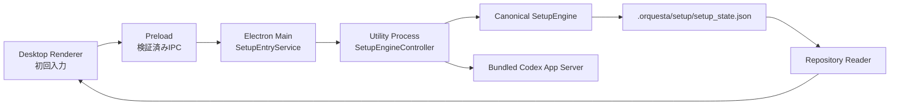
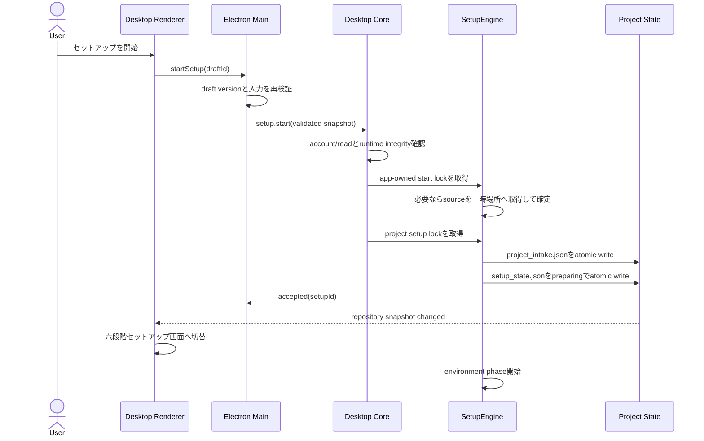

# Orquesta Desktop 初回入力・セットアップ起動設計

作成日: 2026-07-22
状態: ユーザーレビュー待ち
対象: 古い初回セットアップ仕様の整理、Desktop初回入力、Codex接続、セットアップエンジン起動

## 今回の到達点

今回作るのは、Orquestaを初めて開いた人が、プロジェクトを確定し、必要ならCodexへログインし、一つの入力画面からセットアップを開始できるところまでである。

開始後は、現在ある六段階セットアップ画面へ切り替わり、実際のCoreがフェーズ1を開始する。ChatGPT側で制作中の六段階画面の最終外観、六段階すべての処理品質、旧プロジェクトの本格移行は、今回の完了条件に入れない。

ユーザーがHomeへ入る前に操作する主画面は二つだけにする。

1. 初回入力画面
2. 六段階セットアップ画面

完了専用画面は作らず、セットアップ完了後はHomeへ直接移る。

## 現在の実装で確認できたこと

現在のDesktopは、`.orquesta/setup/setup_state.json`を読んでセットアップ画面を表示できる。しかし、Desktopから初回入力を保存したり、セットアップエンジンを開始したりする経路はない。

現在は次の状態になっている。

- プロジェクトを開く操作はフォルダ選択だけで、新規作成やGitHub URL入力がない。
- Codexから渡されたプロジェクトルートを通常起動で受け取る仕組みがない。
- 二重起動時の引数も無視される。
- フォルダを選択すると、`RepositoryRuntime.select()`が旧組織の補修や移行を先に実行する。
- そのため、ユーザーが開始を承認する前に`.orquesta`を書き換える可能性がある。
- `repository-reader.ts`は`agents.json`と`tasks.json`を必須としており、未初期化プロジェクトや、基盤構築前のセットアップ途中状態を読めない。
- セットアップ処理は`orquesta/dashboard-server.js`のHTTP処理と強く結び付いている。
- DesktopはローカルWebサーバーを起動しなくてもCodex App Serverを使えるが、セットアップ開始はまだWeb API側にしかない。
- 現在の正本は`setup_state.json`と`provisioning_batch.json`である。古い設計にある`session.json`は実装と合っていない。
- 基礎エージェント三体と適応型専門家編成はCore側にすでにある。

## 採用する構成

セットアップ処理を`dashboard-server.js`から再利用可能なサービスへ分離し、Desktop Coreから直接呼ぶ。

検討した案は三つある。

- Desktopから既存のローカルHTTP APIを呼ぶ案
  - 変更は少ないが、DesktopのためだけにWebサーバーを起動することになる。ポート、別プロジェクト誤接続、終了処理が増えるため採用しない。
- Desktop側に同じ処理を作り直す案
  - 早く見えるが、Web版とDesktop版で状態更新が分裂する。古い仕様が残る原因になるため採用しない。
- セットアップエンジンをCoreサービスとして分離する案
  - 最初の整理は必要だが、状態更新を一か所にできる。Desktopは直接呼び、旧HTTP APIは当面薄い互換アダプターにできる。この案を採用する。



Rendererはファイル作成、Git取得、Codex実行を直接行わない。MainはOS操作と入力検証を担当し、CoreはCodexとセットアップエンジンを担当する。

## 古い仕様の整理

実装開始前に、次の仕様を新設計へ統一する。

| 古い仕様 | 新しい仕様 |
| --- | --- |
| 利用者連絡係、構想整理係、障害相談係を別々に常設 | `user-support`一体へ統合 |
| 基礎エージェント五体または用途不明の初期設定検証係 | `orchestrator`、`user-support`、`orquesta-admin`の三体 |
| 固定質問、必須6問 | プロジェクトによって0件から3件。全件スキップ可能 |
| オプションパックをユーザーが初回に選ぶ | 初回には表示せず、必要能力から内部選択 |
| Completion Mapを別画面で承認 | 初回入力の「セットアップを開始」を初期体制まで含む一回の承認にする |
| 専門家候補を固定数生成 | 最初の実行可能作業から必要な分だけ生成 |
| `session.json`を新しい正本にする | `setup_state.json`を正本として拡張 |
| WebダッシュボードのセットアップAPIが中心 | `SetupEngine`が正本。HTTPは互換アダプター |
| フォルダ選択時に自動移行、補修 | 選択と確認は読み取り専用。開始後だけ状態変更 |
| 外部Codex Desktopを起動して操作 | 配布物内のCodex App Serverを直接使用 |
| ChatGPT Desktopまたは別途Codex CLIが必須 | どちらも不要。Orquesta同梱runtimeを使用 |

古い資料は削除せず、冒頭に「この設計で置き換えられた範囲」を記載する。コードと同時に参照されるOrquesta skill、セットアップ文言、fixtureも同じ三体構成へ揃える。

資料の優先順位は次の通りにする。

1. この設計書が、初回入口、入力、Codex接続、開始処理、`setup_state.json`の正本契約を決める。
2. `2026-07-20-orquesta-adaptive-organization-and-setup-design.md`は、三体の基礎組織と適応型専門家編成の判断規則に限って引き続き有効とする。
3. `2026-07-20-orquesta-initial-setup-overhaul.md`は、六段階の意味と外観方針に限って有効とする。`session.json`と旧実装順はこの設計で置き換える。
4. `2026-07-20-orquesta-desktop-initial-setup-review-slice.md`は過去の見た目確認記録であり、今後の実装手順には使わない。

## 初回入力画面

一枚の画面内に、プロジェクト、説明、補完質問、Codex接続、開始確認を置く。次へ進むウィザードにはしない。

### プロジェクトの入口

初回リリースでは次の入口を用意する。

- Codexから検出した現在のプロジェクト
- 新しいプロジェクトを作る
- GitHub URLから始める
- 既存フォルダを選ぶ
- 場所が分からない場合の候補検索

Codexからルートが渡されている場合は、それを最初から選択済みにする。「このプロジェクトで始める」と「変更」だけを表示し、ファイル選択をやり直させない。

新しいプロジェクトは、標準では`Documents\Orquesta Projects\<project-name>`に作る。入力画面では予定パスだけを表示し、開始前にはフォルダを作らない。同名がある場合は勝手に上書きせず、既存を使うか別名にするかを画面内で選ばせる。

GitHub URLは、最初の実装では`https://github.com/<owner>/<repository>`形式の公開リポジトリを対象にする。URLと保存予定パスは入力画面で確定する。取得処理はRendererではなくCoreのsource acquisitionで行い、app-ownedの一時場所へ取得してから対象パスへ確定する。対象フォルダへ先に`.orquesta`を作ってcloneを妨げてはならない。

公開GitHub取得には、versionを固定したアプリ内Git clientを使用する。ユーザーPCのPATHにある任意の`git.exe`やCodexのtoken消費には依存しない。Git LFS、submodule、private repositoryが必要な場合は未対応のまま壊れたcopyを作らず、「すでに取得したフォルダを選ぶ」へ案内する。将来はGitHub認証を追加できるよう、入口のデータ型はpublic/privateを区別できる形にする。

「場所が分からない」は別画面にしない。Desktop、Documents、Downloads、保存済みOrquestaプロジェクト、一般的な開発フォルダだけを件数と時間の上限付きで調べ、候補を同じ欄に出す。ドライブ全体の走査は行わない。

### Codexからの起動情報

通常起動引数として、次を受け取れるようにする。

- `--orquesta-project-root <absolute-path>`
- `--orquesta-handoff <absolute-json-path>`

handoffは任意で、プロジェクト名の候補、説明の下書き、元のCodexタスク識別子だけを含む。秘密情報は入れない。64 KiB以下のUTF-8 JSONに限定し、読み取り後はapp-owned draftへ必要項目だけ保存する。任意パスのファイル削除は行わない。

初回起動だけでなく、すでにOrquestaが起動中の`second-instance`でも同じ引数を解析し、確認中の入力を無断で捨てずに「Codexから別のプロジェクトが届きました」と表示する。

### プロジェクト名と説明

名前の初期値は次の順で決める。

1. handoffで渡された名前
2. packageやmanifestの名前
3. Gitリポジトリ名
4. フォルダ名

説明は次の情報から下書きを作る。

- handoffの説明
- READMEの冒頭
- packageやmanifestの説明
- 主要設計書の見出し
- ユーザーが入力した文章

ローカルファイルの確認は、対象ファイル数と総読み取り量を制限する。リポジトリ全体を読み込まない。

### 補完質問

質問は0件から3件までとする。初期計画や最初の専門家構成が変わる場合だけ出す。

質問生成は入力のたびに実行しない。プロジェクト入口、名前、説明が一度揃った時点で、一回だけCodexへ整理を依頼する。同じ入力fingerprintでは結果を再利用する。失敗した場合も入力と開始画面は消さず、ユーザーは質問なしで続行できる。

質問には「なぜ必要か」を短く表示する。未回答は未確認事項として保存し、勝手に既定値へ変換しない。

### 開始確認

別の確認画面は作らない。画面下部の開始欄に次をまとめる。

- 対象プロジェクト
- プロジェクト名
- 説明の短い要約
- Codex接続状態
- 基礎三体
- 補完質問の回答数と未回答数
- 後から変更できること

主要操作は「セットアップを開始」一つにする。この操作が、初期組織と初期専門家編成まで含む一回のユーザー承認になる。

## Codex接続

Orquestaは配布物に固定したCodex App Serverを使う。ChatGPT Desktopも、別途インストールしたCodex CLIも必要ない。

ただし、OpenAIへの認証は必要である。App Serverの`account/read`と`account/rateLimits/read`で次を区別する。

- ChatGPTで接続済み
- API keyで接続済み
- 未接続
- 認証が必要だがworkspace policyで利用不可
- 接続確認失敗

未接続の場合は、同じ初回入力画面に「ChatGPTでログイン」を表示する。`account/login/start`で受け取ったURLをMainが既定ブラウザで開き、`account/login/completed`と`account/updated`を待って画面を更新する。外部Codexアプリは起動しない。

API keyで既にログインしている場合はそのまま利用できる。新しいAPI key入力は副導線として用意できるが、keyをログ、`.orquesta`、app registry、Renderer eventへ残してはならない。第一実装ではChatGPTログインを主導線にする。

認証前でも初回入力画面は開ける。プロジェクトと説明の入力は保存できるが、セットアップ開始は無効にし、理由と解決操作を表示する。

## 利用不能になる条件と画面上の扱い

| 状態 | 初回入力画面の扱い |
| --- | --- |
| ChatGPT/Codex未ログイン | ログイン操作を表示。入力は保持 |
| Codex Localの権限がない | workspace管理者へ確認する説明を表示 |
| 利用上限に到達 | リセットまたは課金状態を確認する説明を表示。自動再試行しない |
| オフライン | 接続再確認を表示。入力は保持 |
| proxy、firewall、TLSで接続不可 | 一般向け説明と技術詳細を分ける |
| bundled runtimeの整合性失敗 | 開始不可。再インストール案内を表示 |
| 保存先へ書き込めない | 別の保存先を選べるようにする |
| 容量不足 | 必要容量と現在の保存先を表示 |
| GitHub URLが無効またはprivate | URL修正か既存フォルダ選択へ戻す |
| `.orquesta`がセットアップ途中 | 新規開始せず再開する |
| `.orquesta`が旧形式 | 今回は自動移行せず、移行が必要と表示 |
| `.orquesta`が破損 | 勝手に修復せず、診断結果と選択肢を出す |

WindowsのSmartScreen、コード署名、x64以外への対応は、入力フローより前の配布問題である。重要だが今回の実装範囲には混ぜず、release作業として別に扱う。

## 開始前の書き込み禁止

プロジェクトの確認と分析は読み取り専用にする。

「セットアップを開始」を押す前に、対象プロジェクトへ次を書いてはならない。

- `.orquesta`
- `agents.json`
- `tasks.json`
- `roles.json`
- `organization.json`
- project固有のCodex設定

入力途中の内容は、Electronの`app.getPath('userData')`配下に`SetupDraft`として保存する。これによりアプリを閉じても入力は戻せるが、ユーザーのプロジェクトは汚さない。

既存の`ensureLegacyOrganizationState()`は、通常のフォルダ選択から外す。移行が必要な既存プロジェクトでは、明示的な移行操作からだけ呼ぶ。

## データ契約

### app-owned SetupDraft

```ts
type SetupDraft = {
  version: 1;
  draftId: string;
  source:
    | { kind: 'detected'; rootPath: string }
    | { kind: 'new'; targetRootPath: string }
    | { kind: 'github'; url: string; targetRootPath: string }
    | { kind: 'existing'; rootPath: string };
  projectName: string;
  projectDescription: string;
  evidenceFingerprint: string | null;
  questions: Array<{
    id: string;
    prompt: string;
    reason: string;
    answer: string | null;
  }>;
  codexConnection: 'checking' | 'ready_chatgpt' | 'ready_api_key' | 'signed_out' | 'blocked' | 'unavailable';
  sourceStatus: 'draft' | 'acquiring' | 'ready' | 'failed';
  setupId: string | null;
  createdAt: string;
  updatedAt: string;
};
```

生のAPI key、access token、handoff全文は保存しない。

### SetupStartCommand

RendererからCoreへ自由形式のobjectを渡さない。PreloadとMainで検証済みの次のcommandだけを渡す。

```ts
type SetupStartCommand = {
  draftId: string;
  expectedDraftVersion: 1;
  confirmation: 'initial_setup_approved';
};
```

Coreはapp-owned draftをMainから受け取った確定snapshotで処理する。Rendererがproject rootや状態ファイルのパスを直接指定しない。

### canonical setup_state.json

`session.json`は作らない。`setup_state.json`を現在状態の正本にする。

最低限、次を持たせる。

```json
{
  "schema_version": 2,
  "setup_id": "SETUP-...",
  "status": "preparing",
  "entry_route": "detected|new|github|existing",
  "project_title": "...",
  "project_root": "...",
  "current_phase": "environment",
  "phases": [
    { "id": "environment", "order": 1, "status": "active" },
    { "id": "understanding", "order": 2, "status": "waiting" },
    { "id": "foundation", "order": 3, "status": "waiting" },
    { "id": "planning", "order": 4, "status": "waiting" },
    { "id": "specialists", "order": 5, "status": "waiting" },
    { "id": "operation", "order": 6, "status": "waiting" }
  ],
  "current_activity": {
    "id": "environment-preflight",
    "title": "環境を確認しています",
    "detail": "保存先とCodex接続を確認しています。",
    "status": "active",
    "observed_at": "..."
  },
  "recent_activities": [],
  "next_activity": {
    "id": "understanding-entry-files",
    "title": "プロジェクトを理解する",
    "detail": "入口となる文書とmanifestを確認します。",
    "status": "waiting",
    "observed_at": null
  },
  "setup_confirmation": {
    "status": "approved",
    "approved_at": "..."
  },
  "started_at": "...",
  "updated_at": "...",
  "completed_at": null,
  "blocking_issue": null
}
```

履歴は既存の`.orquesta/state/events.jsonl`へ追記する。現在状態と履歴を別ファイルに二重管理しない。

全体statusは`preparing`、`running`、`paused`、`blocked`、`cancelled`、`completed`に限定する。phase statusは`waiting`、`active`、`complete`、`blocked`、`skipped`とし、同時に`active`になれるphaseは一つだけにする。

## セットアップ開始の処理順



処理の原則は次の通りである。

- Startを二重クリックしても同じ`setup_id`を再利用し、二重エンジンを起動しない。
- `setup_id`は永続化済み`draftId`とcanonical project rootから決め、開始途中でアプリが再起動しても同じ開始試行を識別できる。
- `accepted`は、Codexへの依頼を投げただけではなく、正本の`setup_state.json`が作られ、Coreが同じ`setup_id`を所有した後に返す。
- Rendererはボタンを押しただけで進捗画面へ楽観遷移しない。repository snapshotで`setup.status`を確認して切り替える。
- 状態作成後の失敗は初回入力へ戻さず、六段階画面を`blocked`として表示する。
- 状態作成前の失敗は初回入力画面に留まり、入力を失わない。
- GitHub取得や新規フォルダ確定の間は、同じ初回入力画面で開始欄を`準備中`に変える。白画面や別の待機画面は挟まない。

## 未初期化プロジェクトの読み取り

`repository-reader.ts`は最初に`setup_state.json`の有無を確認する。

- active setupがある場合、`agents.json`と`tasks.json`がまだなくても空配列として投影できる。
- setupが完了している場合、通常どおり`agents.json`と`tasks.json`を必須にする。
- setupも通常状態もない場合は、Home用snapshotではなく初回入力用のproject preflight結果を返す。

これにより、フェーズ3で基礎三体が作られる前でも、セットアップ画面を壊さず表示できる。

## SetupEngineの境界

今回分離する`SetupEngine`は次の操作を持つ。

- `inspectSource()`
- `prepareDraftEvidence()`
- `start()`
- `resume()`
- `cancel()`
- `getState()`

`dashboard-server.js`にあるproject intake保存、Completion Map生成、専門家計画、provisioning batch準備のロジックは、順次このサービスへ移す。HTTP handlerはpayloadを検証して同じサービスを呼ぶだけにする。

今回のユーザーレビュー地点は、Desktopから`start()`が通り、実状態によって六段階画面が開き、フェーズ1の現在処理が表示された時点とする。六段階すべての完成確認は次の実装段階で行う。

## 実装順

### 1. 仕様と契約の整理

- 古い五体構成、必須質問、`session.json`の記述を新仕様へ揃える。
- 新しいセットアップ契約を追加する。
- Desktopの最終対象を明記し、browserは互換アダプターに下げる。
- 既存状態を選択時に書き換える処理を分離する。

### 2. 読み取り専用のproject preflight

- 起動引数とsecond-instance引数を処理する。
- 新規、GitHub、既存、候補検索のsource型を実装する。
- project名と説明の下書きを作る。
- SetupDraftをapp-owned領域へ保存する。
- この段階では`.orquesta`へ一切書かないテストを入れる。

### 3. Desktop初回入力画面

- 一枚の入力画面を実装する。
- source、名前、説明、0件から3件の質問、接続状態、開始確認を同じ画面に置く。
- 画面全体スクロールを避け、必要な欄だけ内部スクロールにする。
- 1366×768と1440×900で主要操作が隠れないようにする。

### 4. Codex認証と質問生成

- App Server schemaへ`account/read`、`account/rateLimits/read`、`account/login/start`、関連notificationを追加する。
- 未ログイン時のChatGPTログインをDesktop内から開始する。
- 入力fingerprint単位で一回だけ補完質問を生成する。
- 認証や質問生成に失敗しても入力を消さない。

### 5. SetupEngineの直接起動

- `dashboard-server.js`から正本ロジックをサービスへ分離する。
- `setup.start` IPCとCore requestを追加する。
- project intakeとsetup stateをatomicに作る。
- active setupではrepository readerが欠けたagents/tasksを許容する。
- 現在の`InitialSetupExperience`へ実状態を流す。

### 6. Desktopでの確認

- browser版ではなくElectron Desktopだけで確認する。
- fake App Serverで自動確認した後、実機では代表経路一つだけをユーザーが確認する。
- ユーザー承認後に六段階エンジン本体と最終外観の作業へ進む。

## 想定変更ファイル

新規または変更対象は次の範囲を想定する。

- `apps/orquesta-desktop/src/contracts/bridge.ts`
- `apps/orquesta-desktop/src/contracts/orquesta-ui.ts`
- `apps/orquesta-desktop/electron/shared/host-contract.ts`
- `apps/orquesta-desktop/electron/preload/host-api.ts`
- `apps/orquesta-desktop/electron/main/index.ts`
- `apps/orquesta-desktop/electron/main/ipc-handlers.ts`
- `apps/orquesta-desktop/electron/main/repository-service.ts`
- `apps/orquesta-desktop/electron/main/project-registry.ts`
- `apps/orquesta-desktop/electron/main/setup-entry-service.ts`
- `apps/orquesta-desktop/electron/core/protocol.ts`
- `apps/orquesta-desktop/electron/core/core-runner.ts`
- `apps/orquesta-desktop/electron/core/repository-runtime.ts`
- `apps/orquesta-desktop/electron/core/repository-reader.ts`
- `apps/orquesta-desktop/electron/core/setup-engine-controller.ts`
- `apps/orquesta-desktop/src/renderer/features/setup/SetupIntakeExperience.tsx`
- `packages/codex-adapter/src/app-server-adapter.js`
- `packages/codex-adapter/protocol/app-server-schema.json`
- `orquesta/setup-engine/`
- `orquesta/dashboard-server.js`
- Orquesta skillの配布元とinstalled copy

現在のworktreeには`.agents/skills/orquesta/SKILL.md`がtracked fileとして存在しない。したがって、feature commitで存在しないpathを更新したことにはしない。skillの配布元を特定して更新し、installed copyの同期はrelease作業として証拠を分ける。

実装計画を作る際に、各変更を小さいコミットへ分ける。関係のないHome、ツリー、Luca、監査エージェントの変更は混ぜない。

## 確認方針

同じ検証を何度も繰り返さない。確認は責任境界ごとに一回ずつ行う。

### 機械確認

- launch引数の正規化と危険な相対パス拒否
- source型とIPC payloadの検証
- Start前にprojectへ書き込みがないこと
- SetupDraftの再開
- account状態の変換
- login notificationの相関
- setup startのidempotency
- atomic write失敗時の復旧
- active setup中にagents/tasksがなくても描画できること
- completed setupでは通常状態を必須に戻すこと

### Electron確認

- Codexから検出されたprojectが最初から選ばれる
- 新しいprojectで予定パスが表示される
- GitHub URLが正規化される
- 既存フォルダを選べる
- 未ログイン時にログイン導線が出る
- 開始前には`.orquesta`が作られない
- 開始後に六段階画面へ切り替わる
- 再起動時に入力途中または実行途中を再開できる

### ユーザーレビュー

自動確認後、Desktop実機で一回だけ確認する。

1. 初回入力画面が一枚で理解できる。
2. projectを探す操作で迷わない。
3. Codex接続状態と開始できない理由が分かる。
4. 開始ボタンの時点で何が作られるか分かる。
5. 開始後、実際の進捗画面へ移り、フェーズ1が動き始める。

見た目の微調整と六段階画面の最終演出は、このレビューを通してから行う。

## 今回の非目標

- 六段階画面の最終ビジュアル制作
- 六段階すべての処理内容の再実装
- 旧プロジェクトの自動移行
- private GitHub repositoryの認証
- Windows installerのコード署名
- x64以外の配布
- updater
- macOS版
- setup完了後のHomeやツリーの変更

## 受け入れ条件

- 未ログインでも初回入力画面を開き、入力を保存できる。
- ChatGPT Desktopと別途Codex CLIを要求しない。
- bundled App Serverの接続状態を画面で確認できる。
- Codexから渡されたproject rootを再選択せず使える。
- 新規、公開GitHub URL、既存フォルダ、候補検索の入口がある。
- 開始前には対象projectへ一切書き込まない。
- 固定質問と必須6問が残っていない。
- 基礎三体は`orchestrator`、`user-support`、`orquesta-admin`である。
- `session.json`を作らない。
- DesktopはWebサーバーを起動せずCoreからSetupEngineを開始する。
- 開始操作はidempotentで、二重セットアップを作らない。
- `setup_state.json`が作成されてからacceptedを返す。
- 実状態のsnapshotによって六段階画面へ切り替わる。
- フェーズ1開始前後にagents/tasksがなくてもDesktopが白画面にならない。
- browser確認だけで完了扱いにしない。

## 参照した事実

- Codex App Serverは、認証、会話履歴、承認、streamed eventを製品へ深く統合するための公式interfaceである。
- CodexはChatGPTログインとAPI keyログインに対応し、ChatGPTログインはブラウザへ移る。
- 現在固定しているCodex 0.144.5の生成schemaには`account/read`、`account/login/start`、`account/login/completed`が存在する。
- Orquesta Desktopは`@openai/codex`、`@openai/codex-sdk`、Windows runtimeを0.144.5で同梱している。

公式資料:

- [Codex App Server](https://learn.chatgpt.com/docs/app-server.md)
- [Codex authentication](https://learn.chatgpt.com/docs/auth)
- [Codex developer commands](https://learn.chatgpt.com/docs/developer-commands?surface=cli#cli-codex-app-server)
