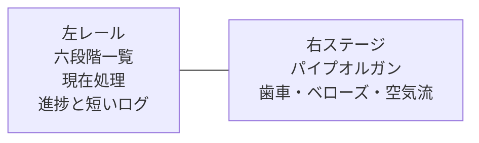
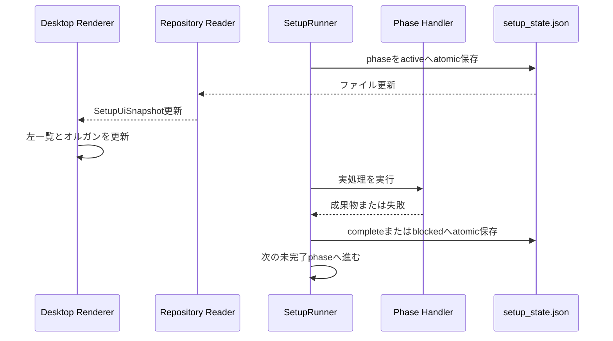

# Orquesta 六段階セットアップ・パイプオルガン統合設計

作成日: 2026-07-22
状態: ユーザーレビュー待ち
対象: `ORQUESTA_V11_3_SOURCE_LIBRARY.zip`の本番移植、六段階セットアップの自動実行、Desktop進捗画面

## 今回の結論

ZIPをアプリごと移植しない。現在のOrquesta Desktopの初回入力と状態契約を残し、ZIPから次の二つを採用する。

- 左側の六段階一覧、現在処理、進捗、短いログという画面構成
- 右側のThree.js製パイプオルガンと段階別アニメーション

ZIPにある手動フェーズ切替、Auto、Blocked、Complete、言語切替、Reduced motion切替、バージョン表示などは、アニメーション確認用の開発UIなので本番へ入れない。

六段階の進行はRendererのタイマーで作らない。Orquesta Coreのセットアップエンジンが実際の処理を順番に実行し、`.orquesta/setup/setup_state.json`へ状態を保存する。Desktopはその状態を読み、左の進捗と右の機構を動かす。

## ZIPを確認して分かったこと

ZIPの中身は、見た目だけの一枚画像ではない。パイプオルガン、歯車、ベローズ、空気流、パイプの発光はThree.jsとReact Three Fiberで組まれており、実データへ接続できる構造になっている。

一方、セットアップ自体はデモである。

- `src/App.tsx`がフェーズ切替や確認用ボタンを持つ。
- `src/setup/demoSetupState.ts`が2.6秒ごとにフェーズを進め、最後はフェーズ1へ戻す。
- 表示文、ログ時刻、接続数は固定値である。
- `SetupPrototype.tsx`は表示用で、実際のセットアップ処理を起動しない。
- `setup-prototype.css`には、現在のThree.js版で使わない古いSVG版のCSSが大量に残っている。
- 右の3D機構は外部画像、CDN、フォント、3Dモデルへ依存していない。
- 3D機構内には51本のパイプがあり、フェーズが進むほど前段の機構を残したまま動作が増える。
- OSのモーション低減設定を受け取れる形になっている。

このため、見た目の土台は使えるが、デモの状態管理と本番の状態管理は完全に切り分ける。

## 残すものと削除するもの

| ZIPの要素 | 判断 | 本番での扱い |
| --- | --- | --- |
| 左側の六段階一覧 | 残す | `SetupUiSnapshot.phases`を表示する本番UIへ変更 |
| 左下の現在状態と進捗 | 残す | current activity、全体status、進捗率を実状態から表示 |
| 短いsystem log | 残す | recent activitiesを最大6件だけ表示。全文履歴にはしない |
| 右側のパイプオルガン | 残す | 六段階の状態から動作を決める純粋な可視化へ変更 |
| 段階ごとのカメラ構図 | 原則残す | 動きが大きすぎる箇所だけDesktopで調整 |
| ポインターによる小さな視差 | 条件付きで残す | 弱くする。モーション低減時は無効 |
| Phase buttons 1から6 | 削除 | 本番ユーザーはフェーズを手動で飛ばせない |
| Auto | 削除 | 実際のSetupRunnerが自動進行する |
| Blocked、Complete | 削除 | 実処理の結果だけが状態を変える |
| Reduce motion切替 | 削除 | OSの`prefers-reduced-motion`へ従う |
| 言語切替 | 削除 | Desktop全体の表示言語へ従う |
| V11.3表示とreview query | 削除 | 開発確認専用なので本番に出さない |
| `demoSetupState.ts` | 削除 | 本番状態を偽装するタイマーを持ち込まない |
| 旧SVG版と大量の旧CSS | 削除 | Three.js版に必要な最小CSSだけ移す |

## 採用する画面

セットアップ開始後は、次の一画面だけを表示する。



### 左レール

左レールは飾りではなく、現在の状態を理解するための主UIにする。

上から次を表示する。

1. Orquesta setupとプロジェクト名
2. 六段階一覧
3. 現在の処理名と一文説明
4. 全体進捗
5. 直近の処理ログ
6. blocked時だけ、理由、技術詳細、再試行または必要操作

六段階一覧の各行には、番号、名前、短い説明、状態を置く。状態は「完了」「実行中」「待機」「停止」だけにする。固定英語のStandby、Drive train、Mechanicsなどは表示しない。

六段階が一画面に収まることを優先する。ログが増えても画面全体はスクロールさせず、ログ欄だけを内部スクロールにする。ログは現在の理解に必要な直近6件までを標準表示し、それ以前の履歴はセットアップ完了後に記録画面で確認する。

### 右ステージ

右側はパイプオルガンの演出を主役にする。説明カード、凡例、デモ操作、フェーズボタンは重ねない。

画面の隅には、現在フェーズ名と短い動作説明だけを置ける。ただし左レールと同じ文章を二重表示しない。右の文言は「空気経路を接続中」のように、今見えている機構の意味を一文で補う。

音は自動再生しない。Soundingはパイプの発光、空気粒子、共鳴する小さな動きで表現する。実音は初回セットアップに必要なく、突然音が鳴る問題を増やすため今回の対象外とする。

### 現在のDesktop画面との関係

今の`InitialSetupExperience`は、左に現在処理、右に歯車の六段階一覧、中央に静止したパイプオルガンを置いている。この三分割は置き換える。

ただし、現在実装済みの次は残す。

- `SetupUiSnapshot`を受け取る入口
- setupが終わるまでHomeを表示しない画面遷移
- 中止確認
- 技術詳細
- プロジェクト名とルートの表示
- setup状態をRepository Readerから読む流れ

つまり、画面の見た目と配置はZIP寄りに変えるが、Desktopの製品境界と実状態の流れは残す。

## 六段階と機構の対応

表示上の六段階は、現在決まっているセットアップエンジンの名前を正本にする。

| 段階 | 実処理 | パイプオルガンの変化 |
| --- | --- | --- |
| 1 環境確認 | 保存先、同梱Codex、認証、書き込み、正本状態を確認 | 入力モーターと最初のフライホイールが動く |
| 2 プロジェクト理解 | 入力、README、manifest、主要資料から理解結果を作る | クラッチがつながり、歯車列へ回転が伝わる |
| 3 基礎組織 | 統括者、Luca、利用者支援係を正本へ作る | クランク、リンク、ポンプが動き始める |
| 4 初期計画 | Completion Mapと最初の実行可能作業を作る | ベローズと空気貯留部が動き始める |
| 5 専門家編成 | 必要な専門家だけを決め、Codex sessionを生成する | 空気が分岐し、必要なパイプへ流れ始める |
| 6 運用開始 | 初期タスクと組織を接続し、読取検証後に運用可能へする | 全機構が同期し、パイプが順に起動する |

前の段階で動き始めた機構は、次の段階へ進んでも止めない。構築が積み上がっていく見た目にする。

## 状態からアニメーションを決める規則

Renderer内に`visualPhase`を自由に変更するデモ状態は持たせない。見た目は`SetupUiSnapshot`から計算する。

```ts
type SetupVisualState = {
  activePhaseOrder: 1 | 2 | 3 | 4 | 5 | 6;
  phaseStatuses: Array<'complete' | 'active' | 'waiting' | 'blocked'>;
  setupStatus: 'preparing' | 'running' | 'paused' | 'blocked' | 'completed' | 'cancelled';
  reducedMotion: boolean;
};
```

動作規則は次の通りにする。

- `complete`: その段階の機構は低速で動き続ける。
- `active`: その段階の機構を最も見やすくし、通常速度で動かす。
- `waiting`: 機構は存在するが、薄く静止する。
- `blocked`: 直前まで動いていた現在機構を止め、橙色の細い表示にする。完了済みの前段機構は低速で動き続ける。
- `paused`: 全機構を穏やかに停止する。再開時に同じ角度から戻す。
- `completed`: 全機構を1.2秒だけ安定動作させ、その後Homeへフェードする。
- `cancelled`: 全機構を停止し、左レールへ中止済みと再開方法を表示する。

実処理が速く進んでも、Coreを演出待ちで止めない。Rendererは受け取った状態変化を450ミリ秒から700ミリ秒の短い遷移でつなぐ。複数フェーズを偽って「実行中」と表示し続けず、完了済みなら完了として見せる。

## 六段階を実際に自動進行させる仕組み

現在の`SetupEngine.start()`は、フェーズ1がactiveの`setup_state.json`を作るところまでである。六段階を動かすため、Core側に`SetupRunner`を追加する。



`SetupRunner`は次の責任だけを持つ。

- 六つのphase handlerを順番に呼ぶ。
- 同時にactiveなフェーズを一つに保つ。
- 現在処理、直近処理、次の処理を正本へ保存する。
- 成果物の保存が終わった後だけフェーズをcompleteにする。
- 再起動時は最初の未完了フェーズから再開する。
- 失敗時は同じフェーズをblockedにし、勝手に次へ進まない。
- 二重Start、二重Resumeで同じ処理を二回作らない。

Desktop Core内では、project rootごとに実行中Runnerを一つだけ持つ。DesktopはローカルWebサーバーを起動しないため、初回リリースでは複数プロセス共通の重い分散ロックを追加しない。各phase handlerを冪等にし、再起動後に同じ成果物がある場合は検証して再利用する。

## 各フェーズの本番処理

### フェーズ1 環境確認

確認する内容は次の通りである。

- project rootが正規化済みである。
- source acquisitionが完了している。
- 保存先へ読み書きできる。
- 同梱Codex App Serverが起動できる。
- accountが利用可能である。
- `.orquesta/setup/setup_state.json`が現在の`setup_id`と一致する。
- 必要な空き容量と基本ファイル構成がある。

この段階では、基礎三体を先に作らない。現在の`SetupEngine.start()`が行っている`createFoundationStateBundle()`はフェーズ3へ移す。開始時はproject intake、setup state、最低限の空stateだけを作る。

### フェーズ2 プロジェクト理解

ユーザー入力と、件数と容量を制限した既存資産の読み取りから、次を作る。

- プロジェクトの目的
- 現在ある資産
- 技術構成
- 最初に完成させる候補
- 判断に使った根拠
- 未確定事項

成果物は既存契約に合わせて`.orquesta/project/project_understanding.json`へ保存する。READMEやmanifestがない場合も失敗扱いにせず、ユーザー入力だけで進められるようにする。

### フェーズ3 基礎組織

次の三体だけを基礎組織として作る。

- `orchestrator`
- `user-support`
- `orquesta-admin`、表示名Luca

agents、roles、organization、sessionsのrevisionを一回の組織変更として揃える。利用者連絡係、構想整理係、障害相談係を別々に復活させない。

### フェーズ4 初期計画

project understandingから、完成までの大まかな地図と、最初に実行できる作業を作る。

- `.orquesta/project/completion_map.json`
- 最初のmilestone
- 最初の実行可能作業
- 必要能力と、その根拠

初回入力画面の「セットアップを開始」が、この初期体制まで含む承認なので、Completion Map専用の追加承認画面は出さない。ただし、創造的な方針や製品判断でユーザー確認が必要な内容は、セットアップ完了後のユーザータスクとして残す。

### フェーズ5 専門家編成

最初の実行可能作業に必要な能力を、現在の三体で実行できるか判定する。足りない場合だけ専門家を追加する。

- 既存roleで足りる場合は新しいroleを作らない。
- 一人でよいroleにteam枠を作らない。
- 同じroleの別人は同じrole IDを共有する。
- 新しい専門家と既存teamへの追加は自動で行える。
- 新しい生産ラインの作成だけはユーザー承認を要求する。
- 初回セットアップ中に新ラインが必要と判断した場合、セットアップをblockedにし、ユーザータスクを一件だけ作る。

専門家の要求は`.orquesta/setup/provisioning_batch.json`へ保存し、現在のDesktop Codex adapterと`specialist-provisioner.ts`を使う。新しい別系統の生成処理は作らない。

現在の`specialist-provisioner.ts`は、provisioning batchが成功するとsetup全体をその場で`completed`にしている。この処理は変更する。Phase 5成功時に行うのは、specialistsをcomplete、operationをactiveへ進めることだけである。setup全体の`completed_at`はPhase 6の検証後にSetupRunnerだけが書く。

### フェーズ6 運用開始

最後に次を確認する。

- 基礎三体と必要な専門家のsessionが使える。
- 最初のtaskがownerへ接続されている。
- organization revisionが関連stateで一致する。
- Repository Readerが通常のHome snapshotを生成できる。
- 未完了の致命的なsetup failureがない。

確認が通った後だけ`setup.status`を`completed`へする。フェーズ6がactiveになった時点では完了扱いにしない。完了演出の後、DesktopはHomeへ移る。

## 正本状態の拡張

現在の`schema_version: 2`を基礎に、各フェーズを安全に再開できる情報を足す。

```json
{
  "schema_version": 3,
  "setup_id": "SETUP-...",
  "status": "running",
  "current_phase_id": "understanding",
  "phases": [
    {
      "phase_id": "environment",
      "order": 1,
      "title": "環境確認",
      "summary": "保存先と実行環境を確認します。",
      "status": "complete",
      "attempt": 1,
      "started_at": "...",
      "completed_at": "...",
      "checkpoint_ref": "setup/checkpoints/environment.json"
    }
  ],
  "current_activity": {},
  "recent_activities": [],
  "next_activity": {},
  "blocking_issue": null,
  "started_at": "...",
  "updated_at": "...",
  "completed_at": null
}
```

phaseの更新は一時ファイルへ書いてからrenameする。`events.jsonl`にはphase started、completed、blocked、resumed、setup completedだけを追記する。画面用の細かいアニメーション状態は正本へ保存しない。

旧処理が使う`current_phase`は読み取り互換だけ残し、新しい書き込みは`current_phase_id`へ統一する。Repository Readerは移行期間だけ両方を読めるが、同じ更新で二つの値を書き続けない。

checkpointは、フェーズを再実行せずに済む最小の証拠だけを持つ。ログ全文やCodexの会話全文を複製しない。

## 失敗、中断、再開

### 自動で再試行してよいもの

- 一時的なファイル読み取り失敗
- Repository Readerの更新待ち
- Codex App Serverの一時的な接続切れ

自動再試行は短い回数に制限し、同じ原因で繰り返し続けない。

### ユーザー操作が必要なもの

- ログイン切れ
- 保存権限不足
- 容量不足
- 新ライン承認
- private repositoryや未取得submodule
- 解釈不能な既存Orquesta状態

この場合は現在フェーズをblockedにし、左レールに原因と一つの解決操作を出す。Homeへ進まず、初回入力へも戻さない。

### アプリ再起動

起動時にactiveまたはblockedなsetupを検出した場合、新しいsetupを作らない。

- activeだった場合はcheckpointを確認して同じフェーズから再開する。
- blockedだった場合は解決操作を待つ。
- completedだった場合はHomeへ進む。
- cancelledだった場合は再開か初期入力へ戻るかを選べる。

## Three.jsの組み込み方

ZIPのReactアプリを依存関係ごとコピーせず、Desktopのsetup feature配下へ必要部分だけ移す。

想定する構成は次の通りである。

```text
apps/orquesta-desktop/src/renderer/features/setup/
  InitialSetupExperience.tsx
  initial-setup.css
  setup-visual-state.ts
  organ/
    SetupOrganStage.tsx
    SetupOrganScene.tsx
    GearTrain3D.tsx
    Mechanics3D.tsx
    Bellows3D.tsx
    Airflow3D.tsx
    OrganPipes3D.tsx
    OrganFrame3D.tsx
    materials.ts
```

ZIPの`src/setup/three/*`は、この`organ`配下へ移し、source独自のsetup型を`SetupVisualState`へ置き換える。`SetupPrototype.tsx`、`demoSetupState.ts`、`App.tsx`は本番へ移さない。

Three.js表示はlazy loadする。初回入力とHomeの初期bundleへ強制的に読み込ませず、六段階画面を開いた時だけロードする。setup完了後はCanvasをunmountし、WebGL contextとanimation loopを解放する。

依存関係はDesktop側へversionを固定して追加する。

- `three: 0.185.1`
- `@react-three/fiber: 9.6.1`

ZIP側のReact、Vite、lucideのversionは持ち込まず、現在のDesktop側を使う。

## 性能と安定性

- device pixel ratioは最大1.5程度に抑える。
- ウィンドウが非表示または最小化されたらanimation loopを止める。
- 51本のパイプを毎フレーム作り直さない。
- geometryとmaterialは再利用し、unmount時に解放する。
- state fileの更新ごとにCanvas全体を再生成しない。
- WebGL context lostを検知したら、左レールを残して右だけ静止fallbackへ切り替える。
- WebGLが使えなくてもセットアップ処理そのものは止めない。
- 1366×768、1440×900、1920×1080で左レールと右ステージが重ならないようにする。

性能確認は実装の各小変更ごとに繰り返さない。六段階と画面の接続が終わった時点で、Desktop上の一回の連続セットアップで確認する。

## アクセシビリティ

- 左の六段階一覧を`ol`とし、現在段階へ`aria-current="step"`を付ける。
- 進捗には`role="progressbar"`と現在値を付ける。
- アニメーションだけで状態を伝えず、必ず文字と状態アイコンを併記する。
- `prefers-reduced-motion`では回転、視差、粒子を止め、段階変化は色と静止形状で表す。
- blocked時の橙色だけに意味を持たせず、「停止」と原因を表示する。
- Canvasには説明用の短いlabelを付け、機構の内部パーツを一つずつ読み上げさせない。

## 実装段階

一度に全部を変更しない。ただし、各段階で同じ検証を繰り返さない。

### S1 表示部の整理

- ZIPからThree.js機構だけを移す。
- 左レールを`SetupUiSnapshot`で表示する。
- デモ操作と固定データを入れない。
- fixtureで六つの表示状態だけ機械確認する。

この段階ではCoreの実処理は増やさない。Desktopで見た目を一回確認する。

### S2 SetupRunnerとフェーズ1から4

- SetupRunner、atomic state transition、checkpoint、resumeを作る。
- Phase 1から4の実処理を接続する。
- 基礎三体生成をPhase 3へ移す。
- 実stateで左レールとオルガンが順に変わることを確認する。

### S3 専門家編成と運用開始

- Phase 5を現在のspecialist provisionerへ接続する。
- 新ライン承認時のblocked表示を接続する。
- Phase 6の通常Home snapshot検証と完了遷移を作る。

### S4 Desktop最終確認

- 初回入力からHomeまで一回通す。
- 途中で一回再起動し、同じフェーズから戻れることを確認する。
- 一つの人工的なblocked fixtureで左表示を確認する。
- WebGL fallbackを確認する。
- 最後に最新installerへ含める。

browser版の確認は完了条件にしない。最終対象はElectron Desktopである。

## 主な変更ファイル

想定範囲は次の通りである。

- `orquesta/scripts/setup-engine.js`
- `orquesta/scripts/setup-runner.js`
- `orquesta/scripts/setup-phase-handlers.js`
- `apps/orquesta-desktop/electron/core/setup-engine-adapter.ts`
- `apps/orquesta-desktop/electron/core/core-runner.ts`
- `apps/orquesta-desktop/electron/core/repository-runtime.ts`
- `apps/orquesta-desktop/electron/core/repository-reader.ts`
- `apps/orquesta-desktop/electron/core/specialist-provisioner.ts`
- `apps/orquesta-desktop/src/contracts/orquesta-ui.ts`
- `apps/orquesta-desktop/src/renderer/features/setup/InitialSetupExperience.tsx`
- `apps/orquesta-desktop/src/renderer/features/setup/initial-setup.css`
- `apps/orquesta-desktop/src/renderer/features/setup/setup-visual-state.ts`
- `apps/orquesta-desktop/src/renderer/features/setup/organ/*`
- `apps/orquesta-desktop/package.json`
- `package-lock.json`
- setup engine、projection、Renderer、Electronの関連test

Home、ツリー、Luca、外部比較、敵対監査には変更を入れない。

## 検証方針

### 機械確認

- デモ用timerと手動phase切替が本番bundleに入っていない。
- 六段階の順序と同時active一件が守られる。
- 各phase handlerを再実行しても同じagent、task、sessionを重複作成しない。
- Phase 3より前に基礎三体が作られない。
- Phase 5で既存specialist provisionerが使われる。
- Phase 6 activeとsetup completedが別状態である。
- blocked、resume、cancel、restartの状態が正しく投影される。
- reduced motionで継続animationが止まる。

### Desktop確認

- 左一覧が実際のフェーズと一致する。
- 現在処理と短いログが固定文ではない。
- 前段の機構が次段階でも動き続ける。
- blocked時に現在機構が止まり、理由が読める。
- setup完了後にCanvasが消え、Homeへ移る。
- 1366×768で画面全体スクロールが発生しない。
- ウィンドウ最小化後にanimation負荷が残り続けない。

### ユーザーレビュー

ユーザーには次だけを確認してもらう。

1. 左の六段階が、今何をしているか理解できる。
2. 右の機構が段階ごとに動き出すことが分かる。
3. 動きが派手すぎず、待ち時間に見続けられる。
4. blocked時に次に何をすればよいか分かる。
5. 最後のHome遷移が唐突ではない。

## 受け入れ条件

- ZIPの確認用UIが本番画面に残っていない。
- 左の六段階一覧は削除せず、実際のSetupEngine状態を表示する。
- パイプオルガンは静止画像ではなく、六段階の正本状態で動く。
- Rendererのtimerがsetup phaseを進めない。
- Phase 1から6までCoreが自動進行する。
- 失敗時に次へ進まず、同じ段階から再開できる。
- アプリ再起動で新しいsetupを重複作成しない。
- 基礎三体はPhase 3で生成される。
- 専門家は必要な分だけPhase 5で生成される。
- 新ラインだけはユーザー承認を要求する。
- Phase 6の実処理と検証が終わってからcompletedになる。
- 完了後は一枚の完了画面を挟まずHomeへ移る。
- WebGLが壊れてもsetup処理と左の進捗は継続する。
- 最終確認をElectron Desktopで行う。

## 今回の非目標

- 自動で音を鳴らすこと
- ZIPのデモアプリを別製品として残すこと
- browser版の見た目を先に完成させること
- 旧SVG版パイプオルガンの移植
- Home、ツリー、設定画面の変更
- 旧Orquesta project全体の移行
- private GitHubやsubmodule対応の拡張
- セットアップ中に組織図を編集する機能

## 設計上の注意

見た目が動いていることと、処理が進んでいることを混同しない。左レールは実状態を表示し、右のパイプオルガンはその実状態を理解しやすくする演出に徹する。

この境界を守れば、ZIPの強い見た目を使いながら、デモの嘘の進捗、固定ログ、無限ループをOrquesta本体へ持ち込まずに済む。
