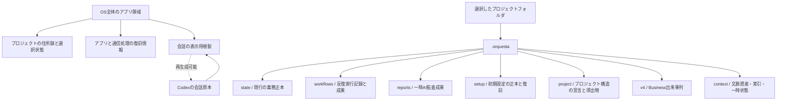

# V5 プロジェクト保存責任

更新日: 2026-08-13

この文書は新機能の設計書ではない。現存する保存場所を分類し、同じ情報を複数の場所で正本扱いしないための所有権表である。

## 境界

OS全体のアプリ領域には、複数プロジェクトを開くための住所録、単一アプリ実行の所有権、未解決通信、添付隔離、表示用の会話複製だけを置く。プロジェクトのタスク、AI成果、監査結果を置かない。資格情報とCodex会話原本はOrquestaの所有物にしない。

プロジェクトフォルダ内の `.orquesta` は、そのプロジェクトだけに属する情報を持つ。別プロジェクトの番号・スレッド・成果を参照する場合は、暗黙の経路推定ではなく明示した参照が必要である。

Nativeへのフォルダ登録は住所録の更新だけであり、プロジェクト内へ `.orquesta` を作らない。利用者が空のホームから初期設定を開始した時点で、Local Coreが選択済みプロジェクトの実体を再確認して初期設定の正本を作る。

## 現在の配置

| 場所 | 所有内容 | 性質 | 削除・再生成 |
|---|---|---|---|
| `.orquesta/state` | 現行のタスク、組織、AI、役割、セッション対応表 | 現行製品の正本 | 自動削除不可 |
| `.orquesta/workflows` | 反復実行の定義、組、試行、結果 | 機能別の実行正本と成果 | 履歴方針に従う |
| `.orquesta/state/inspection-runs.json` | 一時AI監査の実行状態 | 機能別の実行正本 | 自動削除不可 |
| `.orquesta/reports/inspections` | 一時AI監査の報告 | 成果 | 実行記録から参照される間は削除不可 |
| `.orquesta/state/runtime-binding.json` | 選択案件と実行権限の結合 | 実行時の権限記録 | 実行方式を確認せず削除不可 |
| `.orquesta/state/messages.jsonl` | 通常送信の到達段階 | 配送・復旧証拠 | 未確定送信がある間は削除不可 |
| `.orquesta/state/execution-kernel-v2.json` | 実行中核の再開状態 | 実行・復旧 | 実行中は削除不可 |
| `.orquesta/state/execution-kernel-shadow-v2.json` | 実行中核の比較観測 | 検証用の実行状態 | 本番切替判断後に廃止候補 |
| `.orquesta/state/desktop-writer.lock` | 案件の単一書込み所有権 | 一時的な排他証拠 | 所有者確認なしに削除不可 |
| `.orquesta/v4/events.jsonl` | Business Work Orderの出来事 | 不変正本 | 削除不可 |
| `.orquesta/v4/projections` | Businessの現在表示 | 導出物 | 出来事列から再生成可能 |
| `.orquesta/v4/pending`等 | Business書込みの復旧証拠 | 復旧 | 状態解決前は削除不可 |
| OS側 `conversation-history` | Codex会話の表示用索引 | 投影・キャッシュ | 原本から再生成可能 |
| `CURRENT_ORCHESTRA.md`、`project/derived` | 人間・画面向けの現在像 | 投影 | 正本から再生成する対象 |

## 今回の整理

- 物理配置は変えず、中央の保存表から参照する。Gitでコードを一つ戻したとき、案件データだけ新配置へ残る事故を避けるためである。
- 反復実行と一時AI監査の同時操作は拒否せず、同一案件内で順番に状態へ反映する。
- AI成果の識別番号と物理ファイル名を分け、Windowsで禁止される文字をファイル名へ使わない。
- 選択時にNativeが渡したプロジェクト番号を、画面用状態にもそのまま使う。経路から別番号を再生成しない。
- 実行権限記録は案件の物理実体を再検証する。新形式の登録簿へ一度移行した案件は単純な改名に追従し、別フォルダへ複製された記録は受理しない。
- 旧い経路由来のプロジェクト番号で途中停止していた初期設定は、選択中のNativeプロジェクト番号を移行記録付きで採用してから再開する。
- 再選択で自動再開するのは稼働中か明示的に再試行可能な停止だけである。取消済み初期設定は終端で、現状は再開始できない。
- セッション自身に残った過去の作業場所をプロジェクト所属の根拠にしない。別作業場所は同じGitプロジェクトに属することを確認する。
- 報告・世代交代記録は、外部へのリンクや識別番号を使ったプロジェクト外経路を読書きしない。

物理配置の変更は、旧版が新配置を読める橋渡し版を先に配布し、案件データの降格手順まで用意できる段階で行う。今回の整理では行わない。

## 今回統合しないもの

`state/tasks.json` と Business Work Orderは、前者が現行タスク、後者が分岐・試行・外部操作を持つ実行単位であり、同じ形式ではない。Businessの製品書込み経路が未接続な現在、どちらかを削除すると既存機能か次世代基盤のどちらかを失う。意味対応と一回移行が決まるまで物理統合しない。

`state/events.jsonl` は現行画面用の補助履歴、`v4/events.jsonl` は再生可能なBusiness正本である。名前が似ていても結合しない。

セッション対応表、世代交代、Codex会話原本、表示用会話複製も役割が異なる。まず案件番号と現行ルートの検証を一本化し、その後に会話複製の案件別配置を行う。

## 残る整理対象

1. Native登録簿を失った場合にも同じプロジェクト番号を復元できる、プロジェクト内の安定した識別を設計する。今回は選択中の番号を全層へ渡し、新形式の登録簿は同一端末内の改名へ追従する。旧登録簿のままアプリ停止中に改名したプロジェクトも、Nativeの登録経路で同じ物理フォルダを明示的に再選択すれば従来の番号を引き継ぐ。アプリ領域を失ったプロジェクトや複製は機械だけで元と同一か新規かを確定できないため、将来の明示的な再結合画面でユーザー判断を受ける。
2. AIに明示した別作業場所について、将来はプロジェクト番号を持つ所属記録を追加し、現在の `workspace_path` 文字列だけに依存しない。
3. `context` 内の正本、解決済み資料、索引、実行中状態を分類する。形式を決める前に移動しない。
4. `tasks.json` と Work Orderの意味分担を決め、製品書込み経路を一つにする。
5. 実行中核の比較観測を本番切替後に削除できるか判断する。

この順序は、見た目のディレクトリ数よりも「正本の数を増やさないこと」を優先する。
