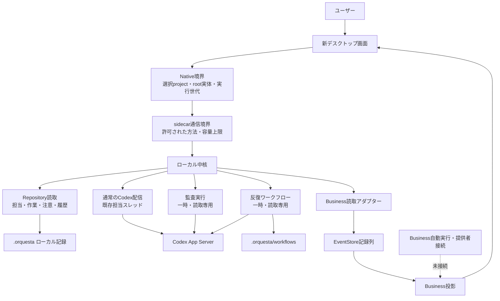
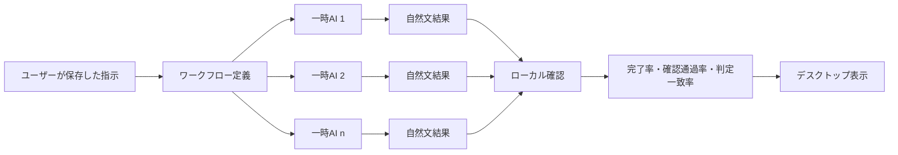
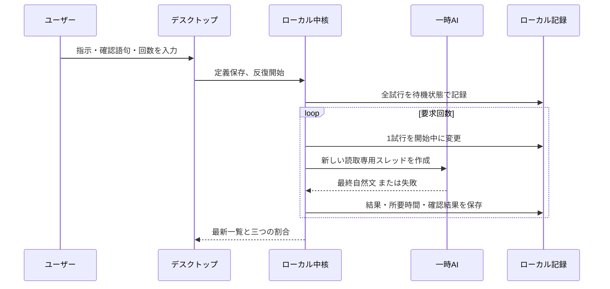

# V5全体構造と反復ワークフロー監査

更新日: 2026-08-12

## 結論

V5は、現時点でも「人が担当を選び、複数のCodexスレッドへ仕事を渡し、結果と承認をデスクトップで見る」マルチエージェント製品として機能する。一方、Business Work Orderを起点に自動で計画・配信・再試行する製品経路はまだ読み取り専用であり、完全自動の運転系ではない。

今回追加した反復ワークフローは、この不足を巨大な自動運転エンジンで埋めるものではない。保存した一つの指示を、毎回新しい読み取り専用の一時AIへ渡し、結果と失敗をローカルへ残して、反復実行の信頼性を測る最小の実験器である。

## 現在の製品構造



実線は現在の製品経路、破線は実装断片があっても製品として有効化していない経路を示す。

## 正本と候補結果の境界



AIの返答は候補結果であり、作業完了・承認・外部操作の正本ではない。固定JSON形式も要求しない。出力が自然文、追加項目を含む文章、提供者固有の書式であっても保存できる。

## 反復ワークフローの保存場所

```text
.orquesta/
└── workflows/
    ├── state.json
    └── results/
        └── <batch-id>/
            ├── <attempt-id>.md
            └── ...
```

- `state.json`: ワークフロー定義、反復まとまり、各試行の状態、結果参照。
- `results`: AIの最終自然文を試行単位で保存。
- 指示の複製保存場所や専用ハードリンク台帳は作っていない。
- 書込みは既存の選択projectとNative/Coreの書込み権限内で直列化する。
- 結果は外部操作を許可しない読み取り専用スレッドから回収する。
- 開始受理の途中で中核が終了した試行は、重複課金を避けるため自動再実行せず「開始結果不明」にする。残りの試行は続行できる。

## 数字の意味

| 表示 | 計算 | 意味 | 意味しないもの |
|---|---|---|---|
| 実行完了率 | 完了数 / 要求回数 | 一時AIが最終結果まで到達した割合 | 内容の正しさ |
| 確認通過率 | 確認通過数 / 確認済み数 | ユーザーが設定した単純な含有・非含有確認の通過割合 | 総合品質、事実性 |
| 判定一致率 | 多数側の判定数 / 確認済み数 | 通過/不通過が反復間でどれだけ揃ったか | 正しい側へ揃った保証 |
| 標本数 | 終了数 / 要求回数 | 何回分の根拠があるか | 統計的な十分性 |

確認規則がゼロなら、確認通過率と判定一致率は `未評価` とする。AI自身の「成功しました」という文章だけから100%を作らない。判定一致率100%でも全試行が失敗側へ揃っている場合があるため、通過率と必ず別に見る。

## 反復の時系列



一つの反復まとまりの中では順番に実行する。別の反復まとまりは並行して開始できる。これは「一つの正しい運用だけ」を強制せず、同じ試験内の比較可能性と利用者が明示した並行性を両立するためである。

## 実装済みと未接続

| 領域 | 現在 | 根拠 |
|---|---|---|
| project選択とroot権限 | 実装・試験済み | Nativeが呼出し前後に実体と実行世代を再確認 |
| 複数担当の作成 | 実装・試験済み | setup-domainとspecialist provisioner |
| 担当別Codexスレッド | 実装・試験済み | DesktopCodexServiceとthread reconciler |
| 手動メッセージ配信 | 実装・試験済み | Native outbox、Core、Codex App Server |
| 承認要求 | 実装・試験済み | attentionとruntime approval |
| 敵対監査・外部比較 | 実装・試験済み | 読み取り専用の一時スレッド |
| 反復ワークフロー | 実装・試験済み | 定義、反復、再起動回収、割合、Desktop表示 |
| Business Work Order表示 | 読取りのみ実装 | EventStore replayとBusiness投影 |
| Businessからの自動配信 | 製品では無効 | reactor/providerは内部または記録済みfakeのみ |
| 定時実行 | 未実装 | cron・スケジューラーなし |
| LLMによる別審査員 | 未実装 | 現在はローカル文字確認だけ |
| 費用・トークン統計 | 未実装 | Codex利用量の正規化記録なし |
| Windows実機試験 | 未実証 | 現環境にRust/Windows実機なし |

## 厳格さの置き場所

### 残す厳格さ

- 選択projectと実際のrootが違う。
- 実行世代や呼出し権限が途中で変わった。
- 外部書込みや承認が必要な操作を、読み取り専用一時AIが要求した。
- 記録列の所有権、順序、内容ハッシュが一致しない。
- 通信・保存容量が製品境界を超える。

### 緩くした場所

- AIの最終返答は固定JSONでなく自然文を受ける。
- 確認規則がなければ未評価として継続する。
- 一回失敗しても残りの反復を続ける。
- 追加の製品項目はDesktopの読取りで無視できる。
- 複数の反復まとまりを同時に持てる。

### まだ見直す価値がある場所

- 既存の「敵対監査」と「外部比較」は、監査証拠のため厳密なJSON報告形式を要求する。監査用途には理由があるが、一般AI結果と混ぜないこと。
- Business Orchestratorは48ファイル、約5.97万行で、製品からは主に読み取り面しか使っていない。削除ではなく、製品接続前に所有境界と必要部分を再監査する。
- `orquesta/scripts` は76ファイルあり、現デスクトップ経路とCLI/技能用の責任が混在する。旧資産削除とは別工程で、利用者ごとの入口へ整理する余地がある。

## ファイルと技能の現在量

2026-08-12の保存前集計:

| 範囲 | ファイル | おおよその行数 | 試験ファイル |
|---|---:|---:|---:|
| 新デスクトップ | 84 | 42,665 | 7 |
| ローカル中核 | 77 | 20,266 | 32 |
| EventStore | 15 | 3,821 | 5 |
| Business Orchestrator | 48 | 59,714 | 23 |
| `orquesta/` 制御資産 | 130 | 29,995 | 34 |
| Git管理全体 | 482 | - | 126 |

技能の入口は `orquesta/SKILL.md` の1個。補助資料10個、生成済み実行資産1個、状態形式40個、制御スクリプト76個を持つ。技能数を増やす前に、この一つの入口からDesktop主体の操作へ委譲できる範囲を明確にする方がよい。

## 商用基盤との比較

Cloudflare Agentsは、各AgentをDurable Objectへ対応させる大規模な状態分離、Cloudflare Workflowsによる長時間・多段・再試行可能な処理、Sandboxによる隔離実行を提供している。Orquestaが現時点で優位なのはローカルprojectの実体権限、Codex開発作業との直結、人間の注意・承認を一画面へ集める点。劣るのは定時実行、分散規模、資格情報管理、運用監視、長時間ワークフローの一般化である。

- CloudflareのAgent/Workflow分担: https://developers.cloudflare.com/agents/runtime/execution/run-workflows/
- 複数Agentの経路: https://developers.cloudflare.com/agents/runtime/communication/routing/
- Sandbox: https://developers.cloudflare.com/agents/tools/sandbox/

ユーザーが以前挙げた「T3」が Trust3 AI を指すなら、Trust3はエージェント発見、委譲連鎖の追跡、操作ごとの統制を中心とする。Orquestaには担当・作業・承認のローカル証拠はあるが、全プロンプト・全ツール呼出し・全委譲を一つの追跡記録として表示する機能はまだない。別のT3製品を指す場合は、製品名を確定してから比較し直す。

- Trust3 AIのA2A追跡: https://trust3.ai/platform/a2a-security/

## 次に足すなら何か

今すぐ大きな自動運転を足すべきではない。優先順は次の通り。

1. 実際のCodex接続で、3回・10回・30回の反復を実施し、完了率と失敗分類を保存する。
2. 簡単な確認語句では測れない課題向けに、別の読み取り専用審査AIを任意追加する。ただし人の受入判断とは分ける。
3. 所要時間に加え、利用量・中断理由・提供者エラーを正規化する。
4. ユーザーが明示的に有効化した場合だけ、定時実行と再試行方針を追加する。
5. その後にBusiness Work Orderからの自動配信を接続するか判断する。

## 今回のGit保存点

- `f95ae48`: 反復ワークフロー中核、自然文結果、ローカル評価、再起動回収。
- `5357cbf`: Desktop通信、画面、ライブ更新、製品境界。
- `0025721`: 全体構造、正本境界、割合の意味、未接続領域を一枚に整理。
- 最終接続修正: Nativeが再確認済みの選択rootをCore要求へ補い、利用者画面へ実パスを持たせない境界を確定。
